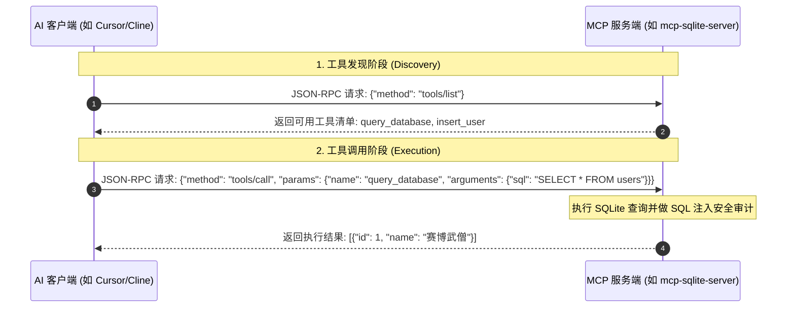

# Agent Skills 与扩展协议（MCP）

> **“当 Agent 掌握了主动操控工具和打破沙盒连接现实的能力，它就不再只是个助手，而是一个真正的赛博数智人。”**

---

在长期开发一个复杂项目时，你会发现有些重复的动作大模型总是需要你反复教导才能做对。例如：“清理 Docker 缓存 -> 重置 Supabase 本地数据库 -> 生成最新 Prisma 客户端 -> 运行种子（Seed）数据填充”。

通过在项目根目录编写 **`SKILL.md`（技能树文件）**，你可以一劳永逸地教会大模型这些复杂的复合动作。然而，如果我们想让大模型跨出文本编辑器，拥有主动访问数据库、操纵浏览器截图、甚至直接调用公司内网私有服务的本领，我们需要一根划时代的连接插线——这就是 **Model Context Protocol（模型上下文协议，简称 MCP）**。

本章将系统剖析 MCP 的协议基石，并手把手带你使用 Node.js 与 Python **编写一个可以读写本地 SQLite 数据库的自定义 MCP Server**。

---

## 1. 极速扫盲：MCP 的三大核心支柱

MCP 是 Anthropic 联合行业巨头推出的开源开放协议，基于 **JSON-RPC 2.0** 协议标准，你可以把它当成大模型连接外部世界的“USB 数据接口”。在协议内部，主要定义了三种大模型可以调用的核心原语（Primitives）：

* **资源（Resources）**：向大模型提供只读的、高质量的静态数据源。比如：把本地的一个 `api-documentation.json`、或者一个日志文件声明为“资源”，大模型可以像查阅图书一样随时拉取它。
* **工具（Tools）**：向大模型提供**可以执行动作的“武器”**。比如：“执行一条数据库 SQL 查询”、“请求浏览器截图网页”或“通过 Slack 发送消息”。这是 Agent 能够主动改变外部物理世界的核心方式。
* **提示词模板（Prompts）**：向大模型提供预设好的、带有占位符的对话模板。比如：“重构当前文件并补充测试的提示词模板”，大模型可以动态填入文件名并直接套用最佳实践。

### 📡 MCP 通信序列 (JSON-RPC 2.0)



---

## 2. 动手实战：从零编写一个 SQLite 自定义 MCP Server

### 🛠️ 方案 A：Node.js 实现

#### 第一步：创建项目并安装依赖
在本地新建一个目录，在终端运行：
```bash
npm init -y
npm install @modelcontextprotocol/sdk sqlite3
npm install -D typescript @types/node @types/sqlite3 tsx
```
初始化 TypeScript 配置：
```bash
npx tsc --init
```

#### 第二步：编写核心 MCP 服务代码
新建 `index.ts`，写入如下符合 MCP SDK 规范的代码：

```typescript
import { Server } from "@modelcontextprotocol/sdk/server/index.js";
import { StdioServerTransport } from "@modelcontextprotocol/sdk/server/stdio.js";
import {
  CallToolRequestSchema,
  ListToolsRequestSchema,
} from "@modelcontextprotocol/sdk/types.js";
import sqlite3 from "sqlite3";

// 1. 初始化本地 SQLite 数据库，并建立一张测试表
const db = new sqlite3.Database("./local_users.db");
db.serialize(() => {
  db.run(`
    CREATE TABLE IF NOT EXISTS users (
      id INTEGER PRIMARY KEY AUTOINCREMENT,
      name TEXT NOT NULL,
      email TEXT UNIQUE NOT NULL,
      role TEXT DEFAULT 'developer'
    )
  `);
});

// 2. 创建一个名为 "sqlite-mcp-server" 的 MCP 服务实例
const server = new Server(
  {
    name: "sqlite-mcp-server",
    version: "1.0.0",
  },
  {
    capabilities: {
      tools: {}, // 声明本 Server 具有提供 Tools 工具的能力
    },
  }
);

// 3. 向大模型声明我们拥有的工具列表 (List Tools)
server.setRequestHandler(ListToolsRequestSchema, async () => {
  return {
    tools: [
      {
        name: "query_database",
        description: "运行 SELECT SQL 语句查询本地用户数据库。仅允许只读查询。",
        inputSchema: {
          type: "object",
          properties: {
            sql: {
              type: "string",
              description: "要在 local_users.db 上运行的只读 SELECT SQL 语句。例如: 'SELECT * FROM users LIMIT 10'"
            }
          },
          required: ["sql"]
        }
      },
      {
        name: "insert_user",
        description: "向本地用户表中插入一条新用户记录。",
        inputSchema: {
          type: "object",
          properties: {
            name: { type: "string", description: "用户的姓名" },
            email: { type: "string", description: "用户的唯一邮箱地址" },
            role: { type: "string", description: "用户的系统角色，默认是 'developer'" }
          },
          required: ["name", "email"]
        }
      }
    ]
  };
});

// 4. 实现工具的执行逻辑 (Call Tool)
server.setRequestHandler(CallToolRequestSchema, async (request) => {
  const { name, arguments: args } = request.params;

  if (name === "query_database") {
    const sql = args?.sql as string;
    // 严格限制，防止 AI 通过注入执行危险的删除语句
    if (!sql.toLowerCase().trim().startsWith("select")) {
      return {
        content: [{ type: "text", text: "错误: 该工具仅允许执行 SELECT 只读语句。" }],
        isError: true
      };
    }

    return new Promise((resolve) => {
      db.all(sql, [], (err, rows) => {
        if (err) {
          resolve({
            content: [{ type: "text", text: `SQL 执行失败: ${err.message}` }],
            isError: true
          });
        } else {
          resolve({
            content: [{ type: "text", text: JSON.stringify(rows, null, 2) }]
          });
        }
      });
    });
  }

  if (name === "insert_user") {
    const userName = args?.name as string;
    const userEmail = args?.email as string;
    const userRole = (args?.role as string) || "developer";

    return new Promise((resolve) => {
      db.run(
        "INSERT INTO users (name, email, role) VALUES (?, ?, ?)",
        [userName, userEmail, userRole],
        function (err) {
          if (err) {
            resolve({
              content: [{ type: "text", text: `写入失败: ${err.message}` }],
              isError: true
            });
          } else {
            resolve({
              content: [{ type: "text", text: `写入成功！新用户 ID 为: ${this.lastID}` }]
            });
          }
        }
      );
    });
  }

  throw new Error(`找不到匹配的工具: ${name}`);
});

// 5. 启动服务并采用标准输入输出 (Stdio) 进行通信传输
const transport = new StdioServerTransport();
await server.connect(transport);
console.error("SQLite MCP Server 启动成功！正在等待 AI 指令...");
```

---

### 🐍 方案 B：Python 实现 (使用官方 Python MCP SDK)

如果你的项目侧重于 AI 和数据分析，Python 可能是首选：

#### 第一步：安装 SDK 依赖
```bash
pip install mcp sqlite3
```

#### 第二步：编写 `server.py` 代码
```python
import sqlite3
import json
from mcp.server.fastmcp import FastMCP

# 1. 创建一个 FastMCP 服务实例
mcp = FastMCP("sqlite-mcp-server")

# 2. 初始化 SQLite 数据库
def init_db():
    conn = sqlite3.connect("local_users.db")
    cursor = conn.cursor()
    cursor.execute("""
        CREATE TABLE IF NOT EXISTS users (
            id INTEGER PRIMARY KEY AUTOINCREMENT,
            name TEXT NOT NULL,
            email TEXT UNIQUE NOT NULL,
            role TEXT DEFAULT 'developer'
        )
    """)
    conn.commit()
    conn.close()

init_db()

# 3. 注册工具（使用 Python 类型标注，FastMCP 会自动生成 JSON Schema）
@mcp.tool()
def query_database(sql: str) -> str:
    """运行 SELECT SQL 语句查询本地用户数据库。仅允许只读查询。"""
    if not sql.lower().strip().startswith("select"):
        return "错误: 该工具仅允许执行 SELECT 只读语句。"
    
    try:
        conn = sqlite3.connect("local_users.db")
        cursor = conn.cursor()
        cursor.execute(sql)
        rows = cursor.fetchall()
        columns = [description[0] for description in cursor.description]
        results = [dict(zip(columns, row)) for row in rows]
        conn.close()
        return json.dumps(results, indent=2, ensure_ascii=False)
    except Exception as e:
        return f"SQL 执行失败: {str(e)}"

@mcp.tool()
def insert_user(name: str, email: str, role: str = "developer") -> str:
    """向本地用户表中插入一条新用户记录。"""
    try:
        conn = sqlite3.connect("local_users.db")
        cursor = conn.cursor()
        cursor.execute(
            "INSERT INTO users (name, email, role) VALUES (?, ?, ?)",
            (name, email, role)
        )
        conn.commit()
        last_id = cursor.lastrowid
        conn.close()
        return f"写入成功！新用户 ID 为: {last_id}"
    except Exception as e:
        return f"写入失败: {str(e)}"

if __name__ == "__main__":
    # 以 Stdio 传输协议启动 MCP 服务
    mcp.run()
```

---

## 3. 常见故障诊断与排查

在将自定义 MCP 服务配置到 Cursor 或 Cline 的 `mcpServers` 配置文件后，许多开发者会遇到服务无法加载的困境。以下是黄金排错指南：

> [!CAUTION]
> **绝对禁止在 MCP 服务中向 `stdout`（标准输出）打印普通调试日志！**
> 
> 因为 MCP 客户端与服务端是通过 `stdout` 进行 `JSON-RPC` 数据传递的。如果你的代码中写了 `console.log("Database connected")` 或 `print("Connecting to DB")`，这些普通日志会直接干扰 `JSON-RPC` 帧，导致客户端协议解析彻底崩溃！

### 🛡️ 调试与测试技巧：
* **日志输出方向**：所有的调试、警告、错误信息，在 Node.js 中强制使用 `console.error()`，在 Python 中使用 `sys.stderr.write()`，这会将信息输出到 `stderr`（标准错误流），客户端能安全地捕获并输出到 IDE 日志面板中，而不破坏主通道。
* **物理路径问题**：在 `mcpServers` 配置里指定路径时，Windows 环境下建议使用绝对路径（如 `c:/projects/mcp-sqlite-server/index.ts`），并确保路径中的斜杠方向正确。

---

## 本章小结

本章向你展示了人机协作从“纸上谈兵”转入“自主操盘”的物理跃迁。我们：
1. 理解了 MCP 协议底层的 `JSON-RPC 2.0` 通信流；
2. 分别使用 Node.js 和 Python 编写了具有 SQL 安全过滤机制的 SQLite 自定义 MCP 数据库服务；
3. 学习了如何利用 `stderr` 打印调试日志，避开了破坏 `stdio` 标准输出通道的协议死穴。

Agent 拥有了双手，让一切变得全自动。接下来，我们将正式踏入 AI 时代中，针对项目核心逻辑——编码与重构的高价值攻坚战。

让我们一起进入 **《编码、重构与遗留代码解毒》（扩充版）**！
