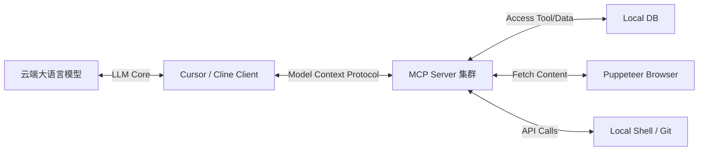

# Agent Skills 与扩展协议（MCP）

> **“当 Agent 掌握了主动操控工具和打破沙盒连接现实的能力，它就不再只是个助手，而是一个真正的赛博数智人。”**

---

## 8.1 自定义技能树：利用 SKILL.md 创建可复用的自动化工作流

在长期开发一个复杂项目时，你会发现有些重复的动作大模型总是需要你教一遍才能做对。例如：“清理 Docker 缓存 -> 重置 Supabase 本地数据库 -> 生成最新 Prisma 客户端 -> 运行种子（Seed）数据填充”。

通过在项目根目录编写 **`SKILL.md`（技能树文件）**，你可以一劳永逸地教会大模型这些复杂的复合动作。

### 🛡️ `SKILL.md` 的精妙结构

```markdown
# Agent Skills Repository

## Skill: Reset-Local-Database
**Description**: 当开发人员要求重置本地开发数据库或发生严重的 Schema 不一致导致 Prisma 报错时使用。

### Steps
1. 运行系统命令清理 Docker 中的旧容器：`docker compose down -v`
2. 重新拉起干净的 PG 容器：`docker compose up -d db`
3. 运行本地数据库迁移命令：`npx prisma db push --force-reset`
4. 填充系统基础种子数据：`npx prisma db seed`

### Validation
执行 `npx prisma studio` 并调用端口健康检查，确认返回 200。
```

当 Agent 读到这个文件时，它能瞬间理解并将其注册进自己的**内部技能库**。你只需在对话中简单说一句：“帮我 Reset 一下本地 DB”，它就会有条不紊地完美执行整套复合动作。

---

## 8.2 钩子机制（Hooks）：在 Agent 动作前后的自动脚本注入

真正的工程管理离不开自动化的流程拦截与卡点。通过配置 Agent 钩子（Hooks），我们可以在 Agent 开始干活前和干完活后自动执行脚本，进行安全扫描与质量保护。

### 🪝 常见的 Hooks 应用场景
1. **Pre-action Hook（动作前置钩子）**：
   * **自动备份**：在 Agent 决定跨文件改写核心代码前，自动对其执行一个轻量级的 Git Branch 备份，方便瞬间回滚。
   * **依赖预检**：检查本地依赖包是否安装完整，防止大模型运行命令时发生 `module not found` 的低级错误。
2. **Post-action Hook（动作后置钩子）**：
   * **自动编译卡点**：修改完代码后，自动拉起 ESLint 格式化和类型检查。
   * **审计防护**：在 Git Commit 动作前，利用扫描脚本确认大模型没有把 API Keys 或密钥文件误贴进源码中。

---

## 8.3 破墙而出的 MCP（Model Context Protocol）：统一大模型与外部数据工具的连接枢纽

2024 年底，Anthropic 提出了划时代的 **Model Context Protocol（模型上下文协议，简称 MCP）**。这成为了大模型时代的 USB 协议。

:::important 什么是 MCP？
**MCP 是一个开源、开放的标准协议**，它允许开发者为大模型提供一个统一的数据与工具连接管道。通过 MCP，运行在云端的大模型可以通过本地 client 破墙而出，与你本地的数据库、浏览器、Slack、GitHub 甚至是公司内部的私有 API 进行无缝通信。
:::

### 🌐 MCP 的三层经典架构



### 🚀 开发者能用 MCP 做什么？
* **数据库交互**：大模型可以直接通过 MCP Server 查询你本地 PostgreSQL 的表结构和前 10 行测试数据，写出完美的 SQL 语句，不再需要你手动复制表 Schema 投喂它。
* **实时浏览器预览**：在修改前端 UI 时，大模型可以直接调用 MCP Puppeteer Server，在后台渲染出页面，自动截图并分析页面样式是否对齐，实现纯闭环的“改动 -> 渲染 -> 视觉检查 -> 修正”。

MCP 协议彻底抹平了“自然语言逻辑”与“计算机底层命令”之间的鸿沟，是实现真正全自动人机协作的底层终极枢纽。
