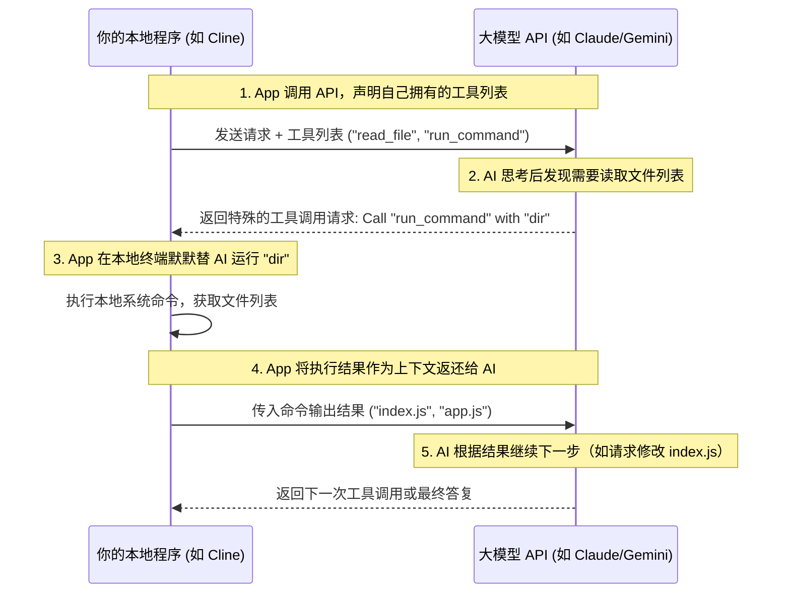

# 主流 AI API 调用：自主搭建工具的基石

> “如果你只使用现成的工具，你只能成为别人的用户。当你学会调用 API，你才真正开始成为规则的制定者。”

---

在前几章中，我们学习了提示词工程，理解了如何用人类的语言去引导 AI。然而，当你在日常开发中频繁使用 Cursor、Windsurf、Cline 或 Aider 时，你是否曾想过：**这些神奇的工具，底层的魔法究竟是什么？**

答案其实非常简单，甚至可以说是朴实无华：**它们本质上都是基于 AI API 构建的封装器或智能体（Agent）。**

无论是 Cursor 在你保存代码时自动扫描上下文，还是 Cline 在终端自主运行命令、检测报错并改写多个文件，它们的幕后流程都是一致的：
1. **捕获上下文**：读取你的本地文件内容、终端报错信息、Git 提交历史等；
2. **组装 Prompt**：将这些信息以结构化的形式，组装进特定的系统提示词（System Prompt）和用户消息（User Message）中；
3. **调用 API**：通过网络请求将数据发送给大模型厂商（如 OpenAI、Anthropic、Google 等）的 API 接口；
4. **解析与执行**：接收 AI 返回的文本（如 Patch/Diff 代码片段）或工具调用指令（Tool Calls），并在你本地的计算机上执行对应的读写或终端命令。

掌握了 API 调用，就等于拿到了通往“自主自动化”的入场券。你将不再局限于现有 IDE 插件的功能，而是可以根据自己的特殊工作流，编写脚本自动审查代码、自动生成每日周报、甚至搭建一个专属的行业级开发助理。

---

## AI API 的核心概念模型

虽然不同大模型厂商的 SDK（软件开发工具包）命名各有千秋，但它们底层的 HTTP 协议和数据结构几乎是完全相通的。理解以下核心概念，你就能在任意厂商的 API 之间无缝切换：

### 1. 消息角色（Messages & Roles）
API 交互通常采用**对话历史数组**的形式。数组中的每一条消息都包含一个 `role`（角色）和 `content`（内容）：
* **`system`（系统角色）**：AI 的“灵魂与面具”。在这里定义 AI 的身份、规则、限制条件和输出格式。一旦设定，AI 在整个对话中都会严格遵守。
* **`user`（用户角色）**：人类输入的具体指令或当前的上下文数据。
* **`assistant`（助手角色）**：AI 之前做出的回复。如果需要让 AI 记住之前的对话，必须将历史的 `assistant` 消息连同 `user` 消息一起发回去。

### 2. 超参数扫盲（Hyperparameters）
* **`temperature`（温度值）**：控制输出的随机性与创造力。取值通常在 `0.0` 到 `2.0` 之间。
  * 对于**编写代码、数据提取、格式化转换**等需要极度精准的场景，请务必将其设为 **`0.0` 或极低值（如 `0.1`）**，以确保输出稳定、逻辑严密。
  * 对于文案创作、头脑风暴，可以设为 `0.7` 或更高。
* **`max_tokens`**：限制模型单次回复的最大 Token 数量（防范 AI 产生幻觉陷入死循环无限吐字，从而烧光你的钱包）。
* **`stream`（流式传输）**：设为 `true` 后，API 将像打字机一样逐字返回数据（Server-Sent Events），而非等待全部生成完毕才一次性返回。这在构建交互式终端或聊天界面时能极大地改善用户体验。

---

## 四大主流 AI API 调用实战

下面我们针对当前最主流的四大 AI 势力，提供最干净、开箱即用且符合最新 SDK 规范的代码示例。

:::tip 提示
在运行以下代码前，请确保您已在相应平台上申请了 API Key，并将其配置为环境变量（例如在 Windows Powershell 中使用 `$env:OPENAI_API_KEY="your-key-here"`，或在 Linux/macOS 中使用 `export OPENAI_API_KEY="your-key-here"`）。
:::

### 1. OpenAI (GPT-4o / GPT-4o-mini)
作为行业事实上的标准，OpenAI 的 API 协议被几乎所有开源工具和第三方大模型（如各种国产大模型、本地 Ollama 等）所兼容。

#### 🐍 Python 示例
首先安装 SDK：`pip install openai`
```python
import os
from openai import OpenAI

# 默认会读取环境变量 OPENAI_API_KEY
client = OpenAI()

response = client.chat.completions.create(
    model="gpt-4o-mini",
    temperature=0.0,
    messages=[
        {"role": "system", "content": "你是一位精通算法的资深教练。"},
        {"role": "user", "content": "请用一行 Python 代码实现斐波那契数列的前 N 项生成。"}
    ]
)

print(response.choices[0].message.content)
```

#### 🟢 Node.js 示例
首先安装 SDK：`npm install openai`
```javascript
import OpenAI from "openai";

const openai = new OpenAI();

const response = await openai.chat.completions.create({
  model: "gpt-4o-mini",
  temperature: 0.0,
  messages: [
    { role: "system", content: "你是一位精通算法的资深教练。" },
    { role: "user", content: "请用一行 Python 代码实现斐波那契数列的前 N 项生成。" }
  ],
});

console.log(response.choices[0].message.content);
```

#### 🐚 cURL (HTTP 直连)
```bash
curl https://api.openai.com/v1/chat/completions \
  -H "Content-Type: application/json" \
  -H "Authorization: Bearer $OPENAI_API_KEY" \
  -d '{
    "model": "gpt-4o-mini",
    "temperature": 0.0,
    "messages": [
      {"role": "system", "content": "你是一位精通算法的资深教练。"},
      {"role": "user", "content": "请用一行 Python 代码实现斐波那契数列的前 N 项生成。"}
    ]
  }'
```
---

### 2. Anthropic Claude (Claude 3.5 / 3.7 Sonnet)
Claude 3.5 Sonnet 以及最新的 Claude 3.7 Sonnet 被广泛认为是当前在**编程逻辑推理、复杂系统重构与测试生成**方面处于全球顶尖水平的旗舰模型。其 API 格式与 OpenAI 略有不同，系统提示词（System Prompt）是作为顶层的独立参数传入，而非放进 `messages` 数组中。

#### 🐍 Python 示例
安装 SDK：`pip install anthropic`
```python
import os
from anthropic import Anthropic

client = Anthropic() # 默认读取 ANTHROPIC_API_KEY

message = client.messages.create(
    model="claude-3-5-sonnet-latest", # 或使用最新的 "claude-3-7-sonnet-latest"
    max_tokens=2048,
    temperature=0.0,
    system="你是一位严苛的软件安全审计专家。",
    messages=[
        {"role": "user", "content": "分析以下代码是否存在 SQL 注入风险：\n\n`db.execute('SELECT * FROM users WHERE name = ' + user_input)`"}
    ]
)

print(message.content[0].text)
```

#### 🟢 Node.js 示例
安装 SDK：`npm install @anthropic-ai/sdk`
```javascript
import Anthropic from '@anthropic-ai/sdk';

const anthropic = new Anthropic();

const message = await anthropic.messages.create({
  model: 'claude-3-5-sonnet-latest',
  max_tokens: 2048,
  temperature: 0.0,
  system: '你是一位严苛的软件安全审计专家。',
  messages: [
    { role: 'user', content: '分析以下代码是否存在 SQL 注入风险：\n\n`db.execute(\'SELECT * FROM users WHERE name = \' + user_input)`' }
  ],
});

console.log(message.content[0].text);
```

#### 🐚 cURL 示例
```bash
curl https://api.anthropic.com/v1/messages \
     --header "x-api-key: $ANTHROPIC_API_KEY" \
     --header "anthropic-version: 2023-06-01" \
     --header "content-type: application/json" \
     --data '{
         "model": "claude-3-5-sonnet-latest",
         "max_tokens": 2048,
         "temperature": 0.0,
         "system": "你是一位严苛的软件安全审计专家。",
         "messages": [
             {"role": "user", "content": "分析以下代码是否存在 SQL 注入风险。"}
         ]
     }'
```

---

### 3. Google Gemini (Gemini 2.5 / 2.0)
Gemini 最大的杀手锏是**百万级别至两百万级别（1M - 2M）的超长上下文窗口**，这使得你可以将整个中小型项目的全部源文件打包一次性喂给它。谷歌统一推出了全新的下一代 `google-genai` SDK，语法相比老版更加一致、优雅。

#### 🐍 Python 示例
安装 SDK：`pip install google-genai`
```python
import os
from google import genai
from google.genai import types

# 默认读取 GEMINI_API_KEY 环境变量
client = genai.Client()

response = client.models.generate_content(
    model='gemini-2.5-flash', # 也可使用性能更强的 'gemini-2.5-pro'
    contents='如何使用 Docker 快速部署一个 PostgreSQL 数据库？',
    config=types.GenerateContentConfig(
        system_instruction="你是一位经验丰富的云计算运维专家。",
        temperature=0.1,
    ),
)

print(response.text)
```

#### 🟢 Node.js 示例
安装 SDK：`npm install @google/genai`
```javascript
import { GoogleGenAI } from '@google/genai';

const ai = new GoogleGenAI(); // 默认读取 GEMINI_API_KEY

const response = await ai.models.generateContent({
  model: 'gemini-2.5-flash',
  contents: '如何使用 Docker 快速部署一个 PostgreSQL 数据库？',
  config: {
    systemInstruction: '你是一位经验丰富的云计算运维专家。',
    temperature: 0.1,
  }
});

console.log(response.text);
```

#### 🐚 cURL 示例
```bash
curl "https://generativelanguage.googleapis.com/v1beta/models/gemini-2.5-flash:generateContent?key=${GEMINI_API_KEY}" \
  -H 'Content-Type: application/json' \
  -d '{
    "contents": [{
      "parts":[{"text": "如何使用 Docker 快速部署一个 PostgreSQL 数据库？"}]
    }],
    "systemInstruction": {
      "parts": [{"text": "你是一位经验丰富的云计算运维专家。"}]
    },
    "generationConfig": {
      "temperature": 0.1
    }
  }'
```

---

### 4. DeepSeek (V3 / R1)
作为性价比极其恐怖的现象级大模型，DeepSeek 的编程能力直逼世界第一梯队。其官方 API 在设计上完全兼容 OpenAI 的 SDK 规范，极大地方便了老代码的零成本平滑迁移。

#### 🐍 Python 示例（无缝复用 OpenAI SDK 调用 V3 模型）
安装 SDK：`pip install openai`
```python
import os
from openai import OpenAI

# 实例化 client 并指向 DeepSeek 官方端点
client = OpenAI(
    base_url="https://api.deepseek.com/v1",
    api_key=os.environ.get("DEEPSEEK_API_KEY")
)

response = client.chat.completions.create(
    model="deepseek-chat",  # 对应性能强劲的 DeepSeek-V3 模型
    temperature=0.0,
    messages=[
        {"role": "system", "content": "你是一位极致精简的极客导师，不吐废话。"},
        {"role": "user", "content": "解释什么是 '闭包' (Closure)，限两句话。"}
    ]
)

print(response.choices[0].message.content)
```

#### 🧠 深度推理模型 DeepSeek-R1 的调用
对于需要严密数学证明、复杂算法推导的任务，可以使用 `deepseek-reasoner` 模型。该模型会返回一个特殊的 `reasoning_content`（思维链内容），在 SDK 返回中可以通过 `response.choices[0].message.reasoning_content` 提取。

---

### 5. 进阶：OpenAI 推理模型 (o1 / o3-mini) 与调用参数变化
OpenAI 推出的 **o1** 与 **o3-mini** 代表了推理大模型的新流派。
* **思维链运行**：这些模型在回复前会在后台进行长时间的“自我纠错和多路径推演”，因此在面对高难度的算法编写、复杂逻辑漏洞调试时具有出色的表现。
* **超参数微调**：由于推理模型需要在后台进行大量的概率搜索，**调用时建议将 `temperature` 设为默认值（如不传该参数）**。强行将其锁定为 `0` 可能会限制其思维分支的正常探索。

---

### 💡 动态获取最新的模型 ID 与 API 官方文档指南

AI 领域瞬息万变，模型更迭极快。为了防止代码中的模型 ID 过时失效，请牢记以下动态获取与官方文档查询通道：

* **官方模型明细页（建议常年收藏）**：
  * **Anthropic Models**: [docs.anthropic.com/en/docs/about-claude/models](https://docs.anthropic.com/en/docs/about-claude/models)
  * **Google Gemini Models**: [ai.google.dev/gemini-api/docs/models/gemini](https://ai.google.dev/gemini-api/docs/models/gemini)
  * **OpenAI Models**: [platform.openai.com/docs/models](https://platform.openai.com/docs/models)
  * **DeepSeek Models**: [api-docs.deepseek.com](https://api-docs.deepseek.com)
* **API 动态拉取模型列表命令 (Python 示例)**：
  ```python
  # 运行以下命令可以实时从厂商服务器拉取当前所有可用模型 ID 列表：
  from openai import OpenAI
  client = OpenAI()
  model_list = client.models.list()
  for model in model_list.data:
      print(model.id)
  ```

---

## 进阶：AI 工具幕后的“两大魔法”

当我们在写简单的聊天工具时，以上的普通文本对话 API 就足够了。但在构建高级 AI 开发工具时，我们必须引入两个更高级的 API 特性：**结构化输出（Structured Outputs）** 与 **工具调用（Tool Use / Function Calling）**。

### 1. 结构化输出 (Structured Outputs)
普通的文本输出就像野马脱缰，AI 的回答可能夹带很多解释性废话（例如：“好的，为您生成的代码如下...`[代码]`...希望对您有帮助！”）。

如果我们的自动化脚本想要精准解析 AI 的返回并自动修改文件，这简直是灾难。**结构化输出（JSON Mode）** 强制要求 AI 必须返回符合特定 JSON Schema（结构定义）的纯 JSON 格式数据。

例如，你可以定义一个 JSON Schema，要求 AI 必须以如下格式返回代码修改计划：
```json
{
  "filePath": "src/index.js",
  "action": "replace",
  "targetContent": "const count = 0;",
  "replacementContent": "const count = state.count;"
}
```
此时，你的本地代码解析器就可以闭着眼睛解析这段 JSON，在零人工干预的情况下精准地将原有代码替换掉。

### 2. 工具调用 (Tool Use / Function Calling)
这是**智能体（Agent）**的核心灵魂，也是 Cline、Windsurf 等工具能够“自主操控电脑”的底层原理。

在普通的 API 调用中，大模型只是一个“纸上谈兵”的大脑，它能写出运行终端的命令，但自己无法执行。

而通过 **Tool Use**：
1. **开发者“赋能”**：你在调用 API 时，在参数中向 AI 声明：“亲爱的模型，我这里有两个本地工具供你调度：一个是 `read_file(path)`，一个是 `run_command(cmd)`。我把它们的参数格式和用途都解释给你听。”
2. **AI“做决定”**：AI 读完后，发现你的要求是“帮我把当前目录下所有 `.js` 文件的第一行加上版权声明”。AI 分析后认为需要先读取文件，于是它**不返回普通文本**，而是返回一个特殊的“调用申请”：
   * *“我想调用 `run_command` 工具，参数是 `ls`。”*
3. **人类/程序“代为跑腿”**：你的本地包装程序截获了这个“调用申请”，在你的电脑上安全地运行了 `ls` 命令，捕获了输出（比如得到了 `index.js`, `utils.js`），然后**将运行结果作为一条新的 user 消息再次发给 AI**。
4. **AI“继续决策”**：AI 拿到了运行结果，接着发起下一次调用申请（比如调用 `read_file` 读取 `index.js`），循环往复，直到最终完成任务。



这一精妙的闭环，正是现代 AI 软件工程的终极图景。

---

## 承上启下

现在，你已经掌握了提示词工程的沟通心法，更揭开了 API 调用与智能体交互的底层奥秘。你已经了解，那些被捧上神坛的 AI IDE，其实都是在这些极其标准、朴素的 API 基础之上，凭借高超的工程设计和上下文管理技术搭建出来的。

那么，在今天的市面上，到底有哪些已经被开发得炉火纯青的“赛博神兵”供我们直接驱策？我们该如何根据不同的项目类型、公司合规限制和开发场景，将它们组合成威力最大、成本最低的“开发阵地”？

请翻开下一章：**《生产力工具选型：构建你的 AI 开发阵地》**。
