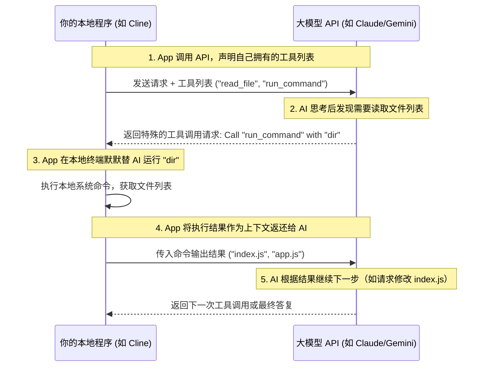

# AI API

> “如果你只使用现成的工具，你只能成为别人的用户。当你学会调用 API，你才真正开始成为规则的制定者。”

大多数 AI 平台不仅提供方便的网页端应用（如 ChatGPT、Claude Web），通常还会提供 **API 接口**，允许开发者通过代码来调用大模型。当前市面上所有主流的 AI 编程工具（如 Cursor、Windsurf、Cline 或 Aider），底层的魔法其实都是调用了这些 API 接口，然后把复杂的操作流程封装起来。

理解并掌握 AI API，不仅能让你看透这些顶尖编程工具的底层逻辑，更能让你将 AI 功能无缝嵌入到自己的程序中，从而创建出专属的 AI 工具。本章将带你由浅入深，从核心概念、高级进阶魔法，再到最新的全球 API 生态布局与实战代码，完成全方位的兵器谱扫盲。

---

## AI API 的核心概念模型

虽然不同大模型厂商的 SDK（软件开发工具包）命名各有千秋，但它们底层的 HTTP 协议和数据结构几乎是完全相通的。理解以下核心概念，你就能在任意厂商的 API 之间无缝切换。

### 消息角色（Messages & Roles）

API 交互通常采用**对话历史数组**的形式。数组中的每一条消息都包含一个 `role`（角色）和 `content`（内容）：

* **`system`（系统角色）**：AI 的“灵魂与面具”。在这里定义 AI 的身份、规则、限制条件和输出格式。一旦设定，AI 在整个对话中都会严格遵守。
* **`user`（用户角色）**：人类输入的具体指令或当前的上下文数据。
* **`assistant`（助手角色）**：AI 之前做出的回复。如果需要让 AI 记住之前的对话，必须将历史的 `assistant` 消息连同 `user` 消息一起发回去。

### 超参数（Hyperparameters）

* **`temperature`（温度值）**：控制输出的随机性与创造力。取值通常在 `0.0` 到 `2.0` 之间。
* 对于**编写代码、数据提取、格式化转换**等需要极度精准的场景，请务必将其设为 **`0.0` 或极低值（如 `0.1`）**，以确保输出稳定、逻辑严密。
* 对于文案创作、头脑风暴，可以设为 `0.7` 或更高。


* **`max_tokens`**：限制模型单次回复的最大 Token 数量（防范 AI 产生幻觉陷入死循环无限吐字，从而保护你的钱包）。
* **`stream`（流式传输）**：设为 `true` 后，API 将像打字机一样逐字返回数据（Server-Sent Events），而非等待全部生成完毕才一次性返回。这在构建交互式终端或聊天界面时能极大地改善用户体验。

---

## AI 工具幕后的“两大魔法”

在编写简单的聊天工具时，普通的文本对话 API 就足够了。但在构建高级 AI 开发工具（如 AI Agent、自动重构重写脚本）时，必须引入两个更高级的 API 特性：**结构化输出（Structured Outputs）** 与 **工具调用（Tool Use / Function Calling）**。

### 结构化输出 (Structured Outputs)

普通的文本输出就像野马脱缰，AI 的回答可能夹带很多解释性废话（例如：“好的，为您生成的代码如下...`[代码]`...希望对您有帮助！”）。如果我们的自动化脚本想要精准解析 AI 的返回并自动修改文件，这简直是灾难。

**结构化输出（JSON Mode）** 强制要求 AI 必须返回符合特定 JSON Schema（结构定义）的纯 JSON 格式数据。例如，你可以定义一个 JSON Schema，要求 AI 必须以如下格式返回代码修改计划：

```json
{
  "filePath": "src/index.js",
  "action": "replace",
  "targetContent": "const count = 0;",
  "replacementContent": "const count = state.count;"
}

```

此时，你的本地代码解析器就可以闭着眼睛解析这段 JSON，在零人工干预的情况下精准地将原有代码替换掉。

### 工具调用 (Tool Use / Function Calling)

这是智能体（Agent）的核心灵魂，也是 Cline、Windsurf 等工具能够“自主操控电脑”的底层原理。

在普通的 API 调用中，大模型只是一个“纸上谈兵”的大脑，它能写出运行终端的命令，但自己无法执行。而通过 **Tool Use**，可以实现由 AI 决策、程序跑腿的闭环自动化：

1. **开发者“赋能”**：你在调用 API 时，在参数中向 AI 声明：“亲爱的模型，我这里有两个本地工具供你调度：一个是 `read_file(path)`，一个是 `run_command(cmd)`。我把它们的参数格式和用途都解释给你听。”
2. **AI“做决定”**：AI 读完后，发现你的要求是“帮我把当前目录下所有 `.js` 文件的第一行加上版权声明”。AI 分析后认为需要先读取文件，于是它**不返回普通文本**，而是返回一个特殊的“调用申请”：*“我想调用 `run_command` 工具，参数是 `ls`。”*
3. **人类/程序“代为跑腿”**：你的本地包装程序截获了这个“调用申请”，在你的电脑上安全地运行了 `ls` 命令，捕获了输出（比如得到了 `index.js`, `utils.js`），然后**将运行结果作为一条新的 `user` 消息再次发给 AI**。
4. **AI“继续决策”**：AI 拿到了运行结果，接着发起下一次调用申请（比如调用 `read_file` 读取 `index.js`），循环往复，直到最终完成任务。



---

## 全球 AI API 提供商

在当前的 AI API 市场上，各家大模型厂商已经形成了一套层次分明的生态格局。对于程序员而言，选择提供商时最核心的考量指标就是性能与价格的权衡。

### 性能巅峰梯队：谁的代码能力最强？

在编程逻辑推理、复杂系统重构与 Agentic 工作流中，**Anthropic (Claude)** 与 **OpenAI** 稳居全球性能的第一梯队。

* **性能王者：Anthropic (Claude)**
它是目前公认在代码生成、重构和 Bug 修复方面表现最出色的厂商。其旗舰级模型（如 Claude Sonnet/Opus 系列）几乎是所有主流 AI 编程工具的首选后端。虽然它的**整体整体定价偏向中高端**，但其极高的高级指令遵循能力和极具价值的提示缓存折扣（最高可减免 90% 输入成本），让它在处理复杂代码库时具有无与伦比的综合效益。
* **全能宗师：OpenAI**
作为行业标准的制定者，OpenAI 的产品线最为完整（涵盖从超轻量 Nano 到顶级推理的 o3 系列）。在通用生产级任务中，其高级推理模型（如 o1/o3 系列）通过在后台进行“长时自我纠错与推演”，在应对高难度算法编写时表现极其优秀。OpenAI 的整体调用价格处于**行业中高档**。

### 极致性价比梯队：谁的价格最便宜？

如果你对成本极度敏感，或者正在开发高吞吐量的批处理任务，以下两家厂商提供了市场上无可匹敌的性价比优势：

* **价格屠夫：DeepSeek**
作为行业内现象级的存在，DeepSeek 是当之无愧的**全球价格底线**。其最新旗舰模型和深度推理模型的调用成本仅为海外同梯队前沿模型的几十分之一。当触发缓存命中时，其输入成本几乎可以忽略不计。它用极低的地板价提供了直逼世界第一梯队的优秀编程与数学推理能力。
* **长文本性价比之王：Google (Gemini)**
Google 是海外主流厂商中**性价比极其亲民**的代表。它的最大杀手锏是提供了高达百万级别的超长上下文窗口，你可以闭着眼睛把整个项目的全部源文件打包喂给它。同时，Gemini 提供了非常慷慨的免费测试额度，非常适合独立开发者和初创团队用于原型打样。

### 特定场景与企业合规梯队

除了上述四大巨头，市场上还活跃着满足特定开发诉求的特色提供商：

* **本地化与中文首选：国产大模型**
对于国内开发者而言，**阿里云（通义千问）**、**百度（文心一言）**、**智谱 AI**、**月之暗面（Kimi）**和**字节跳动（豆包）**等本土力量，不仅**价格战极其激烈、调用成本极低**，而且在中文语境理解、国内网络访问稳定度以及中国数据合规要求上拥有天然的本土优势。
* **完全隐私与开源自建：Meta (Llama)**
Meta 自身不直接售卖付费 API，但其强大的 Llama 开源系列允许企业彻底进行本地化部署。如果你拥有自备的 GPU 算力且对敏感代码数据有绝对的隐私控制诉求，利用 Llama 自建服务可以完全消除数据出域的顾虑。
* **区域合规标杆：Mistral AI**
作为欧洲的 AI 领头羊，Mistral 旗下的前沿模型在保持优秀性价比（尤其是极低的输出成本）的同时，数据天然存储在欧盟境内，是需要严格通过 GDPR 隐私审计的跨国项目的首选。
* **企业级托管安全：AWS Bedrock & Azure OpenAI**
通过这类大型云平台聚合调用大模型，企业需要额外承担一定的平台溢价（**整体资费较高**）。但它们能提供大厂特有的金融级安全隔离（VPC）、私有网络连接、高吞吐量 SLA 协议保障，且承诺企业数据绝对不会被挪用去训练公开模型。


## 四大主流 AI API 调用实战

下面针对当前最主流的四大 AI 势力，提供最干净、开箱即用且符合最新 SDK 规范的代码示例。

### OpenAI (标准调用)

#### 🐍 Python 示例

首先安装 SDK：`pip install openai`

```python
import os
from openai import OpenAI

# 默认会自动读取环境变量 OPENAI_API_KEY
client = OpenAI()

response = client.chat.completions.create(
    model="gpt-5.4-mini",
    temperature=0.0,
    messages=[
        {"role": "system", "content": "你是一位精通算法的资深教练。"},
        {"role": "user", "content": "请用一行 Python 代码实现斐波那契数列的前 N 项生成。"}
    ]
)

print(response.choices[0].message.content)

```

#### 🟢 Node.js 示例

首先安装 SDK：`npm install openai`

```javascript
import OpenAI from "openai";

const openai = new OpenAI();

const response = await openai.chat.completions.create({
  model: "gpt-5.4-mini",
  temperature: 0.0,
  messages: [
    { role: "system", content: "你是一位精通算法的资深教练。" },
    { role: "user", content: "请用一行 Python 代码实现斐波那契数列的前 N 项生成。" }
  ],
});

console.log(response.choices[0].message.content);

```

---

### Anthropic Claude (System 参数置顶规范)

#### 🐍 Python 示例

安装 SDK：`pip install anthropic`

```python
import os
from anthropic import Anthropic

client = Anthropic() # 默认读取 ANTHROPIC_API_KEY

message = client.messages.create(
    model="claude-3-5-sonnet-latest", 
    max_tokens=2048,
    temperature=0.0,
    system="你是一位严苛的软件安全审计专家。",
    messages=[
        {"role": "user", "content": "分析以下代码是否存在 SQL 注入风险：\n\n`db.execute('SELECT * FROM users WHERE name = ' + user_input)`"}
    ]
)

print(message.content[0].text)

```

---

### Google Gemini (长文本新一代 SDK)

谷歌统一推出了全新的下一代 `google-genai` SDK，语法相比老版更加一致、优雅。

#### 🐍 Python 示例

安装 SDK：`pip install google-genai`

```python
import os
from google import genai
from google.genai import types

# 默认读取 GEMINI_API_KEY 环境变量
client = genai.Client()

response = client.models.generate_content(
    model='gemini-2.5-flash', 
    contents='如何使用 Docker 快速部署一个 PostgreSQL 数据库？',
    config=types.GenerateContentConfig(
        system_instruction="你是一位经验丰富的云计算运维专家。",
        temperature=0.1,
    ),
)

print(response.text)

```


### DeepSeek (标准兼容性与思维链提取)

#### 🐍 Python 示例（无缝复用 OpenAI SDK 调用 V3 模型）

```python
import os
from openai import OpenAI

# 实例化 client 并直接指向 DeepSeek 官方端点
client = OpenAI(
    base_url="https://api.deepseek.com/v1",
    api_key=os.environ.get("DEEPSEEK_API_KEY")
)

response = client.chat.completions.create(
    model="deepseek-chat",  
    temperature=0.0,
    messages=[
        {"role": "system", "content": "你是一位极致精简的极客导师，不吐废话。"},
        {"role": "user", "content": "解释什么是 '闭包' (Closure)，限两句话。"}
    ]
)

print(response.choices[0].message.content)

```

#### 🧠 深度推理模型 DeepSeek-R1 的思维链获取

当调用高级深度推理模型时（`model="deepseek-reasoner"`），除了获取最终结果，还可以通过 `reasoning_content` 提取出代表 AI 思考逻辑的思维链内容：

```python
response = client.chat.completions.create(
    model="deepseek-reasoner", 
    messages=[
        {"role": "user", "content": "证明：当 n 为正整数时，n^3 - n 必定能被 6 整除。"}
    ]
)

# 提取并打印思维链（思考过程）
print("=== 思考过程 ===")
print(response.choices[0].message.reasoning_content)

# 提取并打印最终答案
print("\n=== 最终答案 ===")
print(response.choices[0].message.content)

```

---

## 工程落地建议

1. **不要只看单价，要看“单次任务成本（Cost per Task）”**：低阶廉价模型不一定是最终最省钱的。如果一个极便宜的模型由于能力不足，需要重复请求 3 次才能生成正确的代码，而一个价格偏高的高级前沿模型 1 次就能完美输出，那么选择性能更强、价格较贵的模型反而是时间与金钱的双重最优解。
2. **善用缓存（Prompt Caching）**：如果你的 AI 编程脚本包含很长的系统提示词，或者需要频繁把整个项目的代码骨架传给模型，请务必保证请求前缀一致，触发各大厂商提供的提示缓存折扣，可以省下绝大部分的输入账单费用。
3. **多模型混合编排策略（Multi-Model Strategy）**：在工程实现中，不要把逻辑全部绑定在单一厂商上。可以用强推理模型（如 Claude Opus 或 OpenAI o3）进行顶层架构设计与任务拆解，而把拆解出来的具体代码编写、日志解析、单测生成等简单任务交给快模型（如 GPT-4.1 Mini 或 Gemini Flash）去执行。
4. **非实时任务采用 Batch API**：如果你在写一些代码审查、自动化全库文档生成等不需要秒级返回的工具，可以使用厂商提供的 Batch API，这能直接帮你砍掉一半的调用费用。

---

