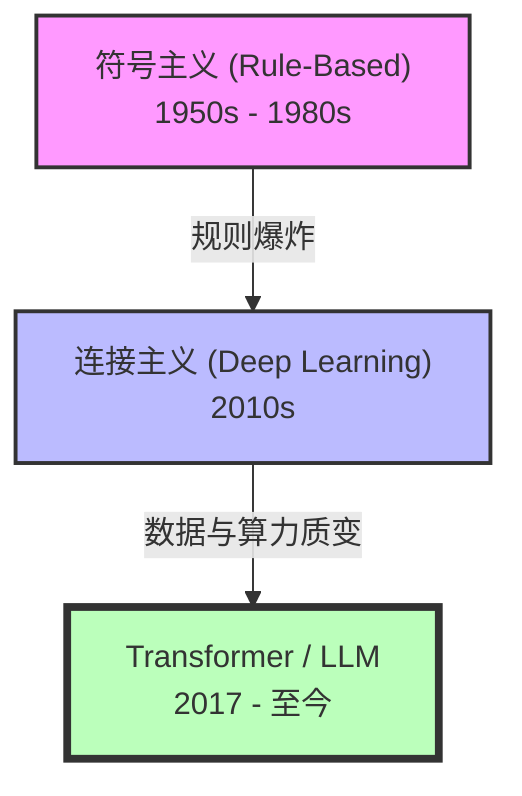

# 背景介绍：从图灵测试到人机共生

> 在沸腾的算力洪流中，我们重构的不只是代码，更是程序员自身。理解工具如何诞生，才能更深刻理解如何驾驭它。

过去几十年里，软件工程的核心始终没有改变：人类负责思考，计算机负责执行。而今天，大语言模型（LLM）的出现，第一次让机器开始介入“思考”本身。

当开发者第一次体验到 Cursor 自动重构项目、Claude Code 自主修复测试、GitHub Copilot 一口气补完整个函数时，往往都会产生一种矛盾感。一方面，是近乎魔法般的生产力跃迁；另一方面，则是一种隐隐的不安：如果 AI 已经能写代码了，那么程序员还剩下什么？

这种焦虑并不奇怪。因为我们面对的，并不是一次普通的工具升级，而是一场软件工业底层生产关系的重构。

本章将带你回到 AI 的起点，梳理人工智能与 AI 编程的发展脉络，并拆解大模型“理解代码”的底层逻辑。只有建立正确的认知地基，你才能真正理解：这场技术革命究竟改变了什么，又没有改变什么。

## 1. AI 发展简史：从逻辑机器到概率智能

人类对于“制造会思考的机器”的执念，几乎与计算机本身同时诞生。过去七十年里，人工智能的发展并非一条平滑曲线，而更像是一场不断失败、不断复活的漫长战争。它大致经历了三个阶段：



### 1.1 符号主义：人类试图“手写智慧”

早期 AI 的核心思想非常朴素：既然人的思维可以被逻辑描述，那么只要把逻辑全部写出来，机器自然就会拥有智能。

于是，科学家们开始构建庞大的规则系统，例如：

```js
if (天气 == 晴天 && 温度 > 25) {
    穿短袖();
}
```

这便是所谓的符号主义（Symbolism）。

那个时代诞生了大量“专家系统”。它们在国际象棋、数学定理证明等规则清晰的领域表现惊艳，一度让人类相信“通用 AI”近在眼前。

然而问题很快出现了。现实世界并不像棋盘那样规整。人类语言充满歧义，图像识别充满噪声，而真实环境里的变量几乎无限。

比如，你想让机器理解“猫”，你很快会发现，机器需要应对各种复杂情况：
- 什么算猫？
- 黑猫算吗？
- 卡通猫算吗？
- 只有半张脸算吗？
- 光线模糊怎么办？

于是规则开始指数级膨胀。最终，符号主义撞上现实高墙，AI 进入了第一次漫长寒冬。


### 1.2 深度学习：机器开始“自己学习”

与“手写规则”不同，另一派研究者提出了完全相反的思路：

> 不要告诉机器规则，让机器自己从数据中学。这便是连接主义（Connectionism）。相关的算法被称之为机器学习算法。而这其中最著名的当属人工神经网络算法。人工神经网络模仿生物神经元之间的连接方式。它的基本单元是神经元，每个神经元接收输入信号，经过加权求和与激活函数处理后产生输出。通过大量的神经元相互连接形成多层网络，可以模拟人脑复杂的处理过程。

简单来说，神经网络就是一个“函数拟合器”。它能够学习输入和输出之间的映射关系，并利用这种关系对新的输入进行预测。

过去几十年里，这种方法始终不温不火。因为它极度依赖两样稀缺的东西：算力和数据。

直到 2010 年后，两者同时爆炸。GPU 带来了恐怖的并行计算能力；互联网则贡献了前所未有的海量数据。2012 年，AlexNet 在 ImageNet 图像识别竞赛中以碾压优势夺冠，正式点燃了深度学习时代。

随后几年里，AI 开始在各个领域疯狂攻城略地，包括但不限于：语音识别、人脸识别、自动翻译、自动驾驶。在专业棋类比赛中，机器第一次展现出了超越人类直觉的能力。

但此时的 AI 依然只是“专才”。下棋的 AI 不会聊天；识别图片的 AI 不会开车；翻译 AI 甚至不知道自己在翻译什么。直到 Transformer 的出现。


### 1.3 Transformer：现代 AI 的“蒸汽机”

2017 年，谷歌发表了一篇论文：《Attention Is All You Need》。这篇论文后来几乎改变了整个世界。它提出了一种全新的神经网络架构：Transformer。

相比传统模型，Transformer 最大的突破在于：它能够理解长距离上下文；它极度适合并行计算； 它能够通过“注意力机制”动态理解信息之间的关系。

简单来说，过去的 AI 更像一个逐字阅读的人；而 Transformer 更像一个能“一眼扫完整页”的人。这使得模型规模第一次可以真正无限扩张。

随后，OpenAI 开始疯狂实践一个后来震惊世界的理论：“Scaling Law（尺度定律）”。这个理论指出：当模型参数、训练数据与算力持续扩大时，模型能力会持续涌现。

于是 GPT 系列诞生了。而 2022 年 ChatGPT 的出现，则彻底引爆了整个行业。人类第一次意识到，AI 已经不只是“分类器”或“预测器”。
它开始具备对话能力、推理能力、创造能力、编程能力，甚至某种近似“理解”的表现。

软件行业的生产方式，也从这一刻开始被永久改变。


## 2. AI 编程的进化：程序员如何一步步“放权”

代码天然适合 AI。因为代码本质上也是一种语言，而且比自然语言更加规整、更加结构化。AI 编程的发展史，本质上是一部程序员逐渐把“执行权”交给机器的历史。

| 阶段            | 代表技术                   | 交互模式        | 程序员角色  |
| ------------- | ---------------------- | ----------- | ------ |
| 第一代：语法补全      | IDE Intellisense       | 自动补全变量与 API | 键盘操作者  |
| 第二代：代码续写      | GitHub Copilot         | 自动生成函数与代码片段 | 监工     |
| 第三代：聊天式编程     | ChatGPT / Cursor       | 对话生成模块      | 教练     |
| 第四代：Agent 智能体 | Claude Code / Windsurf | 自主规划、测试、修复  | 架构师与法官 |


### 从“少敲键盘”到“自主开发”

最早的 AI 编程，只是帮你少敲几个字符。后来，它开始补全整行代码。再后来，它能够根据一句注释生成整个函数。

而今天的 Agent，已经能阅读整个项目；分析依赖关系；自动修改多个文件；调用终端运行测试；在报错后继续迭代修复；甚至自主规划开发步骤。

某种意义上，它已经不再像一个“代码提示工具”。而更像一个不会疲惫、不会抱怨、24 小时在线的初级工程团队。

程序员的角色，也因此发生了巨大变化。软件工程的重心，正从“代码实现”向“系统设计与约束管理”迁移。


## 3. 大模型为什么会写代码？

很多人第一次看到 AI 写代码时，都会产生一个问题：它是不是已经真正理解了编程？

答案比想象中更加微妙。但从底层原理来看，大语言模型做的事情其实极其简单：“预测下一个最可能出现的单词”。仅此而已。

### 3.1 下一词预测：概率构成的智能

当模型看到：

```js
function add(a, b) {
    return
```

它会根据训练中见过的海量代码，预测后面最可能出现的是：

```js
a + b;
```

本质上，它是在一个巨大的概率空间中不断进行预测。但当模型规模大到一定程度后，这种“概率预测”会开始表现出近似推理的能力。因为代码世界存在大量稳定模式，比如：CRUD 写法高度重复；API 调用存在固定范式；常见算法拥有明确结构；开源世界存在海量相似实现。

模型学习的并不是“语法”，而是整个软件世界的统计规律。于是它看起来就像真的“懂了”。


### 3.2 为什么 AI 反而更擅长代码？

直觉上，人类语言似乎比代码更简单；但对于大模型来说，恰恰相反。因为代码的“信息密度”极高，而且规则极其稳定。自然语言里充满歧义，比如“苹果”可能是水果，也可能是公司；“我到了”可能真的到了，也可能还堵在路上。

但代码不会。它的含义是严格确定的。代码中的类型、控制流、调用关系、数据结构等，都在显式的表达它的逻辑。这使得 Transformer 的注意力机制极其容易捕捉其中规律。对于 AI 来说，代码并不一门难学的外语，而是它最标准、最规范的母语。

---

### 3.3 涌现与幻觉：AI 为什么有时像天才，有时像骗子？


### Emergence（能力涌现）

当模型参数跨越某个临界点后，会出现一种神秘现象：能力涌现。

模型会突然学会一些训练目标里从未显式要求过的能力，例如多步推理、复杂代码重构、Bug 分析、算法迁移、工程抽象等。这也是为什么现代 AI 经常会给人一种“它真的在思考”的错觉。

但与此同时，它依然存在根本性的物理局限，它并不真正理解现实。它没有真正运行代码后的“物理体验”，也没有长期稳定记忆，更没有真实的软件工程责任感。因此，一旦超出概率分布覆盖范围，模型就会开始“编造”。

### 幻觉（Hallucination）

AI 会编造根本不存在接口函数、会虚构函数参数、会写出看似优雅却完全无法运行的代码，会一本正经输出灾难级架构。这就是所谓的幻觉。

AI 并不是“知道后胡说”。它在概率空间里，真的认为那个答案“看起来像对的”。


## 4. 人机共生时代：程序员的新身份

当 AI 能以十倍速度生成代码时，程序员的价值并没有完全消失，但正在迁移。未来真正稀缺的，不再是“会写代码的人”。我们不得不考虑转向其它角色。 比如：

1. 领域建模者：能够理解混乱业务，并抽象出优雅系统模型的人。AI 能写代码，但它无法理解商业世界。
2. AI 的审判官：未来的软件开发，很可能变成 AI 负责疯狂生成； 人类负责验证与约束。测试、代码审查、架构治理的重要性，将被无限放大。因为 AI 最大的问题，从来不是“写得慢”。而是它会以惊人的速度制造技术债。
3. 架构秩序的守门人：当代码生成成本趋近于零后，系统复杂度会开始失控。未来最大的工程挑战，很可将是如何维持系统一致性；如何防止架构腐化；如何控制指数级膨胀的代码规模；如何让 AI 生成的东西依然可维护。

真正强大的程序员，不再是最会写代码的人。而是最会驾驭 AI、约束 AI、理解系统的人。
