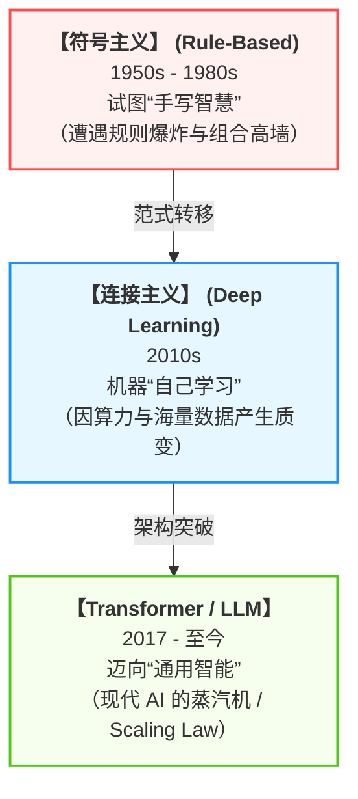
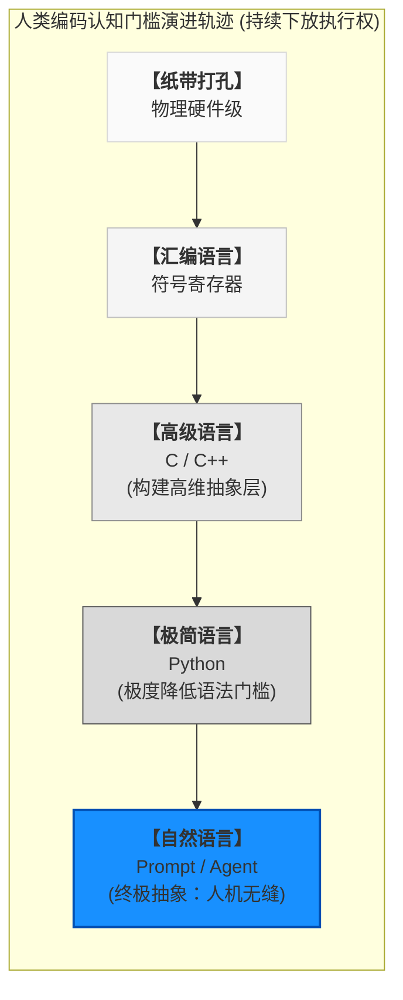
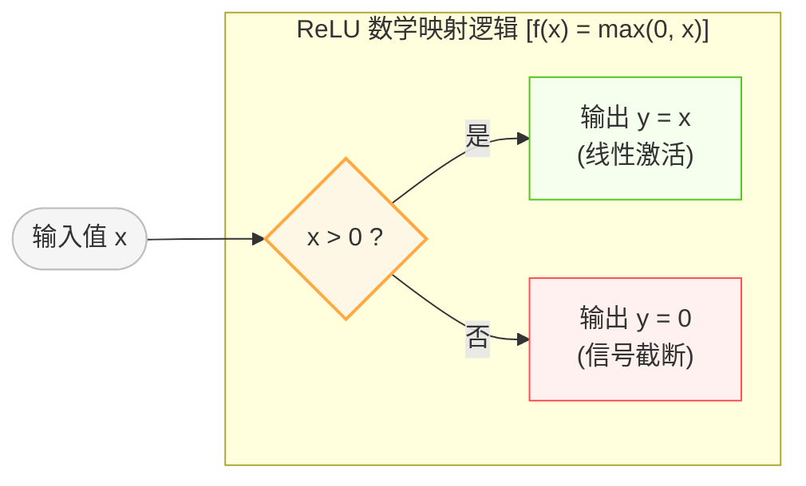
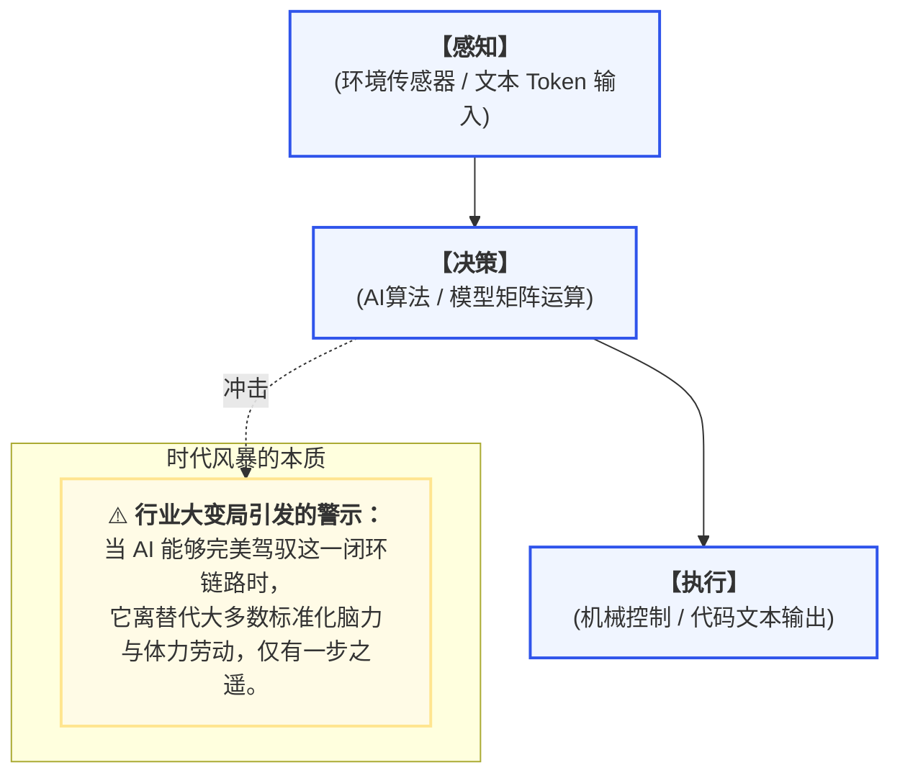

# 背景介绍：AI 进化简史

> 历史不会简单重复，但总是押着相同的韵脚。

过去几十年里，软件工程的核心范式始终没有改变：人类负责思考，计算机负责执行。而今天，大语言模型（LLM）的出现，让机器开始深度介入“思考”这一人类独占的领域。

当开发者第一次体验到 Cursor 自动重构项目、Claude Code 自主修复测试、GitHub Copilot 一口气补完整个复杂函数时，往往都会产生一种强烈的矛盾感。一方面惊叹于这近乎魔法般的生产力跃迁，另一方面则是内心隐隐的不安：如果 AI 已经能自主写代码了，那么还需要我吗？

这种焦虑并不奇怪。因为我们面对的并不是一次常规的工具升级，而是一场软件工业底层生产关系的重构。本章将带你回到 AI 的起点，梳理人工智能与 AI 编程的发展脉络，并拆解大模型“理解代码”的底层逻辑。了解历史可以帮助我们看清：这场技术革命究竟改变了什么？没有改变什么？


## AI 发展简史：从逻辑机器到概率智能

人类对于“制造会思考的机器”的执念，几乎与现代计算机本身同时诞生。在过去七十年里，人工智能的发展并非一条平滑的上升曲线，而更像是一场不断失败、又不断复活的漫长战争。它大致经历了三个关键的范式阶段：



### 符号主义：人类试图“手写智慧”

早期 AI 的核心思想非常朴素：既然人类的思维可以被逻辑和符号所描述，那么只要把所有逻辑规则全部写出来，机器自然就会拥有智能。

于是，科学家们开始构建庞大的规则系统。例如：“`规则 1：如果 (天气 == 晴天 并且 温度 > 25) 则 穿短袖`”。这便是所谓的**符号主义（Symbolism）**。那个时代诞生了大量“专家系统”，它们在国际象棋、数学定理证明等规则边界极其清晰的领域表现惊艳，一度让人类相信通用人工智能近在眼前。

然而，现实世界并不像棋盘那样规整。人类语言充满歧义，图像识别充满噪声，现实环境中的变量近乎无限。你想让机器理解什么是“猫”，很快就会陷入规则的泥潭：黑猫算吗？卡通猫算吗？只有半张脸算吗？光线模糊怎么办？随着边界条件的增加，规则开始呈指数级膨胀，最终撞上了“组合爆炸”的高墙。AI 迎来了第一个寒冬。

### 深度学习：机器开始“自己学习”

与“手写规则”不同，另一派研究者提出了完全相反的思路：不要告诉机器规则，让机器自己从海量数据中去归纳规则。这便是**连接主义（Connectionism）**，也就是我们熟知的机器学习与深度学习。

深度学习的核心武器是**人工神经网络（ANN）**，它模仿生物神经元的连接方式，通过输入信号、加权求和、激活函数处理后产生输出。本质上，神经网络就是一个极其庞大的“高维函数拟合器”。

在过去很长一段时间里，这种方法由于极度依赖算力和数据这两大稀缺资源，始终处于不温不火的状态。直到 2010 年前后，GPU 的爆发带来了恐怖的并行计算能力，移动互联网的发展贡献了前所未有的海量数据。2012 年，AlexNet 在 ImageNet 图像识别竞赛中以碾压性优势夺冠，正式宣告深度学习时代的全面到来。

随后几年，AI 在语音、人脸识别、自动驾驶等领域疯狂攻城略地。但此时的 AI 依然只是“专才”：下棋的 AI 不会聊天，识别图片的 AI 无法开车。直到 Transformer 架构的横空出世，打破了垂直领域的壁垒。

### Transformer：现代 AI 的“蒸汽机”

2017 年，谷歌发表了划时代的论文 《Attention Is All You Need》，提出了 **Transformer** 架构。

相比于传统的循环神经网络（RNN），Transformer 迎来了两大史诗级突破：它能够完美捕捉超长距离的上下文依赖，且极度适合 GPU 并行计算。如果说过去的 AI 更像一个逐字阅读的苦行僧，Transformer 则更像一个能“一眼扫完整页”的天才。这使得模型的参数规模第一次打破了物理限制，可以真正无限扩张。

随后，OpenAI 坚定地践行了震惊世界的 **Scaling Law（尺度定律）**：当模型的参数量、训练数据量和计算量持续扩大时，模型的能力会持续进化，并在跨越某个临界点时产生“能力涌现”。GPT 系列的诞生与 2022 年 ChatGPT 的引爆，让世界意识到，AI 已经不再仅仅是一个呆板的“分类器”，它开始具备对话、多步推理、创造以及极为恐怖的编程能力。


## AI 编程的进化：程序员如何一步步“放权”

代码是天然适合 AI 的土壤。因为代码本质上也是一种语言，且比自然语言更加规整、结构严密、逻辑确定。纵观 AI 编程的发展史，本质上就是一部程序员逐步将“代码执行权与构建权”让渡给机器的历史：

| 发展阶段 | 代表技术 | 交互模式 | 程序员的核心角色 |
| --- | --- | --- | --- |
| **第一代：语法补全** | IDE IntelliSense | 自动补全变量、类名与 API | 键盘操作者（纯体力编码） |
| **第二代：代码续写** | GitHub Copilot | 根据上下文自动生成函数与片段 | 行级监工（逐行审查代码） |
| **第三代：聊天式编程** | ChatGPT / Cursor | 通过自然语言对话生成模块、Debug | 研发教练（组织模块逻辑） |
| **第四代：Agent 智能体** | Claude Code / Windsurf | 自主规划、读写文件、运行测试并修复 | 架构师与终审法官（设定边界） |

从最初的“少敲几个字符”，到如今的 AI Agent 能够自主阅读整个项目架构、分析依赖、修改多处文件、调用终端运行测试、在报错后自我迭代修复……AI 正在从一个“辅助外挂”蜕变为一个 24 小时在线、不知疲惫的初级工程团队。

随之而来的，是软件工程重心的深刻迁移：单纯的代码实现能力开始大幅贬值，而系统设计与约束管理的能力被无限放大。


## 大模型为什么会写代码？

很多人在第一次看到 AI 写出完美的代码时，都会产生一种科幻式的崇拜：它是不是已经真正理解了编程的奥义？

### 概率构成的智能

从底层的技术原理来看，大语言模型做的事情极其纯粹，甚至简单得有些令人大跌眼镜：“根据当前已有的 Token，预测下一个最可能出现的 Token。”

当模型看到如下上下文：

```javascript
function add(a, b) {
    return

```

它会根据在训练阶段吞噬过的海量开源代码，计算出概率空间里的最强趋势，从而续写出：

```javascript
    a + b;
}

```

它学习的并不是刻板的语法教科书，而是整个软件世界的统计学规律。因为在工程现实中，存在着大量的稳定模式：CRUD 操作高度重复、API 调用存在固定范式、常见算法拥有明确结构。当模型规模大到一定程度后，这种基于海量数据的概率预测，就会在表象上涌现出极其逼真的“逻辑推理能力”。

### 为什么 AI 反而更擅长代码？

在直觉上，人类会觉得日常说的话（自然语言）比编程代码更简单，但对大模型而言，恰恰相反：代码才是它最标准、最规范的母语。

自然语言中充斥着大量的歧义、隐喻与环境噪声（例如“苹果”可以代表水果也可以代表公司；“我到了”可能真的到了，也可能还卡在路上）。但代码不同，代码具有极高的“信息密度”和“绝对稳定的规则”。代码中的类型定义、控制流、调用链和数据结构，都在以毫无歧义的方式显式表达逻辑。这使得 Transformer 的注意力机制极其容易捕捉其中的规律。

### 程序员会被淘汰吗？


程序员会被淘汰吗？答案是：常规意义上扮演“代码打字员”角色的程序员，其生存空间将被极大限度地压缩。

回看编程语言的发展史，其核心轨迹无疑是不断向着“降低人类认知门槛”的方向演进：



从晦涩的汇编语言到让编程门槛大幅降低的 Python，人类一直在构建越来越易用的抽象层。过去通向“自然语言直接驱动计算机”这一终极目标的最大技术壁垒，在于机器无法准确解析人类语言天然的模糊性。而今天，LLM 的突破基本上已经彻底扫清了这一障碍。

底层架构、核心算法以及对性能要求极高的系统级开发，依然需要少量顶尖的硬核职业程序员去坚守。但常规的应用层开发、增删改查（CRUD）的业务岗位需求必然会断崖式缩减。考虑到过去十几年行业扩张期积累的庞大软件人才储备，未来的供需失衡恐将让普通程序员面临前所未有的行业寒冬。

面对这场不可逆的技术洪流，一味地焦虑、抗拒，或者装作视而不见，都无济于事。当 AI 能以十倍的速度倾泻代码时，程序员的价值并没有完全消失，但正在发生深刻的位移。

未来的核心竞争力，将不再是熟练掌握某门特定编程语言的语法细节，或者比拼键盘上的肌肉记忆。在代码生成成本趋近于零的时代，一个优秀程序员的护城河将由以下三个全新身份重新定义：

- **领域建模者（Domain Modeler）：** AI 精通代码，但它无法理解混乱、动态、充满博弈的真实商业世界。未来真正稀缺的，是能够深入复杂的业务场景，理清混乱的需求，并将其抽象为优雅、严密、可复现的系统模型的人。
- **AI 的终审法官（The Judge）：** 未来的软件开发，很可能变成“AI 负责疯狂生成，人类负责交叉验证”。由于大模型天然存在幻觉且没有工程责任感，它会以惊人的速度制造出看似优雅却暗藏杀机的技术债。测试、代码审查、边界约束治理的重要性将被无限放大。人类必须紧握“最终裁判权”。
- **架构秩序的守门人（Guardian of Order）：** 当写代码变得轻而易举，系统的复杂度会呈指数级失控。未来最大的工程挑战，是如何在铺天盖地的 AI 生成代码中维持系统的高度一致性，防止架构野蛮腐化，确保整个庞然大物依然在人类的控制下稳定运行。

真正强大的程序员不再是最会写代码的人，而是最会驾驭 AI、约束 AI、理解系统本质的人。


## AI 会产生意识吗？

既然大模型在写代码、做推理时表现得越来越像一个“活人”，那么它是否正在悄然走向“觉醒”？

在技术概念层出不穷的时代，“机器威胁论”每隔十几年就会被热炒一番。然而，如果从纯粹的工程与数学视角来看，大模型距离真正的“意识”还存在着不可逾越的鸿沟。至少在可预见的未来，我们无需担心 AI 拥有真正的自主灵魂。

### 算法的本质：高维函数的叠加拟合

目前最主流的 AI 算法，无论是写代码的大语言模型（LLM）还是画图的扩散模型（Diffusion Model），本质都是基于人工神经网络（ANN）。

在数学上，我们可以把任何复杂的现实问题抽象为一个超级函数。比如“聊天”是一个输入一段文字、输出另一段文字的函数；“编程”是一个输入自然语言需求、输出代码文本的函数。这些函数由于变量极其庞大，无法用一个精简的物理公式来表达。

为了解决这个问题，现代深度学习采用了类似于高维级数分解的方法——将一个无法直视的复杂函数拆解为数十亿、上万亿个极其简单的基础函数的线性与非线性叠加。

在大语言模型中，这个扮演“底层积木”的角色通常是极其简单的 ReLU（线性整流函数）或者是其变体（如 SwiGLU）。


$$\text{ReLU}(x) = \max(0, x)$$



这就是大模型的全部秘密：上千亿个简单如折线一般的数学函数，通过错综复杂的权重连接与线性叠加，最终拟合出了一个能够写出高阶代码的复杂网络。这里的每一步都建立在严格的数学运算和矩阵乘法之上，它是一个高度精密的数学拟合结果，与生物学上的“自我意识”毫无干系。

### 破除 AI 觉醒的两个认知误区

支持 AI 即将觉醒的言论，通常基于两个似是而非的论据：

- 误区一：“人工神经网络是对人脑的模拟，所以人脑有意识，AI 就会有意识。”
这是一种常见的概念偷换。人工神经网络的核心是函数拟合，而非生物学上的人脑模拟。两者在物理结构上存在本质的巨大差异：
   1. 动态与静态： 人脑的神经网络是动态的，神经元之间在思考过程中会不断建立新连接、修剪旧连接；而人工神经网络的架构在训练结束后就是完全静态、死板的，改变的只有权重参数，其突触结构无法自主重组。
   2. 网状与分层： 人脑是真正的、复杂的、深度非线性的三维网状连接；而目前的 AI 模型，本质上依然是高度规整的分层线性传播。甚至，人类至今对自身大脑的运行机制也仅窥见冰山一角。有些物理学者认为，人类的思维活动中可能包含了量子效应或尚未被发现的物理规律。这些都是目前运行在经典计算机芯片上、进行确定性数学计算的 AI 算法完全不具备的。


- 误区二：“量变引起质变，参数量足够多，AI 就会突然灵光一闪产生意识。”
这种想法是将技术当成了魔法。如果算法底层没有关于“自我、动机、意识”的架构设计，再多的参数也不会产生类似能力。指望参数堆叠自发产生意识，就像把组成生命的各种化学元素放进一个玻璃瓶里晃一晃，就指望这些分子能自发排列组合成一个活生生的细胞一样。我们有时候会有一些美好的愿望，希望自己并不了解的东西可以自发地产生魔法和奇迹，但最终这些愿望基本都会落空。

目前的 AI 展现出的高度复杂智力让我们振奋，但它依然是一件冷冰冰的、由数学公式锻造的工具。

## 技术洪流下普通人的历史宿命

既然大模型没有意识，它是不是就无法对人类社会产生实质性威胁？答案恰恰相反。最危险的从来不是工具获得了灵魂，而是工具以无可匹敌的低成本和高效率开始大规模解构现有的社会生产关系。

很多技术乐观主义者会反驳：AI 的到来同样会创造出大量全新岗位。然而，一个残酷的现实被刻意忽略了：那些被技术洪流在短时间内无情淘汰的人，真的能够毫无痛楚地跨越巨大的“技能鸿沟”，摇身一变成为 AI 数据标注师或系统维护专家等新身份吗？



目前，AI 离操作工厂里的机械设备、进行外科手术、或者在软件世界里自主调用各种工具仅有一步之遥。可以预期，教师、秘书、翻译、画师、医生、律师、程序员等行业，在这轮由概率智能引爆的技术革命风暴中，无一能置身事外。

站在未来的门槛上回望，历史总是惊人地相似。人们在史书上总是对那些波澜壮阔的宏大叙事津津乐道。然而在这些英雄史诗的背面，是那些往往被隐入尘烟、沦为背景板的普通百姓。历史残酷地表明：每一次所谓的社会生产力“巨大进步”，在初期往往都伴随着底层从业者生存空间的剧烈挤压与淘汰。

生产关系的演进速度，永远滞后于生产力的狂飙突进。在重大的技术跃迁初期，财富与资源总是不可避免地向掌握新技术、拥有大算力的极少数人集中，反而会导致大多数尚未适应变革、技能单一的普通人处境更加艰难。

