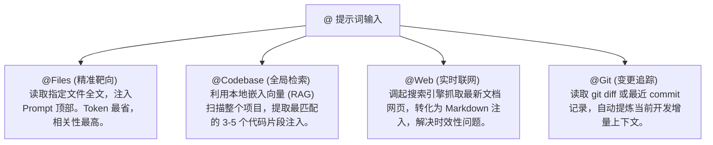

# 上下文工程（Context Engineering）：喂饱你的 AI

> **“大模型没有记忆，你提供给它的上下文，就是它灵魂的全部容器。”**

---

在人机协同开发中，很多程序员遇到 AI 给出牛头不对马嘴的代码或离奇的报错时，第一反应往往是：“这个模型太笨了，根本不能用。”

但如果冷静地做一次“死后剖析（Post-mortem）”，你会发现：**90% 的 AI 编程失败，根本原因都在于输入给它的上下文极度匮乏、模糊或充满噪音。** 

如果大模型不知道你当前的数据库版本、不清楚你全局的错误处理类、看不到你定义的公共 TypeScript 接口，它就只能依据公开互联网的“通用概率平均值”去瞎猜。瞎猜的结果，自然就是与你的系统格格不入的垃圾代码。

本章将系统拆解上下文的核心机制，并通过一个“用户注册模块”的真实案例，演示“极度贫瘠”与“精准富集”上下文带来的天差地别的生成质量。

---

## 1. 深入剖析 @ 符号系统：Files、Codebase 与 Web 的底层机制

在现代 AI IDE（如 Cursor、Windsurf）中，右侧聊天窗口的 `@` 系统是我们最强大的“喂食铲”。理解它们各自的底层抓取机制，才能做到精准投喂：



* **`@Files`（精准投喂，Token 最省）**：直接读取指定文件的全部文本，以高优先级注入到 Prompt 的顶部。这是日常高频重构和调用特定接口时的首选，能实现 100% 的无偏见感知。
* **`@Codebase`（向量检索，跨文件感知）**：AI IDE 会在后台默默地为你的整个项目建立轻量级本地**向量嵌入（Vector Embeddings）**。当你 @Codebase 提问时，它会进行语义检索，抓取出与你问题最相关的 3~5 个文件片段。这适合在寻找全局 bug 或了解跨模块业务流时使用。
* **`@Web`（联网搜索，消灭时效偏差）**：大模型的离线训练数据是有截止日期的。当你需要调用最新的第三方 API（如 Docusaurus v3 或最新的 Next.js v15）时，必须加上 `@Web` 强制联网抓取最新文档，避免 AI 凭借几年前的旧记忆胡说八道。

---

## 2. 经典对比：Poor Context vs. Rich Context

为了让你切身感受到上下文管理的重要性，我们来现场模拟一个开发任务：**“编写一个用户注册路由函数”**。

### ❌ 场景 A：极度贫瘠的上下文（Poor Context）
人类在对话框里直接输入：
> “帮我写一个 Express 的用户注册接口函数。要能保存用户，密码要加密。”

#### AI 在信息荒漠下的生成结果：
```javascript
// AI 凭借互联网的“概率平均值”盲猜写出的代码：
const express = require('express');
const router = express.Router();
const bcrypt = require('bcrypt');
const User = require('./models/User'); // ❌ 盲猜的文件路径，与项目实际架构不符

router.post('/register', async (req, res) => {
  try {
    const { email, password } = req.body;
    const hashedPassword = await bcrypt.hash(password, 10); // ❌ 盲猜的加密算法，可能与项目全局的 Token/Auth 类冲突
    const newUser = new User({ email, password: hashedPassword });
    await newUser.save();
    return res.status(201).json({ message: 'User created' });
  } catch (error) {
    return res.status(500).json({ error: error.message }); // ❌ 粗暴的 try-catch，破坏了项目统一的全局错误处理器
  }
});
```

#### 致命缺陷分析：
1. **数据库断层**：AI 盲猜你用的是 Mongoose，但你的项目实际用的是 Prisma 配合 PostgreSQL。这段代码直接导致编译挂掉。
2. **逻辑重复与混乱**：密码加密它用了普通的 `bcrypt`，但你的项目明明在 `src/utils/crypto.ts` 中封装了加盐的 `scrypt` 算法。
3. **架构污染**：它写了简陋的 `try-catch` 返回原始错误，直接绕过了你精心编写的全局 `errorHandler.ts` 捕获中间件，导致日志监控系统无法捕捉异常。

---

### 🟢 场景 B：精准富集的上下文（Rich Context）
人类通过精准的 `@` 系统，为 AI 搭建了一个极高纯度的“认知沙盒”：
> “请帮我编写用户注册的 API 接口函数。我已把核心的依赖关系附在下方：
> 
> * 数据库模型定义：`@schema.prisma`
> * 项目全局统一的输入校验机制：`@authValidation.ts`
> * 全局密码加密工具：`@crypto.ts`
> * 全局统一错误处理器：`@errorHandler.ts`
> 
> 请严格复用这些现有模块，不要引入任何新的第三方加密包，确保通过全局错误处理中间件安全抛出异常。”

#### AI 在知识灯塔下的生成结果：
```typescript
import { Request, Response, NextFunction } from 'express';
import { prisma } from '../lib/prismaClient'; // ✅ 精准复用项目现有的 Prisma Client
import { validateRegisterInput } from '../utils/authValidation'; // ✅ 严格遵守项目的输入校验契约
import { hashPassword } from '../utils/crypto'; // ✅ 精准调用项目的专属加密算法
import { AppError } from '../middlewares/errorHandler'; // ✅ 融入全局统一错误处理器

export async function registerUser(req: Request, res: Response, next: NextFunction) {
  try {
    // 1. 严格使用全局校验机制
    const { error, value } = validateRegisterInput(req.body);
    if (error) {
      throw new AppError(400, `输入校验失败: ${error.message}`);
    }

    const { email, password, nickname } = value;

    // 2. 检查用户是否已存在
    const existingUser = await prisma.user.findUnique({ where: { email } });
    if (existingUser) {
      throw new AppError(409, '该邮箱已被注册');
    }

    // 3. 复用项目中统一的哈希函数
    const hashedPassword = await hashPassword(password);

    // 4. 精准持久化写入
    const newUser = await prisma.user.create({
      data: {
        email,
        passwordHash: hashedPassword,
        nickname
      },
      select: {
        id: true,
        email: true,
        nickname: true,
        createdAt: true
      }
    });

    return res.status(201).json({
      success: true,
      data: newUser
    });
  } catch (error) {
    // ✅ 不再在局部做脏捕获，直接传递给全局错误处理中间件
    next(error);
  }
}
```

#### 完美生成效果：
这段代码完全不需要人类进行二次修改！它自动使用了你项目的 Prisma 客户端，复用了你已经写好的 `validateRegisterInput` 输入校验，调起了你们团队指定的 `hashPassword` 函数，并在报错时优雅地 `next(error)` 丢给全局监控处理器。这就是**上下文工程的终极威力**。

---

## 3. 即时上下文管理的“断舍离”技巧：应对长会话崩塌

在人机协同开发中，另一个隐性杀手叫做**“上下文腐烂”（Context Rot）**。当你与 AI 连续对话超过 1 个小时，积攒了上百条历史聊天记录后，你会发现大模型突然开始变得丢三落四、反应迟钝，甚至连刚写好的接口名字都记错了。

### 为什么长会话必崩？
1. **迷失在中间（Lost in the Middle）**：模型在超长上下文中对中部信息的召回率会呈指数级下降。你的核心指令被淹没在了无尽的历史废话中。
2. **负面记忆污染**：你和 AI 在调试过程中尝试过的、但最终被抛弃的 3 个错误思路依然残留在历史消息中，干扰了 AI 当前的推理路径。

### 🛠️ 黄金法则：另起炉灶的艺术
一旦发现 AI 出现智商退化的苗头，**毫不犹豫地关闭当前 Chat 会话**，开启一个新的干净会话！

在新会话的开头，直接以最干净的结构“投喂”当前切片状态：
> “我们正在开发用户模块。刚才已经顺利完成了 `register.ts` 文件的编写，以下是目前最新的完整代码：
> 
> `[粘贴代码]`
> 
> 现在，让我们开启下一阶段任务：编写对应的 `loginUser` 登录认证接口。”

轻装上阵的 AI 会瞬间重新激发它最高级别的代码推理能力。

---

## 本章小结

谁掌控了上下文，谁就掌控了 AI。在本章中，我们：
1. 深入剖析了 Files、Codebase 与 Web 等即时上下文的抓取机制；
2. 通过 Poor Context 与 Rich Context 的真实代码对比，直观感受到了上下文丰富度对生成质量的决定性作用；
3. 学习了如何利用“另起炉灶”的断舍离技巧，彻底消灭长会话带来的上下文腐烂。

上下文不仅是文件的堆叠。在现代全自动智能体（Agent）中，大模型已经能够主动调用本地工具。这种“人机合一”的最前沿形态正是 **MCP 协议**。

下一章，让我们一起走进 **《Agent Skills 与 MCP：动手搭建你的第一个自定义 MCP Server》（扩充版）**。
