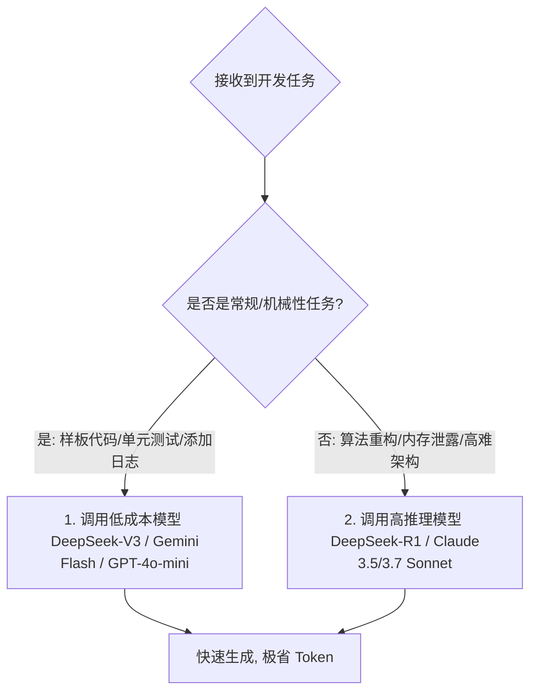

# AI 编程的成本控制：把算力压榨到极致

> **“在人机结对时代，Token 就像是你的电费和水费。一个不懂得控制 Token 的程序员，很快就会被昂贵的 API 账单直接劝退；而真正的工程大师，能用最低的算力成本撬动最高的生产力。”**

---

在刚刚配置好本地 AI 开发环境或命令行工具（如 Cline/Aider）时，许多开发者会沉浸在 AI 瞬间重写几十个文件的快感中。然而，到了月底，当他们看到 API 控制台上高达几百美元的扣费账单时，才猛然惊醒。

大模型虽然聪明，但它的计算是要付费的。如果每一次提问，你的工具都会悄无声息地把项目里的上万行代码重新“打包投喂”一次，那么你的 API 额度就会像流水一样瞬间烧光。

本章将系统拆解 **AI 编程的成本构成**，并为你奉上三套被业界顶级极客奉为圣经的**算力省钱战术**。

---

## 1. 账单解密：API 是如何收你的钱的？

为了省钱，我们必须先弄清大模型厂商的计费公式。大模型 API 交互通常包含三种 Token：

$$\text{总费用} = (\text{输入 Token 数量} \times \text{输入单价}) + (\text{输出 Token 数量} \times \text{输出单价}) - (\text{缓存命中 Token 数量} \times \text{缓存折扣})$$

* **输入 Token (Input Tokens)**：你发送给 AI 的所有消息、历史对话记录，以及你引用的本地文件代码的总量。**在开发中，输入 Token 往往占据了总体消耗的 80% ~ 90%**。因为每次你问一句话，AI 工具都需要把之前几十次对话的历史记录、以及包含几千行代码的源文件全部打包重新发给大模型。
* **输出 Token (Output Tokens)**：AI 回复给你的代码和文本数量。价格通常是输入 Token 的 **3 ~ 5 倍**，但因为单次输出文字量有限，所以总体占比并没有输入 Token 那么高。
* **缓存命中 Token (Prompt Caching / Context Caching)**：如果你的上一次提问和这一次提问，发送的文件内容有高达 90% 是一模一样的，模型在服务器端就会直接复用上一次的缓存，而不需要重新计算。缓存命中的 Token 价格通常可以获得 **1 折（省 90%）到 5 折** 的惊人折扣。这正是我们省钱的核心阵地！

---

## 2. 货比三家：主流 API 价格横向对比（2026 年最新数据）

为了让你直观感受到不同模型的“性价比”，我们把各大厂商核心模型的收费价格整理如下（价格单位：美元 / 每百万 Token）：

| 模型名称 | 厂商 | 输入单价 (每百万) | 输出单价 (每百万) | 缓存命中的输入折扣 | 适用场景 |
|---|---|---|---|---|---|
| **DeepSeek-V3** | DeepSeek | **$0.14** | **$0.28** | **0.1 折 ($0.014)** | **极高性价比**，日常代码编写、样板代码生成。 |
| **DeepSeek-R1** | DeepSeek | **$0.55** | **$2.19** | **0.1 折 ($0.055)** | **神级性价比**，高难度算法、架构设计与底层排错。 |
| **Gemini 2.5 Flash** | Google | **$0.075** | **$0.30** | **无** | **极速便宜**，支持超长上下文，日常常规工具选型。 |
| **Gemini 2.0 Pro** | Google | **$1.25** | **$5.00** | **无** | **平衡之选**，巨量上下文检索，长篇重构。 |
| **GPT-4o-mini** | OpenAI | $0.15 | $0.60 | 5折 | 兼容性极强，日常简单重写。 |
| **Claude 3.5 Sonnet** | Anthropic | $3.00 | $15.00 | **1 折 ($0.30)** | **编程智商巅峰**，极其复杂的重构、TDD与深度调试。 |
| **Claude 3.7 Sonnet (Hybrid/Thinking)** | Anthropic | $3.00 (思考 Token 算输出价) | $15.00 | **1 折 ($0.30)** | **新一代代码霸主**，极高自主性的 PR 审查与全自主 Agent。 |

*从表格中可以一眼看出，DeepSeek 的价格近乎是硅谷闭源模型的 **百分之一**。这也是为什么学会在不同任务中“混合调度”模型是省钱的核心。*

---

## 3. 省钱大招一：模型分级协作战术 (Tiered LLM Strategy)

在团队开发中，最忌讳的是“用大炮打蚊子”——无论遇到什么琐碎任务，都无脑调用最贵、最聪明的 Claude 3.7 Sonnet。我们可以构建一个动态路由决策：

### 🎯 场景 A：使用低成本模型（日常体力活）
当你要写常规的 HTML 表单、给函数补写单元测试、在代码里插入大量的打点日志，或者写一些通俗的文档注释时，**毫不犹豫地使用 DeepSeek-V3 或 Gemini 2.5 Flash**。它们的速度快如闪电，且调用一百次的成本可能还买不起一杯咖啡。

### 🧠 场景 B：使用高智商/强推理模型（重大重构与高难排错）
当你遇到了匪夷所思的内存泄露、高并发竞态条件，或者需要设计一套复杂的解耦架构设计书时，**立刻切换为 DeepSeek-R1（推理模型）或 Claude 3.7 Sonnet**。把钱花在真正的“刀刃”上，让最强的智慧去攻克最坚硬的堡垒。

---

## 4. 省钱大招二：自动会话压缩（Claude Code 压缩原理）

终端 Agent 工具（如 Claude Code）在长会话中的 Token 控制非常高明。为了防止上下文随着对话深入而发生“Lost in the Middle”的智商衰退，它设计了**自动压缩机制（Auto-compact）**：

1. **阈值触发**：当历史会话消耗的 Token 达到上下文窗口的临界点（如 90% 的上下文水位）时，工具会暂停当前对话。
2. **异步摘要**：后台会自动唤醒一个轻量级快速模型，对前 80% 的对话内容进行“语义蒸馏”。
3. **遗忘废话，保留决策**：它会过滤掉“你说的对，对不起，我再改改”等调试中的道歉和尝试代码，仅提炼出：
   - 目前已确认修改的文件路径及最终实现契约。
   - 人类架构师做出的核心架构决策。
   - 剩余未完工的 Phase 步骤。
4. **状态复位**：将这段紧凑的摘要作为第一条 System 消息，直接清空这 80% 的历史垃圾 Token，使 AI 的智商瞬间归位，且为你砍掉接下来大笔的交互账单。

---

## 5. 战力核算：典型中型项目 Token 账单推演

为了让你对开发成本有具体的感知，我们来核算一个 10,000 行核心代码（约 50 个 TS/JS 文件，折合 30 万 Token 上下文）的项目，在一次为期 **2 周开发** 中的成本差异：

| 调度策略 | 每日交互次数 | 缓存命中率 | 使用模型 | 2周总成本 (估算) |
|---|---|---|---|---|
| **土豪全选 Sonnet (无缓存)** | 100 次 | 0% | Claude 3.5 Sonnet | **约 $150.00 ~ $220.00** |
| **混合调度 + 缓存保活** | 120 次 | 85% | Claude 3.5 Sonnet (20%) + DeepSeek-V3/R1 (80%) | **约 $12.00 ~ $18.00** |

*数据表明，合理的混合调度和缓存保活策略能帮你省下将近 90% 的算力开销！*

---

## 6. 省钱大招三：上下文主动剪枝 (Active Context Pruning)

你的 AI 工具在没有经过特殊优化时，是一个非常贪婪的“吞金兽”。如果不加约束，它会把你的整个编译产物、甚至 `node_modules` 里的几十万个依赖文件一股脑丢给 API。

你必须掌握**上下文主动剪枝技术**：

### ✂️ 战术 1：编写专用的 `.gitignore` 与排除配置文件
如果你在使用 Aider 或 Cline，它们会自动遵循你项目根目录下的 `.gitignore`。
* **保命做法**：把所有自动生成的代码（如打包后的 `build/`、`dist/`、依赖文件夹 `node_modules/`、以及超大的测试日志文件 `*.log`）严格写入 `.gitignore` 中。这不仅能让你的 Git 干净，更阻断了 AI 自动读取它们的可能。
* 对于 Cursor，可以在设置中合理配置 **“Exclude Files”**，排除不需要 AI 感知的庞大资源文件夹。

### ✂️ 战术 2：学会“定向喂养”，拒绝无脑 `@Codebase`
在 Cursor 中使用 `@Codebase` 是一个很酷的动作，它会对整个仓库做向量化索引并进行检索。但在日常开发中，很多时候 AI 只需要知道特定的 2 个核心接口文件就行了。
* **精致做法**：不要动辄 `@Codebase`，而是精准地在聊天窗口输入 **`@src/api/user.js`** 和 **`@src/models/userModel.js`**。这种“靶向投喂”能将单次查询的 Token 消耗从 20,000 直接压缩到 1,500，瞬间帮你省下十倍的费用！

---

## 本章小结

钱要花在刀刃上。人机协同不是为了证明算力的无限浪费，而是为了实现效率与成本的最佳平衡。在本章中，我们：
1. 理解了输入 Token、输出 Token 与缓存命中（Prompt Caching）的计费关系；
2. 梳理了 2026 主流大模型的性价比梯度，认识到了 DeepSeek 的极低价格优势；
3. 学习了 Claude Code 的自动会话压缩机理；
4. 掌握了“分级调用（Flash vs Reasoning）”、“疯狂缓存”以及“主动剪枝”三大省钱绝招。

掌握了环境配置、Git 安全带、多模态前沿与成本控制之后，你已经完成了《重构程序员》全书最硬核的底层理论升级。

接下来，我们将进入如何为 AI 树立钢铁般的纪律——编写项目级操作指令的战役。

让我们一起进入 **《铁律的边界：编写 AI 专属的操作指令》（扩充版）**！
