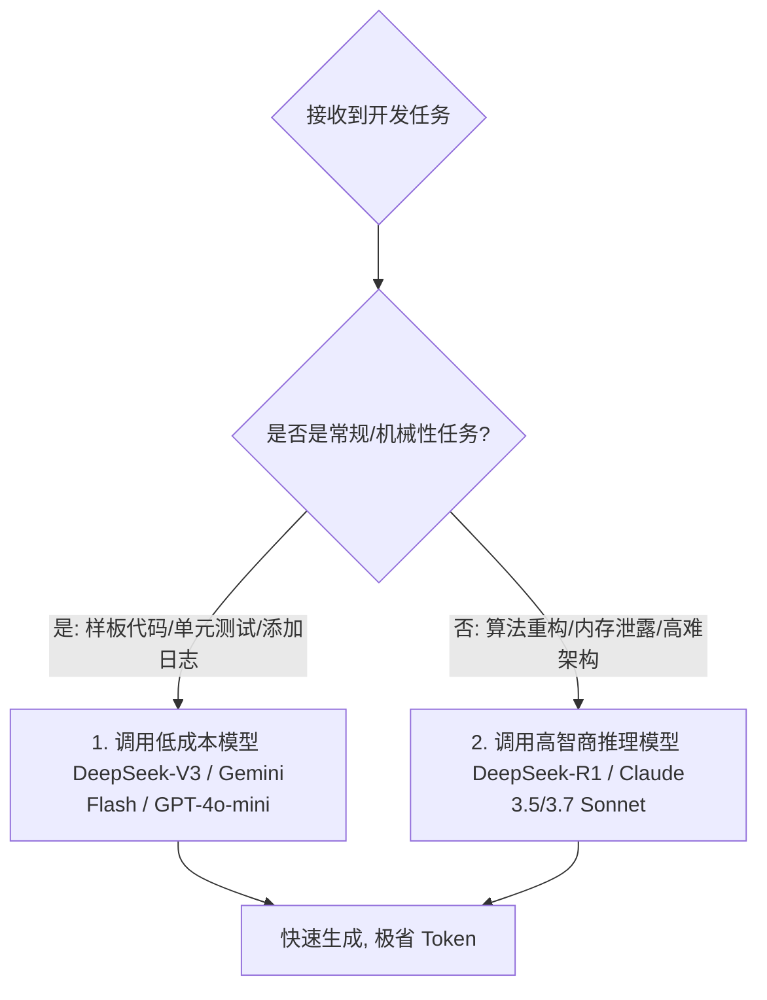

# AI 编程的成本控制：把算力压榨到极致

> **“在人机结对时代，Token 就像是你的电费和水费。一个不懂得控制 Token 的程序员，很快就会被昂贵的 API 账单直接劝退；而真正的工程大师，能用最低的算力成本撬动最高的生产力。”**

---

在刚刚接入本地 AI 开发环境或命令行工具（如 Cline/Aider）时，许多开发者会沉浸在 AI 瞬间重写几十个文件的快感中。然而，到了月底，当他们看到 API 控制台上高达几百美元的扣费账单时，才猛然惊醒。

大模型虽然聪明，但它的计算是要付费的。如果每一次提问，你的工具都会悄无声息地把项目里的上万行代码重新“打包投喂”一次，那么你的 API 额度就会像流水一样瞬间烧光。

本章将系统拆解 **AI 编程的成本构成**，并为你奉上三套拿来即用、被业界顶级极客奉为圣经的**算力省钱战术**。

---

## 1. 账单解密：API 是如何收你的钱的？

为了省钱，我们必须先弄清大模型厂商的计费公式。大模型 API 交互通常包含三种 Token：

$$\text{总费用} = (\text{输入 Token 数量} \times \text{输入单价}) + (\text{输出 Token 数量} \times \text{输出单价}) - (\text{缓存命中 Token 数量} \times \text{缓存折扣})$$

### 📥 输入 Token (Input Tokens)
你发送给 AI 的所有消息、历史对话记录，以及你引用的本地文件代码的总量。
* **特点**：在人机协同开发中，**输入 Token 往往占据了总体消耗的 80% ~ 90%**。因为每次你问一句话，AI 工具都需要把之前几十次对话的历史记录、以及包含几千行代码的源文件全部打包重新发给大模型。

### 📤 输出 Token (Output Tokens)
AI 回复给你的代码和文本数量。
* **特点**：价格通常是输入 Token 的 **3 ~ 5 倍**，但因为单次输出文字量有限，所以总体占比并没有输入 Token 那么高。

### 💽 缓存命中 Token (Prompt Caching / Context Caching)
这是现代大模型（如 Anthropic Claude, DeepSeek）推出的一项伟大技术。如果你的上一次提问和这一次提问，发送的文件内容有高达 90% 是一模一样的，模型在服务器端就会直接复用上一次的缓存，而不需要重新计算。
* **特点**：缓存命中的 Token 价格通常可以获得 **1 折（省 90%）到 5 折** 的惊人折扣。这正是我们省钱的核心阵地！

---

## 2. 货比三家：主流 API 价格横向对比 (2026年最新数据)

为了让你直观感受到不同模型的“性价比”，我们把各大厂商核心模型的收费价格整理如下（价格单位：美元 / 每百万 Token）：

| 模型名称 | 厂商 | 输入单价 (每百万) | 输出单价 (每百万) | 缓存命中的输入折扣 | 适用场景 |
|---|---|---|---|---|---|
| **DeepSeek-V3** | DeepSeek | **$0.14** | **$0.28** | **0.1 折 ($0.014)** | **极高性价比**，日常代码编写、样板代码生成。 |
| **DeepSeek-R1** | DeepSeek | **$0.55** | **$2.19** | **0.1 折 ($0.055)** | **神级性价比**，高难度算法、架构设计与底层排错。 |
| **Gemini 2.5 Flash** | Google | **$0.075** | **$0.30** | **无** | **极速便宜**，支持超长上下文，日常常规工具选型。 |
| **GPT-4o-mini** | OpenAI | $0.15 | $0.60 | 5折 | 兼容性极强，日常简单重写。 |
| **Claude 3.5 Sonnet** | Anthropic | $3.00 | $15.00 | **1 折 ($0.30)** | **编程智商巅峰**，极其复杂的重构、TDD与深度调试。 |
| **GPT-4o** | OpenAI | $2.50 | $10.00 | 5折 | 经典旗舰，综合任务。 |

*从表格中可以一眼看出，DeepSeek 的价格近乎是硅谷闭源模型的 **百分之一**。这也是为什么学会在不同任务中“混合调度”模型是省钱的核心。*

---

## 3. 省钱大招一：模型分级协作战术 (Tiered LLM Strategy)

在团队开发中，最忌讳的是“用大炮打蚊子”——无论遇到什么琐碎任务，都无脑调用最贵、最聪明的 Claude 3.5 Sonnet。
顶尖的 AI 结对专家通常会采用 **“分级协作机制”**：

### 🎯 场景 A：使用低成本模型（日常体力活）
当你要写常规的 HTML 表单、给函数补写单元测试、在代码里插入大量的打点日志，或者写一些通俗的文档注释时，**毫不犹豫地使用 DeepSeek-V3 或 Gemini 2.5 Flash**。它们的速度快如闪电，且调用一百次的成本可能还买不起一杯咖啡。

### 🧠 场景 B：使用高智商/强推理模型（重大重构与高难排错）
当你遇到了匪夷所思的内存泄露、高并发竞态条件，或者需要设计一套复杂的解耦架构设计书时，**立刻切换为 DeepSeek-R1（推理模型）或 Claude 3.5 Sonnet**。把钱花在真正的“刀刃”上，让最强的智慧去攻克最坚硬的堡垒。

---

## 4. 省钱大招二：疯狂榨取“提示词缓存”红利

目前，Anthropic 与 DeepSeek 的 API 都支持**提示词缓存（Prompt Caching）**。如果你在使用 Cline 或 Aider 这样需要频繁投喂整个文件的工具，如何编排你的提示词来保持缓存不失效？

### 💡 秘诀 1：把“不会变动”的巨大上下文放在最前面
模型的缓存匹配是**按从头到尾的顺序**进行的。一旦前面的内容发生了一丁点改变，后面的所有缓存就会瞬间宣告失效。
* **省钱做法**：在向 AI 工具中注入信息时，把最长、最稳定、最不容易修改的信息（比如几万字的官方 API 参考手册、你的项目全局 README、系统架构规范等）放在对话的最开始引入。只要你不修改这部分，它在后续的十几次交互中都能获得高达 **90% 甚至 99% 的计费折扣**。

### 💡 秘诀 2：小步多聊，杜绝在单次对话中频繁修改顶层文档
在同一个 Chat Session（聊天会话）中，尽量围绕一个具体的单一任务进行深入，完成了这个任务后，立刻存档并**主动重置/开启新的会话**。如果一个会话拖得太长，积攒了上百条历史消息，就算缓存命中，高额的历史包袱也会让你的基础输入 Token 居高不下。

---

## 5. 省钱大招三：上下文主动剪枝 (Active Context Pruning)

你的 AI 工具在没有经过特殊优化时，是一个非常贪婪的“食铁兽”。如果不加约束，它会把你的整个 `dist` 编译产物、甚至 `node_modules` 里的几十万个依赖文件一股脑丢给 API，在几秒内烧光你的全部额度。

为了阻止这种“自杀式”的 Token 烧毁行为，你必须掌握**上下文主动剪枝技术**：

### ✂️ 战术 1：编写专用的 `.gitignore` 与配置文件
如果你在使用 Aider 或 Cline，它们会自动遵循你项目根目录下的 `.gitignore`。
* **保命做法**：把所有自动生成的代码（如打包后的 `build/`、`dist/`、依赖文件夹 `node_modules/`、以及超大的测试日志文件 `*.log`）严格写入 `.gitignore` 中。这不仅能让你的 Git 干净，更阻断了 AI 工具偷偷读取它们的可能。
* 对于 Cursor，可以在设置中合理配置 **“Exclude Files”**，排除不需要 AI 感知的庞大资源文件夹。

### ✂️ 战术 2：学会“定向喂养”，拒绝无脑 `@Codebase`
在 Cursor 中使用 `@Codebase` 是一个很酷的动作，它会对整个仓库做向量化索引并进行检索。但在日常开发中，很多时候 AI 只需要知道特定的 2 个核心接口文件就行了。
* **精致做法**：不要动辄 `@Codebase`，而是精准地在聊天窗口输入 **`@src/api/user.js`** 和 **`@src/models/userModel.js`**。这种“靶向投喂”能将单次查询的 Token 消耗从 20,000 直接压缩到 1,500，瞬间帮你省下十倍的费用！

---

## 本章小结

钱要花在刀刃上。人机协同不是为了证明算力的无限浪费，而是为了实现效率与成本的最佳平衡。在本章中，我们：
1. 理解了输入 Token、输出 Token 与缓存命中（Prompt Caching）的计费关系；
2. 梳理了主流大模型的性价比梯度，认识到了 DeepSeek 的极低价格优势；
3. 掌握了“分级调用（Flash vs Reasoning）”、“疯狂缓存”以及“主动剪枝（Exclude Files）”三大省钱绝招。

掌握了环境配置、Git 安全带、多模态前沿与成本控制之后，你已经完成了《重构程序员》全书最硬核的底层理论升级。

接下来，我们将踏入实打实的**老章节内容重塑与大规模实战充实**。我们将为 7 个偏薄的章节注入真正的“灵魂与实战”，首先就是构建你的工具阵地——

让我们一起进入 **《生产力工具选型：构建你的 AI 开发阵地》（扩充版）**！
