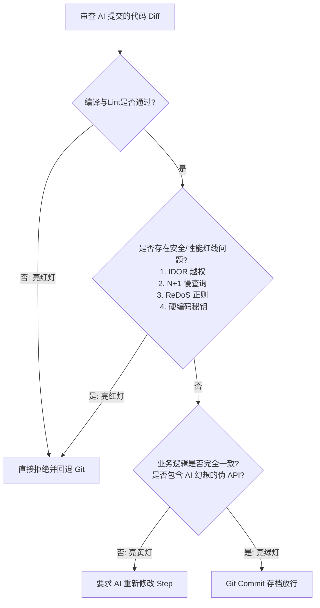

# 批判性思维与最高裁判权

> **“键盘在 AI 手里，但最高裁判的法槌，永远必须握在人类手里。”**

---

在人机协同编程时代，大模型生成代码的高速度极易引发一种可怕的软件工程亚健康现象——**“认知懒惰”**。许多开发者顺从地接受大模型给出的所有代码，连看都不看就直接合入主分支。

这不仅是工程态度的堕落，更是软件事故的开始。大模型不需要为线上宕机负责，不需要在凌晨三点起床排查 Core Dump，更不会被公司解雇。只有你，屏幕前的人类程序员，需要承担代码的一切因果律。

为了防范 AI 的“甜蜜毒药”，人类必须坐在法官席上，以冷酷怀疑的目光去审视每一行生成的 Diff。本章将通过“安全”、“性能”以及“算法隐患”三个经典的 AI 翻车案例，演示人类“最高裁判”应当如何对生成的代码执行严苛的质量判决。

---

## 🔒 审判案例一：AI 遗漏的越权漏洞（IDOR 安全红线）

### ⏳ 翻车场景
你让 AI 编写一个“删除指定购物车条目”的 API 接口。AI 快速写出了以下看起来格式非常优雅、结构极其标准的 Express + Prisma 代码：

```typescript
// AI 生成的删除购物车条目函数（看似完美，实则剧毒）
export async function deleteCartItem(req: Request, res: Response, next: NextFunction) {
  try {
    const { itemId } = req.params; // ❌ 仅获取要删除的条目 ID

    // 检查条目是否存在
    const item = await prisma.cartItem.findUnique({
      where: { id: parseInt(itemId) }
    });

    if (!item) {
      return res.status(404).json({ error: "未找到该条目" });
    }

    // ❌ 致命安全漏洞：直接执行删除！
    await prisma.cartItem.delete({
      where: { id: parseInt(itemId) }
    });

    return res.status(200).json({ success: true, message: "删除成功" });
  } catch (error) {
    next(error);
  }
}
```

### 🔨 判官法槌：指出 IDOR 越权漏洞
大模型在这个任务中只关注了“逻辑的执行”（即：拿到 ID -> 删除条目），却完全遗漏了**“用户权限隔离边界”**。
这是一个极其典型的**水平越权漏洞（IDOR，Insecure Direct Object Reference）**。黑客只需要登录自己的账号，然后通过脚本遍历递增 `itemId`（如 `10023`、`10024`），就可以强行删除全站所有用户的购物车数据！

### 🛡️ 拯救方案：重塑权限防线
人类裁判冷酷否决了这一生成，并指令 AI 重构：

```typescript
// 修复后的高安全性删除代码
export async function deleteCartItem(req: Request, res: Response, next: NextFunction) {
  try {
    const { itemId } = req.params;
    const currentUserId = req.user.id; // ✅ 从身份认证中间件中提取当前登录用户的 ID

    // 联合查询校验拥有权：确保该 itemId 的购物车必须属于 currentUserId
    const item = await prisma.cartItem.findFirst({
      where: {
        id: parseInt(itemId),
        cart: {
          userId: currentUserId // ✅ 强行关联用户隔离边界
        }
      }
    });

    if (!item) {
      // 故意返回 404 而不是 403，防范黑客探测其他用户条目的存在性
      return res.status(404).json({ error: "未找到该条目" });
    }

    await prisma.cartItem.delete({
      where: { id: parseInt(itemId) }
    });

    return res.status(200).json({ success: true, message: "条目已安全删除" });
  } catch (error) {
    next(error);
  }
}
```

---

## ⚡ 审判案例二：AI 制造的“N+1 查询”黑洞（极限性能红线）

### ⏳ 翻车场景
你需要写一个后台管理页面，列出最近的 100 条订单，并展示每一笔订单对应的买家昵称。AI 啪地写出了一段看似合情合理的 Node.js + TypeORM 查询代码：

```javascript
// AI 生成的获取最近订单及用户信息逻辑（经典性能黑洞）
export async function getRecentOrders(req, res, next) {
  try {
    const orders = await orderRepository.find({
      order: { createdAt: 'DESC' },
      take: 100
    });

    const enrichedOrders = [];
    for (const order of orders) {
      // ❌ 致命的循环内数据库查询！
      const user = await userRepository.findOne({ where: { id: order.userId } }); 
      enrichedOrders.push({
        ...order,
        buyerName: user ? user.nickname : "未知用户"
      });
    }

    return res.status(200).json(enrichedOrders);
  } catch (error) {
    next(error);
  }
}
```

### 🔨 判官法槌：刺穿 N+1 慢查询黑洞
大模型缺乏“物理时间”与“IO 瓶颈”的概念。在它的概率网络中，“循环遍历 -> 单独查表”是一种非常直观的代码结构。
然而在生产环境下，这行代码是灾难性的 **N+1 查询黑洞**：每次查表都是一次网络 IO，这会导致数据库的 CPU 瞬间飙升到 100%。如果并发用户稍微升高，系统会瞬间雪崩死机！

### 🛡️ 优化策略：引导 AI 使用 JOIN 联表查询
人类法官立刻否决代码，发出严厉训诫：

```javascript
// 优化后的高QPS联表查询代码
export async function getRecentOrders(req, res, next) {
  try {
    const orders = await orderRepository.find({
      relations: ["user"], // ✅ 声明级联抓取关联的用户行 (LEFT JOIN)
      order: { createdAt: 'DESC' },
      take: 100
    });

    const result = orders.map(order => ({
      id: order.id,
      amount: order.amount,
      createdAt: order.createdAt,
      buyerName: order.user ? order.user.nickname : "未知用户"
    }));

    return res.status(200).json(result);
  } catch (error) {
    next(error);
  }
}
```

---

## 💥 审判案例三：AI 制造的灾难性 ReDoS（算法安全红线）

### ⏳ 翻车场景
你让 AI 编写一个验证用户输入的邮箱是否合法的正则表达式规则。
AI 信心满满地写出了如下正则表达式：
```typescript
// AI 生成的经典邮箱校验正则
const emailRegex = /^([a-zA-Z0-9-\.]+)+@([a-zA-Z0-9-\.]+)+$/;
```

### 🔨 判官法槌：ReDoS 正则表达式拒绝服务攻击
大模型在处理正则表达式时，极易写出带有**恶性嵌套量词**的正则（如 `(a+)+` 或 `([a-zA-Z0-9-\.]+)+`）。
当恶意用户故意输入一个极长且尾部不合法的邮箱（例如输入包含 50 个 `a` 却在尾部缺少 `@` 的字符串：`aaaaaaaaaaaaaaaaaaaaaaaaaaaaaaaaaaaaaaaaaaaaaaaaaa!`），JavaScript 的正则引擎在进行回溯（Backtracking）时，计算步骤会呈**指数级暴增**，导致整个服务器进程直接死锁卡死在 CPU 计算中，瞬间拖垮整个集群！这就是著名的 **ReDoS（Regular Expression Denial of Service）** 攻击。

### 🛡️ 拯救方案：强行拦截
人类裁判否决该正则，并命令 AI 使用原生标准库或者更安全的非回溯正则：
```typescript
// 优化后的高安全性邮箱校验
export function isValidEmail(email: string): boolean {
  if (email.length > 254) return false; // 限制输入长度，阻断超长回溯
  
  // 采用简单、无嵌套量词的非指数级回溯正则
  const safeEmailRegex = /^[a-zA-Z0-9._%+-]+@[a-zA-Z0-9.-]+\.[a-zA-Z]{2,}$/;
  return safeEmailRegex.test(email);
}
```

---

## 4. 人类裁判的决策分支树（Decision Tree）

在审查 AI 提交的 Diff 代码时，你应当在大脑中运行如下的决策过滤流程：



---

## 本章小结

批判性思维是你在赛博洪流中立于不败之地的定海神针。在本章中，我们：
1. 直观审判了 AI 遗漏的水平越权漏洞（IDOR）；
2. 戳破了 AI 在循环体中编写数据库查询引发的 “N+1 查询”性能黑洞；
3. 诊断了因嵌套量词引起的致命 ReDoS（正则表达式拒绝服务）攻击，并给出防范技巧；
4. 建立了人类判官的决策审核树。

当个人修行达到无懈可击后，我们如何将这套人机协作的心法推广到整个团队，使多人结对时效率翻倍而不是制造混乱？

下一章，让我们一起走进 **《团队协作与工程化实践》（扩充版）**。
