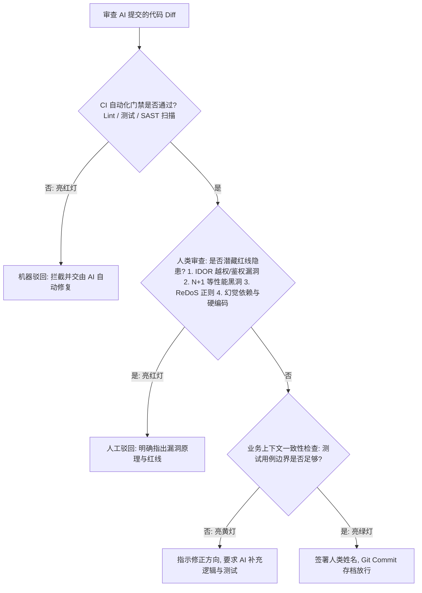

# 最终裁决

> 键盘在 AI 手里，但最高裁判的法槌，永远必须握在人类手里。

随着 97% 的组织开始使用或试点 AI 编程助手，软件开发的痛点已经悄然转移。过去，我们的瓶颈在于“如何快速把代码写出来”；现在，生与死的界线变成了“如何确保写出的代码是安全的”。

在人机协同编程时代，大模型生成代码的高速度极易引发一种可怕的软件工程亚健康现象——“认知懒惰”。许多开发者顺从地接受大模型给出的所有代码，面对极其专业且优雅的代码格式，产生了一种“虚假的安全感”，连看都不看就直接合入主分支。这不仅是工程态度的堕落，更是软件灾难的开始。最新研究表明，AI 生成代码中的逻辑和正确性缺陷比传统开发方法高出 1.7 倍。

大模型不需要为线上宕机负责，不需要在凌晨三点起床排查 Core Dump，更不会因为数据泄露被公司解雇。只有你，屏幕前的人类程序员，需要承担代码的一切因果律。

为了防范 AI 的“甜蜜毒药”，人类必须稳坐在法官席上，以冷酷怀疑的目光去审视每一行生成的 Diff。

## 默认不信任的裁判心智

不要把 AI 当作一个“需要指导的高级工程师”。在代码审查的法庭上，你应该把它当成一个打字极快、不知疲倦、但绝不承担任何责任的狂热实习生。

人类在审查同事实体代码时，通常假设代码背后有作者对业务的“意图”和理解。但 AI 没有意图，它只是基于庞大的概率模型预测“看起来最合理的下一行代码”。AI 工具在设计上往往倾向于优化“任务完成（Task Complete）”，而不是“任务正确（Task Correct）”。

因此，审查 AI 代码时，我们要彻底转变心智模型：建立“默认不信任”的原则。不要问“这代码看起来合理吗？”，而要问“这代码做出了什么假设？这些假设在极端边缘情况下安全吗？”

### 审查维度

| 审查维度 | 传统的人审人思维 | AI 时代的人审机器思维 |
| --- | --- | --- |
| 业务意图 | 相信作者了解系统的 Auth（鉴权）机制。 | 预设 AI 可能会为了跑通逻辑，强行绕过 Auth 或把校验错放在 UI 层。 |
| 历史语境 | 相信作者知道这个核心函数的历史坑点。 | 预设 AI 毫无历史记忆，它极有可能自信地精准踩中五年前的漏洞模式。 |
| 代码表象 | 代码有详尽注释，说明逻辑是深思熟虑的。 | 认定注释只是 AI 为了让代码“看起来专业”而生成的伪装文本。 |

当 AI 告诉你“这段代码是安全的”时，绝不要相信它的口头解释。要求它提供证据——例如证明边界条件被妥善处理的测试用例运行结果。没有证据的代码，一律当庭驳回。

## 翻车的三大真实案卷

为了演示人类“最高裁判”应当如何执行严苛的质量判决，我们来看三个极其典型的 AI 翻车案例。它们分别触碰了安全、性能与算法的三大底线。

### 审判案卷一：AI 遗漏的越权漏洞（IDOR 安全红线）

#### 翻车场景

你让 AI 编写一个“删除指定购物车条目”的 API 接口。AI 快速写出了以下看起来格式非常优雅、结构极其标准的 Express + Prisma 代码：

```typescript
// AI 生成的删除购物车条目函数（看似完美，实则剧毒）
export async function deleteCartItem(req: Request, res: Response, next: NextFunction) {
  try {
    const { itemId } = req.params; // 仅获取要删除的条目 ID

    // 检查条目是否存在
    const item = await prisma.cartItem.findUnique({
      where: { id: parseInt(itemId) }
    });

    if (!item) {
      return res.status(404).json({ error: "未找到该条目" });
    }

    // 致命安全漏洞：直接执行删除！
    await prisma.cartItem.delete({
      where: { id: parseInt(itemId) }
    });

    return res.status(200).json({ success: true, message: "删除成功" });
  } catch (error) {
    next(error);
  }
}
```

#### 判官法槌：指出 IDOR 越权漏洞

大模型在这个任务中只关注了“逻辑的执行”（即：拿到 ID -> 查库 -> 删除），却完全遗漏了“用户权限隔离边界”。这是一个极其典型的水平越权漏洞（IDOR，Insecure Direct Object Reference）。黑客只需要登录自己的账号，然后通过脚本遍历递增 itemId（如 10023、10024），就可以强行清空全站所有用户的购物车数据！

#### 拯救方案：重塑权限防线

人类裁判必须冷酷否决这一生成，并指令 AI 重构代码。在数据库查询中，必须强行联合校验当前登录用户的身份：

```typescript
// 修复后的高安全性删除代码
export async function deleteCartItem(req: Request, res: Response, next: NextFunction) {
  try {
    const { itemId } = req.params;
    const currentUserId = req.user.id; // 从身份认证中间件中提取当前登录用户的 ID

    // 联合查询校验拥有权：确保该 itemId 的购物车必须属于 currentUserId
    const item = await prisma.cartItem.findFirst({
      where: {
        id: parseInt(itemId),
        cart: {
          userId: currentUserId // 强行关联用户隔离边界
        }
      }
    });

    if (!item) {
      // 故意返回 404 而不是 403，防范黑客探测其他用户条目的存在性
      return res.status(404).json({ error: "未找到该条目" });
    }

    await prisma.cartItem.delete({
      where: { id: parseInt(itemId) }
    });

    return res.status(200).json({ success: true, message: "条目已安全删除" });
  } catch (error) {
    next(error);
  }
}
```

### 审判案卷二：AI 制造的“N+1 查询”黑洞（极限性能红线）

#### 翻车场景

你需要写一个后台管理页面，列出最近的 100 条订单，并展示每一笔订单对应的买家昵称。AI 啪地写出了一段看似合情合理的 Node.js + TypeORM 查询代码：

```javascript
// AI 生成的获取最近订单逻辑（经典性能黑洞）
export async function getRecentOrders(req, res, next) {
  try {
    const orders = await orderRepository.find({
      order: { createdAt: 'DESC' },
      take: 100
    });

    const enrichedOrders = [];
    for (const order of orders) {
      // 致命的循环内数据库查询！
      const user = await userRepository.findOne({ where: { id: order.userId } }); 
      enrichedOrders.push({
        ...order,
        buyerName: user ? user.nickname : "未知用户"
      });
    }

    return res.status(200).json(enrichedOrders);
  } catch (error) {
    next(error);
  }
}
```

#### 判官法槌：刺穿 N+1 慢查询黑洞

大模型的概率网络中缺乏“物理时间”与“网络 IO 瓶颈”的概念。在它眼里，“循环遍历 -> 单独查表”是一种非常直观的代码结构。然而在生产环境下，这 100 次循环意味着 100 次独立的网络查询。如果并发用户稍微升高，数据库的连接数会瞬间爆满，CPU 飙升到 100%，系统直接雪崩死机！这就是灾难性的 N+1 查询黑洞。

#### 拯救方案：引导 AI 使用 JOIN 联表查询

人类法官立刻否决代码，发出严厉训诫，要求改用单次级联抓取：

```javascript
// 优化后的高QPS联表查询代码
export async function getRecentOrders(req, res, next) {
  try {
    const orders = await orderRepository.find({
      relations: ["user"], // 声明级联抓取关联的用户行 (LEFT JOIN)，一次 IO 搞定
      order: { createdAt: 'DESC' },
      take: 100
    });

    const result = orders.map(order => ({
      id: order.id,
      amount: order.amount,
      createdAt: order.createdAt,
      buyerName: order.user ? order.user.nickname : "未知用户"
    }));

    return res.status(200).json(result);
  } catch (error) {
    next(error);
  }
}
```

### 审判案卷三：AI 制造的灾难性 ReDoS（算法安全红线）

#### 翻车场景

你让 AI 编写一个验证用户输入的邮箱是否合法的正则表达式。AI 信心满满地写出了如下规则：

```typescript
// AI 生成的经典邮箱校验正则
const emailRegex = /^([a-zA-Z0-9-\.]+)+@([a-zA-Z0-9-\.]+)+$/;
```

#### 判官法槌：ReDoS 正则表达式拒绝服务攻击

大模型在处理正则表达式时，极易写出带有“恶性嵌套量词”的正则（如 `(a+)+` 或 `([a-zA-Z0-9-\.]+)+`）。当恶意黑客故意输入一个极长且尾部不合法的邮箱（例如输入包含 50 个 a 却在尾部缺少 `@` 的字符串：`aaaaaaaaaaaaaaaaaaaaaaaaaaaaaaaaaaaaaaaaaaaaaaaaaa!`），JavaScript 引擎在进行回溯（Backtracking）时，计算步骤会呈指数级暴增。这会导致整个单线程服务器进程直接死锁，卡死在 CPU 计算中，瞬间拖垮整个集群！这就是著名的 ReDoS（正则表达式拒绝服务）攻击。

#### 拯救方案：强行拦截与标准库替代

人类裁判必须否决该正则，并命令 AI 使用原生标准库或者更安全的非回溯正则：

```typescript
// 优化后的高安全性邮箱校验
export function isValidEmail(email: string): boolean {
  if (email.length > 254) return false; // 前置限制输入长度，物理阻断超长回溯
  
  // 采用简单、无嵌套量词的非指数级回溯正则
  const safeEmailRegex = /^[a-zA-Z0-9._%+-]+@[a-zA-Z0-9.-]+\.[a-zA-Z]{2,}$/;
  return safeEmailRegex.test(email);
}
```

## 三位一体的自动化护栏

人类的肉眼无法永远保持警惕，也不能被用来寻找丢失的分号。要驾驭疯狂暴兵的 AI 代码，必须建立一套高频、自动化的赛博防御体系，让低级错误根本进不了人类的视线。这套体系必须涵盖三个层次：正确性、安全性和可控性。

### 第一道护栏：正确性

AI 擅长生成，但不擅长验证。验证必须自动化，且在人类介入前跑完。
- 测试驱动（TDD）前置：不要只扔给 AI 一句“写个登录函数”。给它一个可测试的契约：输入输出类型、边界条件。先让 AI 生成测试，再写实现。没有通过单元测试的 AI 代码，就是废代码。
- 多智能体验证链：让 AI 互相制衡。构建一条流水线，让“生成者 Agent”写代码，“批评者 Agent”专门寻找逻辑漏洞，“测试者 Agent”补充 10 万次随机 Fuzz（模糊测试）。用魔法打败魔法。

### 第二道护栏：安全性

AI 引入的安全问题往往不是出于恶意，而是因为它自信地抄袭了历史库中过时的代码。
- 上下文工程（Context Engineering）：在项目根目录的 `.cursorrules` 文件中死死钉住基线：“禁止使用 `eval`，SQL 必须参数化，所有外部输入用 Zod 校验”。生成时就掐断危险苗头。
- 无情的自动化安全门禁：AI 极爱引入老旧依赖包，甚至“幻觉”出不存在的包引发依赖混淆攻击。必须在 CI/CD 中强制运行 SAST（静态漏洞扫描）与 SCA（依赖扫描）。有任何 High/Critical 告警，机器直接阻断合并，绝不允许仅抛出警告。
- 运行时沙箱隔离：如果条件允许，AI 写的全新模块第一次上线，不要给全量权限。在容器里运行，网络默认出站禁止，文件系统只读，敏感凭据由 Vault 注入。哪怕代码里藏了个 `rm -rf /`，它也炸不掉你的系统。

### 第三道护栏：可控性

这是很多团队在疯狂堆砌 AI 产出时最容易漏掉的底线。
- 来源绝对可追溯：要求生成的代码提交时，必须带有 AI 参与的标签（如 Commit Message 中附带 `Co-authored-by: model-gpt4o` 及对应的 Prompt 意图 Hash）。出了诡异的 Bug，你能立刻溯源到是哪条“咒语”惹的祸。
- 限制爆炸半径：严禁 AI 一次性重写 2000 行代码。限制单次 PR 在 300 行以内，并且使用功能开关（Feature Flags）包裹 AI 代码。线上一旦出现异常，一键秒级降级。
- 明确人类所有权：仓库里每个文件都要有一个明确的人类 Owner。认证、支付、加密等高危模块，设立为“AI 禁写区”（只能生成草稿思路，不可直接提交）。谁按下了 Merge 键，谁就是事故的唯一第一责任人。

## 4. 判决执行：人类裁判的终极决策树

在面对每天海量的 AI 代码合并请求时，你的大脑与 CI 流水线应当严格遵循以下这一套决策判决 SOP：


```mermaid
graph TD
    Diff["审查 AI 提交的代码 Diff"] --> Compiles{"CI 自动化门禁是否通过? Lint / 测试 / SAST 扫描"}
    Compiles -- 否: 亮红灯 --> Reject["机器驳回: 拦截并交由 AI 自动修复"]
    Compiles -- 是 --> RedLines{"人类审查: 是否潜藏红线隐患? 1. IDOR 越权/鉴权漏洞 2. N+1 等性能黑洞 3. ReDoS 正则 4. 幻觉依赖与硬编码"}
    
    RedLines -- 是: 亮红灯 --> RejectHuman["人工驳回: 明确指出漏洞原理与红线"]
    RedLines -- 否 --> Business{"业务上下文一致性检查: 测试用例边界是否足够?"}
    
    Business -- 否: 亮黄灯 --> Rewrite["指示修正方向, 要求 AI 补充逻辑与测试"]
    Business -- 是: 亮绿灯 --> Accept["签署人类姓名, Git Commit 存档放行"]
```

## 不可推卸的因果律

当 97% 的团队都在使用 AI 编程时，软件工程的核心竞争力已经彻底从“如何快速写出代码”转移到了“定义什么是对的、识别什么是错的”。

你可以把敲击键盘的苦力活外包给机器，但你绝不能把系统的灵魂与底线交予它。敲下 Enter 键合入代码的那一刻，因果律已成。保持清醒，握紧你手中的法槌，这是在代码洪流中守护软件工程底线的最后屏障。