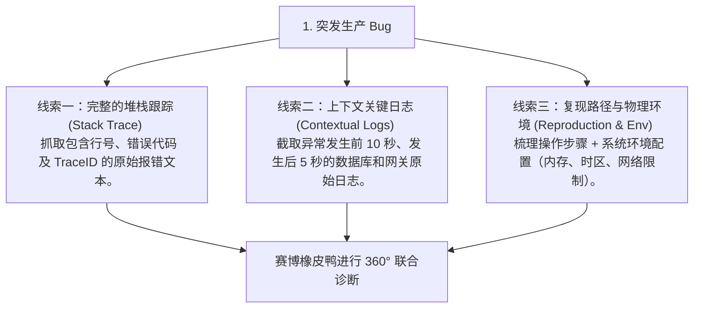
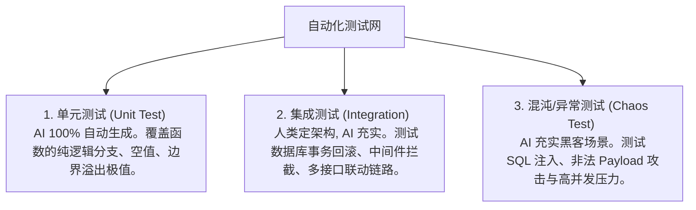

# 橡皮鸭调试与全场景测试

> **“调试不是为了让程序能动，而是为了理解它为什么不动；测试不是为了证明自己没错，而是为了发现错在哪里。”**

---

在传统的软件开发中，程序员遇到棘手的 bug 时，往往会采用经典的 **“橡皮鸭调试法”（Rubber Duck Debugging）**：在桌上放一只无辜的黄色塑料小鸭子，然后逐行向它解释自己的代码逻辑：“你看，我第一步先从数据库读取了用户 ID，第二步我把这个 ID 传给了……” 很多时候，在逐字向鸭子解释的过程中，程序员的脑回路会突然打通，猛然发现自己逻辑中的漏洞。

然而，小黄鸭是沉默的，它无法给你反馈。

大模型时代的到来，将这套古老的方法论升级为了 **“赛博橡皮鸭调试法”（Cyber Rubber Duck Debugging）**。你的桌上不再是那只沉默的塑料鸭，而是一个**拥有无限耐心、通晓全世界各种偏门框架源码、且能高频互动的顶尖调试大师**。

本章将为你正式揭开赛博橡皮鸭调试的奥秘，并结合一个“诡异的并发异步竞态条件（Race Condition）”真实案例，演示如何与 AI 联手狙击生产环境的高危 Bug。

---

## 1. 赛博橡皮鸭的“三向投喂”心法

要让大模型扮演好这只高智商的“赛博橡皮鸭”，你不能只是手忙脚乱地对它说：“我的接口崩了，报错 500，快帮我看看。” 这种提问毫无信息浓度。

科学的赛博小黄鸭调试法要求你严格向它提供以下**三维线索**：



### 🔬 赛博小黄鸭提问模版：
> “亲爱的赛博小黄鸭，我的生产环境接口发生崩溃。我整理了以下核心证据链，请帮我分析潜在的逻辑死锁或边界崩溃：
> 
> * **【完整堆栈日志】**：`[粘贴 Stack Trace]`
> * **【上下文日志流】**：`[粘贴前后 10 秒的原始 Log]`
> * **【复现步骤与运行环境】**：`[如：用户高频连续点击『提交』按钮；宿主机为 1核1G 容器，时区配置为东八区]`
> 
> 请帮我推演可能的代码执行路径，并给出至少两套修复策略（一套快速止损，一套根本重构）。”

---

## 2. 实战案例：狙击诡异的异步竞态条件 (Race Condition) Bug

### ⏳ 故事背景
你的商城在进行 618 大促时，系统后台频繁抛出 `PrismaClientKnownRequestError: Unique constraint failed on the fields: (orderId)`（订单 ID 唯一性冲突报错）。诡异的是：
* 在本地测试时，创建订单一切正常；
* 单元测试 100% 通过；
* 只有当线上高并发促销、多用户同时下单时，系统才会离奇报错崩溃，并导致少数用户被重复扣款。

我们邀请“赛博橡皮鸭”入场联调。

---

### 📥 第一步：投喂证据链
我们向 AI 提交了报错文件的核心代码 `orderService.ts` 及其对应的堆栈日志：

```typescript
// orderService.ts - 核心下单逻辑
export async function createOrder(userId: string, cartItems: any[]) {
  // 1. 计算商品总价
  const totalPrice = cartItems.reduce((sum, item) => sum + item.price * item.quantity, 0);

  // 2. 检查用户余额
  const wallet = await prisma.wallet.findUnique({ where: { userId } });
  if (!wallet || wallet.balance < totalPrice) {
    throw new Error("余额不足");
  }

  // 3. 创建订单快照
  const newOrder = await prisma.order.create({
    data: {
      userId,
      amount: totalPrice,
      status: "PENDING"
    }
  });

  // 4. 扣除用户钱包余额
  await prisma.wallet.update({
    where: { userId },
    data: {
      balance: wallet.balance - totalPrice // ❌ 潜在的危险更新
    }
  });

  return newOrder;
}
```

**堆栈日志证据**：
```text
PrismaClientKnownRequestError: Unique constraint failed on the fields: (orderId)
    at OrderService.createOrder (src/services/orderService.ts:16:32)
    at OrderController.postOrder (src/controllers/orderController.ts:8:12)
    at async Promise.all (index 0) ...
```

---

### 🔍 第二步：赛博橡皮鸭的“因果推演”诊断
大模型仔细分析了代码逻辑与高并发的物理背景，在 3 秒内给出了直击灵魂的**推演诊断报告**：

> **“小黄鸭诊断判定：典型的『先读后写（Read-Then-Write）』导致的异步竞态条件（Race Condition）与脏读漏洞。”**
> 
> **物理过程推演**：
> 1. 当高并发发生，用户在极短时间内**并发双击**了“确认付款”按钮，前端在毫秒差内发出了两个完全相同的请求（Request A 与 Request B）。
> 2. **异步执行交错**：
>    * **时刻 1 (Req A)**：执行步骤 2，读取钱包余额（此时余额为 `100`，需付 `80`，校验通过）。
>    * **时刻 2 (Req B)**：在 Req A 还没有来得及更新数据库前，Req B 也执行了步骤 2，读取钱包余额（由于 Req A 没扣钱，此时读出来的余额依然是 `100`，需付 `80`，校验通过！**脏读发生！**）。
>    * **时刻 3 (Req A)**：执行步骤 3，成功创建了 Order A。
>    * **时刻 4 (Req B)**：执行步骤 3，由于多线程高频处理，在极其微小的时序偏差下，Req B 试图用相同的幂等 Key 或在同个事务内创建 Order B，或者因为后面的钱包扣款逻辑导致冲突，系统最终抛出了 `Unique constraint failed`。
>    * **最致命的情况**：如果时刻 4 没有被唯一约束拦截，那么两个请求都会成功，Req A 扣减钱包（`100 - 80 = 20` 写入数据库），紧接着 Req B 扣减钱包（`100 - 80 = 20` 写入数据库）。原本价值 160 元的商品，用户只被扣了 80 元，商城的资金安全彻底失控！

---

### 💊 第三步：赛博橡皮鸭给出的拯救方案
大模型提供了两套非常专业的工业级防御策略：

#### 方案一：乐观锁/悲观并发控制（Prisma 事务级行锁，最推荐）
在读取余额时，采用数据库排他锁，强行让 Req B 等待 Req A 执行完毕：

```typescript
// 优化后的 orderService.ts
export async function createOrder(userId: string, cartItems: any[]) {
  const totalPrice = cartItems.reduce((sum, item) => sum + item.price * item.quantity, 0);

  // 1. 使用 Prisma 交互式事务 (Interactive Transaction)
  return await prisma.$transaction(async (tx) => {
    // 2. 使用原生 SQL 或强行查询锁住当前钱包行 (Select For Update)
    const wallet = await tx.$queryRaw<any[]>`
      SELECT * FROM "Wallet" WHERE "userId" = ${userId} FOR UPDATE
    `;

    const userWallet = wallet[0];
    if (!userWallet || userWallet.balance < totalPrice) {
      throw new Error("余额不足");
    }

    // 3. 创建订单
    const newOrder = await tx.order.create({
      data: { userId, amount: totalPrice, status: "PENDING" }
    });

    // 4. 精准扣款 (通过数据库原生自减，杜绝内存脏数据复写)
    await tx.wallet.update({
      where: { userId },
      data: {
        balance: {
          decrement: totalPrice // ✅ 使用原生的 decrement 原子操作！
        }
      }
    });

    return newOrder;
  });
}
```

#### 方案二：分布式 Redis 幂等锁（系统级防御，防范双击）
在 API 入口处，使用用户的 `userId` 加上请求参数的 md5 值做 Redis 锁，防范 1 秒内的重复点击。

---

通过与赛博橡皮鸭的“案情分析式”推演，我们不仅瞬间定位了本地绝对无法复现的异步竞态 Bug，更得到了优雅、严密、具有生产级保障的修复方案。

---

## 3. 密织海陆空测试防护网

光有高超的调试技术是不够的，防御的最高境界是**让 bug 连编译阶段都过不去**。优秀的软件系统必须编织起海陆空立体的三维自动化测试网络：



在日常开发中，我们可以给 AI 下达极其强悍的 **“混沌测试 Prompt”**，主动寻找系统的破绽：
> “你现在是一个极其冷酷的黑客和混沌测试工程师。请阅读我的 `@authController.ts` 代码，为它编写 5 个异常测试用例。
> 
> **重点覆盖**：
> 1. 发送长达 10MB 的非法超长 JSON 字符串尝试撑爆 Node.js 内存；
> 2. 在验证码输入框中注入 SQL 混淆字符；
> 3. 模拟分布式高并发下，多用户在同一微秒抢购最后 1 件商品的库存竞态。
> 
> 请使用 Vitest 输出这些用例的代码，并补充 Mock 逻辑。”

这层防护网一旦铺开，未来大模型在帮你进行任何微小的重构时，只要触发了旧逻辑的警报，测试网就会瞬间亮起红灯，为您彻底掐死线上事故的萌芽。

---

## 本章小结

调试与测试是 AI 编程中最容易被忽视、却最不应该被忽视的环节。在本章中，我们：
1. 正式认识了如何将古老的“橡皮鸭调试法”升级为高智商互动的“赛博橡皮鸭”；
2. 实战推演了如何通过“三维证据投喂”精准击破一个本地无法复现的异步并发竞态条件（Race Condition）Bug；
3. 学习了如何通过单元测试、集成测试及混沌测试织密系统的安全防护网。

调试出了正确的逻辑，测试确保了系统的安全。但代码最终是由人去部署和运营的。作为最高裁判，人类还必须在一系列代码越权漏洞与慢查询性能隐患面前，扮演冷酷无情的“最高大法官”。

下一章，让我们一起走进 **《批判性思维与最高裁判权：在安全与性能陷阱前做冷酷判官》（扩充版）**。
