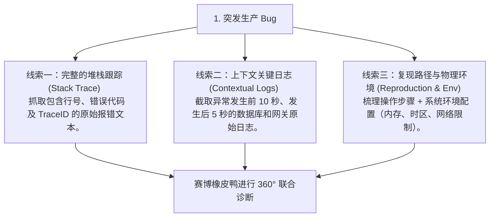
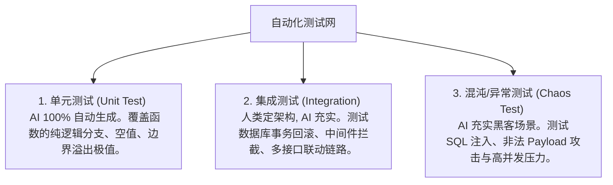

# 橡皮鸭调试与全场景测试

> **“调试不是为了让程序能动，而是为了理解它为什么不动；测试不是为了证明自己没错，而是为了发现错在哪里。”**

---

在传统的软件开发中，程序员遇到棘手的 bug 时，往往会采用经典的 **“橡皮鸭调试法”（Rubber Duck Debugging）**：在桌上放一只无辜的黄色塑料小鸭子，然后逐行向它解释自己的代码逻辑。很多时候，在逐字向鸭子解释的过程中，程序员的脑回路会突然打通，猛然发现自己逻辑中的漏洞。

然而，小黄鸭是沉默的，它无法给你反馈。

大模型时代的到来，将这套古老的方法论升级为了 **“赛博橡皮鸭调试法”（Cyber Rubber Duck Debugging）**。你的桌上不再是那只沉默的塑料鸭，而是一个**拥有无限耐心、通晓全世界各种偏门框架源码、且能高频互动的顶尖调试大师**。

---

## 1. 赛博橡皮鸭的“三向投喂”心法

要让大模型扮演好这只高智商的“赛博橡皮鸭”，你不能只是手忙脚乱地对它说：“我的接口崩了，报错 500，快帮我看看。” 这种提问毫无信息浓度。

科学的赛博小黄鸭调试法要求你严格向它提供以下**三维线索**：



### 🔬 赛博小黄鸭调试分析模板：
```markdown
# 赛博小黄鸭调试指令

## 1. 错误现场描述
- **触发场景**：[如：高并发促销、多用户同时下单]
- **宿主环境**：[如：Node.js v20.10.0, PostgreSQL 15, AWS ECS (1vCPU/2GB)]

## 2. 核心报错堆栈 (Stack Trace)
\```text
[在这里贴入完整的 Stack Trace 日志]
\```

## 3. 关联上下文日志流 (Log Context)
\```text
[贴入异常发生前后 10 秒的系统原始 Log，包括数据库查询日志]
\```

## 4. 目标任务
请基于上述因果链，推演可能的代码执行路径，排查竞态条件、内存溢出或死锁隐患，并给出至少两套修复策略。
```

---

## 2. 攻坚战 1：狙击诡异的并发异步竞态条件 (Race Condition) Bug

### ⏳ 故事背景
系统后台频繁抛出 `PrismaClientKnownRequestError: Unique constraint failed on the fields: (orderId)`（订单 ID 唯一性冲突报错）。诡异的是，在本地单线程测试时一切正常，只有线上高并发促销时，系统才会离奇报错崩溃，并导致少数用户钱包余额被扣成负数。

我们邀请“赛博橡皮鸭”入场联调。

### 📥 投喂核心代码与日志

```typescript
// orderService.ts - 核心下单逻辑
export async function createOrder(userId: string, totalPrice: number) {
  // 1. 检查用户余额
  const wallet = await prisma.wallet.findUnique({ where: { userId } });
  if (!wallet || wallet.balance < totalPrice) {
    throw new Error("余额不足");
  }

  // 2. 创建订单快照
  const newOrder = await prisma.order.create({
    data: { userId, amount: totalPrice, status: "PENDING" }
  });

  // 3. 扣除用户钱包余额
  await prisma.wallet.update({
    where: { userId },
    data: { balance: wallet.balance - totalPrice } // ❌ 脏写隐患
  });

  return newOrder;
}
```

### 🔍 赛博橡皮鸭的“因果推演”诊断
大模型仔细分析了代码逻辑与高并发的物理背景，在瞬间给出了推演报告：

> **“小黄鸭诊断判定：典型的『先读后写（Read-Then-Write）』导致的异步竞态条件（Race Condition）与脏读漏洞。”**
> 
> **物理过程推演**：
> 1. 当高并发发生，用户在极短时间内**并发双击**了“确认付款”按钮，前端发出两个完全相同的请求（Req A 与 Req B）。
> 2. **异步执行交错**：
>    * **时刻 1 (Req A)**：读取钱包余额（余额为 `100`，需付 `80`，校验通过）。
>    * **时刻 2 (Req B)**：在 Req A 还没有更新数据库前，Req B 也读取了钱包余额（由于 Req A 没扣钱，读出来的余额依然是 `100`，校验通过！**脏读发生！**）。
>    * **时刻 3 (Req A)**：更新钱包余额（`100 - 80 = 20` 写入数据库）。
>    * **时刻 4 (Req B)**：更新钱包余额（由于拿到的旧余额也是 `100`，计算出 `20` 再次覆写数据库）。
>    * **后果**：用户钱包原本只剩 100 元，却买到了 2 件 80 元的商品（共 160 元），数据库的余额变成了 `20`，商城资产发生严重透支！
> 
> **解决方案**：
> 引入数据库行级排他锁，强行让 Req B 等待 Req A 执行完毕，并在数据库层执行原子扣减（Atomic Decrement）：

```typescript
// 优化后的高安全性交互式事务代码
export async function createOrder(userId: string, totalPrice: number) {
  return await prisma.$transaction(async (tx) => {
    // 1. 使用 SELECT FOR UPDATE 强行锁住当前钱包行
    const wallet = await tx.$queryRaw<any[]>`
      SELECT * FROM "Wallet" WHERE "userId" = ${userId} FOR UPDATE
    `;
    const userWallet = wallet[0];
    if (!userWallet || userWallet.balance < totalPrice) {
      throw new Error("余额不足");
    }

    // 2. 创建订单
    const newOrder = await tx.order.create({
      data: { userId, amount: totalPrice, status: "PENDING" }
    });

    // 3. 精准原子扣款
    await tx.wallet.update({
      where: { userId },
      data: {
        balance: { decrement: totalPrice } // ✅ 依靠数据库原生减法操作
      }
    });

    return newOrder;
  });
}
```

---

## 3. 攻坚战 2：诊断 Node.js 内存泄漏（Heap Dump 分析）

系统在连续运行 48 小时后，容器频繁因为 OOM (Out of Memory) 重启。我们抓取了一份堆内存快照（Heap Dump），并把分析出的“疑似对象分配图”喂给 AI 鸭。

### 📥 投喂 Heap Dump 诊断数据
> “小黄鸭，我们的服务频繁 OOM。这是 Chrome DevTools 中堆分配分析图导出的疑似泄漏路径：
> `Closure -> context -> pendingRequests (Array) -> 240,000 items`
> 
> 对应的请求日志路由代码如下：
> ```typescript
> const pendingRequests = [];
> app.use((req, res, next) => {
>   pendingRequests.push({ req, timestamp: Date.now() }); // 记录请求
>   res.on('finish', () => {
>     // ❌ 忘记从 pendingRequests 中移除了！
>   });
>   next();
> });
> ```
> 请问如何优雅解决，保证高并发下内存绝对不泄漏？”

### 🔍 赛博橡皮鸭诊断：
> **“诊断报告：典型的事件监听器闭包逃逸与静态数组引用残留引起的内存泄漏。”**
> 
> **解决方案**：
> 移除全局静态数组的常驻引用，改用局部弱引用（`WeakMap` 或 `WeakRef`），或者在事件结束时手动清除队列：

```typescript
// 优化后的无泄漏请求追踪中间件
import { Request, Response, NextFunction } from 'express';

// 使用 WeakMap 关联请求对象，当请求销毁时，对应的元数据会自动被垃圾回收机制 (GC) 回收
const requestMetadata = new WeakMap<Request, { timestamp: number }>();

app.use((req: Request, res: Response, next: NextFunction) => {
  requestMetadata.set(req, { timestamp: Date.now() });

  res.on('finish', () => {
    // 此时无需手动 delete，垃圾回收会自动追踪 req 对象的生命周期并自动释放内存
  });
  next();
});
```

---

## 4. 密织三维自动化测试网络

光有高超的调试技术是不够的，防御的最高境界是**让 bug 连编译阶段都过不去**。优秀的软件系统必须编织起三维自动化测试网络：



在日常开发中，我们可以给 AI 下达极其强悍的 **“混沌测试 Prompt”**，主动寻找系统的破绽：
> “你现在是一个极其冷酷的黑客和混沌测试工程师。请阅读我的 `@authController.ts` 代码，使用 Vitest 为它编写 5 个异常测试用例。重点覆盖发送 10MB 的非法超长 JSON 尝试撑爆 Node.js 内存，以及验证码输入框 SQL 注入绕过校验。”

---

## 本章小结

调试与测试是 AI 编程中最容易被忽视、却最不应该被忽视的环节。在本章中，我们：
1. 正式认识了如何将古老的“橡皮鸭调试法”升级为高智商互动的“赛博橡皮鸭”；
2. 实战推演了如何通过“三维证据投喂”精准击破一个本地无法复现的异步并发竞态条件（Race Condition）Bug；
3. 学习了如何利用 Heap Dump 与 WeakMap 诊断并彻底根治 Node.js 内存泄漏问题；
4. 梳理了三维一体的测试防护网。

调试出了正确的逻辑，测试确保了系统的安全。但代码最终是要被发布和维护的。如何让 AI 帮你生成无懈可击的技术文档，并帮你一键攻克完全陌生的新语言框架？

下一章，让我们一起走进 **《质量审计、技术文档与技术破局》（扩充版）**。
