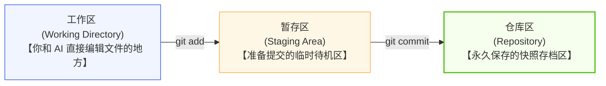
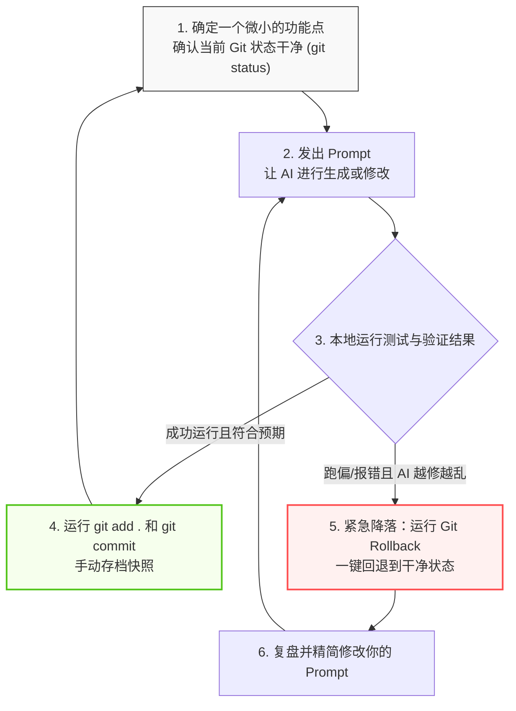

# 代码版本控制

> 使用 AI 编程，一定要准备好“后悔药”。

AI 编写代码的速度极快，但它犯错、跑偏和“越帮越忙”把系统彻底搞崩的速度也同样快。如果不把每个版本的代码都保存下来，一旦 AI 在某个步骤中改坏了程序的核心逻辑，而我们又记不清它改了哪些文件、改动之前什么样，那可就惨了——搞不好需要把整个程序推倒重来。

帮我们备份、记录、恢复每个版本代码的工具，叫做版本控制工具。在所有同类工具中，Git 是当今全球软件开发中最核心、最著名的一个，而 GitHub 则是基于 Git 构建的全球最大代码托管与协作平台。

本指南将从零开始，带你全面掌握 Git 和 GitHub，为你搭建起一张 AI 时代的“超级安全网”。


## Git 的底层逻辑

在动手操作之前，你可以把 Git 想象成一部专门给代码世界录像的“高清行车记录仪”。它最重要的工作，就是在你（或者 AI）对代码做重大手术前，按下快门键，留存一份绝对安全的完好副本。

### Git 的核心词汇表

| 概念 | 英文名称 | 通俗解释（AI 视角） |
| --- | --- | --- |
| **仓库** | Repository / Repo | 你的项目文件夹。一旦被 Git 托管，它的一举一动都会被默默记录。 |
| **提交** | Commit | 给代码库拍一张“快照”（Snapshot）。一旦提交，此时的状态就会被永久锁定。 |
| **分支** | Branch | 从主线分出的独立开发线。你可以开个新分支让 AI 乱涂乱画，不影响主线。 |
| **合并** | Merge | 将一个分支的修改（如 AI 已经写好的新功能）合并到主线分支中。 |
| **克隆** | Clone | 将云端的远程仓库完整复制一份到你的本地电脑上。 |
| **推送** | Push | 把本地电脑上的历史快照安全地同步到云端服务器。 |
| **拉取** | Pull | 从云端下载最新的修改并合并到本地（多设备或团队协作时使用）。 |
| **回退** | Reset / Rollback | AI 时代的最强后悔药。 无论代码被 AI 蹂躏得多么惨，一瞬间就能回滚到上一次完美的快照状态。 |

:::tip 分布式设计理念
Git 的核心是“分布式”的：每个开发者的本地电脑都有完整的项目历史，即使没有网络也能正常工作。而 GitHub 则是一个位于云端的“大管家”，用于多端同步代码和团队协作。
:::

### Git 的三大工作区域

理解 Git 的三个工作区域，是掌握所有 Git 命令的关键：



---

## 注册 GitHub 与安装配置 Git

### 注册 GitHub 账号

1. 访问 [GitHub 官网 (https://github.com)](https://github.com)，点击右上角的 Sign up（注册）。
2. 输入你的邮箱地址，设置用户名和强密码。
   - **用户名建议：** 使用简洁、专业的英文或拼音（如 `ruanqizhen`），因为它会出现在你所有项目的网页链接中。
3. 完成人机验证，点击 Create account，并前往邮箱查收验证码完成激活。
4. 计划选择：直接选择 Free（免费）计划，它已经提供了无限的公开和私有仓库，完全够用。

### 安装 Git

- Windows： 前往 [Git 官网下载页面](https://git-scm.com/download/win) 下载安装包。安装时一路上保持默认勾选即可，务必确保勾选了 "Git Bash"（一个非常好用的终端工具）。
- macOS： 打开终端，输入 `xcode-select --install` 安装苹果开发者工具，或者使用 Homebrew 运行 `brew install git`。
- Linux (Ubuntu/Debian)： 运行 `sudo apt update && sudo apt install git`。

安装完成后，打开终端（Windows 用户打开 Git Bash），输入以下命令验证是否安装成功：

```bash
git --version
# 如果正确输出类似 "git version 2.x.x" 的字样，说明安装成功！

```

### 初始身份配置

Git 的每次提交都会记录是谁修改的代码，因此安装后必须配置你的身份信息（请与 GitHub 注册信息保持一致）：

```bash
# 1. 设置你的名字或昵称
git config --global user.name "你的GitHub用户名"

# 2. 设置你的邮箱
git config --global user.email "your-email@example.com"

# 3. 设置默认分支名为 main
git config --global init.defaultBranch main

# 4. 验证配置是否成功
git config --list

```

### 配置 SSH 密钥（免密推送推荐）

配置 SSH 密钥可以让你以后每次向 GitHub 推送代码时，都不需要苦哈哈地重复输入账号密码。

1. 生成密钥对： 在终端中运行以下命令（一路敲回车即可）：
```bash
ssh-keygen -t ed25519 -C "your-email@example.com"

```


2. 复制公钥： 运行以下命令查看并复制输出的全部文本：
```bash
cat ~/.ssh/id_ed25519.pub
# 复制以 ssh-ed25519 开头的这一长串字符

```

3. 绑定到 GitHub： 登录 GitHub $\rightarrow$ 点击右上角头像 $\rightarrow$ Settings $\rightarrow$ SSH and GPG keys $\rightarrow$ 点击 New SSH key。把刚才复制的内容粘贴进 `Key` 文本框中，起个名字（如 "My Laptop"），点击 Add SSH key。
4. 测试连接： 运行 `ssh -T git@github.com`。如果看到 `Hi username! You've successfully authenticated...`，说明免密通道彻底打通！


## Git 本地高频基础操作

### 创建本地仓库

随便挑选或新建一个文件夹作为你的项目目录，在终端中进入该目录：

```bash
# 进入项目目录
cd my-project

# 初始化 Git 仓库
git init
# 此时文件夹下会自动生成一个隐藏的 .git 目录，它就是行车记录仪的“存储卡”

```

### 记录你的代码

当你或者 AI 修改了代码后，我们需要通过以下三步将代码固化为历史快照：

```bash
# 第一步：查看当前状态（看看 AI 动了哪些文件）
git status

# 第二步：把修改过的文件提交到“暂存区”
git add README.md  # 添加单个文件
git add .          # 【最常用】把当前目录下所有文件的修改一次性全部暂存

# 第三步：正式提交到仓库，拍下历史快照
git commit -m "feat: 初始化项目，添加 README 文档"

```

### 看清 AI 到底改了什么

AI 生成的代码有时极其庞大，在 commit 之前，你必须睁大眼睛看清它的改动：

```bash
# 查看工作区与上一次快照的差异（未运行 git add 之前看 AI 改了啥）
git diff

# 查看已经 git add、但尚未 commit 的差异
git diff --staged

# 查看简洁的历史提交日志
git log --oneline

```


## 小步构建与紧急降落

掌握了基本的 Git 操作后，你在和 AI（如 Cursor、ChatGPT）结对编程时，应该严格遵守以下“黄金循环法则”。绝对不要让 AI 一口气写几百行代码而不做任何 Commit。



### 如何优雅地撤销与回退

一旦 AI 越帮越忙，直接动用以下命令进行“紧急降落”：

```bash
# 场景 1：AI 刚改完，你还没运行 git add，想放弃工作区的全部修改
git restore . 
# （老版本 Git 使用：git checkout -- .）

# 场景 2：你已经不小心运行了 git add .，想把文件从暂存区撤回到工作区
git restore --staged .

# 场景 3：AI 连续改了好几次，把整个系统彻底改崩了，你想彻底放弃最近的一次 Commit 快照
# 【软回退】：撤销上一次 commit，但保留 AI 写的代码在工作区，方便你审查修改
git reset --soft HEAD~1

# 【硬回退】：极其猛烈！直接丢弃上一次提交后的所有修改，强制回到上一个干净的快照点
git reset --hard HEAD~1

```


## 实战演练

为了让你彻底融会贯通，我们来完整模拟一个使用 **Git 规范 + AI 思维** 协作开发“赛博木鱼”单文件网页项目（HTML + Tailwind CSS）的真实场景。

### 第一步：创建文件夹并初始化

1. 在你的电脑上新建一个名为 `cyber-muyu` 的文件夹（可以通过操作系统的鼠标右键“新建文件夹”来操作）。
2. 打开终端（Windows 用户使用 Git Bash），进入该文件夹并初始化 Git 仓库：

```bash
cd cyber-muyu
git init
# 此时文件夹下会自动生成一个隐藏的 .git 目录，它就是行车记录仪的“存储卡”
```


### 第二步：向 AI 发送指令，生成最初版（MVP）木鱼

1. 打开你的通用 AI 网页对话框（如 Meta AI、DeepSeek、ChatGPT 等），发送如下指令：
   > “帮我做一个极简的电子木鱼网页。请直接生成一个可以运行的单文件 HTML。界面背景为深色，中间放一个圆形的木鱼，每次点击它，累计功德数会加 1。”
2. AI 生成代码后，在你的 `cyber-muyu` 文件夹中新建一个文本文件，将其命名为 `index.html`（确保后缀是 `.html` 而不是 `.txt`），并将 AI 生成的代码完整复制并粘贴进去，然后保存。
3. 双击 `index.html` 在浏览器中试玩，确认点击时功德数字确实在增加。
4. 确认运行良好，立刻在终端中存档你的第一块安全基石：

```bash
# 查看当前状态，你会看到 index.html 呈红色（代表它是未被托管的新文件）
git status

# 准备提交：将当前文件夹下的所有修改放入暂存区
git add .

# 正式拍照存档
git commit -m "feat: 搭建赛博木鱼基础界面并实现核心敲击计数功能"
```

### 第三步：开辟新分支，准备添加炫酷动效

我们想让 AI 继续升级这个木鱼，加入敲击时的缩放动效以及漂浮的“功德+1”文字。遵循“不污染主线”的金科玉律，我们立刻开辟并切换到一个临时开发分支：

```bash
git switch -c feature/add-effects
# 此时，你已经进入了安全的“平行世界”分支中，无论接下来怎么改，都不会弄乱刚才那个完美的 MVP 存档
```

1. 打开网页 AI，把你的 `index.html` 中的代码全部复制给它，并发送指令：
   > “请帮我在这个代码基础上进行升级。使用 Tailwind CSS 美化界面，加入敲击木鱼时的缩放过渡动画；并且每次敲击时，在鼠标指针附近随机漂浮出 cyan 色发光的『功德+1』文字，文字向上漂移并逐渐淡出消失。直接输出完整的 HTML 代码。”
2. AI 生成新代码后，在你的记事本（或简易文本编辑器）里，将新代码完整覆盖粘贴到 `index.html` 中并保存。
3. 刷新浏览器试玩，确认特效非常炫酷！
4. 运行 `git diff` 确认 AI 所有的改动点：

```bash
git diff
```

5. 确认一切表现完美，在临时功能分支上拍下快照存档：

```bash
git add .
git commit -m "feat: 增加敲击缩放过渡动画与漂浮文字特效"
```


### 第四步：安全合入主流并收工

既然新功能测试完美，我们现在可以将它安全地合入到主线（`main` 分支）中了：

```bash
# 1. 切换回 main 主分支
git switch main

# 2. 将临时分支中写好的动效代码合并进来
git merge feature/add-effects

# 3. 大功告成！现在主分支已经拥有了最炫酷的木鱼。我们可以放心地删掉本地临时分支了：
git branch -d feature/add-effects
```

瞧！即使在此刻，我们还没有使用任何高级编程工具（如 VS Code），只是使用网页端 AI 和简单的文件复制粘贴，配合这几行极简的 Git 命令，就已经优雅、专业地管理了我们的软件演进。即使中途 AI 的代码写坏了，我们也随时可以使用 `git reset --hard HEAD` 一键服下“后悔药”！


## 图形化工具

如果你看到满屏幕的黑色终端、敲入一串串英文命令（如 `git add`、`git commit`）时感到头晕目眩，完全不用恐慌。Git 世界里有一条对新手极其友好的“捷径”——GitHub Desktop（GitHub 桌面版）。

它把复杂的黑窗口命令变成了直观的图形化仪表盘。你不需要死记硬背任何命令，只需通过鼠标“点点点”，就能完美驾驭前面提到的所有 Git 心法。

### 下载与一键登录

访问 [GitHub Desktop 官网 (https://desktop.github.com)](https://desktop.github.com) 下载对应你操作系统的安装包。安装完成后启动软件，点击 Sign in to GitHub.com，它会自动拉起浏览器让你授权登录。登录成功后，你的本地电脑就和云端账号无缝绑定了，甚至连前面复杂的 SSH 密钥配置都可以直接跳过！

### 命令行 vs 图形化

在 GitHub Desktop 的世界里，原本枯燥的命令变成了极其形象的视觉操作：

- `git status`（查看状态）： 软件左侧的 "Changes" 列表会自动列出被修改的文件。点击任何一个文件，右侧就会用红色（删除）和绿色（新增）清晰地标出你（或 AI）改动了哪一行代码。
- `git add`（暂存）： 每一个被修改的文件前面都有一个复选框。勾选它，就等于运行了 `git add`；取消勾选，就等于把它移出暂存区。
- `git commit`（提交快照）： 界面左下角自带一个打字框。在 `Summary` 里写下你的 Commit 信息（如 `feat: 新增登录功能`），然后点击下方的 "Commit to main" 蓝色按钮，一张历史快照就拍摄完成了。
- `git push`（推送到云端）： 顶部导航栏正中间有一个大大的 "Push origin" 按钮，点一下，本地快照就会安全地飞向云端。


:::tip
即便我们将来将会使用 VS Code 等自带 AI 的编程工具，而且它们本身也内置了非常漂亮的图形化 Git 面板，但在电脑里常备一个官方的 GitHub Desktop 依然是一个聪明的决定。
当 AI 疯狂倾泻代码、导致项目彻底乱掉，或者你搞不清当前代码分支走向时，打开 GitHub Desktop。它那拥有“上帝视角”的超清全景可视化历史树，能让你一眼看清过去发生了什么，帮你轻松一键“紧急降落”。
:::