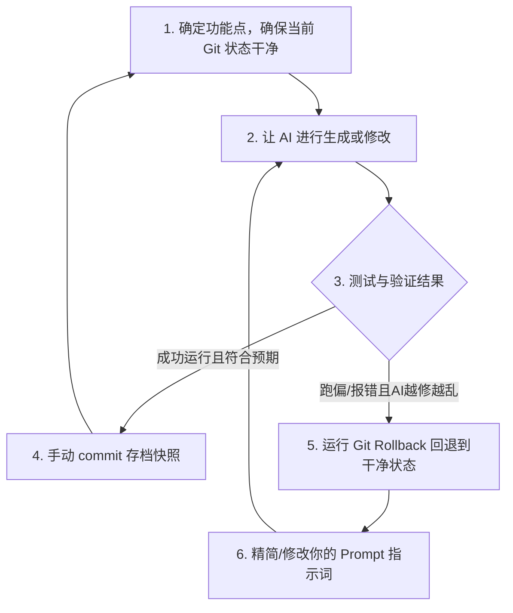

# 代码版本控制

> 使用 AI 编程，一定要准备好后悔药。


AI 编写代码的速度极快，但它犯错、跑偏和“越帮越忙”把系统彻底搞崩的速度同样也快了 100 倍。如果我们不把每个版本的代码都保存下来，一旦 AI 在某个重构步骤中改坏了程序的核心逻辑，而我们又记不清它改了哪些文件，改动之前什么样。那可就惨了，搞不好可能需要把整个程序推倒重来。

帮我们备份，恢复每个版本代码的工具叫做版本控制工具。在所有控制工具中 Git 是最著名的一个。


本章将介绍如何将 Git 作为 AI 编程中的“超级安全网”。


## Git 四大概念

你可以把 Git 想象成一部专门给代码世界录像的“高清行车记录仪”。它最重要的工作，就是在你（或者 AI）做重大手术前，按下快门键，留存一份绝对安全的完好副本。

### 仓库 (Repository / Repo)
仓库就是你的项目文件夹。一旦在这个文件夹里运行了“Git 初始化”命令，这个文件夹就被 Git 正式托管了，它的一举一动都会被默默记录。

### 提交 (Commit)
提交就是给代码库拍一张“快照”（Snapshot）。每一个 Commit 都包含一个唯一 ID 和一句人类写的文字注释（如“修复了登录界面的样式”）。一旦提交，代码库在这个时间点的所有状态就会被永久锁定在历史长河里。

### 回退 (Reset / Rollback)
这是 AI 时代的最强后悔药。无论你的代码被 AI 蹂躏得多么惨不忍睹、报错信息多么铺天盖地，只要你发出回退指令，代码就能在一瞬间回滚到上一次快照时的完美状态。

### 远端与推送 (Remote & Push)
远端就是你云端的代码管家（通常是 GitHub）。推送（Push）就是把你本地电脑上的这些历史快照，安全地备份到 GitHub 服务器上，防止电脑意外损坏导致数据丢失。


## 小步构建与紧急降落

掌握了 Git 回退的原理后，日常 AI 结对开发流程应当严格遵循以下“黄金法则”：



### 步骤详解

1. **第一步：起步干净**
   在命令 AI 干活前，运行 `git status` 确认当前工作区是“干净的”（没有未提交的零碎修改）。
2. **第二步：发出指令**
   告诉 Cursor 或 Cline：“帮我实现购物车组件的优惠券抵扣逻辑。”
3. **第三步：冷静评估**
   AI 会啪啪啪修改 3 个文件。此时，尝试在浏览器中运行它。
4. **第四步：双向分流**
   * **情况 A（顺利通过）**：太棒了！运行正常。此时，立刻运行 `git add .` 和 `git commit -m "feat: 成功实现了购物车优惠券抵扣逻辑"`。**这一步至关重要，它意味着你锁定了这个里程碑，接下来的开发不管怎么折腾，都不会丢失这个劳动成果。**
   * **情况 B（跑偏搞砸）**：AI 写完了代码，控制台亮起大片红字报错。你让它修，它越修越乱，甚至把原本好用的商品列表都改坏了。**此时，绝对不要恋战，立刻扔掉所有坏死代码！** 运行：
     ```bash
     git reset --hard HEAD
     ```
     瞧！大风刮过，所有的报错、死机和垃圾代码瞬间消失，你的项目在毫秒之间恢复了完美的干净状态。

:::warning 警惕：不要让 AI “裸奔”
在没有初始化 Git 的文件夹中让高级智能体（如 Cline 或 Aider）自动写代码，无异于在高空秋千上不做任何安全防护措施。请务必在新建项目的第一分钟，运行 `git init`！
:::


## 3. 实战：从零构建你的 Git 安全防线

下面我们亲自动手，在本地演练一遍如何利用 Git 抵御 AI 的“代码投毒”。

### 🛠️ 第一步：播种（初始化本地仓库）
新建或进入你的网页项目文件夹，在终端运行：
```bash
git init
```
系统会输出：`Initialized empty Git repository in ...`。

### 📸 第二步：第一次存档（首版快照）
首先，让我们把初始的代码存个档。在终端依次运行：
```bash
git add .
git commit -m "initial commit: 第一个干净的主页"
```

### 🤖 第三步：模拟 AI 搞砸了代码
现在，假设我们向 AI 发出了一个愚蠢的指令，而 AI 也非常配合地用一段逻辑漏洞百出、甚至有语法错误的代码覆盖了我们好端端的网页。
此时你打开网页，发现原本精美的界面全毁了，控制台里报错连连。

### 💊 第四步：服下后悔药（一键回滚）
不要慌，深吸一口气。在终端里冷静地输入：
```bash
git reset --hard HEAD
```
*（注：`HEAD` 在 Git 里代表当前最新的那次 Commit 快照。这条命令表示将本地所有代码强行回退到最新的那次快照。）*

现在回去看你的编辑器和浏览器——奇迹发生了，原本被 AI 搞得一塌糊涂的代码瞬间恢复如初，完好无损！

---

## 4. 结对编程大师的终极奥义：Aider 自动提交

在前面的章节中我们提到了命令行神兵 **Aider**。它之所以被无数顶级极客推崇，是因为它把“小步迭代与 Git 存档”这个工作流做到了极致的自动化：

* **自动 Commit**：当你使用 Aider 聊天时，如果你对 Aider 说：“帮我把按钮改成渐变蓝色。” Aider 改完后会在后台自动尝试编译和测试，一旦运行通过，Aider 会**自动帮你执行 `git add/commit`，甚至它会通过分析你刚刚的代码变动，自动写出一句完美的 Commit Message**。
* **随时回滚**：如果它的下一次修改把你原本的逻辑写崩了，你只需要在 Aider 聊天窗口里输入 `/undo`，它就会自动回退上一次自动提交的快照，并向你道歉，准备重新出发。

这种机制彻底解放了人类，让版本控制变成了如呼吸般自然和无感的隐形守护神。

