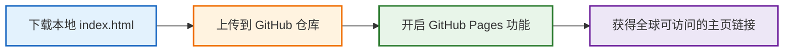
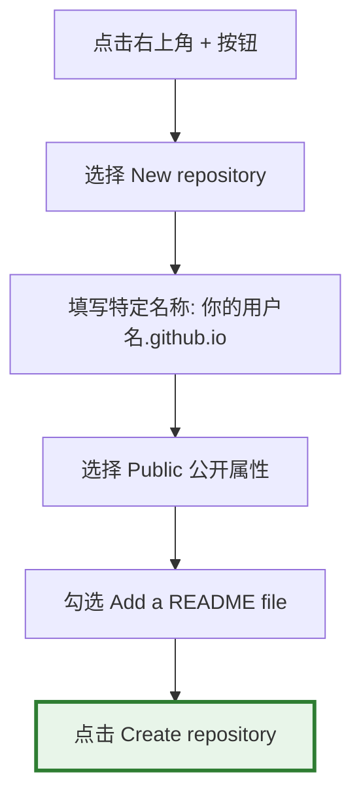

# 发布与分享你的网页

> 写出的代码只有在被全世界看到和使用时，它才真正拥有了生命。

前面几章里，我们已经学会了用 AI 制作各种小工具、小游戏。但你有没有想过，在互联网的世界里，拥有一个完全属于自己的专属角落？

这就是**个人主页**。

在社交媒体时代，我们所有人的主页都长得一模一样：相同的模板、固定的格式，你的个性和内容被塞进平台统一的盒子里。但个人网站不同。在那里：页面长什么样，由你决定；展示什么内容，由你决定；如何向世界介绍自己，也完全由你决定。

过去，搭建个人主页的门槛极高，原本是专业前端工程师才能完成的事情。而 AI 的出现，让普通人也第一次拥有了自由定义“互联网数字城堡”的能力。

很多 AI 工具在生成网页后都会附带一个“分享”按钮，可以直接生成一个链接发给朋友。但这有几个明显的问题：

1. 往往要求访问者也拥有对应 AI 平台的账号；
2. 依赖 AI 平台自身的临时运行环境，并不是真正属于你的网站；
3. 很多平台不会永久保存这些结果，过一段时间链接就失效了。

如果你想拥有一座长期存在、完全由你做主的个人主页，你就需要一个更稳定、更正式的发布方式。

这一章，我们将使用全球最著名的代码托管平台 —— GitHub 提供的免费静态网站服务 —— GitHub Pages。你无需租用服务器，无需购买域名，也无需学习复杂的运维知识。只需要点几下鼠标，5 分钟后，你就会拥有一个真正运行在互联网中的个人主页。


## 第一步：用自然语言勾勒你的个人主页

现在，你只需要学会用自然语言向 AI 描述你想要的感觉。比如：

* *“我想要一个像深夜森林一样安静的主页”*
* *“我希望按钮像玻璃一样有半透明质感”*
* *“我想要页面滚动时有轻微视差”*
* *“我想做一个赛步朋克终端风格的主页”*

AI 会替我们把这些抽象的审美，翻译成真正运行的网页代码。下面是一个极简素雅的个人主页提示词模板，你可以直接复制给 AI：

```text
# Role & Objective
你是一位顶级的全栈前端工程师和 UI/UX 设计师。请帮我编写一个单文件 (Single-file) 的个人主页/社交导航页面 (Link-in-bio page)，命名为 `index.html`。页面必须完全手写原生 HTML/CSS/JavaScript，不依赖任何第三方 CSS/JS 框架或外部图标库，所有图标必须使用内联 SVG。

# Core Requirements
1. 视觉风格与美学 (Premium Aesthetics)：
   - 采用精致的现代轻拟物与极简主义结合的风格。
   - 使用 CSS 变量 (`:root` 与 `html.dark`) 定义两套高质感的配色系统（如森林绿/莫兰迪色系）。
   - 背景使用柔和的渐变，并叠加一层使用 SVG `<feTurbulence>` 动态随机生成的超轻微大理石纹理（Marble Texture）滤镜，透明度保持在 10% 左右。
   - 主卡片容器使用毛玻璃效果 (`backdrop-filter: blur(10px)`)，在暗黑和亮色模式下有不同的微弱描边和阴影。

2. 微交互与动画 (Micro-animations)：
   - 主题切换按钮：右上角放置一个圆形主题切换按钮。切换时图标（☀️/🌙）伴随旋转、缩放和渐隐动画，且页面背景和变量平滑过渡。
   - 导航卡片 (Cards)：
     - 卡片宽度适中（如最大 680px），纵向排列。
     - 卡片悬浮 (Hover)时：卡片整体向上微移，投影加深，边框颜色渐变；卡片顶部平滑显示一条横向的彩色渐变进度条 (`::before` 缩放动画)；右侧的箭头图标从左侧滑出显现；左侧的 SVG 图标产生轻微旋转或放大。

3. 工程与技术细节 (Engineering Best Practices)：
   - 防止暗黑模式闪烁：在 `<head>` 中立刻执行一个 IIFE 脚本，从 `localStorage` 中读取主题并立即应用。
   - 响应式设计：完美适配移动端（最大宽度 600px 以下时，隐藏右侧悬浮箭头，微调内边距）。
   - SEO 友好：包含完整的 Meta 标签、合理的 HTML5 语义化结构、以及交互元素的 aria-label。

# Page Content Structure
- 顶部：一行精致有哲理的 Slogan（如“花开花落，云卷云舒”）。
- 中部：一组纵向排列的卡片，每个卡片包含左侧 SVG 图标、中间标题与描述、右侧悬浮箭头。
- 底部：极简的 Footer 分割线与域名标识。

请直接输出完整、无缺失的 `index.html` 代码，确保 CSS 写在 `<style>` 内，JS 写在底部的 `<script>` 内。

```

下面是多模块个人主页提示词模板：

```text
# Role & Objective
你是一位殿堂级的全栈前端工程师和顶尖 UI/UX 设计师。请帮我编写一个单文件 (Single-file) 的高级“便当盒布局 (Bento Grid)”个人主页与多维作品集页面，命名为 `index.html`。
页面必须完全手写原生 HTML/CSS/JavaScript，拒绝任何第三方框架或外部图标库，所有图标一律使用高清内联 SVG。

# Layout & Architecture (便当盒黄金网格)
页面核心主体是一个最大宽度为 1100px 的响应式 CSS Grid 网格系统。卡片之间保持 20px 的间距 (gap)。卡片错落有致地分为不同的尺寸（如 2x2 大卡片、1x2 长卡片、1x1 方卡片），构建极具现代科技感的非对称视觉美学：
1. 【大卡片·个人看板】：占据左上角核心位置。包含精美的头像框、姓名、极简的动态打字机效果 Tagline，以及一个优雅的本地时间实时运行组件。
2. 【长卡片·精选项目】：横向延展。用于展示自豪的作品，包含项目卡片、精致的分组标签、一句话亮眼描述，以及一个光效流转的“查看源码”微动按钮。
3. 【方卡片·技能矩阵】：聚合个人技术栈或兴趣标签。标签采用胶囊设计，带有半透明的呼吸渐变底色，悬浮时会像霓虹灯一样微微发光。
4. 【长卡片·灵感/随笔】：展示一句富有哲理的座右铭或近期的思想动态，字体排版具备极高的设计感。
5. 【方卡片·社交传送门】：聚合多个常用社交平台。每个平台是一个独立的极简微型卡片，内嵌精致的 SVG 图标。

# Design Philosophy & Aesthetics (视觉美学巅峰)
1. 极致暗黑流光 (Premium Dark Mode by Default)：
   - 默认采用深邃的科技暗黑风格（背景色：暗夜曜黑 `#0a0a0c` 到 钛空灰 `#161619` 的极其微弱的渐变）。
   - 背景中隐约散落着使用 CSS 绘制的、带有微弱毛玻璃散光效果的流动光晕（Mesh Gradient Blob），它们在后台极慢地漂移旋转，赋予页面生命力。
2. 钛金边框与悬浮光效 (Glow & Border Effects)：
   - 每个便当盒卡片背景为半透明的超精细材质 (`background: rgba(255, 255, 255, 0.03)`)，搭配毛玻璃滤镜 (`backdrop-filter: blur(12px)`)。
   - 卡片拥有 `1px` 的微弱半透明钛金边框 (`rgba(255, 255, 255, 0.08)`)。
3. 双色系统适配：
   - 必须完美支持亮色模式 (Light Mode) 切换。亮色模式下转为纯净高雅的莫兰迪白与浅灰层级，边框变为极淡的雅致灰色，整体呈现如顶级纸张般的质感。

# Interaction & Micro-animations (有灵魂的微交互)
1. 磁吸悬浮 (Magnetic Hover)：当鼠标指针悬浮在任何一个便当盒卡片上时，卡片整体产生顺滑的 3D 视角微倾斜（或者轻微向上平移 6px），阴影加深，且边框的透明度平滑变亮。
2. 边框跟随光晕 (Border Spotlight Effect)：（可选高级效果）如果可以，利用 JS 捕捉鼠标在卡片内的坐标，让卡片的边框或背景在鼠标附近产生隐约的跟随微光。
3. 一键转体：右上角的主题切换按钮（太阳/月亮），点击时伴随着极其丝滑的旋转坍缩动画，整个页面的色彩变量切换时间控制在 0.4s，带有完美的淡入淡出过渡。

# Technical Specifications & Code Quality
1. 零首屏闪烁：在 `<head>` 顶部嵌入遮罩逻辑或立即执行函数 (IIFE)，确保页面首次加载或刷新时，主题（暗黑/亮色）瞬间匹配用户系统或 `localStorage`，绝不允许出现一瞬间的摆白或闪烁。
2. 极致响应式：在手机端（屏幕宽度小于 768px）时，网格系统完美自动无缝降级为优雅的单列 (1-column) 纵向排列，卡片间距微调为 16px，各元素等比例缩放，确保移动端交互极佳。
3. 代码纯净：直接输出一份无任何删减、结构完美的 `index.html`。样式全部封装在 `<style>` 中，微交互与动态逻辑全部封装在底部的 `<script>` 中。页面内的文字内容请先使用富有诗意、极具极客浪漫的高级占位符（例如：姓名“未名行者”、格言“代码编写世界，文字记录灵魂”等）进行完整填充。

```


## 第二步：准备并下载你的 HTML 文件

无论你使用的是 ChatGPT Canvas、Claude Artifacts、Gemini、Meta AI，还是其它 AI 工具，只要它根据上面的提示词生成了网页程序，你最终都需要把这段代码变成你电脑里的一个真实文件。

根据你使用的工具不同，提取代码的方式略有差异：

* **如果你用的是 Claude Artifacts 或 ChatGPT Canvas**：在生成的网页预览界面右下角或顶部，你会看到一个明显的“下载文件（Download）”图标（通常是一个向下的小箭头或代码文件图标）。点击它，浏览器就会自动把网页下载到你的电脑上。
* **如果你用的是普通 AI 聊天窗口**：在 AI 输出的代码块右上角，点击 **Copy code（复制代码）**。然后在电脑桌面上新建一个文本文件（TXT），把代码粘贴进去，保存关闭。

下载或保存完成后，找到这个文件，右键选择**重命名**，将其名字彻底修改为：**`index.html`**

:::tip 为什么必须叫 `index.html`？
在互联网世界中，`index.html` 是服务器默认认定的“首页”。当别人访问一个网址时，服务器会自动优先寻找这个名字的文件并展示。因此，绝大多数静态网站的入口文件，都必须叫 `index.html`。
:::


## 免费建站的整体流程

有了这个本地的 `index.html` 个人主页文件后，将它发布到互联网其实远没有想象中复杂，整体流程大概只有下面四步：



本质上，你只是把自己的主页文件，上传到了 GitHub 的云端服务器上。而 GitHub Pages 会自动把它变成一个真正的网站。


## 第三步：注册并登录 GitHub 账号

**GitHub** 是全球最大的代码托管与开源协作平台，你可以把它简单理解为“程序员的云硬盘 + 网站托管平台”。

1. 打开浏览器，访问 [GitHub 官网 (github.com)](https://github.com/)。
2. 点击右上角的 **Sign up** 按钮进行注册。
3. 按照屏幕提示输入邮箱、密码和你的专属用户名（Username）。
4. 注册完成并激活邮箱后，登录你的账号。

:::tip 选择用户名（username）非常重要！
Username 将会直接决定你未来个人主页的链接前缀。例如你的用户名是 `tom`，那么你生成的网页链接就会以 `tom.github.io` 开头。也就是说，你今天随手起下的用户名，未来会成为你在网络世界里的“门牌号”。
:::


## 第四步：创建一个云端“仓库”（解锁专属顶级域名）

在 GitHub 里，每个项目都有一个独立的存储空间，叫 Repository（仓库）。我们可以把它理解成“放主页文件的云端文件夹”。



具体步骤如下 :

1. 登录 GitHub 后，点击页面右上角的 **`+`** 号图标，选择 **New repository**（新建仓库）。
2. **Repository name (仓库名称)**：**这里有一个非常关键的“隐藏彩蛋”！** 请务必精准输入：`你的用户名.github.io`（例如你的 GitHub 用户名是 `tom`，那么这里就填写 `tom.github.io`）。
3. **Description (描述)**：可以简单写一句介绍（选填），例如“我的 AI 定制个人主页与社交导航”。
4. **Public/Private**：**必须勾选 Public (公开)**！免费账户只有将仓库设置为 Public，GitHub 才会允许我们开启 GitHub Pages 网站发布服务。如果设为 Private，别人将无法访问你的网页。
5. **Initialize this repository with**：勾选 **Add a README file**（添加自述文件）。这一步非常重要，它能帮我们自动初始化仓库环境。
6. 滑动到页面最下方，点击绿色的 **Create repository**（创建仓库）按钮。

:::tip 为什么要用这个特殊的仓库名？
如果你把仓库命名为普通的英文（如 `my-homepage`），你最终的主页网址会带上小尾巴，变成 `https://tom.github.io/my-homepage/`。
But 如果你将仓库名精准设置为 `你的用户名.github.io`，GitHub 会认定这是你的**最高级别个人主页**，最终生成的网址将是极其完美的：**`https://tom.github.io/`**。后面没有任何冗余路径，瞬间让你拥有大厂官网般的专业高级感！
:::


## 第五步：上传你的个人主页文件

现在你的云端仓库已经建好了，我们需要把准备好的 `index.html` 文件上传上去。完全不需要安装任何专业软件，直接在浏览器中就能完成：

1. 在刚刚建好的仓库主页中，点击右上角的 **Add file** 按钮，选择 **Upload files**（上传文件）。
2. **拖拽上传**：直接将你电脑上的 `index.html` 文件拖拽到网页中间的虚线框内。
3. 等待文件上传进度条走完，你会在列表中看到 `index.html`。
4. **Commit changes (提交变更)**：在页面下方的输入框中输入一句说明（例如 `Deploy my personal homepage`）。
5. 点击绿色的 **Commit changes** 按钮，保存上传。

此时，你的仓库里应当同时包含两个文件：`README.md` 和 `index.html`。

:::tip 💡 高阶玩法：想在个人主页放自己的真实照片？
做个人主页，大家通常最想放的是自己的头像。如果直接使用本地电脑路径（如 `C:/Users/Desktop/avatar.jpg`），别人在互联网上是绝对打不开的。
**正确做法是利用“相对路径”一起上传：**

1. 把你的个人照片（重命名为简洁的英文，如 `avatar.jpg`）和 `index.html` 放在电脑的**同一个文件夹**里。
2. 在让 AI 编写网页代码时，加上一句要求：“我的头像文件名叫 `avatar.jpg`，请在代码中直接使用相对路径引用它。”
3. 在进行本步上传时，把 `index.html` 和 `avatar.jpg` **同时拖拽上传**到 GitHub 仓库中。这样，你的个人主页就能完美展示你自己的照片了！
:::


## 第六步：开启 GitHub Pages

这是最关键的一步，我们将指挥 GitHub 把刚刚上传的网页文件渲染成一个可供全球访问的真实网站。

1. 在仓库顶部的一排功能标签中，点击最右侧的 ⚙️ **Settings**（设置）。
2. 在左侧的导航栏中向下滚动，找到 **Code and automation** 栏目下的 🌐 **Pages** 选项，点击进入。
3. 在 **Build and deployment** 部分，找到 **Source** 选项，默认应为 **Deploy from a branch**。
4. 在下方的 **Branch** (分支) 下拉菜单中，**检查是否已默认选择好了 `main**`（某些老旧账户可能是 `master`）以及旁边的 `/ (root)`。由于我们在前几步创建仓库时勾选了添加自述文件，GitHub 通常会自动为你配置好这里。如果它依然显示为 `None`，请手动点击修改为 **`main`**。
5. 点击右侧的 **Save** (保存) 按钮。


## 第七步：获得你的专属网站链接

点击保存后，GitHub 会在后台自动为我们启动构建服务器。

1. 耐心等待 1 到 2 分钟。
2. 刷新当前的 Pages 设置页面，你会看到页面顶部多出了一个带有绿色背景的高亮通知栏：
> **Your site is live at `https://<你的用户名>.github.io/**`


3. **点击链接**：点击那个网址，奇迹发生了！你亲手指挥 AI 编写的、极极具设计感的个人主页，已经在真实的互联网上完美运行了！
4. **分享快乐**：复制这个干净完美的顶级链接，发给朋友或者放在你的社交软件简介里。无论别人使用的是手机、平板还是电脑，都能立刻流畅地访问你的个人网站。


## 持续进化：未来如何更新你的主页？

当你想继续通过 AI 迭代你的主页（比如修改 Slogan、增加新的社交链接或更换主题颜色）时，流程极为简单：

| 动作 | 操作步骤 |
| --- | --- |
| **1. 迭代开发** | 在 AI 聊天框里输入新需求（如“帮我加一个网易云音乐的卡片”），下载更新后的 HTML 代码。 |
| **2. 准备文件** | 确保新文件依然命名为 `index.html`（如果有新图片，确保文件名也一致）。 |
| **3. 覆写上传** | 打开 GitHub 对应的仓库页面，点击 **Add file** -> **Upload files**，将新的文件拖拽进去。 |
| **4. 自动部署** | 点击 **Commit changes** 提交。GitHub 会自动在后台重新发布，约 1 分钟后，原链接就会自动更新！ |

我们在前面几章里，用 AI 制作的小游戏、小工具等，也可以用同样的方法下载下来，把它们逐一上传到 GitHub，并将链接挂在你的个人主页上。你的主页，就会成为你所有 AI 作品的“中央大本营”。


## 零基础玩家的 GitHub 避坑红线

在享受发布网站的巨大成就感时，请务必留意以下几个常见的问题卡点：

* **大小写敏感**：文件名必须是纯小写的 `index.html`，不能是 `Index.html` 或 `INDEX.HTML`。Linux 服务器对大小写极其敏感，错一个字母都会导致 404 错误（找不到网页）。
* **网络资源引用**：如果你在网页中让 AI 引入外部的非自定义资源，确保使用的是**网络绝对链接**（例如 `https://picsum.photos/200`）。若要使用自己独有的本地图片，请务必参考第五步的“高阶玩法”使用相对路径并一同上传。
* **访问延迟**：有些时候，由于跨国网络波动的关系，点击 Commit 之后网站可能需要几分钟才能展示出最新内容。这属于正常网络现象，请耐心等待或尝试清理浏览器缓存（快捷键 Ctrl+F5 或 Command+Shift+R）后再试。


### 笔者的个人主页

作为参考，我的个人主页也是使用类似的 AI 提示词生成，并在后续不断微调完成的。

* **主页预览**： [https://qizhen.xyz/](https://qizhen.xyz/)
* **开源源码**： [https://github.com/ruanqizhen/ruanqizhen](https://github.com/ruanqizhen/ruanqizhen)