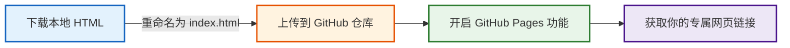
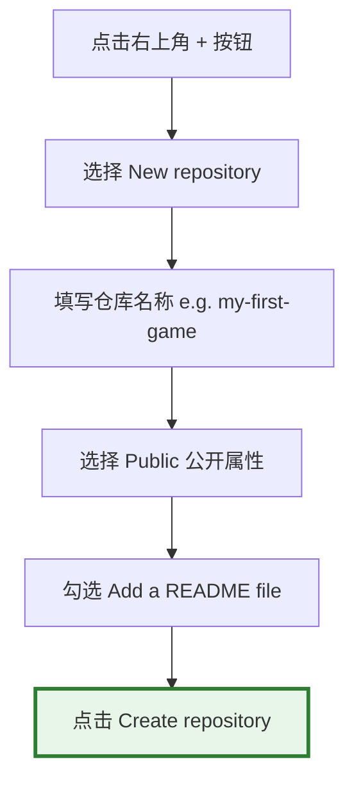

# 从本地到云端：用 GitHub Pages 免费发布与分享你的网页

> **“写出的代码只有在被全世界看到和使用时，它才真正拥有了生命。”**

在此之前，我们使用 AI 编写的所有网页小程序和 3D 游戏，都只存在于我们自己的电脑上。我们是通过在浏览器中“双击打开 HTML 文件”来运行它们的。

这种方式虽然方便调试，但却有一个致命的缺点：**你无法把这个程序轻松分享给你的家人、朋友或同事。** 你总不能把 HTML 文件用微信发给他们，让他们在手机上痛苦地寻找如何用浏览器打开它吧？

为了让所有人只需**点击一个链接**就能在手机或电脑上瞬间运行你的程序，我们需要将它发布到互联网上。

这一章，我们将教你使用全球最著名的代码托管平台——**GitHub** 提供的免费建站服务 **GitHub Pages**。你无需花费一分钱租用服务器，也无需注册繁琐的域名，只需在网页上点点鼠标，就能在 5 分钟内拥有一个专属的网站！

---

## 免费建站的整体流程

将本地网页发布到互联网上并生成链接，整体流程其实非常简单：



---

## 第一步：准备并下载你的 HTML 文件

无论你使用的是 ChatGPT Canvas、Claude Artifacts 还是 Meta AI，当你对生成的程序感到满意后，都可以将其下载到本地电脑上。

### 🚨 避坑核心要诀：必须命名为 `index.html`

下载完成后，找到这个文件，右键重命名，将其名字修改为：

```text
index.html
```

> [!IMPORTANT]
> **为什么必须叫 `index.html`？**
> 在互联网的世界中，`index.html` 是所有网站服务器默认认定的“首页文件名”。当你访问一个网址时，服务器会自动去寻找这个名字的文件来展示。如果你的文件名叫 `mygame.html`，服务器将无法自动识别，访问者就会看到 404 错误页面。

---

## 第二步：注册并登录 GitHub 账号

**GitHub** 是全球最大的代码托管与开源协作平台，你可以把它简单理解为“程序员的云端朋友圈”和“代码云盘”。

1. 打开浏览器，访问 [GitHub 官网 (github.com)](https://github.com/)。
2. 点击右上角的 **Sign up** 按钮进行注册。
3. 按照屏幕提示输入邮箱、密码和你的专属用户名（Username）。
4. 注册完成并激活邮箱后，登录你的账号。

> [!TIP]
> 注册时选择的 **用户名（Username）** 非常重要！它将会直接决定你未来所有个人网站的链接前缀。例如你的用户名是 `tom`，那么你生成的网页链接就会以 `tom.github.io` 开头。

---

## 第三步：创建一个云端“仓库”

在 GitHub 上，每个项目都有一个独立的存储空间，我们称之为**仓库（Repository）**。



具体步骤如下：
1. 登录 GitHub 后，点击页面右上角的 **`+`** 号图标，选择 **New repository**（新建仓库）。
2. **Repository name (仓库名称)**：输入一个简洁的英文名字，例如 `my-first-game` 或 `pixel-pet`。
3. **Description (描述)**：可以简单写一句介绍（选填），例如“我的第一个赛博木鱼解压网页”。
4. **Public/Private**：**必须勾选 Public (公开)**！
   > [!WARNING]
   > 免费账户只有将仓库设置为 **Public (公开)**，GitHub 才会允许我们开启 GitHub Pages 网站发布服务。如果设为 Private，别人将无法访问你的网页。
5. **Initialize this repository with**：勾选 **Add a README file**（添加自述文件）。
6. 滑动到页面最下方，点击绿色的 **Create repository**（创建仓库）按钮。

---

## 第四步：上传你的 HTML 网页文件

现在你的云端仓库已经建好了，我们需要把刚刚重命名好的 `index.html` 文件上传上去。我们完全不需要安装任何专业软件，直接在浏览器中就能完成上传！

1. 在刚刚建好的仓库主页中，点击右上角的 **Add file** 按钮，选择 **Upload files**（上传文件）。
2. **拖拽上传**：直接将你电脑上的 `index.html` 文件拖拽到网页中间的虚线框内；或者点击 **choose your files** 并在电脑中选择该文件。
3. 等待文件上传进度条走完，你会在列表中看到 `index.html`。
4. **Commit changes (提交变更)**：在页面下方的输入框中输入一句说明（例如 `Upload my game index.html`，也可以不填保持默认）。
5. 点击绿色的 **Commit changes** 按钮，保存上传。

此时，你的仓库里应当同时包含两个文件：`README.md` 和 `index.html`。

---

## 第五步：开启 GitHub Pages 魔法

这是最关键的一步，我们将指挥 GitHub 把刚刚上传的网页文件渲染成一个可供全球访问的真实网站。

1. 在仓库顶部的一排功能标签中，点击最右侧的 ⚙️ **Settings**（设置）。
2. 在左侧的导航栏中向下滚动，找到 **Code and automation** 栏目下的 🌐 **Pages** 选项，点击进入。
3. 在 **Build and deployment** (构建和部署) 部分，找到 **Source** 选项，默认应为 **Deploy from a branch**（从分支部署）。
4. 在下方的 **Branch** (分支) 下拉菜单中，将默认的 `None` 修改为 **`main`**（有些老旧仓库可能是 `master`）。
5. 旁边的目录保持默认的 `/ (root)` 即可，然后点击右侧的 **Save** (保存) 按钮。

---

## 第六步：获取并分享你的专属网页链接！

点击保存后，GitHub 会在后台自动为我们启动构建服务器。

1. 耐心等待 1 到 2 分钟。
2. 刷新当前的 Pages 设置页面，你会看到页面顶部多出了一个带有绿色背景的高亮通知栏：

> **Your site is live at `https://<你的用户名>.github.io/<你的仓库名>/`**

3. **点击链接**：点击那个网址，奇迹发生了！你亲手指挥 AI 编写的游戏或小工具，已经在真实的互联网上完美运行了！
4. **分享快乐**：复制这个链接，发到你的微信群、朋友圈、小红书，或者在手机浏览器中直接打开。无论你的朋友使用的是 iPhone、安卓手机还是平板，他们都能立刻流畅地畅玩你的大作！

---

## 持续进化：未来如何更新你的网页？

当你想继续通过 AI 迭代你的程序，并把更新后的版本发布上线时，流程极为简单：

| 动作 | 操作步骤 |
| :--- | :--- |
| **1. 迭代开发** | 在本地或 AI 聊天框里调试新代码，下载更新后的 HTML 代码文件。 |
| **2. 准备文件** | 确保本地下载的新文件依然命名为 `index.html`。 |
| **3. 覆写上传** | 打开 GitHub 对应的仓库页面，点击 **Add file** -> **Upload files**，将新的 `index.html` 拖拽进去。 |
| **4. 自动部署** | 点击 **Commit changes** 提交。GitHub 会自动在后台重新打包发布，约 1 分钟后，原链接的内容就会自动更新为全新版本！ |

---

## 零基础玩家的 GitHub 避坑红线

在享受发布网站的巨大成就感时，请务必留意以下几个常见的问题卡点：

* **大小写敏感**：文件名必须是纯小写的 `index.html`，不能是 `Index.html` 或 `INDEX.HTML`。Linux 服务器对大小写极其敏感，错一个字母都会导致网站无法打开。
* **资源引用问题**：如果你在网页中加入了图片、音乐等资源，确保使用的是**网络链接**（例如 `https://picsum.photos/200`），而不能是本地电脑路径（如 `C:/Users/Desktop/cat.jpg`）。因为别人的电脑和服务器上根本没有你本地的 `C` 盘文件。
* **访问延迟**：有些时候，由于跨国网络波动的关系，点击 Commit 之后网站可能需要几分钟才能展示出最新内容，或者国内首次访问时加载稍慢。这属于正常网络现象，请耐心等待或尝试刷新浏览器缓存。

现在，你已经彻底完成了**“构思想法 ➡️ 指挥 AI 编写 ➡️ 体验调试 ➡️ 免费发布上线”**的完整软件开发闭环！你已经不再是软件的被动消费者，而是一名真正能够为世界创造价值的**创作者**。去开启你的软件发布时代吧！
