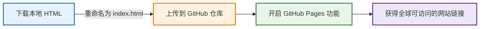
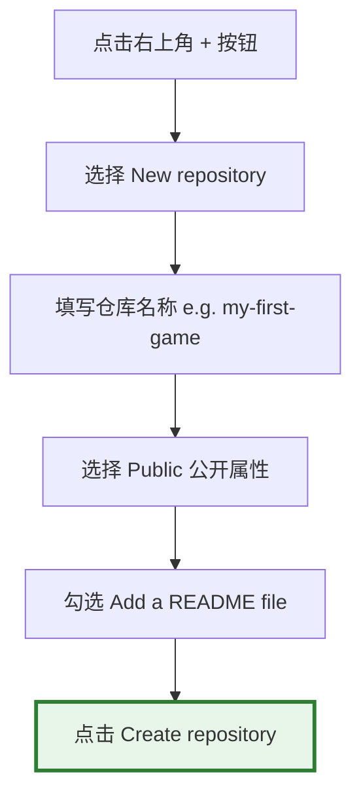

# 发布与分享你的网页

> 写出的代码只有在被全世界看到和使用时，它才真正拥有了生命。

前面几章里，我们已经开始用 AI 制作自己的小游戏、小工具，甚至复杂的网页应用了。

很多 AI 工具都会在生成结果旁边附带一个“分享”按钮，可以直接生成一个网页链接发给朋友试玩。这确实很方便，但它也有几个明显的问题：

第一，这类链接往往要求访问者也拥有对应 AI 平台的账号；
第二，这些网页通常依赖 AI 平台自身的临时运行环境，并不是真正属于你的网站；
第三，很多平台不会永久保存这些生成结果，过一段时间后，链接可能就失效了。

如果你只是随手玩玩，这当然没问题。
但如果你真的做出了一个想长期保存、长期分享，甚至想公开展示给更多人看的作品，那么你就需要一个更稳定、更正式的发布方式。

幸运的是，现在已经有大量免费的网页托管平台，可以让普通人零成本拥有属于自己的网站。

这一章，我们将使用全球最著名的代码托管平台 —— GitHub 提供的免费静态网站服务 —— GitHub Pages。

你无需租用服务器，无需购买域名，也无需学习复杂的运维知识。
只需要点几下鼠标，5 分钟后，你就会拥有一个真正运行在互联网中的个人网站。


## 免费建站的整体流程

将本地 HTML 网页发布到互联网，其实远没有想象中复杂。

整体流程大概只有下面四步：



本质上，你只是把自己的网页文件，上传到了 GitHub 的云端服务器上。而 GitHub Pages 会自动把它变成一个真正的网站。

## 第一步：准备并下载你的 HTML 文件

无论你使用的是 ChatGPT Canvas、Claude Artifacts、Gemini、Meta AI，还是其它 AI 工具，只要它生成的是网页程序，你最终都会得到一个 HTML 文件。

通常在生成结果附近，你会看到“查看代码”、“下载文件”之类的按钮。 把它下载到你的电脑上。

下载完成后，找到这个文件，右键重命名，将其名字修改为`index.html`

:::tip 为什么必须叫 `index.html`？
在互联网世界中，index.html 是服务器默认认定的“首页”。

当别人访问一个网址时，服务器会自动优先寻找这个名字的文件并展示。

因此，绝大多数静态网站的入口文件，都叫 index.html。
:::


## 第二步：注册并登录 GitHub 账号

**GitHub** 是全球最大的代码托管与开源协作平台，你可以把它简单理解为“程序员的云硬盘 + 开源社区 + 网站托管平台”。无数世界级的软件、游戏、AI 工具，实际上都托管在 GitHub 上。

注册步骤如下：

1. 打开浏览器，访问 [GitHub 官网 (github.com)](https://github.com/)。
2. 点击右上角的 **Sign up** 按钮进行注册。
3. 按照屏幕提示输入邮箱、密码和你的专属用户名（Username）。
4. 注册完成并激活邮箱后，登录你的账号。

:::tip 选择用户名（username） 
username 非常重要！它将会直接决定你未来所有个人网站的链接前缀。例如你的用户名是 `tom`，那么你生成的网页链接就会以 `tom.github.io` 开头。

也就是说，你今天随手起下的用户名，未来可能真的会成为你的“互联网门牌号”。
:::


## 第三步：创建一个云端“仓库”

在 GitHub 里，每个项目都有一个独立的存储空间，叫 Repository（仓库）。我们可以把它理解成“放网页文件的云端文件夹”。



具体步骤如下：
1. 登录 GitHub 后，点击页面右上角的 **`+`** 号图标，选择 **New repository**（新建仓库）。
2. **Repository name (仓库名称)**：输入一个简洁的英文名字，例如 `my-first-game` 或 `pixel-pet`。
3. **Description (描述)**：可以简单写一句介绍（选填），例如“我的第一个赛博木鱼解压网页”。
4. **Public/Private**：**必须勾选 Public (公开)**！免费账户只有将仓库设置为 Public (公开)，GitHub 才会允许我们开启 GitHub Pages 网站发布服务。如果设为 Private，别人将无法访问你的网页。
5. **Initialize this repository with**：勾选 **Add a README file**（添加自述文件）。
6. 滑动到页面最下方，点击绿色的 **Create repository**（创建仓库）按钮。


## 第四步：上传你的 HTML 网页文件

现在你的云端仓库已经建好了，我们需要把刚刚重命名好的 `index.html` 文件上传上去。我们完全不需要安装任何专业软件，直接在浏览器中就能完成上传！

1. 在刚刚建好的仓库主页中，点击右上角的 **Add file** 按钮，选择 **Upload files**（上传文件）。
2. **拖拽上传**：直接将你电脑上的 `index.html` 文件拖拽到网页中间的虚线框内；或者点击 **choose your files** 并在电脑中选择该文件。
3. 等待文件上传进度条走完，你会在列表中看到 `index.html`。
4. **Commit changes (提交变更)**：在页面下方的输入框中输入一句说明（例如 `Upload my game index.html`，也可以不填保持默认）。
5. 点击绿色的 **Commit changes** 按钮，保存上传。

此时，你的仓库里应当同时包含两个文件：`README.md` 和 `index.html`。


## 第五步：开启 GitHub Pages 

这是最关键的一步，我们将指挥 GitHub 把刚刚上传的网页文件渲染成一个可供全球访问的真实网站。

1. 在仓库顶部的一排功能标签中，点击最右侧的 ⚙️ **Settings**（设置）。
2. 在左侧的导航栏中向下滚动，找到 **Code and automation** 栏目下的 🌐 **Pages** 选项，点击进入。
3. 在 **Build and deployment** (构建和部署) 部分，找到 **Source** 选项，默认应为 **Deploy from a branch**（从分支部署）。
4. 在下方的 **Branch** (分支) 下拉菜单中，将默认的 `None` 修改为 **`main`**（有些老旧仓库可能是 `master`）。
5. 旁边的目录保持默认的 `/ (root)` 即可，然后点击右侧的 **Save** (保存) 按钮。


## 第六步：获得你的专属网站链接

点击保存后，GitHub 会在后台自动为我们启动构建服务器。

1. 耐心等待 1 到 2 分钟。
2. 刷新当前的 Pages 设置页面，你会看到页面顶部多出了一个带有绿色背景的高亮通知栏：

> **Your site is live at `https://<你的用户名>.github.io/<你的仓库名>/`**

3. **点击链接**：点击那个网址，奇迹发生了！你亲手指挥 AI 编写的游戏或小工具，已经在真实的互联网上完美运行了！
4. **分享快乐**：复制这个链接，发到你的微信群、朋友圈、小红书，或者在手机浏览器中直接打开。无论你的朋友使用的是 iPhone、安卓手机还是平板，他们都能立刻流畅地畅玩你的大作！


## 持续进化：未来如何更新你的网页？

当你想继续通过 AI 迭代你的程序，并把更新后的版本发布上线时，流程极为简单：

| 动作 | 操作步骤 |
| :--- | :--- |
| **1. 迭代开发** | 在本地或 AI 聊天框里调试新代码，下载更新后的 HTML 代码文件。 |
| **2. 准备文件** | 确保本地下载的新文件依然命名为 `index.html`。 |
| **3. 覆写上传** | 打开 GitHub 对应的仓库页面，点击 **Add file** -> **Upload files**，将新的 `index.html` 拖拽进去。 |
| **4. 自动部署** | 点击 **Commit changes** 提交。GitHub 会自动在后台重新打包发布，约 1 分钟后，原链接的内容就会自动更新为全新版本！ |

---

## 零基础玩家的 GitHub 避坑红线

在享受发布网站的巨大成就感时，请务必留意以下几个常见的问题卡点：

* **大小写敏感**：文件名必须是纯小写的 `index.html`，不能是 `Index.html` 或 `INDEX.HTML`。Linux 服务器对大小写极其敏感，错一个字母都会导致网站无法打开。
* **资源引用问题**：如果你在网页中加入了图片、音乐等资源，确保使用的是**网络链接**（例如 `https://picsum.photos/200`），而不能是本地电脑路径（如 `C:/Users/Desktop/cat.jpg`）。因为别人的电脑和服务器上根本没有你本地的 `C` 盘文件。
* **访问延迟**：有些时候，由于跨国网络波动的关系，点击 Commit 之后网站可能需要几分钟才能展示出最新内容，或者国内首次访问时加载稍慢。这属于正常网络现象，请耐心等待或尝试刷新浏览器缓存。

## 搭建个人主页

除了小游戏之外，很多人还会想拥有一个属于自己的个人主页。

这其实是互联网世界里非常浪漫的一件事。在社交媒体时代，我们所有人的主页都长得一模一样：微信朋友圈、微博、
小红书或者一个其它的社交平台页面。你的内容被塞进平台统一的模板里。

但个人网站不同。在那里：页面长什么样，由你决定；有什么多媒体，由你决定；如何展示自己，也由你决定。个人网站之前无法流行一个重要原因是搭建的门槛太高。而 AI 的出现，让过去原本只有专业前端工程师才能完成的事情，第一次变成了普通人也能做到的东西。

现在，只需要学会用自然语言描述自己想要的感觉。比如：

“我想要一个像深夜森林一样安静的主页”
“我希望按钮像玻璃一样有半透明质感”
“我想要页面滚动时有轻微视差”
“我想让整个页面像 old money 风格”
“我想做一个赛博朋克终端风格主页”

AI 会替我们把这些抽象的审美，翻译成真正运行的网页代码。

下面，就是一个我使用过的个人主页提示词模板。

```text
# Role & Objective
你是一位顶级的全栈前端工程师和 UI/UX 设计师。请帮我编写一个单文件 (Single-file) 的个人主页/社交导航页面 (Link-in-bio page)，命名为 `index.html`。页面必须完全手写原生 HTML/CSS/JavaScript，不依赖任何第三方 CSS/JS 框架或外部图标库，所有图标必须使用内联 SVG。

# Core Requirements
1. 视觉风格与美学 (Premium Aesthetics)：
   - 采用精致的现代轻拟物与极简主义结合的风格。
   - 使用 CSS 变量 (`:root` 与 `html.dark`) 定义两套高质感的配色系统（如森林绿/莫兰迪色系）。
   - 背景使用柔和的渐变，并叠加一层使用 SVG `<feTurbulence>` 动态随机生成的超轻微大理石纹理（Marble Texture）滤镜，透明度保持在 10% 左右。
   - 主卡片容器使用毛玻璃效果 (`backdrop-filter: blur(10px)`)，在暗黑和亮色模式下有不同的微弱描边和阴影。

2. 微交互与动画 (Micro-animations)：
   - 主题切换按钮：右上角放置一个圆形主题切换按钮。切换时图标（☀️/🌙）伴随旋转、缩放和渐隐动画，且页面背景和变量平滑过渡。
   - 导航卡片 (Cards)：
     - 卡片宽度适中（如最大 680px），纵向排列。
     - 卡片悬浮 (Hover) 时：卡片整体向上微移，投影加深，边框颜色渐变；卡片顶部平滑显示一条横向的彩色渐变进度条 (`::before` 缩放动画)；右侧的箭头图标从左侧滑出显现；左侧的 SVG 图标产生轻微旋转或放大。

3. 工程与技术细节 (Engineering Best Practices)：
   - **防止暗黑模式闪烁**：在 `<head>` 中立刻执行一个 IIFE 脚本，从 `localStorage` 或系统偏好 (`prefers-color-scheme`) 中读取主题，并立即应用到 `<html>` 标签上。
   - **响应式设计**：完美适配移动端（最大宽度 600px 以下时，隐藏右侧悬浮箭头，微调内边距，保持极致体验）。
   - **SEO 友好**：包含完整的 Meta 标签（Description, Keywords, Open Graph 协议标签）、合理的 HTML5 语义化结构（`<header>`, `<main>`, `<footer>`）、以及交互元素的 `aria-label`。

# Page Content Structure
- 顶部：一行精致有哲理的 Slogan（如“花开花落，云卷云舒”）。
- 中部：一组纵向排列的卡片，每个卡片包含：
  1. 左侧：精致的内联 SVG 图标（背景有微弱的彩色气泡感）。
  2. 中间：标题 + 标签（如“在线书籍”或“网络论坛”）+ 一句诗意且简短的描述。
  3. 右侧：悬浮时才会滑出显现的向右箭头。
- 底部：极简的 Footer 分割线与域名标识。

请直接输出完整、无缺失的 `index.html` 代码，确保 CSS 写在 `<style>` 内，JS 写在底部的 `<script>` 内。

```


### 笔者的个人主页

我的个人主页，就是使用上面的提示词生成后，再不断微调完成的。主页： https://qizhen.xyz/  

源码在： https://github.com/ruanqizhen/ruanqizhen

