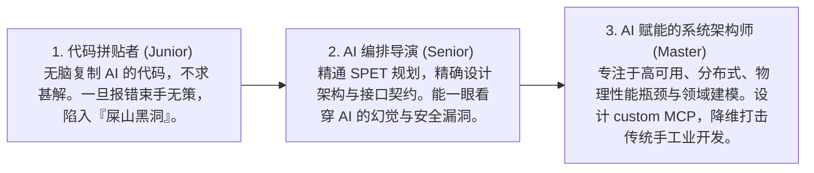

# 终身成长与技能平衡

> **“工具一直在变，但人类对于未知世界的好奇心、对优雅设计的渴望，是代码世界里永远不灭的灯火。”**

---

长期依赖大模型的自动补全（Tab 键）和整块代写，极易引发一种可怕的软件工程亚健康现象——**“技术肌肉萎缩”（Technical Muscle Atrophy）**。

一旦脱离了 AI 辅助（例如：突发断网受限环境、严苛的企业安全脱网环境，或者是手写白板编程面试），许多原本优秀的程序员会突然变得手足无措，连基本的循环、数据转换或 API 声明都写不出来。

AI 释放了我们 80% 的时间红利，但如何将这些溢出的生产力重新“再投资”到我们自己的大脑中？本章将为你奉上一套高强度的 **“无 AI 脱网编码训练表”**，并为你绘制一份 **12 个月的程序员 AI 结对跃迁路线图**。

---

## 1. 脑白质突触保活：“无 AI 脱网编码健美操” 课程表

为了保持你的“指尖物理记忆”和独立编码的尊严，我们强烈建议你：**每周主动抽出 2 小时，彻底关闭所有 AI Tab 补全插件与 Chat 窗口，开启一个纯文本编辑器，进行如下高强度的裸敲健美操练习**。

我们为你设计了 4 周一个循环的**“无 AI 脱网训练课表”**：

| 训练周 | 练习科目 (No-AI Exercises) | 核心考察点 | 裸手敲击要求 (No Google / No Copilot) |
|---|---|---|---|
| **第 1 周：基础数据结构** | 手写一个“红黑树插入”或“高并发线程安全 Hash Map” | 内存指针操作、数据平衡算法、多线程冲突处理。 | 仅使用语言最基本的原生标准库，在一屏内写完，不依赖任何第三方包。 |
| **第 2 周：经典网络底层** | 使用原生 Socket API（如 Node.js `net` 模块或 Python `socket`）从零写一个简易 HTTP 静态服务器。 | 握手包解析、TCP 连接管理、HTTP 响应报文头规范。 | 能够正确处理客户端连接，并手动组装返回 `HTTP/1.1 200 OK` 报文体。 |
| **第 3 周：经典异步控制** | 手写一个完整的 React 状态管理中间件（或 JS 异步 Promise 链式调用控制器）。 | 闭包状态维持、发布订阅模式、微任务队列调度。 | 从零实现 `myPromise.then().catch()` 闭包机制。 |
| **第 4 周：裸手 UI 构建** | 白板纯手敲一段复杂的带有 Flex/Grid 嵌套响应式布局的 HTML + CSS 表单界面。 | 样式选择器优先级、盒子模型计算、媒体查询断点。 | 不查阅任何 CSS 手册，徒手写出高复原度的精美网格对齐。 |

*通过这套健美操，你不仅能保持强大的底层技术肌肉，还能在没有 AI 这根拐杖时，依然拥有在惊涛骇浪中裸奔的**核心求生技能**。*

---

## 2. 生产力红利的二次投资：从“代码拼贴者”到“AI 编排导演”

平庸的开发者会用 AI 释放的 80% 闲暇时间来刷短视频或无意义地摸鱼，导致自己的竞争力贬值；而顶尖的修行者则会把这笔宝贵的时间资产重新投资到自己的**高价值认知域**。

这是一场认知深度的跃迁：

### 🎯 认知的二次投资策略：
* **向业务底层挺进**：去和真实的用户聊天，理清商业流水的每一处卡点。软件的终极价值是解决真实的商业痛点，AI 能帮你写代码，但不能帮你寻找商业机会。
* **向系统美学挺进**：研读 Linux 核心调度、Redis 源码设计、或者 Spring/React 的封装思维。思考如何让你的组件在面对 3 年后的业务剧变时，依然维持优雅的弹性和高内聚。

---

## 3. 12 个月的程序员 AI 修行跃迁路线图

如果你想在未来的算力浪潮中脱颖而出，这里有一份为你定制的 **12 个月技能敏捷重构规划**：

### 📅 Phase 1 (第 1 - 3 个月)：基本功与安全防护网构建
* **核心目标**：彻底告别“无脑丢指令”的习惯，构建物理安全防线。
* **动作要领**：
  * 精通 **SPET 规划流程**，在动工前必写 Spec 与 Plan。
  * 将 Git 精细化操作融入 AI 每次微重构步骤，熟练掌握 `git reset --hard` 安全后悔药。
  * 熟练掌握环境变量 API Key 的安全配置，杜绝硬编码泄密。

### 📅 Phase 2 (第 4 - 6 个月)：高级上下文工程与团队 MCP 赋能
* **核心目标**：实现“高精准靶向喂养”，打破 Agent 物理隔绝沙盒。
* **动作要领**：
  * 掌握 @Files、@Codebase 与长对话“另起炉灶”的断舍离心法，控制 Token 消耗。
  * 动手为你的团队编写并部署自定义的 **MCP Server**，连接企业内部数据库与私有 API，给 AI 插上翅膀。

### 📅 Phase 3 (第 7 - 9 个月)：TDD 驱动的 Cline/Aider 全自动化流水线
* **核心目标**：将测试与重构流水线高度自动化。
* **动作要领**：
  * 熟练掌握 Cline 的 Agent 调试模式，让 AI 主动跑测试、读日志、自我修正 Bug。
  * 编织高密度的单元测试与混沌测试防护网，让 AI 在安全的铁轨上狂奔。

### 📅 Phase 4 (第 10 - 12 个月)：多模态架构设计与极限成本控制
* **核心目标**：实现视觉到代码的零阻碍跨越，掌握极致的财务省钱技术。
* **动作要领**：
  * 熟练运用多模态 AI 进行设计稿一键重构与诡异 CSS 视觉 bug 靶向诊断。
  * 掌握**模型分级调用策略（Tiered LLM Strategy）**与提示词缓存红利，将总体 API 开发成本压缩 90% 以上。

---

## 本章小结

本章讨论了在 AI 编程大潮下如何保持个人长期的竞争力和身心技能的平衡：

1. **肌肉防萎缩**：定期进行脱网编码练习，保持对底层实现和纯手工编码的“肌肉记忆”。
2. **红利再投资**：将 AI 释放出的 80% 的时间红利，重新投资到系统架构、业务理解和代码美学等高价值认知领域。
3. **敏锐跃迁**：建立个人的赛博情报网络，保持“工具是配剑，配剑随时可换”的实用主义心态，与最先进的生产力同频共振。

---

## 结语：重构，从这里开始

恭喜你读完了本书的所有章节！大模型时代的到来，并不是软件工程的终结，而是“人机结对”新型软件工程学的开端。

技术在飞速迭代，但只要你掌握了**上下文工程、小步规划、持续验证**的底层心法，并时刻保持**批判性思维**，你就能在这场技术浪潮中立于不败之地。

拿起你的配剑，去重构你的代码，也去重构你作为程序员的无限未来吧！
