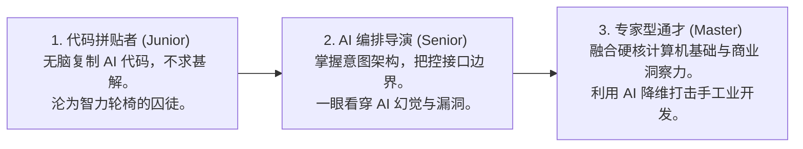

# 与 AI 一同成长

> 工具一直在变，但人类对于未知世界的好奇心、对优雅设计的渴望，是代码世界里永远不灭的灯火。打败你的永远不会是 AI，而是那个手握超级杠杆、且内心支点无比坚固的同类。

每一次划时代技术的降临，往往都会伴随着一种乌托邦式的幻觉。当大语言模型以极低的门槛向大众开放时，人们欢呼雀跃，认为普通人与极客精英之间的资源壁垒终于被打破。既然所有人都能拥有一键生成代码的超级外脑，天才与平庸者的起跑线理应被彻底拉平了吧？

然而，现实的演化逻辑却极其冰冷且反直觉：AI 越是普及，人与人之间的鸿沟不仅没有缩小，反而会以指数级的速度、甚至极其残忍的方式被拉大。

在 AI 释放了我们 80% 的时间红利之后，我们面临着职业生涯中最严峻的考验：你是将这些溢出的生产力重新“再投资”到自己的大脑中，还是坐上了那把看似舒服的“智力轮椅”，任由自己的核心能力逐渐萎缩？

本章将为你揭开 AI 普及背后的残酷真相，并为你奉上一套高强度的“无 AI 脱网编码训练表”与“12 个月技能跃迁路线图”。

## 人类折叠

“人类折叠”（Human Folding）是一个极具社会学和科幻色彩的隐喻。它指的是：超级技术的普及不仅没有像预期的那样“抹平”阶层与智力的鸿沟，反而以指数级的速度，将人类社会急剧撕裂、甚至“折叠”成截然不同的维度的残酷现象。

要理解这场正在加速上演的“人类折叠”，我们必须看透以下三个极其残忍的现实：

### 门槛升级
如果说互联网降低了信息“传播”的门槛，AI 则直接将代码与信息“生成”的边际成本降为了零。在这个充斥着 AI 一秒钟批量生成的“合成废料”和“幻觉代码”的时代，如果没有深厚的底层知识打底，普通人连判断 AI 输出对错的能力都没有，只能把机器包装精美的“平庸废话”奉为圭臬；而真正的高手，则能轻易穿透噪音，从沙砾中淘出真金。

### 技能通胀
普及后的 AI，让所有人都能瞬间写出一段能跑的代码。很多人误以为这抹平了底层的技能差距，但这是一种致命的错觉。

以前，一个普通人做不到 70 分，一个高手能做到 90 分，产出差距是 90:0。现在，AI 帮普通人直接跳到了 70 分；但高手用同样的 AI 跳到了 95 分，并且利用省下的时间，一口气连做了 10 个 95 分的项目。此时，两者的差距瞬间变成了碾压式的 950:70。

当“做出来”的执行成本趋近于零，“做什么、为什么做、做到什么程度算好”的判断力，就成了唯一的稀缺品。 而判断力来自于你过去读过的经典源码、踩过坑的架构以及在泥泞中滚打出的阅历，你永远无法用一个简短的提示词（Prompt），瞬间下载别人积累了十年的工程品味。

## 智力轮椅
面对极其易用的 AI，人群正在两极分化。
第一种人把 AI 当“外包员工”：他们定目标、拆任务、审结果，每天都在变强，因为 AI 在无限放大他们的主体性。
第二种人把 AI 当“答案机”与“智力轮椅”：遇到稍复杂的推演连一分钟都不愿多想，直接向 AI 索要答案。思考能力遵循“用进废退”的生物学铁律，长期依赖这把轮椅，大脑负责逻辑推理的神经回路将严重萎缩。在这个过程中，他们失去了在粗糙中动手试错的能力，也就彻底切断了“判断力”的来源。不知不觉中，他们正在“被 AI 训练”。

## 程序员的未来
AI 不会直接取代程序员，但使用 AI 的程序员会彻底淘汰那些不使用 AI 或沦为 AI 附庸的程序员。你需要将多出来的 80% 生产力时间，投资到不可被 AI 替代的“专家型通才（Expert-Generalist）”领域。

```mermaid
graph LR
    Paster["1. 代码拼贴者 (Junior) <br> 无脑复制 AI 代码，不求甚解。<br>沦为智力轮椅的囚徒。"] --> Director["2. AI 编排导演 (Senior) <br> 掌握意图架构，把控接口边界。<br>一眼看穿 AI 幻觉与漏洞。"]
    Director --> Architect["3. 专家型通才 (Master) <br> 融合硬核计算机基础与商业洞察力。<br>利用 AI 降维打击手工业开发。"]
```
要完成身份的跃迁，你需要向两个极端的方向挺进：

### 向上挺进
AI 懂代码，但不懂你的用户。当代码变得免费时，真正昂贵的护城河就水落石出了：信任、分发网络、资本、商业洞察。去和真实的用户聊天，理清商业流水的每一处卡点。知道“应该建什么”比知道“怎么建”重要一万倍。

### 向下挺进
AI 能写出漂亮的业务增删改查，但在处理底层性能调优、并发竞态、分布式一致性等问题时，往往会给出似是而非的致命幻觉。深入理解 Linux 核心调度、数据库锁原理和网络协议。当 AI 生成的系统在生产环境中崩溃时，只有具备深厚底盘知识的你，才能成为力挽狂澜的定海神针。

## 防止退化
长期依赖大模型的自动补全（Tab 键）和整块代写，极易引发一种可怕的软件工程亚健康现象——“技术肌肉萎缩”（Technical Muscle Atrophy）。

一旦脱离了 AI 辅助（例如：高安全性的物理断网开发环境，或者是白板手写编程面试），许多原本优秀的程序员会变得手足无措，连基本的循环、数据结构转换或 HTTP 接口声明都写不出来。

为了保持你的“指尖物理记忆”和独立编码的尊严，我们强烈建议你：每周主动抽出 2 小时，彻底关闭所有 AI 插件与 Chat 窗口，开启一个纯文本编辑器，进行如下高强度的裸敲健美操练习。 我们为你设计了 4 周一个循环的训练课表：

| 训练周 | 练习科目 (No-AI Exercises) | 核心考察点 | 裸手敲击要求 (No Google / No Copilot) |
|---|---|---|---|
| 第 1 周：基础数据结构 | 手写“红黑树插入”或“高并发线程安全 Hash Map” | 内存指针操作、数据平衡算法、多线程冲突处理。 | 仅使用语言原生标准库，不依赖任何第三方包，手写出正确的逻辑。 |
| 第 2 周：经典网络底层 | 使用原生 Socket API 从零写一个简易 HTTP 静态服务器。 | 握手包解析、TCP 连接管理、HTTP 响应报文头规范。 | 正确处理客户端连接，并手动组装返回 HTTP/1.1 200 OK 报文体。 |
| 第 3 周：经典异步控制 | 手写完整的状态管理中间件或 JS 异步 Promise 链式调用。 | 闭包状态维持、发布订阅模式、微任务队列调度。 | 从零徒手实现 myPromise.then().catch() 的底层状态机运转机制。 |
| 第 4 周：裸手 UI 构建 | 白板纯手敲一段复杂的带有 Flex/Grid 嵌套响应式布局的界面。 | 样式选择器优先级、盒子模型计算、媒体查询断点。 | 不查阅任何手册，徒手写出高复原度的精美网格对齐。 |
注：如果你在裸敲时感到痛苦和卡顿，不要逃避，那正是你的大脑在重新建立神经突触、抵抗萎缩的标志。

## 行动纲领：12 个月的程序员 AI 修行跃迁路线图
如果想在这场席卷全球的算力浪潮中脱颖而出，这里有一份为你定制的 12 个月技能重构路线图：

### Phase 1（第 1 - 3 个月）：建立物理防线与意图架构思维
核心目标：彻底告别“无脑丢指令”的恶习，学会定义系统边界。

动作要领：

拒绝盲目复制：当 AI 为你生成了一段完美的逻辑时，问自己：“这段代码的底层原理是什么？有哪些假设？什么时候会失效？”你不理解的代码绝不合入主干。

精通 SPET（System/Problem/Expectation/Test）规划流程，在唤醒 AI 动工前，强制自己先写业务契约。将 Git 精细化操作融入 AI 每次微重构步骤，熟练掌握 git reset --hard 安全后悔药。

### Phase 2（第 4 - 6 个月）：跨界破壁与团队 MCP 赋能
核心目标：利用 AI 补齐自己的短板，实现全栈跨越，并掌握精准投喂技术。

动作要领：

利用 AI 打破技术栈壁垒：如果你是前端，尝试用 AI 辅助写一个 Python/Go 后端服务；反之亦然。

精通 @Files、@Codebase 等指令，掌握长对话断舍离心法与控制 Token 消耗的高级上下文工程。

动手为团队编写并部署自定义的 MCP Server（模型上下文协议），连接企业内部数据库与私有 API，给 AI 插上通往现实世界的翅膀。

### Phase 3（第 7 - 9 个月）：TDD 驱动的全自动化验证流水线
核心目标：从“代码阅读者”彻底转向“行为验证者”。

动作要领：

熟练驾驭全自主 Agent（如 Cline/Claude Code）的调试模式，让 AI 主动跑测试、读日志、自我修正 Bug。

深入贯彻 TDD（测试驱动开发）思想。编织高密度的特征测试与契约测试防护网，把非确定性的 AI 关进确定性的牢笼里。

### Phase 4（第 10 - 12 个月）：多模态架构设计与赛博数字资产
核心目标：借算力东风，让你的数字资产在睡梦中为你工作。

动作要领：

掌握多模态视觉大模型，实现设计稿的像素级一键重构。学习基础的机器学习概念与数据清洗，迎接 Software 2.0 时代。

在 AI 时代，从想法到可上线的 MVP（最小可行产品）开发周期已压缩至以小时计。快速将你的独立商业想法或开源工具上线并投入真实市场。让代码为你积累真实的财富与影响力，完成传统手工业时代想都不敢想的降维打击。

## 力量源于支点
阿基米德曾说：“给我一个支点，我就能撬动地球。”

大语言模型与全自主 Agent 工作流，就是人类软件工程史上迄今为止最长、最完美的那根杠杆。杠杆本身不产生任何力量，力量依然来自于你站在哪里，以及你想撬动什么。

- 你要解决什么真实的社会问题？
- 你是否拥有在失败与阅历中淬炼出的绝佳技术品味？
- 你敢不敢在极度不确定中，为最终的结果拍板负责？

杠杆越长，站得高的人和站得低的人，能撬动的世界就差得越远。在可预见的未来，AI 将承担大部分机械的、重复的编码工作。这绝不是威胁，而是一种终极的解放。它解放了我们的大脑，让我们能够专注于软件工程中最接近人类灵魂的部分：理解真实的意图，设计优雅的架构，并在复杂、模糊的约束中做出正确的判断。

不要在智力轮椅上沉沦。握紧你的那把剑，成为那个手握超级杠杆、且内心支点无比坚固的同类。