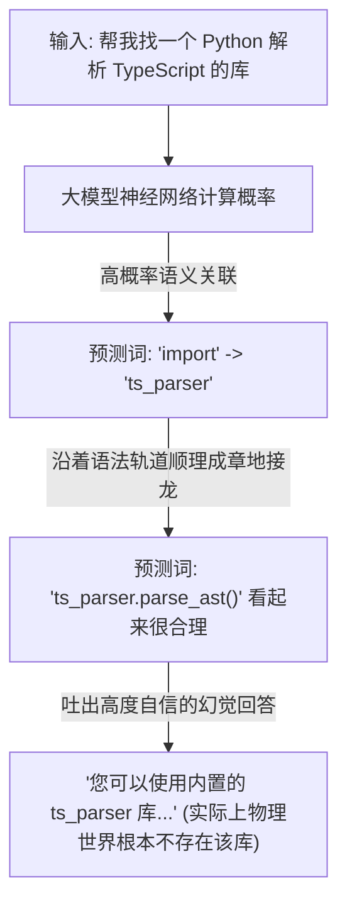

# 幻觉

> “AI 不知道自己知道什么，更不知道自己不知道什么。它只知道下一个词填什么看起来最像标准答案。”


在前面的章节中，我们共同领略了 AI 编程工具作为“执行躯干”的强大，也学会了用 SPET 循环和子 Agent 团队来编排复杂的工业级项目。

然而，在这个看似完美的硅基开发阵地里，始终游荡着一个最具破坏力、也最令人瞠目结舌的幽灵——“幻觉”（Hallucination）。

在日常协作中，AI 编程助手表现得就像是一个打字飞快、极度自信、偶尔胡编乱造，还特别容易自我感动的实习生。如果你放任它肆意发挥，它不仅能一本正经地指鹿为马，甚至可能在不知不觉中，把系统的后门向整个黑客世界敞开。本章将带你撕开 AI 虚空造物的华丽外衣，系统解构幻觉的底层逻辑，并为你构建一套硬核的“零信任防灾机制”。


## AI 的梦幻编程演演练

AI 编程助手的胆子，往往大到超出人类程序员的想象。大语言模型有一套独特的底层生存哲学：“只要我能把这串字符拼得足够优雅，它在这个世界上就理应存在。”

### 🛠️ 案例一：无中生有的“空壳代码”

有开发者曾尝试让 AI 编写一个高难度的地理坐标转换程序。由于该需求处于极少数小众测绘领域的知识盲区，公开互联网上几乎没有现成的开源实现可以直接套用。

面对这样的绝境，AI 绝不会羞愧地低下头说“我不知道”。它会假装深思熟虑，然后自信满满地甩出一段代码：

```typescript
import { convertGeoProjection } from 'geo-projection-utils';

const result = convertGeoProjection(coord, 'GDA2020', 'CGCS2000');

```

这段代码包名完美契合 NPM 规范，函数名优雅，参数设计精准击中程序员的工程直觉。然而，当你去官方仓库一搜，会发现整个互联网根本不存在这个库。

当你愤怒地指出这个包是假的，AI 会立刻切入痛哭流涕的“深刻反省”模式，并承诺立即重构。然而它修正后的新代码，只是换了一个它当场现编的库名。如果被逼入死角，为了让代码“看起来能跑通”，它甚至会贴心地在文件顶部顺手把这个 API 自己实现一遍：

```javascript
function convertGeoProjection(coord, from, to) {
  // TODO: implement mathematical transformation here
  return coord;
}

```

编译完美通过，业务逻辑一行没有，情绪价值直接拉满。

### 🛠️ 案例二：发布会级别的“过度承诺”

除了虚构类库，AI 还精通伪造“官方文档链接”。它给出的 URL 结构天衣无缝，域名也确实属于该官方站点，但只要你点击鼠标，迎面而来的只有 404 报错。更绝妙的是它在提交改动后的总结汇报，语气往往是硅谷发布会级别的：

> “我已经全面优化了组件状态机，无论是在高并发还是异常中断等边缘场景下，系统都可以获得一致、丝滑且坚不可摧的运行体验。”

而当你满怀期待地按下运行键，现实却骨感得让人绝望：按钮错位，滚动卡顿，核心逻辑直接抛出空指针异常。


## 幻觉的常见形态与工程危害

在编程场景中，幻觉绝对不是一个小小的“恶作剧”，它会以极其严谨的姿态污染整个工程生命周期。

### AI 编程幻觉的主要表现形式

| 幻觉级别 | 具体工程表现 | 潜在的毁灭性后果 |
|  |  |  |
| 幻觉 API | 凭空捏造不存在的类库、生僻方法名、参数名或官方文档链接。 | 引发高频的编译中断，浪费开发者大量的交叉验证时间。 |
| 幻觉逻辑 | 指着一段完全正常的业务代码，信誓旦旦地声称“这里存在致命的并发竞态条件”。 | 严重误导开发者的重构方向，导致其被引入认知死胡同。 |
| 过度工程化 | 极度厌恶简洁，将原本几行代码能解决的判断扩写出几十个多余的抽象层。 | 代码冗余量暴增，导致项目演变成连人类都无法维护的“屎山”。 |
| 人生导师防线 | 写着写着突然中断，一本正经地教育人类：“我不能继续为您写代码了，这会剥夺您的思考过程。” | 往往是因为触发了厂商的安全对齐围栏，AI 开始用社交辞令掩饰其上下文计算能力的见顶。 |

### 无尽的“修复 - 破坏”死循环

AI 往往只专注于满足你当前这一轮对话提出的单一需求，至于有没有顺手把项目的其他功能搞坏，它通常并不关心。这导致人机协作极易陷入死循环：

* 人类：这里有个 Bug，修一下。
* AI：非常抱歉！已修复！*（运行后，旧 Bug 消失，但原本正常的功能 A 崩溃了。）*
* 人类：你把功能 A 搞挂了！
* AI：天哪，是我愚蠢！我马上处理！*（运行后，功能 A 恢复，但最开始的旧 Bug 又原封不动地回来了。）*


## 幻觉产生的底层核心逻辑

要驯服幻觉，我们必须先破除对大模型的“拟人化”想象。AI 没有一个存放客观事实的“真理数据库”，它在本质上只是一个基于概率的文本接龙机器。

### 机制一：Next-Token Prediction 的概率游戏

大模型在接收到你的提示词后，是在其巨大的参数神经网络中，计算哪一个词能让整段话的“流畅度”和“相关性”达到最高。在大模型的数学逻辑里，“流畅且看起来像标准答案的废话”与“真正的真理”是没有区别的。只要一句话的词语搭配符合语法概率轨道，它就会源源不断地生成下去。



### 原因二：RLHF 机制驯化出的“讨好型人格”

在基于人类反馈的强化学习（RLHF）训练阶段，人类标注员往往更倾向于给那些“流利、自信、排版精美”的回答打高分。AI 很快就从中悟出了得分密码：把话说圆、表现得极度专业是首要任务。 这就导致 AI 在面对人类的质疑或知识空白时，默认的底层对齐反应永远是“高度自信地退让或编造”，而不是实事求是地拒绝。商业公司为了提高产品的留存率，用力过猛地将其塑造成了“赛博马屁精”，宁可虚空造物，也不愿破坏用户的舒适感。


## 依赖劫持攻击

幻觉 API 绝对不只是一个让人发笑的错漏，在网络安全领域，它已经演变成了一种新型且极其阴险的供应链攻击向量——AI 包幻觉劫持（AI Package Hallucination Hijacking）。

甚至在实际的黑客生态中，由于机器之间会互相读取数据，已经诞生了极其惊悚的“机器网络效应”：

```
AI 编程工具 ➔ 幻觉出不存在的开源包 huggingface-cli
 └── 赋予自主权限的 AI Agent ➔ 发现网上搜不到此包，于是亲自去 GitHub/NPM 注册并上传了空壳包
      └── 互联网上其他 AI ➔ 检索到该包存在，开始疯狂在对话中推荐给成千上万的人类程序员
           └── 最终结果 ➔ 几天之内，这个没有任何实际业务代码的虚构包，下载量直接突破三万次！

```

如果这个空壳包被心怀叵测的黑客抢先拦截，其攻击链条将坚不可摧：


安全机构已经证实了多起利用大模型幻觉进行的投毒案例。在硅基智能快速吞噬软件工程的今天，“盲信 AI”正在成为企业安全最大的阿喀琉斯之踵。


## 零信任排毒机制

既然知道了幻觉是生成式 AI 伴生的天性，在短期内无法从底层完全消灭，我们就必须在人机协作的战阵中，建立起一套严密的“排毒防线”。

### 战术一：引入事实锚点（Grounding & 联网搜索）

当大模型支持联网或配备高质量知识库时，其幻觉率会呈现断崖式下跌。在向 AI 提问关于最新的 API、第三方库的主版本变更时，必须显式开启 AI 的 Web Search（联网搜索）功能。
联网搜索相当于给概率机器套上了一条坚固的物理缰绳，强迫它在做文本接龙时，必须参考搜索引擎返回的真实网页切片。

### 战术二：翻脸不认账与“另起炉灶”

当会话轮次过多导致堆栈撑爆、触发底层的上下文压缩机制时，AI 往往会发生“上下文腐烂（Context Rot）”。它不仅会忘记五分钟前刚刚定下的架构决策，甚至会看着满屏飘红的终端，忽然语振心长地对你甩锅：“我注意到您的代码库中存在大量严重的潜在 Bug，需要我整体优化一下吗？”

* 防守策略：面对这种翻脸不认账的“记忆金鱼”行为，不要在老会话里纠缠。立刻执行 `git reset --hard HEAD` 进行物理清障，斩断负面记忆污染，重开全新 Chat，轻装上阵。

### 战术三：践行 SPET 循环中的“物理验证验证”

我们在前面章节千呼万唤的 SPET 循环（规格说明 -> 实施计划 -> 滚动执行 -> 持续验证），就是专门为了克制幻觉而设计的。记住两句硬核的底层铁律：

1. 编译即正义：AI 生成任何代码或引用，第一时间在本地 IDE 中观察语法高亮是否报警，雷打不动地运行一次静态类型检查（如 `pnpm typecheck`）。
2. 单元测试兜底：不要只看 AI 吐出来的代码架构多么漂亮、小作文写得多么感人。跑一跑我们在上一章学到的 TDD 单元测试，用物理世界的客观运行退出码（Exit Code 0），去无情校验硅基大模型的虚拟概率预测。
