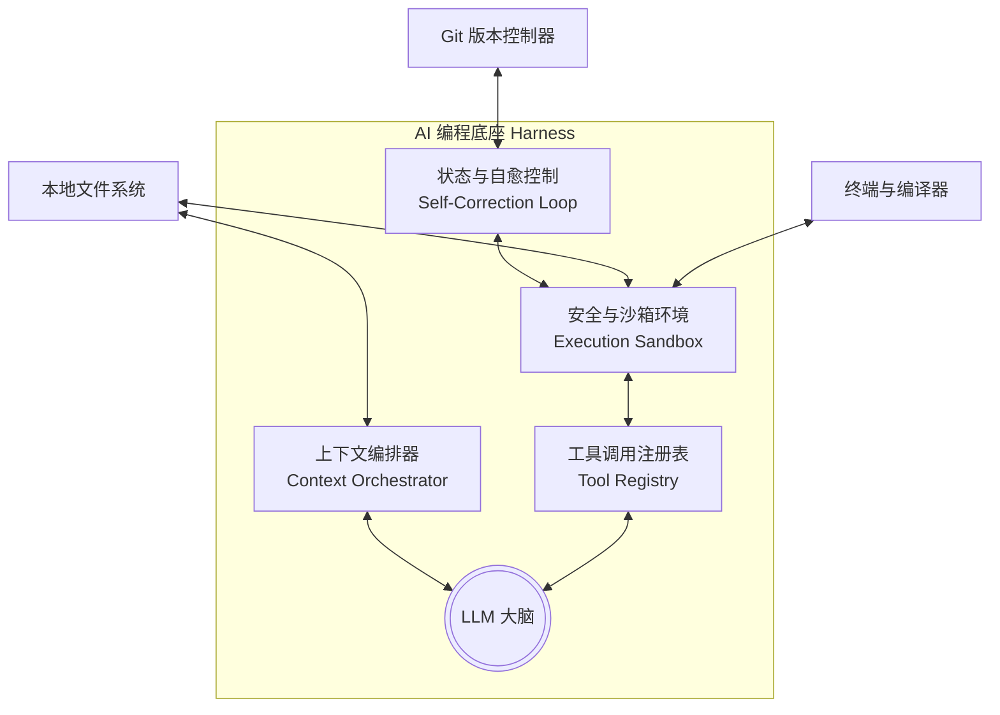

# 底座工程（Harness Engineering）

> 🧠 **“模型是流水的老兵，工具层的 Harness 才是铁打的营盘。”**

---

在探索大模型编程的过程中，很多开发者会产生一个美丽的误区：只要模型参数量足够大、智商足够高，它就能自动为我们写出完美的软件系统。然而，在真实的项目实践中，我们常常会发现，即使是最强的大模型，在直接面对复杂的本地代码库时，依然会手忙脚乱——它可能会无脑读入 50 个无关文件导致上下文撑爆，也可能会写出无法编译通过的语法错误，甚至在命令执行卡死时束手无策。

这背后的根本原因在于：**大模型本质上只是一个“缸中之脑”（Brain in a Vat）。**

它拥有极高水平的代码推理能力，但没有手脚，也没有眼睛。它不知道你的项目结构，无法运行你的编译器，更无法查看你的测试输出。

要让这颗“大脑”真正走入物理世界并成为高效的主力开发者，必须为它配置一套由软件工程环境、工具集和控制回路构成的“机械外骨骼”。这套外骨骼，在现代 AI Agent 架构中被称为 **Harness（底座）**。

而如何设计、优化、操控这套外骨骼的工程学，就是我们本章要探讨的核心课题——**底座工程（Harness Engineering）**。

---

## 一、 什么是 Harness Engineering？

**Harness Engineering（底座工程）** 关注的不是“模型本身如何训练”，而是**“如何为模型构建、管理和优化其实施行动的物理环境与上下文通道”**。

在传统编程时代，我们为测试编写 Test Harness（测试套件/测试底座）。在 AI 编程时代，Harness 则是包围大模型的整个“智能体运行容器”。它不仅封装了模型所能调用的所有原子工具（如读写文件、执行终端命令），还管理着对话历史的精简、上下文的召回、编译报错的回喂，以及代码版本的回滚。

底座工程做好了，哪怕是一个中等参数量的开源模型，也能在精准上下文与高可靠工具链的辅助下输出惊人的生产力；反之，如果底座漏洞百出（如缺乏代码语法树索引、工具调用经常超时报错），即使是闭源的顶级模型，也会迅速陷入逻辑漂移与幻觉爆仓的泥潭。

---

## 二、 底座工程的四大核心支柱

要构建或操控一个强大的编程底座，我们必须深度拆解并设计它的四大支柱：

### 1. 工具链工程 (Tool Engineering)

工具是 AI 作用于物理世界的唯一“手脚”。但如何定义和向大模型暴露工具，是一门精密的学问。

* **低精度工具的陷阱**：在早期，许多工具粗暴地向 AI 暴露一个通用的 `execute_bash` 工具，让 AI 自行在终端里输入 `cat`、`sed` 或 `grep` 来修改代码。这会导致极高的失败率，因为大模型极易写错正则表达式，或者在输出超长文件时发生截断。
* **高精度语义工具的崛起**：现代 Harness（如 Claude Code 或 Cursor 的底座）会向模型提供高内聚、高精度的专用语义工具。例如：
  - `view_file`：限制单次只读取指定行范围，防范上下文撑爆。
  - `replace_file_content`：只允许精确匹配某一段特定代码块进行替换，规避局部代码覆盖错误。
  - `grep_search` / `find_symbols`：通过底层 AST 语法树解析或 ripgrep 快速定位符号定义，避免漫无目的地漫游。

在 2026 年，**MCP 协议（Model Context Protocol）** 已经成为跨工具共享和暴露高精度工具的标准。底座工程的一项核心工作，就是通过编写自定义 MCP 服务，将团队内部的特定 API 契约、文档甚至测试系统一键“插拔式”接入 AI 工具中。

### 2. 沙箱与控制工程 (Sandbox & Control Engineering)

AI 编写完代码后，必须要在本地执行编译或跑通测试。然而，让大模型自主在你的电脑上运行终端命令是极具风险的（可能会误删文件或下载恶意脚本），同时也会面临进程卡死、无限循环等工程挑战。

* **环境隔离**：一个严谨的 Harness 会将 AI 的执行限制在隔离的沙箱（如 Docker 容器、独立的安全子进程，或者包含白名单命令的终端 Shell）中。
* **生命周期与状态控制**：大模型往往无法准确评估一个任务需要运行多久。如果它运行了一个死循环的测试，Harness 必须具备自动超时阻断（Timeout）、优雅退出并捕获 Standard Error (stderr) 的能力。

### 3. 上下文编排工程 (Context Orchestrator)

上下文编排是底座工程最昂贵、也最核心的部分。大模型的上下文窗口（Context Window）是极易受到污染的“贵重资产”。

* **AST 路由解析**：当 AI 提问“如何修改这个函数”时，Harness 会调用底层的 Tree-sitter 等工具分析 AST（抽象语法树），自动追溯该函数的上下游调用依赖，并在 AI 察觉之前将这些强相关的文件片段自动推入上下文，这被称为“精准 RAG 路由”。
* **KV 缓存友好设计 (Prompt Caching)**：如今的云端模型普遍支持提示词缓存。Harness 必须确保投喂给模型的上下文前缀（如 System Prompt、项目基本架构说明 `PRODUCT.md`）在多次对话中是**绝对静态一致**的。一旦前缀中被频繁注入了动态时间戳或随机的 Session 变量，缓存将彻底失效，导致 API 调用成本和响应延迟飙升 10 倍。

### 4. 自愈与回滚工程 (Self-Correction Loop)

“人非圣贤，孰能无错”，大模型写出 Bug 更是家常便饭。优秀的底座不会把错误的代码直接合入主干，而是设计了一条自动化自愈闭环：

1. **自动构建与测试**：Harness 在代码变动后自动调起终端，执行编译或单元测试。
2. **错误自愈 (Self-Correction)**：若编译失败或测试爆红，底座会自动截获错误日志和堆栈信息，将其格式化为高纯度的报错上下文，回喂给大模型重试。
3. **物理回滚 (Git Rollback)**：如果重试数次后依然无法通过，底座会直接调用 Git API 执行物理回滚（如 `git reset --hard HEAD`），退回到干净的初始状态，防止脏代码污染下一次的规划会话。

---

## 三、 实战：如何在日常开发中操控底座

作为日常开发者，你虽然不需要从零去用代码写一个类似 Claude Code 的底座框架，但你必须学会**操纵已有的底座（Harness Engineering on Hand）**，使其效能最大化：

### 1. 配置规则以锚定底座
利用根目录下的配置文件（如 `.cursorrules`、`CLAUDE.md` 或 `.antigravity/rules.json`），你可以向 Harness 的上下文编排器强行注入你的开发红线。
* **高性价比的规则**：定义构建命令（`npm run build`）、测试路径（`npm run test`）和架构约束。Harness 在执行每一步时，都会自动读取并遵守这些规则。

### 2. 巧用 Git 作为 Harness 的安全网
在把开发控制权交给 Agent 执行之前，务必确保你的 Git 树是干净的。当 Agent 执行发生漂移或产生难以调试的并发 Bug 时，不要尝试与它纠缠，利落地在终端运行 `git reset --hard` 回滚，清空它的长会话，重新提炼指令并开启一个干净的 Session。这便是最有效率的人类裁判纠偏手段。

### 3. MCP 扩展底座的行动半径
如果你的项目需要频繁与某个特定的内部系统（如公司的私有 API 接口文档、数据库查询平台）交互，可以尝试用 Node.js 或 Python 编写一个简单的 MCP Server，配置到你的工具中。瞬间，AI 就拥有了直接查询你内部系统的“新眼睛”与“新双手”，极大地省去了复制粘贴的工程损耗。
