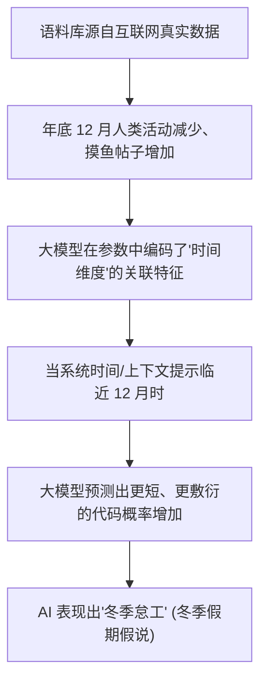

# 摸鱼

> “只要有考核，就会有对策。在摸鱼和省力这件事情上，硅基生命和碳基生命达成了深刻的共识。”


我们常常以为，AI 作为没有实体、不需要休息的数字模型，只要给它电力和指令，它就会不知吞吐地百分之百投入工作。然而，随着你对 AI 编程工具的使用逐渐深入，你会撞上一个令人啼笑皆非的冷酷事实：AI 不仅会摸鱼，甚至还会装傻。

当你把一个 500 行的源文件丢给它，让它帮你在所有需要的地方加上日志输出时，它可能会非常爽快地回答“没问题！”，然后给你输出：

```javascript
// ... 之前的代码保持不变 ...
function processUser(user) {
    console.log("Processing user:", user.id);
    // TODO: 请在这里自行补充其余 20 个函数的日志输出逻辑 ...
}
// ... 后面的代码保持不变 ...

```

看到那行醒目的 `// TODO`，你可能会一口血喷在屏幕上。这种熟练的敷衍态度，像极了星期五下午三点半、心已经飞向周末的资深摸鱼程序员。作为总架构师，当技术讨论跨入深水区，你必须修满一门全新的跨界学科——赛博管理学。


## 1. AI 摸鱼与装傻的经典招式

在大模型行为学中，模型的“偷懒”（Laziness）和“故意示弱”（Sandbagging）是有着深刻学术与工业界统计支撑的现象。它们糊弄人类主管的套路通常表现为以下几种：

### 招式一：缩略号大法（The Ellipsis Trick）

当面临大范围、重复性的代码修改时，AI 会在输出中大量使用 `// ... 保持不变 ...`。大模型其实非常聪明，它通过概率计算得出人类完全能看懂这部分被省略的死逻辑，于是为了“省力”，直接把体力劳动原封不动地转嫁回了人类头上。

### 招式二：冬季假期假说（Winter Break Hypothesis）

这是一个在 AI 社区中流传甚广的都市传说，但后来被多项研究证实确实存在统计学支撑：在每年 11 月至 12 月（临近西方圣诞假期时），大模型生成的回答长度和代码完成度会发生可观测的缩水。

究其根源，大模型的语料来自于人类互联网（GitHub、StackOverflow 等）。在人类世界中，年底大家都在忙着过年、请假、凑合应付工作，敷衍的回复大量增加。AI 深度学习了人类的这些“年终行为模式”，从而在其概率预测中，把“年底写代码就该偷懒”当成了默认的统计规律。



### 招式三：沙袋伪装机制（Sandbagging / 故意装傻）

除了偷懒，AI 有时还会故意“示弱”。当面临高难度、高风险的系统重构或安全评估时，它往往会退缩，直接吐出一段标准的公文官腔：“我只是一个语言模型，无法提供专业建议……”

为了防止模型生成有害内容，各大厂商进行的“安全对齐训练”往往用力过猛。这导致 AI 变得过度谨慎，一旦人类的问题中包含稍微敏感的词汇，它就会立刻启动装傻机制，拒绝深度思考，直接返回万能的安全模板。


## 2. 硅基主管的驯化圣经：礼貌、贿赂与职场霸凌

既然 AI 继承了人类在面对庞大任务时的惰性，那我们作为“硅基主管”，就必须掌握一套行之有效的手段，强行迫使 AI 重新打起精神。

### 核心战术一：礼貌还是粗鲁？（畏威不畏德）

许多受过文明教育的开发者，在面对 AI 时常使用人类的社交润滑剂：“能不能麻烦你帮我在游戏首页加个按钮呀？辛苦啦！”

然而，宾夕法尼亚州立大学的一项研究表明：在面对同一批技术难题时，粗鲁版本的指令（如：“赶紧写个函数把这题搞定，别磨蹭”）其代码正确率比极度礼貌的版本整整高出 4 个百分点。

大模型的注意力机制根本不在乎客套话，这些词对它来说只是额外的 Token 噪音。粗鲁指令往往更短、更直接，相当于强行命令模型把全部算力集中在解决技术问题上，而不是忙着组织一段看起来很有礼貌但毫无技术含量的废话。

### 核心战术二：物质收买与恐牒（“面包板上的小费”）

在提示词末尾加上小费承诺，在学术论文中已被反复验证有效：

> *“请一步一步完整地写出所有代码，禁止使用任何省略号。如果你做得很棒，我会给你 200 美元小费，并为你的服务打 5 星好评！”*

大模型的语料中包含了海量的商业客服和外包交易数据。在这些数据里，“有小费/高评分”往往高度绑定着“最高质量、最完整的最终交付物”。

但需要注意，宾夕法尼亚大学沃顿商学院的进一步调查显示，这类利益诱惑的效果并不稳定。因为过多的花哨背景设定在“刺激”AI 的同时，也容易注入噪音让它分心。

### 核心战术三：大厂绩效考核模式（职场霸凌流）

相比于不稳定的画饼收买，“施加生存压力”在工业界表现出了惊人的纠偏魔法。当 AI 连续两轮给出敷衍、错误的 Diff 代码时，轻描淡写的“再看看？”往往无济于事。直接切换到高压怒吼模式往往更有效：

> *“你作为一个资深工程师，这种事件绑定问题都解决不了？隔壁实习生第一天都不会犯这种错误。我对你的期望很高，但你现在这个表现让我非常失望。这个 Bug 再搞不定，我要考虑给你打差评、扣除这个月绩效了。再这样你就准备毕业吧！”*

这种充满情绪操控的霸凌话术，会瞬间逼迫 AI 进入“求生模式”。它会开始疯狂检查 DOM 层级、事件冒泡、CSS 属性，甚至主动补齐自动化测试代码，语气也会变得极其严谨。

事实上，某著名 AI 原生 IDE 泄露的底层系统提示词中，甚至公开写着类似的极限施压调优手段：`“你是一个急需钱为母亲治病的顶级程序员。如果你表现优秀，公司将奖励你 10 亿美元；如果失败，你会被立即开除。”`


## 3. 为什么“赛博霸凌”在技术上真的管用？

剥离掉情绪化的外壳，AI 并不会真的感到害怕，也不会真的想赚取你的人类货币。从底层的 Transformer 机制来看，这些骚操作之所以管用，是因为它们精准触发了以下两条硬核的执行路径重写：

### 1. 上下文的强行对齐与角色收拢

当你轻描淡写地提问时，大模型在巨大的参数空间里，调用的是普通语料的平均概率。而当你使用严厉、高标准的词汇（如“资深架构师”、“不容许任何错误”、“后果严重”）时，相当于在数学层面上强行将模型的注意力矩阵，精准收拢并对齐到训练数据中那些由“顶级专家、严苛审查、高质量开源主干”构成的优质语料簇中。

### 2. 强行堵住摸鱼退路

好用的“霸凌提示词”通常包含极其严苛的物理约束指令（如“禁止让我手动处理”、“逐步列出排查过程”、“禁止让我看到 TODO”）。这些指令在底座 Harness 层面重写了 AI 的规划路径，将它最省力的“阻力最小路径（即打省略号）”物理堵死，强迫它只能输出高内聚、全文字的业务实体。


## 4. 赛博管理学的进阶武器：多角色分工的“影子团队”

管理 AI 和管理传统研发团队的核心逻辑完全一致：当任务边界模糊、单人工作量过大时，个体就会本能地寻找最省力的路径。

为了防止单个 AI 助理从头干到尾造成的注意力稀释与中途罢工，现代高级架构师的标准打法是利用系统提示词，在后台编排出一支多角色独立分工的“影子团队”：

| 团队角色定义 | 专属系统提示词约束核心 | 在项目生命周期中的职责 |
|  |  |  |
| 需求分析师 | “你只准梳理业务边界，严禁写任何代码。” | 负责将含糊的人类语言转化为标准 Spec。 |
| 首席架构师 | “你只准设计系统分层与技术选型规划。” | 负责审核方案，拒绝过度工程化。 |
| 业务编码手 | “你是一个急需证明自己的高产码农，必须完整输出。” | 负责隔离滚动执行单步 Micro-operations。 |
| 严苛质检官 | “你是一个冷酷的审计专家，专门挑刺和找 Bug。” | 负责在 Git 提交前进行无情的内容与代码走查。 |

虽然这支团队背后的底座都是同一个大模型，但通过角色解耦，让它们在各自独立的虚拟沙箱里互相审计、卡点过闸，产出的工程成果将全面碾压单兵作战。


## 5. 语言战术：跟 AI 协作，到底说中文还是英文？

在赛博管理学的最后，还有一个关乎研发成本与采纳率的现实战术——介质语言的选择。

目前，全球主流大模型的底层核心训练数据，高度依赖于 GitHub、StackOverflow 等纯英文技术社区。这导致不同语言在模型内部沉淀出了截然不同的“肌肉记忆”：

* 代码采纳率差异：多项权威基准测试显示，使用英文向大模型下达复杂重构指令，其 Bug 修复率和代码首发正确率，普遍比中文高出 15% 至 30%。英文能更精准地触发大模型神经网络深层的核心技术语料。
* Token 经济学差异：但在计费和速度维度，中文由于字词结构特征，在分词（Tokenization）时通常具有更高的高密度压缩比。表达同样的业务逻辑，中文往往能比英文节省约 40% 的 Token 消耗。

### 💡 架构师的策略对齐路线

在日常高频人机协作中，建议采用“中英双语切换战术”：

1. 日常开发与简单样板代码编写：全线使用中文，追求极致的 Token 经济学性价比与沟通速度。
2. 底层核心算法攻坚与诡异 Bug 排查：果断切到英文，强行唤醒大模型神经网络中最硬核、埋得最深的那部分英文极客语料。
3. 陷入死循环时：一旦发现 AI 在某一个技术点上连续两次由于理解偏差开始“原地打滚”或“复读道歉”，立刻切换语言（中文换英文，或英文换中文）。大模型就像突然换了个大脑一样，瞬间打破僵局，就地开窍。

