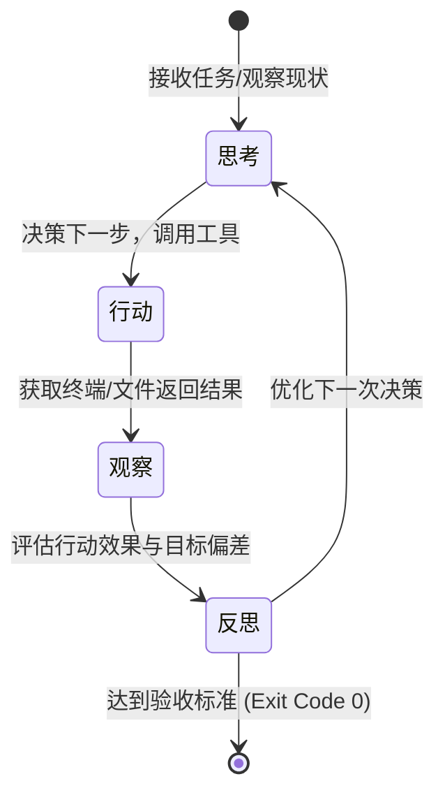

# 环路工程（Loop Engineering）

> 🔄 **“单次的推理只是瞬间的断面，持续的闭环才是滚滚向前的软件生命力。”**

---

在传统的“提示词时代”，人机协作通常是**开环（Open-Loop）**的：你向 AI 发送一段长长的 Prompt，AI 吐出几百行代码，对话便宣告结束。如果生成的代码有语法错误或接口对不上，你必须手动复制报错，重新开启新一轮的提问。这种方式的摩擦极高，效能极其低下。

到了 Agent 时代，AI 编程工具已经获得了执行代码和分析报错的“手脚”。人机协作从开环迈向了**闭环（Closed-Loop）**。

当你命令 AI “实现用户邮件摘要功能”时，底座（Harness）会开始让 AI 处于一个由“分析规格 -> 制定计划 -> 改写代码 -> 运行测试 -> 异常纠错”构成的自主循环中持续滚动，直到测试全部通过或触发终止阀门。

然而，设计这样一个循环并确保其高效、稳定、不跑偏，是一项极具挑战的系统工作：
* 如果循环设计得太盲目，大模型很容易在面对死锁或依赖缺失时陷入原地转圈的“无限死循环”，在短短几分钟内烧光上百美元的 Token。
* 如果循环缺乏边界控制，AI 可能会在重试中不断写出更多脏代码，形成越改越乱的“毁灭性塌缩”。

如何科学地设计、优化并操控大模型的执行与反馈循环，就是本章要探讨的**环路工程（Loop Engineering）**。

---

## 一、 环路工程的核心：ReAct 与自主反思

大模型运行的底层机制通常基于 **ReAct（Reasoning - Acting）** 或 **思考-行动-观察** 环路。

在环路工程中，单纯让 AI “闷头拉车”是不够的，必须引入**自主反思（Self-Reflection）与反省机制**：

* **防原地转圈判定**：当 AI 连续两次调用同一个工具（如运行同一个编译命令）且得到相同的报错时，环路控制器必须强制模型进入“反思模式”——暂停执行，分析为什么前两次的修改没有起效，拒绝进行第三次无脑重试。
* **回零清障机制**：如果 AI 连续改动了 5 次代码，测试依然在报相同的类型错误，说明初期的解题思路已经彻底跑偏。此时，优秀的环路设计会促使模型主动承认失败，拉起 Git 机制“一键回滚”到最初的干净状态，重新调整 Plan 再行出发。

---

## 二、 自愈与验证闭环 (Self-Healing Loop)

环路工程最迷人的实践，莫过于**自愈闭环（Auto-healing）**。它将“运行-报错-修复”的过程完全交由底座的自动化逻辑托管：

### 1. 结构化报错提取
当测试脚本运行爆红时，底座不应当把几千行的完整终端输出一股脑丢给模型。这不仅会严重稀释模型的注意力，还会浪费巨额的 Token。
优秀的底座会通过正则表达式或 AST 分析，精准捕获报错的“核心现场”（如具体的报错文件、行号、类型缺失声明以及 stacktrace 的核心几行），将其打包成高纯度的“纠错数字弹药”送回模型。

### 2. Exit Code 0 黄金法则
自愈闭环的退出机制非常单纯，即 **Exit Code 0（零退出码）**。
无论是类型检查（`tsc`）、代码风格校验（`eslint`），还是单元测试（`vitest`），只有当底座运行这些命令的退出码为 `0` 时，当前的自愈环路才允许合拢，并自动执行 Git Commit 封版。只要退出码不为 `0`，自愈环路就必须处于警戒状态，继续滚动纠偏，严禁把脏代码带入下一个环节。

---

## 三、 人类在环 (Human-in-the-Loop, HITL)

在 2026 年，虽然 Agent 已经能够实现高度的自主循环，但完全脱离人类监管的“全自动驾驶”在商业级项目中依然是极其危险的。

**环路工程最关键的防线，在于“人类在环（Human-in-the-Loop）”的闸门设计。**

我们必须在 AI 的自主循环中，精挑细选地嵌入以下三个“人类架构师卡点”（Gatekeeping）：

| 环路阶段 | 自动运行部分 | 人类卡点审查 (Checklist) | 拒绝/退回红线 |
| :--- | :--- | :--- | :--- |
| **P (Planning)** | AI 探索代码库，生成结构化实施步骤与依赖标注。 | 审查计划是否合理？是否引入了多余依赖？是否破坏了已有架构？ | 步骤含糊、步骤大包大揽、修改范围过宽。 |
| **E (Execution)** | AI 按小步滚动修改代码，本地运行编译检查。 | Review 提交的 `Git Diff`。代码质量是否合格？是否有脑补的安全漏洞？ | 出现冗余垃圾代码、AI 越权修改无关文件。 |
| **T (Testing)** | AI 自动运行单元测试与 Lint 校验，自愈低级语法错。 | 审查测试用例本身的覆盖率是否完整？测试逻辑是否存在“作弊”？ | 测试用例被 AI 擅自改动以“应试”通过。 |

通过这三道人类闸门，我们将大模型的执行环路框定在了一条安全的轨道上。AI 负责高频、枯燥的代码编写与自愈纠偏，人类则负责在宏观的 Plan 和微观的 Git Diff Review 阶段担任冷酷的裁判。这种“有监督的执行”，才是当前人机结对效能最高、最安全的协作姿态。

---

## 四、 开发者如何优化自己的执行环路

在日常使用 Cursor、Claude Code 或 Windsurf 时，你可以通过以下实战手段对你与 AI 的交互环路进行优化：

1. **强行锁定版本安全网**：在启动任何复杂的多步修改前，一定要在 Git 中留下一条干净的 Commit。一旦 AI 在自主执行中陷入死循环或者开始胡乱改动文件，果断打断会话，运行 `git reset --hard HEAD`。重置物理环境，是打断崩坏循环的最快方法。
2. **拒绝盲目打补丁**：当 AI 修改代码出错后尝试给你第二版、第三版补丁时，如果发现第二版补丁引入了新的错误，**千万不要继续往下补**。这会让对话历史里塞满错误的试错垃圾信息。正确的做法是：直接回滚代码，删除这一段错误的对话历史（或者新开一个干净的 Chat），用更精准的上下文重新投喂。
3. **保持测试脚本的敏锐度**：为你的项目配置极其迅速的单体测试运行器。测试反馈周期越短，AI 的纠错环路滚动就越快，首个正确版本的诞生时间也会越短。
