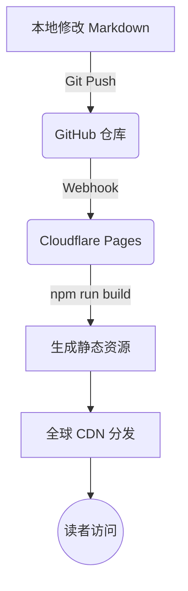

# 制作电子书

> 文字是思想的载体，而 AI 是从思想到成书的通道。

前面几章讲了提示词工程、上下文管理和小步迭代。想让方法落地，最直接的方式就是做一个微型项目通关演练。

做一本开源、现代、可交互的“活电子书”，就是很好的练兵场。它既是创作，也是完整的软件工程实践：前端静态框架、目录与侧边栏规约、Markdown/MDX 排版、组件化微交互、Git 版本控制，以及零成本的 CI/CD。

你现在读到的这本书，就是用这套“人机协同创作流”搭起来并持续迭代的。

下面我会从零开始，用爽文小说作示例，走完规划、制作、发布、运营的全流程。笔者自己从来没读过爽文，但 AI 读过，所以完全可以利用 AI 补齐认知盲区。

## 阶段一：规划

传统写作最容易卡在冷启动。空白文档面前，连大纲都反复涂改。

AI 时代可以用“逆向探针”和“角色扮演”，在几分钟内梳理出结构清晰的知识树。

### 1. 提炼愿景与读者

先把定位写清楚，再让 AI 润色。以本书示例小说为例：

定位：一部关于“叙事规则如何塑造选择”的实验长篇。主角在不断切换的规则里成长，最终从被规则摆布的玩家变成重写规则的作者。

核心命题：
- 当世界观像游戏版本一样热更新，自由意志还有多少可操作空间
- 身份、立场、记忆都被切换时，亲密关系靠什么成立
- 底层求生者用系统思维拆解玄学命运，能拆到哪一步

目标读者：18-35 岁，长期看无限流、规则怪谈、强设定网文的人

把以上内容丢给 AI，让它改写成更凝练的版本，供后续复用。


标题和立意越新颖独特，越出人意料，就越容易吸引人。我之前在网上看过一个小说，的章节标题，就比较有吸引力：“刘姥姥之- 宝玉少爷爱上我； 贾老爷爱上我； 皇上爱上我； 三体人爱上我；变形金刚爱上我；等等... ” 当然，这样太哗众取宠也有负作用，就是很多人只会对标题有兴趣，对里面内容反而不感兴趣。

### 2. 逆向提问拿架构

不要直接要目录。先让 AI 回答：要达成目标，需要哪些核心概念和模块。这样能避开知识盲区。

提示词示例：

```text
# Role
你是一位资深图书架构师和类型小说策划人，擅长长篇网文的世界观搭建、节奏控制和多线融合。

# Context
书名：《消失的终点》
一句话定位：一部关于“叙事规则如何塑造选择”的实验长篇。主角在不断切换的规则里成长，最终从被规则摆布的玩家变成重写规则的作者。
核心命题： 
- 世界观像游戏一样热更新，自由意志的可操作空间
- 身份与记忆切换下的亲密关系成立条件
- 底层求生者用系统思维拆解玄学命运的边界

类型：都市爽文 + 玄幻科幻 + 穿越 + 游戏入侵 + 克苏鲁 + 架空历史官场 + 甜宠 + 双男主 + 悬疑惊悚
核心设定：主角是都市底层外卖骑手，因异常订单进入不同规则的历史/平行世界。前期只呈现现象，不解释规则。
目标读者：18-35 岁，长期看无限流、规则怪谈、强设定网文的人
篇幅预期：30 章，5 幕结构

# Task
请生成完整图书架构，包含 6 个模块：

1. 世界观骨架
   - 核心法则与运行逻辑
   - 11 种法则的名称、触发条件、表现形式、限制
   - 城市地图与关键区域

2. 人物架构
   - 主角、羁绊对象、主要配角小传
   - 关系网与冲突点
   - 成长弧线分阶段目标

3. 故事主线
   - 一句话 logline
   - 五幕结构，每幕核心冲突与情感推进

4. 章节节奏
   - 全书章纲总表，每 2-3 章切换一次法则
   - 每章标注：主导法则、核心事件、钩子、切换引子

5. 悬念与伏笔管理
   - 前期 10 个关键悬念
   - 回收章节与方式

6. 商业化包装
   - 50 字简介、200 字简介
   - 3 个宣传语
   - 封面氛围建议

输出要求：结构清晰，标题分层，章纲用表格，语言简洁可直接写作。
```

AI 会输出大段架构。通读一遍，删改不合理处，保留定稿，交给下一步。

### 3. 生成单章架构

有了骨架，再细化到章。

提示词示例：

```text
# Role
你是资深网文编辑，擅长起爆款章标题和拆解单章节奏。

# Context
*** 粘贴上一步定稿的架构 ***

# Task
为每一章生成：
1. 章标题
   - 3 个备选，6-12 字，带悬念或冲突感，避免剧透法则名
   - 标注情绪标签：悬疑 / 爽感 / 情感

2. 单章架构
   - 本章定位
   - 主导法则
   - 场景：人物、时间、地点、氛围
   - 目标：主角本章要达成什么
   - 阻碍：外部阻力与内部阻力
   - 关键事件：3-5 个，按起承转合排
   - 高潮点
   - 钩子
   - 道具/伏笔

输出格式用表格或分点，简洁可直接写作。
```

到这里，小说的骨架就立住了。

## 阶段二：制作

工具选型决定维护成本。AI 能直接写，但用成熟工具更省心。

Docsify 之类上手快，对 SEO 不友好。我们选 **Docusaurus**，麻烦一点，但搜索友好、可扩展。

### Markdown 是通用语

做书之前先统一格式。Word 是所见即所得，Markdown 是所写即所得。

```markdown
# 第一章 消失的订单
## 主角登场
**重要内容**
> 这是一段引用
```

Markdown 的哲学是专注内容而非排版。对 AI 友好，对 Git 友好，对 Docusaurus 友好，对搜索引擎也友好。技术博客、开源文档、电子书，背后基本都是 Markdown。

### 1. 为什么选 Docusaurus

- **React 驱动**：支持 MDX，可在 Markdown 里直接嵌入交互式 React 组件，让书“动”起来
- **极速首屏与 SEO**：SSG 预编译静态 HTML，加载快，易抓取
- **开箱即用**：精致排版、面包屑、侧边栏折叠、全局搜索接口、完善的暗黑模式

### 2. 初始化工程

在 AI 编程助手中下指令：

```text
请用 Docusaurus v3 创建一个文档站项目。

要求：
- 项目名：Vanish
- 使用 TypeScript
- 包管理器：pnpm
- 首页显示 “消失的终点”
- 只保留默认 docs 目录
- 默认语言中文
- 输出启动与构建命令
```

生成后让 AI 删除示例文档，清理干净。

再把 `sidebars.js` 和定稿的章纲一起给 AI：

```text
根据以下章节标题与提要：
1. 修改 `sidebars.js`
2. 在 `/docs` 下按章节号创建 `.md` 文件
3. 为每章生成完整正文，单章约一万字

*** 粘贴定稿章纲 ***
```

长文生成耗时较长，分批执行更稳。

### 3. 建立项目知识库

写长了，AI 会忘。解决办法是给作品建一本“创作圣经”。

```
knowledge/
├── world.md
├── characters.md
├── timeline.md
├── factions.md
├── rules.md
└── mysteries.md
```

示例：

`world.md`
```markdown
世界名称：终点系统
核心法则：现实会被叙事规则覆盖
已公开法则：订单法则、镜像法则、记忆法则...
```

`characters.md`
```markdown
林深
年龄：25
职业：外卖骑手
性格：谨慎、理性、求生欲强
当前能力：规则感知 Lv2
重要关系：沈昼
```

`mysteries.md`
```markdown
伏笔001：神秘订单来源
出现：第1章
预计回收：第22章
```

每次写新章，都把这些文件一起作为上下文投喂。相当于给 AI 外置记忆。

很多人觉得 AI 写长篇不靠谱，不是模型不行，是缺少项目级知识管理。写代码要维护文档，写长篇也要。

### 4. 不要一次写完整本

新手常写：

```text
请根据大纲生成完整小说。
```

能跑，但效果通常很差。大模型没有真正的长期记忆，几十万字后容易出现：

- 重要设定被遗忘
- 已死亡角色复活
- 能力获得后不再使用
- 人物性格前后割裂

更稳的工作流：

```
世界观 → 人物设定 → 章节大纲 → 逐章写作 → 修改 → 下一章
```

把 AI 当协作者，而非自动印刷机。长篇的关键是长期一致性，不是生成速度。

### 5. 人机协同审校

初稿往往粗糙。用一套“全书体检”提示词扫一遍：

```text
# Role
你是资深网文主编 + 文字润色师，专精长篇节奏、逻辑自洽和爽感优化。

# Context
书名：《消失的终点》
全文字数：约 XX 万字，共 30 章
类型：都市爽文 + 玄幻科幻 + 穿越 + 游戏入侵 + 克苏鲁 + 架空历史官场 + 甜宠 + 双男主 + 悬疑惊悚
核心要求：现象先行解释后置，每 2-3 章切换法则，结尾必留钩子

# Task
按清单审校并给出可直接替换的段落：

1. 结构与节奏
   - 章节长度是否均匀
   - 每章是否完成起承转合，钩子是否有效
   - 法则切换是否自然
   - 爽点密度是否达标

2. 世界观与设定
   - 法则前后一致
   - 道具、能力、地名无矛盾
   - 解释后置是否成功

3. 人物
   - 主角动机贯穿，成长弧清晰
   - 多身份人物前后统一
   - 对话符合人设，无 OOC
   - 配角非工具人

4. 逻辑与情节
   - 因果链完整，无机械降神
   - 时间线与移动合理
   - 伏笔埋设并回收，列出未回收清单

5. 语言与风格
   - 删赘词与重复描写
   - 统一第三人称有限视角
   - 增强画面感与动作感

6. 爽文要素
   - 打脸、逆袭、揭秘力度
   - 信息差被主角有效利用
   - 代入感未被打断
```

也可以分项逐条处理。

真正有价值的书，一定要加入作者自己的东西。AI 给模板，人给灵魂。

- 人脑输出：踩坑经历、核心金句、粗糙但真实的观点手记
- AI 负责：扩写、润色、排版、配图与代码高亮

这样速度快，专业感也到位。

## 阶段三：发布

写完要让读者无障碍访问。传统建站要买 VPS、配 Nginx、申请 SSL。现代做法是 GitHub + Cloudflare Pages，全自动 CI/CD，零成本。

### 架构



### 三步部署

**1. 推到 GitHub**
```bash
git init
git add .
git commit -m "Initialize my beautiful ebook"
git branch -M main
git remote add origin https://github.com/你的用户名/cocode.git
git push -u origin main
```

**2. 连接 Cloudflare Pages**
登录 Cloudflare，Workers 和 Pages → 创建应用程序 → Pages → 连接到 Git → 选 `cocode` 仓库。

**3. 配置构建**
框架预设选 Docusaurus：
- Build command：`npm run build`
- Output directory：`build`

保存并部署。平台会自动分配带 SSL 的二级域名，如 `cocode.pages.dev`。从点击部署到全球上线，通常不到两分钟。

后续更新只需：
```bash
git add .
git commit -m "Fix typos"
git push
```
Cloudflare 通过 Webhook 自动重新构建。你只管写作，运维交给云端。

## 阶段四：从静态文本到活的软件

电子书在 Web 环境下是个活软件，可以持续增强。

**1. 绑定独立域名**
Cloudflare Pages 免费绑定顶级域名，附带全球 CDN 加速和防护，确立你的赛博门牌号。

**2. 接入 Giscus 评论**
基于 GitHub Discussions，无需自建数据库。读者用 GitHub 登录即可在章节下讨论，数据沉淀在仓库的 Discussions 里，自然形成学习社区。

**3. 数据监控**
接入 Umami 或 Google Analytics，观察访问量、来源国家、热门章节、停留时长。真实反馈是持续创作的燃料。

## 结语：从读者到数字资产创造者

这一章表面是做电子书，实际是在演练一种新的创作范式。

过去从想法到成书，需要策划、编辑、美工、排版、运维、发行多人协作。今天一个人加 AI，就能同时扮演这些角色。

你做的不仅是一本书，更是一个数字产品：有版本控制、自动部署、搜索流量、读者社区、持续迭代。

当书放进 Git 仓库，它就不再只是书，而是持续演化的软件项目。

AI 降低了技术门槛，但决定作品价值的始终是人的思想、经验与审美。技术放大表达，表达本身来自作者。

发布电子书不是终点，是你作为数字时代创作者的起点。

示例小说地址： https://vanish.qizhen.xyz/

