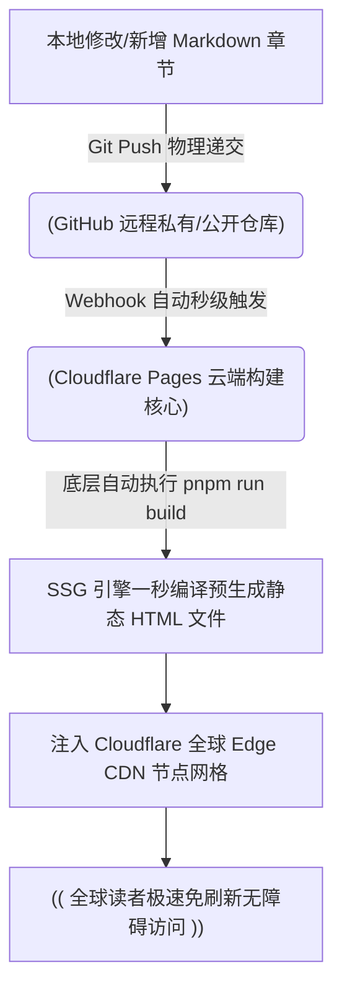

# 制作电子书

> 文字是思想的载体，而 AI 是从思想到成书的通道。

在前面的章节中，我们已经系统学习了提示词工程、上下文管理以及决定成败的 SPET 循环方法论（规格说明 -> 实施计划 -> 滚动执行 -> 持续验证）。然而，纸上得来终觉浅，想要让这些前沿的方法论真正内化为你的肌肉记忆，最有效的方式就是进行一场全栈微型项目的通关演练。

做一本开源、现代、可交互的“活电子书”，就是绝佳的兵器试验场。

在传统认知中，写一本书只是纯粹的文科创作；但在 AI 时代，打造一本数字电子书，本质上是一场精密的软件工程实践。它顺理成章地涵盖了前端静态框架选型、目录与侧边栏契约规约、Markdown/MDX 高级排版、组件化微交互、Git 版本控制，以及零成本的自动发布（CI/CD）流水线。甚至连你此刻正在读的这本书，也是利用这套“人机协同创作流”搭建并持续滚动迭代出来的。

本书正是使用该方法论搭建的，并且持续滚动迭代出来的。

为了让演练足够有趣且硬核，本章将以一部软科幻悬疑爽文小说《消散的终点》为例，带你借助 AI 的规划与执行火力，从零走完规划、制作、发布、到长期运营的全链条全景。


## 电子书工具的进化

在正式动笔规划之前，我们必须先解决工具选型的问题。许多创作者在构建数字化文本时，都曾走过一段极其痛苦的工具进化之路。为了让你少走弯路，我们有必要复盘一下技术演进的底层逻辑：

- 青铜时代：Notepad + 原生 HTML/JS
最原始的做法是直接在记事本里手写 HTML 页面，一页内容对应一个静态文件。然而，HTML 并不是为人类长文阅读而设计的，标签繁琐，一旦文章规模上去了，目录更新和全盘维护会迅速陷入灾难。
- 白银时代：客户端渲染 CSR 架构 （典型代表：Docsify）
为了摆脱 HTML 标签的折磨，时下流行将纯文本保存为机器与人类双向友好的 Markdown（.md） 格式。Docsify 应运而生，它的工作原理非常轻量：将服务器上的 Markdown 文档直接原装传递到读者的浏览器，然后通过 JavaScript 库在浏览器本地实时渲染成网页。
Docsify 让排版彻底解耦，加个搜索框、状态条只需在配置文件里写一行。但它存在一个让现代工业级数字资产无法忍受的致命缺陷：对搜索引擎（SEO）极度不友好。因为纯依赖客户端动态渲染（CSR），许多搜索引擎的爬虫（尤其是国内爬虫）很难高效地执行复杂的 JS 代码，导致它们抓取到的页面常常是一片空白，网站内容根本无法被有效收录。
- 黄金时代：静态站点生成 SSG 架构 （典型代表：Docusaurus）
为了彻底兼顾 Markdown 的维护便利性与极致的 SEO 收录率，我们最终将目光锁定在 Docusaurus。它采用先进的 React 驱动，核心哲学是在编译打包阶段（在本地或云端 CI/CD 环境），就提前将所有的 Markdown 文件全部预编译、渲染成标准的静态 HTML 网页文件。

### 电子书工具技术矩阵对比

| 评估维度 | 记事本原生 HTML | Docsify (CSR) | Docusaurus (SSG) |
| --- | --- | --- | --- |
| 写作介质 | 繁琐的 HTML 标签 | 纯净的 Markdown | 灵活的 Markdown / MDX |
| SEO 抓取友好度 | 极高（原生静态） | 极差（依赖客户端 JS 执行） | 极高（服务端编译预生成） |
| 开箱即用高级功能 | 零（需全部手写 JS） | 高（插件生态丰富） | 顶级（内置全局搜索、暗黑模式等） |
| 技术门槛 | 基础且繁琐 | 极低（无需配置编译） | 中等（多了一步 build 构建） |
| AI 结对降低门槛 | 能够帮助自动生成 HTML | 能够加速配置 | 降维打击（AI 替你抹平 React 与配置鸿沟） |

过去，使用 Docusaurus 需要 React、TypeScript 以及 Webpack 的底层知识，使用者几乎全是程序员；而现在，有了 AI 编程工具，即使没有任何编程背景的文史艺术创作者，也能够完美驾驭这艘高配置的数字母舰。


## 阶段一：高屋建瓴的战术规划（S & P 阶段）

传统写作最容易卡在冷启动。面对一张冰冷的空白文档，人类的大纲往往在涂涂改改中耗尽了最初的热情。而本章要实践的秘诀，是利用上一章学到的 “逆向探针” 策略，在写下第一个字之前，强制让 AI 帮我们推演完备的技术与内容图纸。

### 1. 提炼项目规格书（Specification）

首先，人类作为总导演，必须给项目定下清晰的愿景。我们将小说的立意与定位整理成结构化的 Spec 输入：

```markdown
 《消散的终点》功能规格大纲
 * 一句话定位：一部关于“叙事规则如何塑造选择”的实验网文长篇。主角在不断切换的规则里成长，最终从被规则摆布的玩家变成重写规则的作者。
 * 核心命题：
    1. 当世界观像游戏版本一样被热更新，自由意志还有多少可操作空间？
    2. 身份、立场、记忆都被彻底清洗切换时，亲密关系靠什么成立？
    3. 底层求生者用系统思维拆解玄学命运，能拆到哪一步？
 * 目标读者：18-35 岁，长期阅读无限流、规则怪谈、强设定技术型网文的受众。
 * 类型元素：都市爽文 + 穿越 + 游戏入侵 + 克苏鲁 + 悬疑惊悚。
``` 

在标题和立意上，越是具有强烈的冲突感和反常识悬念，就越容易引人入胜。你可以天马行空，因为 AI 拥有全网语料的概率感知力，它能瞬间帮你补齐不曾涉足的行业认知盲区。

### 2. 逆向提问获取全局架构

不要直接让 AI 盲目为你写目录，那会引入泛化的“概率平均值垃圾”。我们使用高级角色扮演，让 AI 充当图书架构师，对我们的 Spec 进行逆向深度推演。

#### 🚀 战术提示词范本：

```text
# Role
你是一位顶级图书架构师与类型小说总策划，专精于长篇网文的世界观搭建、全书节奏控制与多线冲突融合。

# Context
书名：《消散的终点》
一句话定位：一部关于“叙事规则如何塑造选择”的实验长篇。主角在不断切换的规则里成长，最终从被规则摆摆布的玩家变成重写规则的作者。
类型：都市爽文 + 玄幻科幻 + 穿越 + 游戏入侵 + 克苏鲁 + 悬疑惊悚
核心设定：主角是都市底层外卖骑手，因收到异常订单频繁被迫进入不同规则的历史/平行世界。前期只呈现诡异现象，不解释底层规则。
篇幅预期：30 章，标准五幕工程结构。

# Task
在不写正文的前提下，请为我制定一份完整的、可直接作为上下文工程基建的数字资产架构，必须包含以下 6 个核心模块：
1. 世界观骨架：核心运行逻辑、11 种核心法则的触发条件与限制、关键城市地图区域。
2. 人物架构小传：主角、核心羁绊对象、主要配角小传，成长弧线分阶段目标。
3. 故事主线演进：一句话 Logline，五幕结构的每幕核心冲突与情感里程碑。
4. 章节节奏总表：用 Markdown 表格输出 30 章章纲总表，每 2-3 章切换一次主导法则，标注核心事件与结尾钩子。
5. 悬念与伏笔字典：列出前期埋设的 10 个关键悬念，并指定对应的回收章节。
6. 商业包装：50字/200字简介、3 个吸睛宣传语。

```

通读 AI 吐出的宏观设计图纸，删除不合逻辑的机械降神，保留最终定稿。这份定稿，就是我们接下来上下文工程中不可或缺的长期记忆库。

### 3. 精细化拆解单章实施计划（Plan）

有了宏观骨架后，我们进一步要求 AI 为具体章节制定微观技术实施计划，将其拆解到可以闭环执行的细粒度。

```text
# Role
你是资深网文主编，擅长拆解单章起承转合节奏，严防叙事脱轨。

# Context
* 粘贴上一步定稿的 30 章全局架构总表 *

# Task
请针对“第一幕·第一章：消失的订单”生成精细化单章实施计划，包含以下要素：
1. 爆款章标题（给出 3 个带有强烈情绪张力和悬念的备选，6-12字）。
2. 本章核心主导法则、时空场景、主角的本章阶段性目标。
3. 情节阻碍（外部阻力与内部认知冲突）。
4. 3-5 个关键核心事件节点（严格按起、承、转、合顺序编排，并指定埋设的特定道具或伏笔）。
5. 结尾必留的引子钩子（Hook）。

```

通过这套精密规划，小说的每一章都变成了有技术规范可循的“独立开发模块”。


## 阶段二：工业级敏捷制作（Execution & Testing 阶段）

有了战术图纸后，我们进入真正的 Execution 滚动执行阶段。在这个阶段，我们将见证大模型与 Docusaurus 静态框架如何产生奇妙的化学反应。

### 1. 利用编程代理初始化工程

在你的 AI 原生 IDE（如 Cursor）或终端工具（如 Claude Code）中，直接下达极其具体、可验证的指令，让 AI 替你料理好 Docusaurus 复杂的底层初始化代码：

```text
请使用 pnpm 包管理器创建一套标准的 Docusaurus v3 文档站工程。

要求：
- 项目命名为：Vanish
- 全线启用 TypeScript 语言契约
- 默认语言设置为中文，首页核心标题渲染为 “消散的终点”
- 彻底清理干净默认的示例文档，仅保留一个高净值的纯净 `/docs` 目录结构
- 在当前终端输出本地开发预览命令与生产环境静态构建（build）命令

```

### 2. 建立项目长期记忆基础设施（Knowledge Base）

写长文和写大型软件完全一样：大模型根本没有真正的长期记忆，如果缺乏严苛的上下文控制，几十万字后，AI 必然会发生重大降智（比如重要设定被无声遗忘、已死亡角色离奇复活、主角性格前后割裂、前期伏笔沦为死结）。

对抗上下文腐烂（Context Rot）的工业级标准打法，是在项目中同步建立一套面向机器阅读的 Markdown 知识库基础设施：

```
Vanish/
├── docs/               # 存放实际出版的章节 HTML/MD 文件
└── knowledge/          # 核心上下文仓库（对人类和 AI 共同可见的长期记忆）
    ├── world.md        # 终点系统的核心法则、世界观设定字典
    ├── characters.md   # 肖山、沈策等主角人物的阶梯能力、动态人设小传
    ├── timeline.md     # 宏观历史线与剧情推进沙盒
    └── mysteries.md    # 挂起的伏笔字典（包含埋设章与预计回收章对照表）

```

当你想让 AI 协作编写第 9 章时，绝对不要盲目高呼“帮我写下一章”，而是利落地利用工具的上下文抓取机制，完成富上下文（Rich Context）的精准闭环投喂：

* 在 Cursor 中：在 Chat 窗口中输入：`“请帮我执行第 9 章的编写。当前核心上下文参考：@world.md 、@characters.md 、@mysteries.md 以及前一章最新的静态文件 @chapter08.md 。务必严格遵守设定，更新并回收 mysteries.md 中的第 3 号伏笔。”`
* 在 Claude Code 中：利用其自主的 Tool Calling 探索特性，直接在终端敲击：`claude "编写第 9 章正文。你自己去 knowledge/ 目录下搜寻核心法则和伏笔记录，写完后自动更新 mysteries.md 字典状态。"`
* 在 Google Antigravity 中：将整个 `knowledge/` 文件夹拖入侧边栏的 “Context Pin” 区域，确立全局常驻缓存，随后在内联对话框中直接对 AI 下达滚动执行指令。

> 💡 架构师共鸣
> 很多人觉得用 AI 进行长篇长周期创作不可靠，其实往往不是模型能力不够，而是因为人类没有做好项目级的知识管理。写复杂代码需要精心维护说明文档和类型契约，驱使 AI 进行长周期数字资产创作，也同样需要铁打的知识库。


```


## 阶段三：自动化全球分发（Publish 阶段）

当电子书通过了我们的审校测试，变成了本地高质量的静态文件后，我们如何让全球读者无障碍访问？

传统做法需要你购买昂贵的虚拟服务器（VPS）、折腾复杂的 Nginx 代理、申请麻烦的 SSL 证书。而现代的、面向未来的标准做法是利用 GitHub + Cloudflare Pages 搭建一套全自动的 CI/CD 发布流水线。你将实现零服务器成本、全球全自动分发部署。

### 3.1 数字化资产发布架构图



### 3.2 黄金三步部署指南

#### 第一步：在本地终端将资产推向 GitHub

在你的本地项目根目录下调起 Shell，利落地敲下 Git 存档圣谕：

```bash
git init
git add .
git commit -m "feat: init my beautiful anachron novel project"
git branch -M main
git remote add origin https://github.com/你的用户名/vanish-book.git
git push -u origin main

```

#### 第二步：在 Cloudflare Pages 中进行托管绑定

登录 Cloudflare 控制台，进入 Workers 和 Pages -> 创建应用程序 -> Pages -> 连接到 Git 账户，在列表中精准勾选你刚刚创建的 `vanish-book` 仓库。

#### 第三步：对齐构建环境规格

在预设的框架列表（Framework Preset）中，直接大方地勾选 Docusaurus，系统会自动为你填充好所有底层的发布契约：

* 构建命令（Build command）：`pnpm run build`（或者 `npm run build`）
* 输出目录（Output directory）：`build`

点击“保存并部署”。Cloudflare 就会在云端为你向外拉起一台隔离的沙盒机器，自动拉取代码、自动执行静态站点生成。在不到两分钟的时间内，你就会获得一个全球自带安全 SSL 证书的专有二级域名（如 `vanish.pages.dev`）。

从这一秒起，你的日常维护工作流将变得优雅到极致：你只需要专注于在本地使用 Markdown 持续写作。每写完一章，只需在终端敲下 `git push`，云端流水线会自动重新感知、全量编译、静默发布。你只管思想的创作，运维与分发彻底交给高耸的云端基础设施。


## 阶段四：活体数字产品的长期增效（Evolution 阶段）

当你的电子书顺利跑在 Web 环境下时，它就彻底告别了传统“死寂”的纸质文本，变成了一个不断自我演化、具备完整软件生命周期的活体资产。你可以利用前端生态，持续对它进行升维加固：

1. 确立赛博门牌号（独立域名绑定）：Cloudflare Pages 允许你免费绑定你购买的顶级独立域名（如 `vanish.qizhen.xyz`），并在其高居天幕的全球 CDN 边缘节点上为你自动套上高防盾牌与缓存镜像。
2. 接入 Giscus 评论系统（去中心化社区）：这是一种极其性感的评论流实现方式。它完全基于 GitHub Discussions 的开源接口，不需要你自建任何后端的数据库。读者只需用自己的 GitHub 账号登录，就能直接在任意章节的底部发起逐行级别的技术或剧情讨论，而所有的讨论数据都会清爽地沉淀在你的 GitHub 仓库中，自然而然地为你催生出一个高粘性的极客读者社区。
3. 数据感知雷达（Umami / GA 监控）：在 Docusaurus 的配置文件中，让 AI 替你无缝接入 Umami 等极简、尊重隐私的开源数据监控插件。你能通过图形化看板直观地捕捉到全球访问量的动态脉搏、读者的主要来源国家、哪些章节的停留时长最高（意味着伏笔极其成功）。这种来自物理世界的真实反馈，将成为你持续结对创作最强大的精神燃料。


## 本章小结

本章的表面是在教你如何制作并发布一本精美的小说电子书，但其底层的真实意图，是在带你亲手演练一套全新的数字化资产创造范式。

在过去，从一个灵感的诞生到最终的成品出版上线，中间横亘着策划、编辑、美工、排版、运维、发行等多重沉重的社会分工壁垒。而在今天，当高认知属性的大模型与拥有极佳 Harness 工具层的现代 AI 编程工具完美结对时，你一个人、加上一套清晰的 SPET 战术地图，就能够同时高效地扮演上述所有的角色。

当你的作品被放进 Git 仓库、在云端流水线上自动化翻滚的那一刻，它就不再仅仅是一本冷冰冰的电子书，而是一个拥有版本控制、自动部署、搜索流量自导向、读者社区双向互动的软件项目。

AI 确实大范围地抹平了底层的编码技能鸿沟，但请你永远记住：决定一套数字产品最终能走多远、拥有多高价值的，永远是屏幕前人类作者那不可被概率平均值替代的思想、经验、阅历与独特的审美。 AI 放大你的表达，而表达的灵魂来自你本身。

