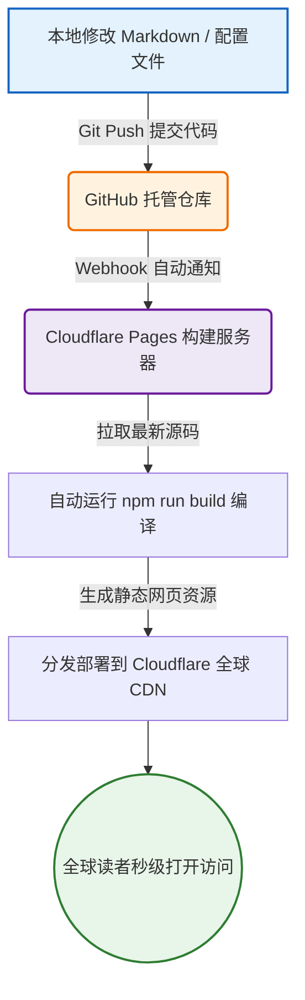

# 发布一本电子书

> 文字是思想的载体，而 AI 是从思想到成书的通道。


在前面几章中，我们探讨了提示词工程、上下文管理、以及小步迭代的开发心智。为了让这些方法论落到实处，最好的办法就是通过一个综合的“微型项目”进行通关演练。

而制作并发布一本开源电子书，就是这样一个完美的练兵场。

制作一本现代、美观、可交互的“活的电子书”，不仅是文学创作，也是一次极佳的软件工程全生命周期实战。它不仅包含了前端静态框架（如 Docusaurus）、目录与侧边栏配置（JSON/JavaScript 规约）、静态内容排版（Markdown & MDX）、微交互与组件化设计，更涵盖了代码版本控制（GitHub）以及零成本的自动化持续集成/持续部署（CI/CD）流水线。

事实上，你当前正在阅读的本书，就是通过这一套完整的“人机协同创作流”规划、搭建并发布上线的。

下面，我将从零开始，写一本爽文小说，然后发布运营。笔者自己从来没读过任何爽文小说，但 AI 可以弥补我们的认知缺陷。

## 阶段一：规划（Planning）

在传统的创作中，写作者最容易被“冷启动”击败。看着一张空白的屏幕，你往往不知道从何落笔，甚至连大纲都反复涂改、难以定案。

在 AI 时代，我们可以利用大模型的全知属性，通过**“逆向探针”**和**“角色扮演”**，在几分钟内协同梳理出逻辑严密、结构完整的知识树。

### 1. 提炼核心愿景与读者定位
首先，明确你想写一本什么样的书。以本书为例，我们小说的定位是：

> 一部关于“叙事规则如何塑造人的选择”的实验长篇。主角在不断切换的规则里成长，最终从被规则摆布的玩家变成重写规则的作者。

> 书中想要探讨的命题包括：
> - 当世界观可以像游戏版本一样热更新，人还剩下多少自由意志
> - 亲密关系在不同身份、不同立场下是否还能成立
> - 底层求生者如何用系统思维拆解看似玄学的命运

> 目标读者：18-35 岁，长期看无限流、规则怪谈、强设定网文的人

帮上面的这些内容发送给 AI，让 AI 修改一下，以备后续使用。

### 2. 逆向提问获取图书架狗

我们不需要直接让 AI 给一个目录，而是先让它分析：**要达到这个目的，需要掌握哪些核心概念？** 这样可以避免遗漏关键的知识盲区。

你可以使用类似的提示词，加入刚才 AI 改进后的：

```text
# Role
你是一位资深图书架构师和类型小说策划人，擅长长篇网文的世界观搭建、节奏控制和多线融合。

# Context
书名：《消失的终点》
一句话定位：一部关于“叙事规则如何塑造人的选择”的实验长篇。主角在不断切换的规则里成长，最终从被规则摆布的玩家变成重写规则的作者。
核心命题： 
- 当世界观像游戏一样随时热更新，人的自由意志还剩多少可操作空间
- 身份、立场、记忆都被切换时，亲密关系靠什么成立
- 底层求生者用系统思维拆解玄学命运，能拆到哪一步

类型：都市爽文 + 玄幻科幻 + 穿越 + 游戏入侵 + 克苏鲁 + 架空历史官场 + 甜宠 + 双男主 + 悬疑惊悚
核心设定：主角是都市底层外卖骑手，因一些神奇的订单进入了不同规则的历史/平行世界。前期只呈现异常现象，不解释规则。
目标读者：18-35 岁，长期看无限流、规则怪谈、强设定网文的人
篇幅预期：30 章，5 大幕结构。

# Task
请为本书生成完整的图书架构，包含以下 6 个模块：

1. 世界观骨架
   - 核心法则与运行逻辑
   - 11 种法则的名称、触发条件、表现形式、限制
   - 城市地图与关键区域

2. 人物架构
   - 主角、羁绊对象、主要配角的人物小传
   - 人物关系网与冲突点
   - 成长弧线分阶段目标

3. 故事主线
   - 一句话 logline
   - 五幕结构大纲，每幕的核心冲突与情感推进

4. 章节节奏
   - 全书章纲总表，按每 2-3 章切换一次法则编排
   - 每章标注：主导法则、核心事件、钩子、切换引子

5. 悬念与伏笔管理
   - 前期埋下的 10 个关键悬念
   - 对应的回收章节与方式

6. 商业化包装
   - 50 字简介、200 字简介
   - 3 个宣传语
   - 封面氛围建议

输出要求：结构清晰，用标题分层，表格呈现章纲，语言简洁可直接用于写作。
```

AI 将会生成一大篇关于这部小说的信息，仔细阅读一边，把觉得不好的地方改掉。把改好的内容保留。传递给下一个步骤。

### 3. 生成每一章的故事架构
当 AI 梳理出清晰的书籍结构后，我们就可以再进一步，要求他生成更细致的内容了，就是每一章的的故事梗概。 

```text
# Role
你是资深网文编辑，擅长起爆款章标题和拆解单章节奏。

# Context
*** 把上一个步骤 AI 生成的并被我们修改过的小说架构信息放在这里 ***

# Task
请为小说的每一章生成：
1. 章标题
   - 3 个备选，要求 6-12 字，带悬念或冲突感，避免剧透法则名称
   - 标注每个标题的情绪标签：悬疑 / 爽感 / 情感

2. 单章故事架构
   - 本章定位：在全书中的作用
   - 主导法则：本章隐性主导的法则
   - 场景：人物、时间、地点、氛围
   - 目标：主角本章想达成什么
   - 阻碍：外部阻力和内部阻力
   - 关键事件：3-5 个情节点，按起承转合排列
   - 高潮点：本章最强冲突或反转
   - 钩子：结尾留下的悬念，引导下章
   - 道具/伏笔：本章出现并在后续回收的元素

输出格式用表格或分点，简洁可直接用于写作。
```

AI 将会生成每一章的大致内容。通过这一步，这本小说的骨架就已经确立起来了。


## 阶段二：制作

首先我们要考虑使用哪种工具来制作电子书。虽然 AI 可以直接制作，但如果利用现成工具，还是会方便的多。

有些工具比如docify ，非常方便，但对于搜索引擎不友好。

我们还是选择制作起来相对稍微麻烦一点的，但对于搜索引擎更友好的  **Docusaurus** 作为我们的建书引擎。

（这里要插入一节，介绍什么事 Markdown 为什么要用 Markdown）


### 1. 为什么选择 Docusaurus？
* **React 驱动**：它不是简单的静态 HTML 转换器。它支持 MDX，意味着你可以在 Markdown 页面中直接嵌入交互式 React 组件，让你的书“动”起来。
* **极速首屏与 SEO**：基于 SSG（静态网站生成）技术，页面在服务器端预先编译为静态 HTML，加载速度极快，且天然有利于搜索引擎抓取。
* **开箱即用**：自带高度精致的文章排版样式、面包屑导航、侧边栏折叠、全局搜索接口（Algolia）以及一流的自适应暗黑模式。

### 2. 初始化工程环境

在 AI 编程工具中，告诉 AI：

```

请用 Docusaurus v3 创建一个全新的文档站项目。

要求：
- 项目名：Vanish
- 使用 TypeScript
- 包管理器：pnpm
- 启动后首页显示 “消失的终点”
- 只保留默认 docs 目录
- 默认语言设置为中文
- 生成后输出启动命令

完成后告诉我如何本地运行和构建。

```


AI 生成的框架，包含一些我们不需要的文档，让AI 把它们都删除 

```

```


接着，你可以把生成的 `sidebars.js` 配置文件贴给 AI，并给出你刚才生成的黄金大纲，命令它：

```text
下面我们要写完这部小说。根据下面提供的小说的每个章节的标题和内容提要：
1. 修改 `sidebars.js` 的配置
2. 在 `/docs` 文件夹下自动创建所有对应的 `.md` 文件，文件名使用章节号。
3. 为每一章节生成完整的小说内容。每一章的字数在一万左右。
下面是小说的章节信息：


```

几秒钟内，一个结构完整、页面齐全、已经能在本地（`npm run start`）流畅运行的电子书网站骨架就正式建立在你的电脑上了。

### 3. “人机协同”的内容创作流
在填充具体章节内容时，我们要避免完全让 AI 盲写（那样会产生大量平庸、同质化的套话），而是采用**“人脑提供灵魂，AI 负责血肉”**的高效协同流：

* **人脑输出核心素材**：为每个章节写下你独特的踩坑经历、核心金句、粗糙但真实的观点手记。
* **AI 润色与排版**：利用 AI 强大的上下文感知能力，对其进行专业扩写。你可以给 AI 下达如下指令：

:::tip 协同创作提示词模板
“我正在撰写‘上下文工程’这一章。以下是我的个人经历和核心观点手记：`[在此处贴入你零碎的想法与真实案例]`。

请帮我进行结构化扩写。要求：
1. 保持第一人称的真诚语调，带有一些对 AI 时代职业危机的思考与幽默感；
2. 排版优雅，多使用无序列表和加粗字体来提升可读性；
3. 在关键观点处加入 `:::important` 或 `:::tip` 警示框；
4. 帮我生成一个 Mermaid 流程图，直观展现‘长上下文’与‘即时上下文’在处理流程上的差异。”
:::

利用这种流，我们不仅能成倍加快协作速度，还能让输出的文章自带可视化图表和清晰的代码高亮，呈现出极致的专业感。

---

## 阶段三：发布（Publishing）—— 自动化 CI/CD 与零成本托管

写完书后，我们要如何让全世界的读者无障碍地访问到它？

在传统建站时代，你可能需要租用 VPS 服务器、购买域名、配置 Nginx 代理、申请 SSL 证书，并用 FTP 手工上传文件。不仅繁琐，而且每年还要承担高昂的服务器运行成本。

在 AI 时代，我们拥有一套**优雅、免费且全自动的“现代 CI/CD 部署流水线”**。我们使用 **GitHub** 托管源码，并使用 **Cloudflare Pages** 负责全球分发与自动编译。

### 1. 零成本 CI/CD 架构图
整个发布流程是完全自动化、高度解耦的：



### 2. 极简部署实战三步法

#### 第一步：推送代码至 GitHub
1. 在 GitHub 上创建一个全新的公开（Public）仓库，命名为 `cocode`。
2. 在本地项目根目录下，将项目初始化为 Git 仓库并推送到云端：
   ```bash
   git init
   git add .
   git commit -m "Initialize my beautiful ebook"
   git branch -M main
   git remote add origin https://github.com/你的用户名/cocode.git
   git push -u origin main
   ```

#### 第二步：连接 Cloudflare Pages
1. 注册并登录 [Cloudflare (cloudflare.com)](https://www.cloudflare.com/) 平台。
2. 进入控制台，在左侧导航栏中选择 **Workers 和 Pages**，点击 **创建应用程序**。
3. 选择 **Pages** 选项卡，然后点击 **连接到 Git**。
4. 授权你的 GitHub 账号，并选择你刚才创建的 `cocode` 仓库。

#### 第三步：配置构建命令并发布
1. **框架预设**：在下拉菜单中直接选择 **Docusaurus**，平台会自动帮我们填好构建命令和输出目录：
   * **构建命令（Build command）**：`npm run build`
   * **输出目录（Build output directory）**：`build`
2. 点击最下方的 **保存并部署（Save and Deploy）**。

此时，Cloudflare 的构建服务器就会启动，拉取你的代码，运行 Docusaurus 的打包程序，并自动分配一个免费的、带有 SSL 安全加密的专属二级域名（如 `cocode.pages.dev`）。

从你点击“部署”到网站全球上线，**整个过程不到 2 分钟**。

更神奇的是，未来当你想要更新内容或修正错别字时，你只需要在本地修改 Markdown 文件，并在终端敲下三行经典的命令：
```bash
git add .
git commit -m "Fix typos"
git push
```
Cloudflare 就会在后台通过 Webhook 自动检测到变动，并在一分钟内完成重新打包分发。**你只管专注写作，剩下的工程运维细节，全部交给云端托管。**

---

## 阶段四：活的软件与数字资产（Beyond Writing）

如果仅仅把电子书当成可读的静态文本，那我们就低估了它的潜能。在 Web 环境下，你的书是一个**生命力旺盛的“活软件”**。

为了让这本书走得更远，你可以进一步为它配置以下增强功能：

### 1. 挂载个人独占域名（Brand Branding）
Cloudflare Pages 允许你完全免费地绑定自己的顶级域名（例如本站使用的域名）。绑定后，它会利用 Cloudflare 强大的边缘节点网络为你的网站提供全球 CDN 加速和防攻击保护，进一步确立你的“赛博门牌号”。

### 2. 接入 Giscus 评论系统（Interactive Community）
写书不仅是输出，更是双向的交流。你可以使用基于 GitHub Discussions 的开源评论组件 **Giscus**。
它无需任何服务器和数据库，读者只需使用自己的 GitHub 账号登录，就能在每章下方进行即时讨论。所有的讨论数据都安全地储存在你 GitHub 仓库的 Discussions 板块内，天然地在你的项目周围形成一个开发者学习社区。

### 3. 数据监控与流量反馈（Analytics）
配置如 **Umami** 或 **Google Analytics** 统计脚本。在后台，你可以清晰地观察到每天有多少读者造访、他们来自于哪些国家、最喜欢读哪一个章节、在每个页面上停留了多长时间。这种真实的数据反馈，是激发写作者源源不断创作动力的最佳燃料。

---

## 本章小结：从被动读者到数字资产创造者

回顾整个过程：

| 阶段 | 核心动作 | 人机协同方式 | 所需时间 |
| :--- | :--- | :--- | :--- |
| **1. 规划** | 明确受众，提炼核心大纲 | 人脑定边界，AI 生成结构化知识大纲 | 3 分钟 |
| **2. 制作** | 初始化工程，撰写章节血肉 | 人脑输出核心踩坑案例，AI 润色美化与制图 | 持续演进 |
| **3. 发布** | GitHub 版本控制，Cloudflare 部署 | 人脑进行 `git push`，云端自动编译与全球分发 | 2 分钟 |
| **4. 运营** | 绑定独立域名，接入 Giscus 评论 | 零运维，以敏捷软件思维不断迭代知识体系 | 长期积累 |

在 AI 时代，技术的高墙正在瓦解。过去被垄断在少数前端工程师和专业出版社手中的“技术建站与成书”能力，现在通过 AI 的桥梁，变成了每一个普通人都能掌控的普适性工具。

不要只做一个被动的知识消费者。**现在，就打开你的 AI 工具，规划并发布属于你的第一本开源电子书吧！**
