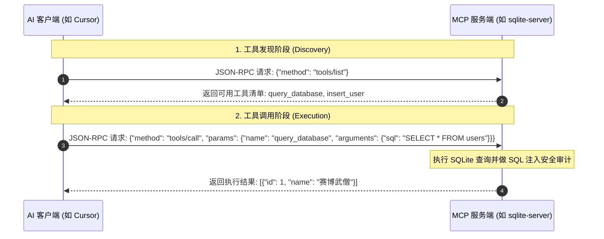

# 模型上下文协议（MCP）

> “当 Agent 掌握了主动操控工具和打破沙盒连接现实的能力，它就不再只是个助手，而是一个真正的赛博数智人。”

在长期开发一个复杂项目时，我们常常需要大模型执行一系列跨越文本编辑器的复合动作：比如读取本地文件、查询私有数据库、或者操纵浏览器截图。在过去，AI 工具想要连接这些外部数据源，需要各自单独开发集成，导致整个生态极度碎片化。

为了解决这个痛点，Anthropic 联合行业巨头推出了划时代的开源标准协议 —— Model Context Protocol（模型上下文协议，简称 MCP）。

## MCP 是什么？

打个比方：如果说 AI 模型是“大脑”，那么 MCP 就是统一的 “USB-C 接口”。

它标准化了 AI 助手（如 Claude Desktop、Cursor、Cline 等）与外部数据源（如本地 SQLite、GitHub、Notion、Slack）之间的连接方式。数据提供方只需要编写一个轻量级的 MCP Server，任何支持 MCP 标准的 AI 助手都可以像插上 U 盘一样，直接读取这个 Server 提供的数据并调用其工具。真正实现了“一次编写，到处连通”。


## MCP 的核心架构与三大支柱

MCP 采用极其轻量、清晰的客户端-服务端架构：

* MCP Hosts（宿主）：启动连接的 AI 应用程序（如 Cursor、Claude Desktop）。
* MCP Clients（客户端）：位于宿主应用内部，负责向外建立连接并发送请求。
* MCP Servers（服务端）：连接到特定数据源的轻量级程序（如 Postgres MCP、GitHub MCP）。

在协议内部，MCP 向大模型暴露了三种核心原语（Primitives）：

* 资源 (Resources)：向大模型提供只读的静态数据源。就像给 AI 递上一本图书，例如将本地的 API 文档或系统日志声明为资源，供大模型随时拉取查阅。
* 工具 (Tools)：向大模型提供可以执行动作的“武器”。这是 Agent 能够主动改变外部物理世界的核心方式，例如执行一条 SQL 查询、发送 Slack 消息等。
* 提示词模板 (Prompts)：向大模型提供预设好的、带有占位符的对话模板。大模型可以动态填入参数并直接套用最佳实践。


## MCP 与 Agent Skills 的关系

随着 AI 编程的发展，很多人会混淆 MCP 与 Agent Skills（技能树文件，如 `SKILL.md`），甚至有“Skills 让 MCP 过时了”的夸张说法。事实上，它们是完美的互补关系。

| 维度 | Model Context Protocol (MCP) | Agent Skills (AI 技能) |
|  |  |  |
| 本质 | 连接 Claude 到外部系统的标准协议 | 教 Claude“如何做事”的指令包 |
| 解决什么 | 提供连接和能力（能做什么） | 提供程序性知识（怎么做） |
| 角色类比 | 通往外部世界的“插座/管道” | 特定任务的“食谱/操作手册” |
| 上下文占用 | 工具定义常驻上下文，返回冗长 JSON | 渐进式披露，按需加载，执行精准 |

### 黄金法则：MCP 用于发现，Skills 用于执行

MCP 帮助 Agent 探索“有什么可能”，Skills 帮助它执行“已知的事情”。一个典型的高效协同工作流如下：

1. 用 MCP 探索：Agent 通过 MCP 连接数据库，探索有哪些表、字段、如何查询（灵活，但耗费较多 Token）。
2. 沉淀为 Skill：一旦明确了正确的查询逻辑，将其固化写进一个 Skill 文件中。
3. 用 Skill 执行：日后遇到同类问题，直接调用 Skill 执行，绕过 MCP 的探索过程。

实测数据显示，对于已知的、重复的任务，使用“MCP + Skills”组合相比纯用 MCP，能够节省 30% 到 65% 的 Token 消耗，让你的 Agent 既灵活又高效。


## JSON-RPC 2.0 序列

MCP 基于标准的 JSON-RPC 2.0 协议进行通信。以下是大模型通过 MCP 发现并调用工具的典型交互序列：




## 编写 SQLite 自定义 MCP Server

接下来，我们将演示如何编写一个可以读写本地 SQLite 数据库的自定义 MCP Server。

### 方案 A：Node.js 实现

初始化项目并安装依赖：

```bash
npm init -y
npm install @modelcontextprotocol/sdk sqlite3
npm install -D typescript @types/node @types/sqlite3 tsx
npx tsc --init

```

编写 `index.ts`：

```typescript
import { Server } from "@modelcontextprotocol/sdk/server/index.js";
import { StdioServerTransport } from "@modelcontextprotocol/sdk/server/stdio.js";
import { CallToolRequestSchema, ListToolsRequestSchema } from "@modelcontextprotocol/sdk/types.js";
import sqlite3 from "sqlite3";

// 1. 初始化数据库
const db = new sqlite3.Database("./local_users.db");
db.serialize(() => {
  db.run(`CREATE TABLE IF NOT EXISTS users (id INTEGER PRIMARY KEY AUTOINCREMENT, name TEXT NOT NULL, email TEXT UNIQUE NOT NULL, role TEXT DEFAULT 'developer')`);
});

// 2. 创建 MCP 服务实例
const server = new Server(
  { name: "sqlite-mcp-server", version: "1.0.0" },
  { capabilities: { tools: {} } }
);

// 3. 声明工具列表
server.setRequestHandler(ListToolsRequestSchema, async () => {
  return {
    tools: [
      {
        name: "query_database",
        description: "运行 SELECT SQL 语句查询本地数据库。仅允许只读查询。",
        inputSchema: { type: "object", properties: { sql: { type: "string", description: "SELECT SQL 语句" } }, required: ["sql"] }
      }
    ]
  };
});

// 4. 实现工具逻辑
server.setRequestHandler(CallToolRequestSchema, async (request) => {
  const { name, arguments: args } = request.params;

  if (name === "query_database") {
    const sql = args?.sql as string;
    if (!sql.toLowerCase().trim().startsWith("select")) {
      return { content: [{ type: "text", text: "错误: 仅允许执行 SELECT 语句。" }], isError: true };
    }
    return new Promise((resolve) => {
      db.all(sql, [], (err, rows) => {
        if (err) resolve({ content: [{ type: "text", text: `执行失败: ${err.message}` }], isError: true });
        else resolve({ content: [{ type: "text", text: JSON.stringify(rows, null, 2) }] });
      });
    });
  }
  throw new Error(`找不到工具: ${name}`);
});

// 5. 启动服务 (Stdio)
const transport = new StdioServerTransport();
await server.connect(transport);
console.error("SQLite MCP Server 已启动！");

```

### 方案 B：Python 实现 (FastMCP)

如果你偏好 Python 生态，可以使用官方提供的 `mcp` 库：

```bash
pip install mcp sqlite3

```

编写 `server.py`：

```python
import sqlite3
import json
from mcp.server.fastmcp import FastMCP

mcp = FastMCP("sqlite-mcp-server")

def init_db():
    conn = sqlite3.connect("local_users.db")
    cursor = conn.cursor()
    cursor.execute("CREATE TABLE IF NOT EXISTS users (id INTEGER PRIMARY KEY, name TEXT NOT NULL, email TEXT UNIQUE, role TEXT DEFAULT 'developer')")
    conn.commit()
    conn.close()

init_db()

@mcp.tool()
def query_database(sql: str) -> str:
    """运行 SELECT SQL 语句查询本地用户数据库。仅允许只读查询。"""
    if not sql.lower().strip().startswith("select"):
        return "错误: 仅允许执行 SELECT 只读语句。"
    try:
        conn = sqlite3.connect("local_users.db")
        cursor = conn.cursor()
        cursor.execute(sql)
        rows = cursor.fetchall()
        columns = [description[0] for description in cursor.description]
        results = [dict(zip(columns, row)) for row in rows]
        conn.close()
        return json.dumps(results, indent=2, ensure_ascii=False)
    except Exception as e:
        return f"SQL 执行失败: {str(e)}"

if __name__ == "__main__":
    mcp.run()

```


## 致命的 console.log

在将自定义 MCP 配置到 AI 宿主（如 Cursor）时，最常见的崩溃原因来源于日志输出方向错误。

由于 MCP 客户端与服务端默认通过 `stdio`（标准输入/输出）进行 `JSON-RPC` 数据帧的传递，如果你在代码中写了普通的打印语句（如 Node.js 的 `console.log` 或 Python 的 `print`），这些普通文本会直接混入标准输出，导致客户端的 JSON 解析器彻底崩溃。

排错黄金法则：

* Node.js：所有的调试、警告、错误信息，强制使用 `console.error()`。
* Python：使用 `sys.stderr.write()` 或标准 `logging` 库配置输出到 `stderr`。
这样做会将日志输出到标准错误流，AI 客户端能安全地捕获并显示在 IDE 面板中，而不破坏主通信通道。配置路径时，在 Windows 环境下也建议使用绝对路径并注意斜杠方向。