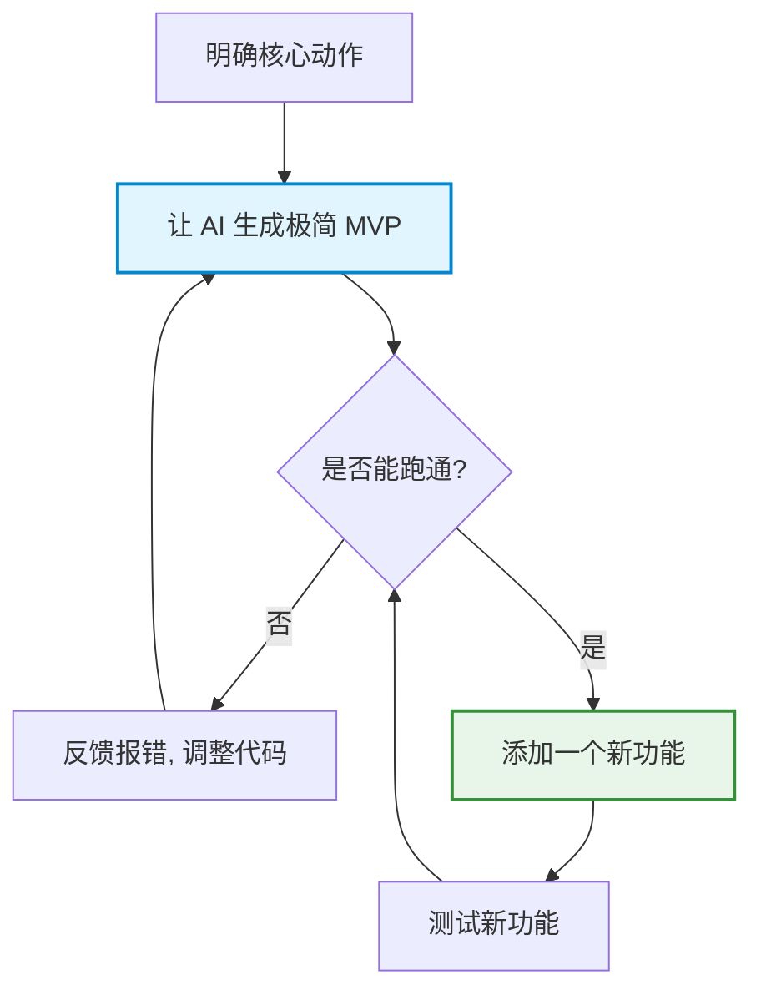

# 零基础进阶：小步迭代与避坑指南

> **“完美的程序从来不是一次性写出来的，而是在‘先运行，再微调’的不断循环中雕琢出来的。”**

在第一步尝试了指挥 AI 做出简单的小游戏之后，你可能会发现：无论我们把需求想得多完美，AI 也几乎不可能一次性直接生成一个毫无瑕疵、功能百分之百满足你想象的程序。

这并不是因为 AI 不够聪明，而是因为软件开发本身就是一个“精细沟通、不断修正”的动态过程。这一章，我们将带你掌握非程序员最核心的“赛博超能力”——**小步迭代**与**避坑艺术**。

---

## 迭代改进：从小步快跑到 MVP 哲学

面对 AI 强大的生成速度，新手最容易犯的错误就是**“既要、又要、还要”**。
如果一上来就给 AI 抛出一个无比宏大、要求繁杂的任务：

> “帮我写一个背单词网页，要有优美的音效，能记录历史，要能同步到云端，还要带好看的排行榜……”

AI 会因为上下文堆积过多、冲突点过密而直接进入“精神错乱”状态，输出的代码往往逻辑混乱、报错频出，最后连你自己也越来越看不懂。

### 核心解法：先做 MVP（最小可行版本）

**MVP（Minimum Viable Product）** 是互联网开发中最核心的真理。它的本质是：**先保证它“能跑”，再考虑它“好看”和“强大”**。



一个合格的 MVP 只需要满足三个基本点：
1. **能跑起来**（浏览器双击打开不会是一片空白）；
2. **能点击/交互**（按钮点击有基本反馈）；
3. **能完成最核心的一个动作**。

---

### 实战演练：背单词工具的 5 步迭代法

如果我们想要做一个背单词工具，正确的迭代节奏应当像走楼梯一样，一步一个台阶：

| 迭代阶段 | 目标任务 | 提示词（Prompt）示范 |
| :--- | :--- | :--- |
| **第一步：搭建骨架** | 只做最核心的展示功能 | “我想做一个背单词网页。请帮我生成一个可以运行的单文件 HTML。界面中间放一个单词卡片，随机显示一个英文单词和它的中文释义，下方有一个『下一个』按钮，点击能随机切换单词。” |
| **第二步：增加单向交互** | 引入用户的判断反馈 | “非常好，现在请在网页下方加入一个『记住了』和一个『没记住』按钮。当点击『记住了』时，卡片背景变绿并自动切换下一个；点击『没记住』时，卡片变红，并在屏幕上方统计今天累计记住了几个单词。” |
| **第三步：优化视觉与进度** | 建立视觉反馈 | “请在卡片上方增加一个进度条，显示今天背单词的进度（比如背完 10 个算 100%）。卡片翻转时加上平滑的过渡动画。” |
| **第四步：引入数据持久化** | 保证数据不丢失（脱离服务器） | “使用浏览器的 LocalStorage 技术，将今天背过的单词和计数保存下来。这样当我刷新网页或关掉浏览器重新打开时，我的进度和记录依然存在。” |
| **第五步：丰富业务逻辑** | 增加错题本/复习模式 | “现在，请增加一个『复习模式』按钮。点击后，只会循环展示之前我点击了『没记住』的那些单词，直到我点击『记住了』把它们移出复习本。” |

:::tip 迭代的快乐
你会发现，采用这种“滚雪球”式的方式，AI 的每次修改范围都极小，几乎不会发生大面积逻辑崩溃。每一次点击“保存并刷新”，你都能立刻看到自己亲手捏出来的软件又强大了一分。
:::

---

## 掌握“吐槽”艺术：报错是协作的调味剂

许多零基础的新手，在看到浏览器控制台弹出一行红色的报错（如 `Uncaught TypeError`），或者双击网页发现是一片漆黑/白板时，会瞬间感到恐慌和沮丧，甚至觉得“自己搞砸了”。

> [!IMPORTANT]
> **报错，是软件开发的绝对日常。** 
> 哪怕是拥有十年经验的资深架构师，每天的工作也有大半时间是在和报错打交道。在 AI 协作时代，你不再需要去搜索引擎里大海捞针地查阅资料，你只需要学会如何向 AI **“优雅地吐槽”**。


### 吐槽的黄金对比指南

当你发现程序运行不符合预期时，千万别说“我的网页坏了，帮我重写”。看看下面这两种截然不同的反馈方式：

❌ **无效吐槽（让 AI 抓狂）**：
> “我的程序报错了，运行不起来，页面一片白，你快看看怎么回事！”

* AI 无法获得任何具体的物理运行状态，只能瞎猜，极易给出无关的错误修改。

---

**黄金吐槽（让 AI 瞬间找到病灶）**：
> “我在点击『复习模式』按钮的时候，页面突然卡住不动了。我按下键盘 F12 打开了浏览器的开发者工具，发现控制台（Console）里报了下面这行红色的错误：
> `Uncaught ReferenceError: reviewList is not defined at HTMLButtonElement.onclick (index.html:145)`
> 
> 请帮我分析为什么会发生这个错误，并直接给出修复后的完整 HTML 代码。”

只要你敢于把具体的错误表现（**报错截屏、报错文本、或是操作后的异常现象**）原存不动地砸给 AI，它就能像一个不会疲惫的私人技术团队一样，在 5 秒钟内向你道歉并双手呈上完整的修复方案。

---

## 实战升级：从“玩具网页”到酷炫 3D 游戏

当你熟悉了上述的小步迭代法，你很快就会觉得普通的平面网页、按钮输入不够过瘾。
别担心，现代大语言模型甚至不需要你掌握任何底层的 3D 图学或物理知识，就能带你跨入 **3D 引擎** 的大门。

### 零基础如何驾驭 3D 效果？

在网页端实现 3D 场景，行业最常用的标准技术是 **Three.js**。作为一个零基础的初学者，你完全不需要去背诵复杂的渲染管线或投影矩阵，你只需要知道**“把这块积木交托给 AI 处理”**。

```text
💡 初学者的 3D 提示词万能钥匙：
“使用 Three.js 在一个单文件 HTML 中搭建 3D 场景，采用低多边形（Low-Poly）风格，确保包含光照和投影效果……”
```

### 3D 飞行游戏的分阶段推进示范

我们可以指挥 AI 像专业的游戏工作室一样，将一个复杂的 3D 场景分阶段攻坚：

```
🛸 【3D 飞行游戏开发蓝图】
├── 阶段 1：构建 3D 世界原型（星空、飞船模型、相机跟随）
├── 阶段 2：注入核心物理动作（键盘/触屏控制飞船左右倾斜躲避）
├── 阶段 3：建立游戏闭环（陨石障碍物随机生成、碰撞检测机制）
└── 阶段 4：华丽视效包装（爆炸粒子特效、引擎喷火、光晕美化）
```

当 AI 帮你写好原型代码后，双击运行，你会看到一个深邃的 3D 星空中，一艘帅气的几何飞船正在随着你的鼠标轻轻倾斜。这就是“自然语言编程”带来的无与伦比的创造快感。


（结果演示： https://artifacts.meta.ai/share/a/1e9a1aac-d6d4-43bf-99b2-dd7c00fef3d6?utm_source=meta_ai_web_share_copy_link&utm_medium=share&utm_campaign=ecto_share）


---

## 零基础玩家的避坑黄金法则

在你的极速启航旅程中，请将以下四条黄金法则深深地刻在脑海里，它们能帮你避开 99% 的常见“翻车”现场。

### 1. 善用 “Tailwind CSS” 美化界面

AI 默认生成出来的网页，如果不加任何限制，通常是非常粗糙的经典蓝白底色（俗称“直男审美”）。
**避坑妙招**：在给 AI 的任何界面需求末尾，加上这一句魔法咒语：

> “**请使用 Tailwind CSS 来美化整个界面，采用精致优雅的暗黑模式（Dark Mode），按钮加上平滑的悬浮缩放动画效果（Hover Scale）。**”

Tailwind CSS 是一个现代化的界面排版工具，AI 对其极其熟悉。只要有了这句约束，AI 吐出来的网页质感就会瞬间跃迁，直接呈现出科技感拉满的“大厂产品级”观感。

---

### 2. 不要一开始就触碰数据库与服务器

“我想做一个可以注册账号、登录、把数据保存到云端服务器的系统。”——这是新手最容易踩中的最大泥潭。
一旦引入数据库（Database）和服务器（Server），意味着你需要：
* 部署后端服务；
* 租用并配置云服务器；
* 解决跨域（CORS）与网络鉴权问题。

这会使得原本“双击即可运行”的快乐，变成“配置环境配到崩溃”的折磨。
**避坑妙招**：前期所有需要存储数据的场景，一律使用 **LocalStorage**。

---

### 3. 学会依靠 LocalStorage 实现“伪云端”

LocalStorage 是浏览器自带的一个“本地记事本”。它能在完全不需要配置任何服务器和数据库的情况下，把你的应用数据完好地锁在用户的本地浏览器里。

```javascript
// 告诉 AI 使用如下逻辑来读写数据：
localStorage.setItem('gameHighScore', 999); // 写入数据
let score = localStorage.getItem('gameHighScore'); // 读取数据
```

当你做待办清单、记账工具、或者游戏最高分记录时，只要跟 AI 说：**“请使用 LocalStorage 保存用户的记录，防止刷新页面时丢失。”** 就能获得近乎完美的持久化体验。

---

### 4. 永远优先“能跑”，把优雅留给以后

很多新手会纠结：AI 生成的这几百行代码里，是不是有重复的逻辑？是不是写法不够高级？命名是不是不够规范？

> [!WARNING]
> 对于零基础玩家而言，**代码是否优雅根本不重要**。
> 你当前唯一的首要任务，是**快速建立『我真的能亲手做出软件』的信心与正反馈**。这种成就感是驱动你持续探索、不断前进的最强燃料。至于代码优化、架构重构，那是大模型在后期一秒钟就能帮你完成的机械工作。

---

## 结束语：创造力，正在成为这个时代最稀缺的资源

当 AI 已经把代码生成的成本压缩到几乎为零时，软件行业最大的“技术壁垒”已经被彻底击碎。

未来真正稀缺和珍贵的，不再是那些懂得声明 `const` 或编写 `for` 循环的指尖肌肉记忆，而是你对于生活的观察、你的审美偏好、你解决真实痛点的想法，以及把想法拆解付诸实践的创造力。

**现在，深吸一口气，把你的想法整理成第一个极简的 MVP 提示词，去和你的 AI 结对伙伴开启这场充满惊喜的探索吧！**
