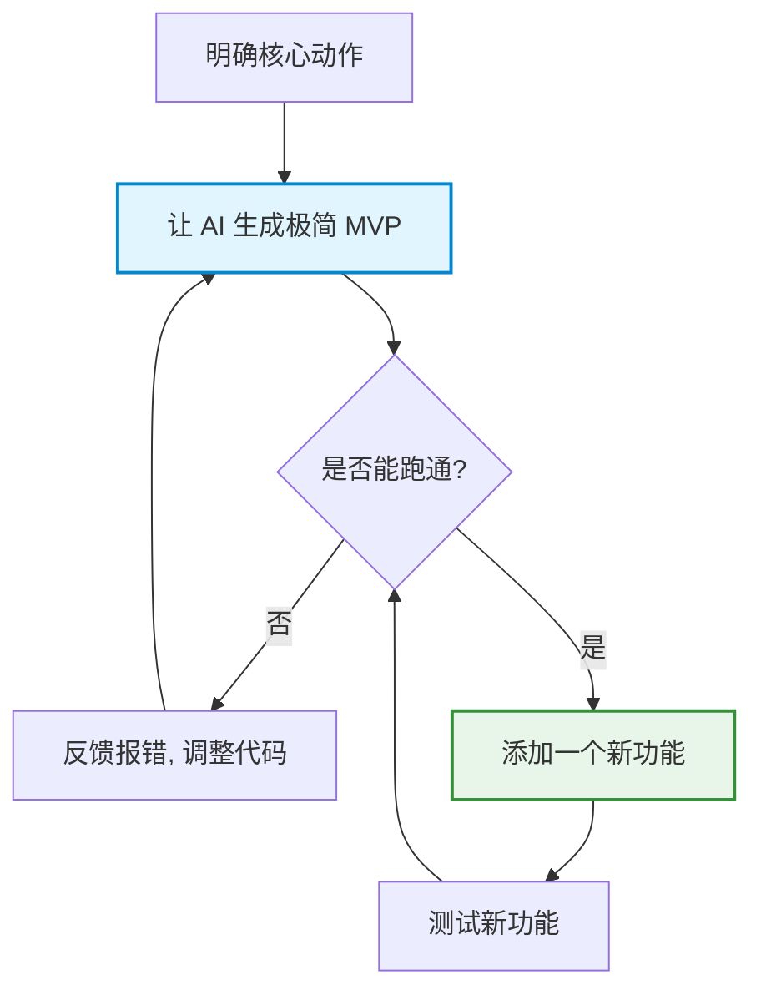

# 迭代改进与排错入门

> 完美的程序从来不是一次性写出来的，而是在“先运行，再微调”的不断循环中雕琢出来的。

在第一步尝试了指挥 AI 做出简单的小游戏之后，你可能会发现：无论我们把需求写得多细致，AI 也决不可能一次性直接生成一个毫无瑕疵、功能百分之百满足你想象的程序。

这并不是因为 AI 不够聪明，而是因为大语言模型本质上是一种带有概率性的生成系统。它并不像传统程序那样“输入固定、输出固定”。即便是同一个提示词，不同时间生成的结果，也可能存在细微差异。


## 迭代改进

如果一上来就给 AI 抛出一个无比宏大、要求繁杂的任务，比如： “帮我做一个带 AI 聊天、账号系统、多人联机、3D 场景、实时排行榜的开放世界游戏平台。”。这时候，AI 可能 会因为上下文堆积过多、冲突点过密而直接进入“精神错乱”状态，输出的代码往往逻辑混乱、报错频出。

一个更有效的方法是，先做一个最小可行版本（MVP），然后再在此基础上不断改进。

### MVP 最小可行产品

MVP（Minimum Viable Product，最小可行产品）是互联网行业一个非常经典的理念。它指的是：“用最少的功能，最快速度验证核心想法。”

MVP 的核心思想是，先保证程序活着，再考虑它帅不帅。




一个合格的 MVP，通常只需要满足三个条件：
1. 能运行（双击打开不是白屏）；
2. 能交互（按钮点击有反馈）；
3. 能完成一个核心动作。

仅此而已。

很多今天的大型产品，其实最初都简陋得难以想象。


### 实战演练：背单词工具的 5 步迭代法

假设我们想做一个背单词工具。那么不应该一次性要求 AI 做出一个“完整版百词斩”。而是像搭积木一样，一层层往上加。

正确的迭代节奏，应该像走楼梯：

| 迭代阶段 | 目标任务 | 提示词（Prompt）示范 |
| :--- | :--- | :--- |
| **第一步：搭建骨架** | 只做最核心的展示功能 | “我想做一个背单词网页。请帮我生成一个可以运行的单文件 HTML。界面中间放一个单词卡片，随机显示一个英文单词和它的中文释义，下方有一个『下一个』按钮，点击能随机切换单词。” |
| **第二步：增加单向交互** | 引入用户的判断反馈 | “非常好，现在请在网页下方加入一个『记住了』和一个『没记住』按钮。当点击『记住了』时，卡片背景变绿并自动切换下一个；点击『没记住』时，卡片变红，并在屏幕上方统计今天累计记住了几个单词。” |
| **第三步：优化视觉与进度** | 建立视觉反馈 | “请在卡片上方增加一个进度条，显示今天背单词的进度（比如背完 10 个算 100%）。卡片翻转时加上平滑的过渡动画。” |
| **第四步：引入数据持久化** | 保证数据不丢失（脱离服务器） | “使用浏览器的 LocalStorage 技术，将今天背过的单词和计数保存下来。这样当我刷新网页或关掉浏览器重新打开时，我的进度和记录依然存在。” |
| **第五步：丰富业务逻辑** | 增加错题本/复习模式 | “现在，请增加一个『复习模式』按钮。点击后，只会循环展示之前我点击了『没记住』的那些单词，直到我点击『记住了』把它们移出复习本。” |

:::tip 迭代的快乐
你会发现，采用这种“滚雪球”式的开发方式后，AI 每次修改的范围都会非常小。
这样不仅极大降低了逻辑崩溃概率，也会让你获得一种非常强烈的创造反馈：
每刷新一次页面，你都能清晰看到，自己亲手创造的软件，又进化了一点。
:::

## 实战升级：一步步做出酷炫 3D 游戏

前面的例子，更多还是“二维网页工具”。下面，我们尝试进一步升级，用自然语言，一步步生成一个 3D 飞行射击游戏。

作为一个零基础的初学者，我们完全不需要了解制作 3D 游戏背后的技术。我们真正需要掌握的，是如何拆解需求。对于零基础玩家来说，只需要把下面这些步骤，一段段发给 AI 即可。AI 会在上一轮代码的基础上，继续自动扩展系统。

整个开发思路，大致如下：

```text
🛸【3D 飞行游戏开发蓝图】
├── 阶段 1：构建 3D 世界原型（星空、飞船模型、相机跟随）
├── 阶段 2：注入核心玩法（飞行、射击、敌机生成）
├── 阶段 3：建立游戏循环（碰撞、得分、死亡、Boss）
├── 阶段 4：加入成长系统（道具、升级、强化）
└── 阶段 5：视听包装与移动端适配
```


具体命令如下，建议一段一段发送。不要一次性全部扔给 AI。

每完成一步后，先运行，试玩。确认没崩后，再继续下一阶段。

#### 0. 初始化项目
```
创建一个 3D 低多边形飞行射击游戏，单文件 HTML。
使用 Three.js，并通过 importmap CDN 引入。
玩家飞机位于屏幕中央偏下，可左右上下移动，并自动向前飞行。
相机跟随在飞机后上方。
加入星空背景与地面网格。
支持键盘 WASD/方向键，以及手机虚拟摇杆。
先生成一个可运行的原型，包含开始界面与游戏结束重开。
```

#### 1. 战斗系统
```
加入自动射击与手动蓄力射击。
子弹使用发光材质，并带拖尾效果。
敌机分为三种：
小型机直线冲锋；
中型机左右摆动；
大型机血厚速度慢。
敌机会从前方程序化生成，并带简单追踪 AI。
加入子弹命中、敌机爆炸粒子特效。
显示分数与连击系统。
```

#### 2. 玩家系统
```
玩家拥有 3 格生命值。
被敌机碰撞或被敌方子弹命中时扣血。
加入翻滚无敌机制：
按 Shift 或双击屏幕触发侧翻，持续 0.8 秒无敌，冷却 3 秒。
加入能量条系统。
蓄力攻击会消耗能量，能量随时间恢复。
UI 使用中文显示：分数、生命、能量、连击。
```

#### 3. 程序化关卡与难度
```
加入无尽模式。
游戏难度随时间与分数递增。
每 60 秒生成一次 Boss 波次。
Boss 拥有三种攻击模式：
散射弹、激光扫射、追踪导弹。
地面与云层程序化生成。
远景加入视差滚动。
增加小行星障碍物，需要玩家躲避。
```

#### 4. Roguelike 成长
```
敌机被击毁后，有 20% 概率掉落随机道具：
1. 散射炮
2. 护盾
3. 能量恢复
4. 僚机

道具持续 15 秒，可叠加。

每获得 5000 分时，弹出三选一升级：
- 射速 +20%
- 移速 +15%
- 最大生命 +1

升级选择使用暂停弹窗实现。
```

#### 5. 视听打磨
```
整体美术风格：
低多边形 + 发光材质。
主色调为赛博蓝紫。

加入：
- 引擎尾焰
- 子弹拖尾
- 爆炸冲击波
- 镜头震动
- 慢动作击杀特效

使用 Web Audio API 合成：
- 射击音效
- 爆炸音效
- 道具拾取音
- Boss 警报

背景音乐使用程序化电子低音循环。
```

#### 6. 手机适配与体验
```
加入左侧虚拟摇杆控制移动。
右侧按钮控制翻滚与蓄力。

自动射击默认开启，可在设置中关闭。

UI 自适应横屏与竖屏。
增大移动端字体与按钮尺寸。

加入暂停按钮与设置菜单。

游戏结束后显示：
- 本局分数
- 历史最高分
- 击毁数
- 存活时间

最高分使用 LocalStorage 保存。
```

#### 7. 上线打包
```
请将所有代码合并为单文件 HTML。
Three.js 使用 CDN importmap 引入。

压缩并内联 CSS 与 JS。
尽量将文件体积控制在 300KB 以内。

页面顶部加入标题《星际突围》。
增加简短操作说明。

导出为可直接上传至静态网站托管平台的版本。

最后，再生成一段 100 字以内的中文介绍文案，用于博客嵌入。
```

当 AI 帮你生成完整原型之后，点击运行。你会看到一个深邃的 3D 星空中，几何飞船在你的操作下轻轻倾斜，尾焰在黑暗中拖出幽蓝色轨迹。

而这一切，可能仅仅来自于你和 AI 的几轮自然语言对话。这就是“自然语言编程”最令人上瘾的地方。它让“创造软件”这件事，变得像讲故事一样自然。


下面是我的 AI 生成的结果：（结果演示： https://artifacts.meta.ai/share/a/1e9a1aac-d6d4-43bf-99b2-dd7c00fef3d6?utm_source=meta_ai_web_share_copy_link&utm_medium=share&utm_campaign=ecto_share）


## 修改错误

上文提到，“如果程序不崩，继续下一步”。但是如果崩了呢？

如果你看到浏览器里挑出一串红色的报错信息，或者什么都没有，不要慌。因为，“出错”本来就是软件开发的日常。哪怕是工作十几年的高级工程师，也几乎每天都在和错误日志搏斗。

在过去，如果遇到错误，我们要自己去 Google 去专业论坛询问，或者自己一点点排查问题。而现在，我们可以直接把错误甩给 AI。


### 吐槽的黄金法则

当你发现程序运行不符合预期时，千万别说“我的网页坏了，帮我看看”。因为 AI 根本看不见，它不知道你在界面上干了什么，一不知道在哪出的错，出的什么错。这样，它只能靠“猜测”来修改问题。于是修复效果通常非常随机。

而真正高效的方式是给出具体细节，比如：“我点击『复习模式』按钮后，页面突然卡住。”或者，按 F12 打开浏览器开发者工具，把它的 Console（控制台）标签页里的文字全部拷贝出来，帖给 AI。

这种信息量，对于 AI 来说几乎已经等于“病历 + CT + X 光片。”它往往能在几秒内精准定位问题。很多时候，甚至比人类程序员排查得还快。


## 零基础玩家的避坑黄金法则

下面这几条经验，几乎能帮你避开 90% 的新手翻车现场。

### 善用 “Tailwind CSS” 美化界面

AI 默认生成出来的网页，如果不加任何限制，通常是非常粗糙的经典蓝白底色（俗称“直男审美”）。如果在提示词最后加一句：“请使用 Tailwind CSS 来美化整个界面，采用精致优雅的暗黑模式（Dark Mode），按钮加上平滑的悬浮缩放动画效果（Hover Scale）。” 页面质感就会瞬间提升一个时代。

Tailwind CSS 是一个现代化的界面排版工具，AI 对其极其熟悉。只要有了这句约束，AI 吐出来的网页质感就会瞬间跃迁，直接呈现出科技感拉满的“大厂产品级”观感。


### 不要一开始就触碰数据库与服务器

带有后端服务的网页程序会让程序的复杂度大为提升。常见的后端服务包括：账户注册登录、链接云端数据、调用 AI 服务等等。本书会在后面的章节中介绍这些功能。但作为新手，我们最好暂时避免这些功能，等积攒一些经验后，再去处理他们。

### 永远优先“能跑”，把优雅留给以后

对于有经验的程序员来说，在看到 AI 生成的代码时，可能已经开始考虑代码优不优雅、命名规不规范、架构高级不高级、有没有重复逻辑等问题了。但这些都不是现阶段最重要的问题。现在真正重要的是能否快速建立“我真的能做出软件”的信心。
