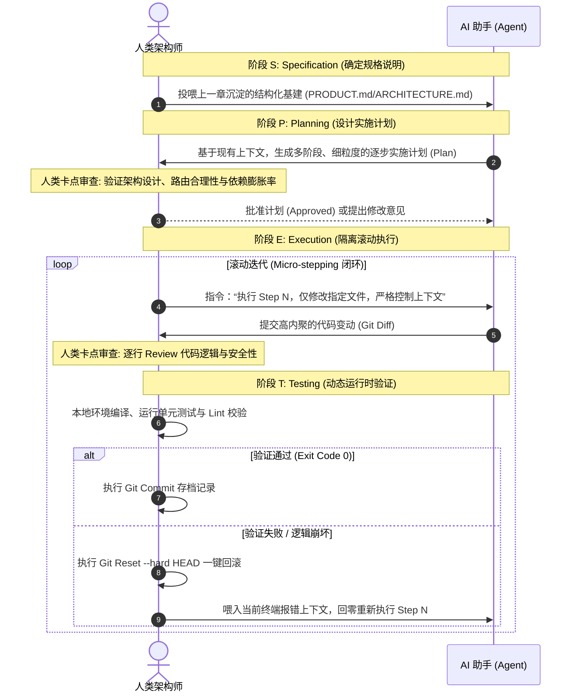

# 制定计划

> 谋定而后动，知止而有得。

大语言模型和现代 AI 编程工具给了我们超越以往的执行手脚，而上下文工程则教会了我们如何为这个大脑调配精准、高纯度的数字弹药。

然而，在面对一个复杂的非平凡（Non-trivial）工程时，很多开发者依然会陷入一个悄无声息的“自动售货机陷阱”：把一段极度含糊且充满歧义的需求（比如：“帮我写一个类似微信的聊天软件”）直接作为 Prompt 扔给工具，期望它下一秒就能吐出完美无瑕的工业级代码。

这种盲目的“盲盒式开发”必败无疑。因为你让 AI 在一句话的跨度里，同时处理了“业务逻辑理解”、“架构边界设计”、“数据模型选型”和“具体语法编码”等多维度的认知挑战。大模型的注意力被极度稀释和污染后，还给你的只能是千疮百孔、逻辑断裂的垃圾代码。

你怎么知道在当下的开发心流中，应该用 `@Files` 靶向投喂哪一个文件？模型又怎么知道何时该调用终端运行测试？

答案是：你必须在 AI 写下哪怕一行代码前，用一张清晰的战略地图来规范它的前进路线。本章将系统介绍现代 AI 编程的核心方法论—— SPET 方法论（Spec - Plan - Execute - Test）。它不仅是区分普通码农与“AI 架构师”的核心分水岭，更是将上一章的“上下文基础设施”串联到实际生产中的核心纽带。

---

## SPET 循环方法论

SPET 是人机高频结对协作中被证明最高效的软件工程范式。它要求我们将整个软件构建过程强行解耦为四个线性推进的阶段，并在关键节点设置人类架构师的审查卡点，实现“规划与执行的绝对分离”：



- S (Specification / 规格说明)：明确“做什么”与“不做什么”。它直接承接了我们在上一章构建的项目级“全景透视图”（`PRODUCT.md` 与 `ARCHITECTURE.md`），人类用高度结构化的自然语言定义清晰的需求边界、技术栈约束及硬性安全红线。
- P (Planning / 实施计划)：理清“怎么做”与“分成几步做”。在动工前，利用 AI 强大的逻辑拆解能力，强制它把宏观大任务肢解为包含具体文件清单、验证手段的详细实施步骤蓝图。
- E (Execution / 滚动执行)：以 “小步快跑（Micro-stepping）” 的节奏执行。每一步要求 AI 只改写极少数几个目标文件。这是对抗“上下文腐烂”的最强武器——让 AI 每次处理的认知负荷保持在最低的水位线内。
- T (Testing & Verification / 持续验证)：每执行完一个微步骤，立刻在本地环境调起终端进行动态运行时验证。若成功则进行 Git Commit 存档，若失败则利用 Git 机制一键 Rollback，绝不让脏代码污染下一个步骤的上下文空间。


## 核心模板规范

为了避免模糊的人类表述降低 AI 的理解力，我们应当使用高度结构化的 Markdown 模板来编排 Spec 和 Plan，使其完美契合 AI 编程工具（如 Cursor、Claude Code）的内置 RAG 索引。

### 📋 规格说明书 (Spec) 模板

```markdown
# 规格说明书 (Spec)：[项目名称]

## 1. 业务目标 (Business Goal)
[用一句话或一小段话描述该功能/模块的最终业务价值]

## 2. 技术栈约束 (Tech Stack Constraints)
- 前端框架/库：[如 React 19, TypeScript]
- 数据管理：[如 Prisma + PostgreSQL]
- 样式方案：[如 Tailwind CSS]
- 依赖限制：[如 严格限制引入外部轮子，复用已有工具类]

## 3. 核心功能契约 (Functional Contracts)
1. [功能A]：[具体入参、出参及逻辑行为描述]
2. [功能B]：[具体输入、输出契约]

## 4. 安全与性能红线 (Red Lines)
- [如 必须通过全局异常拦截器 errorHandler.ts 抛出错误]
- [如 禁止在循环体中执行任何数据库查询]

```

### 📐 实施计划 (Plan) 模板

```markdown
# 实施计划 (Implementation Plan) - [模块名称]

- [ ] Phase A: [阶段名称，如基础架构与契约定义]
  - [ ] Step 1: [具体动作，例如：创建 DTO 与数据库模型]
    - 涉及文件：`src/models/schema.prisma`
    - 验证方式：终端运行 `npx prisma db push` 校验
  - [ ] Step 2: [具体动作]
    - 涉及文件：`src/dtos/create-user.dto.ts`
    - 验证方式：编译期 TS 类型检查

- [ ] Phase B: [阶段名称，如业务逻辑核心实现]
  - [ ] Step 3: [具体动作]
    - 上下文依赖：`@schema.prisma`
    - 关键限制：[明确指出此步不可改动其他无关文件]

```


## 实战案例：用 SPET 环路打造离线 Markdown 编辑器

### 🎯 任务目标

我们要在前端构建一个“支持实时字数统计、本地 IndexedDB 离线自动保存、且能一键导出带有样式 HTML 的现代化 Markdown 编辑器”。

---

### 📝 步骤一：S（Specification）功能规格书定义

人类作为最高设计导演，首先在项目中建立并维护好 Spec 基础设施，向 AI 工具明确灌输规则：

```markdown
# 功能规格说明书 (Spec)：离线 Markdown 编辑器

## 1. 目标 (Goal)
构建一个支持实时 Markdown 渲染、自适应双栏布局、离线自动保存与数据恢复、具有字数统计功能的现代化网页版编辑器。

## 2. 技术栈约束 (Tech Stack)
* 核心框架：React + TypeScript
* 样式美学：Tailwind CSS (简约精致的深色模式与浅色模式切换)
* Markdown 解析：轻量级组件 `marked`
* 离线存储：原生浏览器 `localStorage`（主配置缓存）+ `IndexedDB`（草稿箱增量备份）

## 3. 核心功能契约
1. 编辑器主界面：自适应双栏设计，左侧手敲 Markdown 原文，右侧实时预览 HTML。
2. 实时统计栏：在页面底部实时展示：字符数（不含空格）、汉字数、段落数、估计阅读时间。
3. 离线自动保存（Auto-Save）：
   * 采用防抖机制（Debounce 1000ms），当用户停止输入后，自动将草稿写入本地。
   * 用户重新打开页面时，若发现有未合入草稿，顶部弹出提示：“检测到有未合入草稿，是否恢复？”
4. 安全红线：禁止引入任何体积庞大的富文本编辑器框架，所有 Markdown 解析必须配合 DOMPurify 进行转译净化，严格防范 XSS 攻击。

```


### 📐 步骤二：P（Planning）12 步实施计划的诞生

我们在不同的编程工具中，利用 AI 的规划能力来生成技术图纸。注意，此时此刻，我们绝对不可以允许 AI 编写任何实际的代码文件：

* 在 Cursor 中：在 Composer 模式下切到 `Architect`（架构师模式），投喂上述 Spec 并下达指令。
* 在 Claude Code 中：在终端输入：`claude "仔细阅读说明书。你现在处于 Plan 模式，绝对禁止修改任何业务代码。请结合当前技术栈，为我设计一份 12 步的逐步实施计划。"`
* 在 Google Antigravity 中：将 Spec 文件放入全局常驻 Pin 区，在计划面板中唤醒 AI 规划器。

AI 迅速消化了 Spec，吐出了结构化极强的 Plan 提纲：

```markdown
# 实施计划 (Implementation Plan) - Markdown 编辑器

- [ ] Phase A: 基础结构与 UI 构建
  - [ ] Step 1: 创建基础页面骨架 `src/components/EditorLayout.tsx`，搭建自适应双栏布局。
  - [ ] Step 2: 引入 Tailwind CSS 并配置深/浅色模式切换逻辑（修改 `src/index.css`）。
  - [ ] Step 3: 编写编辑器头部导航栏，包含“导出”按钮及文件重命名输入框。

- [ ] Phase B: Markdown 核心功能实现
  - [ ] Step 4: 安装 `marked` 与 `dompurify`；实现实时编译与防 XSS 安全转译逻辑（创建 `src/utils/markdownParser.ts`）。
  - [ ] Step 5: 实现双栏联动滚动（左侧滚动，右侧预览页等比同步滚动）。
  - [ ] Step 6: 编写底部数据统计组件 `src/components/StatsBar.tsx`（精准计算字数与阅读时间）。

- [ ] Phase C: 离线自动保存（核心引擎）
  - [ ] Step 7: 实现一个防抖 Hook `src/hooks/useDebounce.ts`，防范高频高压写入。
  - [ ] Step 8: 编写本地 IndexedDB 存储控制器 `src/utils/dbController.ts`，支持草稿读写。
  - [ ] Step 9: 联调自动保存逻辑，在编辑区输入测试防抖自动触发与指示灯状态。
  - [ ] Step 10: 实现冷启动时的草稿箱检测与弹窗恢复机制。

- [ ] Phase D: 导出与精细化抛光
  - [ ] Step 11: 实现一键将 Markdown 渲染为标准的带有好看样式的独立 HTML 文件并触发下载。
  - [ ] Step 12: 运行回归测试，修复移动端适配细节。

```

> 🚦 人类架构卡点审阅（Gatekeeping）
> 人类架构师敏锐地审查这份计划，发现了设计瑕疵：*“很好。但是 Step 5 中，双栏等比联动滚动如果用复杂的双向 DOM 属性计算，极易发生死循环抖动。请在该步骤里明确标记：‘仅使用左侧文本框滚动触发右侧预览页滚动的单向绑定，避免监听冲突造成的死循环’。”*
> AI 接收到整改意见，迅速更新了 Step 5 的计划局部细节。人类正式批准（Approved!），蓝图封版。


### 🚀 步骤三：E（Execution）隔离滚动执行

现在，我们命令 AI 工具切入 Act（执行）模式。
在执行阶段，我们必须严格克制大模型的“表现欲”，严禁让 AI 顺着 1 到 12 步一次性生成全部代码。相反，我们采用上一章学到的“另起炉灶”和“精细化上下文控制”手段，只让它执行当前指派的那一个小步：

* 人类：“执行 Step 1。仅创建 `src/components/EditorLayout.tsx`，不要动其他任何地方。”
* AI：严格围绕 Layout 吐出几十行干净的代码文件。
* 人类：在工具中直观地审阅 `Git Diff` 变动。确认完全符合 Step 1 边界，编译通过。
* 人类：在终端利落地敲下：`git add . && git commit -m "feat: md-editor Step 1 completed"`。

通过这种“一问一答、步步扎根”的隔离执行，大模型每一次生成的数据量都保持在极小的局部，人类审阅的负担降到了最低，AI 脑补出离奇 Bug 的几率也被压榨到了接近于零。

---
### 🔬 步骤四：T（Testing & Verification）持续验证与安全网

当执行到 Step 9（自动保存联调）时，意外发生了。AI 编写了一段复杂的异步事件监听代码。当你尝试在编辑器输入文字时，页面突然卡死崩溃，浏览器控制台抛出了由于高频读写未正确释放游标引起的 IndexedDB 死锁报错。

此时，千万不要在已经崩坏的会话环境中命令 AI“打补丁”。这只会让它的上下文堆积大量的垃圾历史样本（负面污染），导致它越补越乱、越描越黑。

利用我们在《上下文工程》中强调的“轻装上阵”黄金法则，标准的破局动作应当分为两步：

1. 肉身回滚，物理清障：立刻在本地终端输入 `git reset --hard HEAD`，将整个项目的物理文件瞬间带回到 Step 8 完成时的绝对干净、可正常运行状态。
2. 重开会话，精准投喂：关闭当前长 Chat，重新开启一个完全干净的新会话。利用编程工具的上下文抓取能力（如在 Cursor 中直接 `@schema.prisma` 与 `@dbController.ts`），向 AI 发出冷酷的重试指令：
> “刚刚我们在执行 Step 9 联调自动保存时，由于 IndexedDB 在高频触发下没有正确释放游标，导致了浏览器死锁崩溃。我刚才已经将代码进行了 Git 物理回退。
> 现在，这是目前最新的干净状态。请专门针对这个并发游标未释放的痛点，修改你先前的 Step 9 设计方案，重新进行代码生成。”


消除了脏消息干扰、吸取了失败教训的 AI 会在瞬间激发其最高级别的代码推理能力。它敏锐地发现自己漏掉了一个 `db.close()`，随即吐出了精简、无死锁的新版 Step 9。

放入项目，联调测试，终端 Exit Code 0，全线通过！

## 人类裁判在各阶段的卡点审核清单

人机结对协作绝对不是“放羊”。作为最高指挥官与裁判，你必须在四个关闸严守以下审核清单：

| 阶段 | 审查重点 (Checklist) | 拒绝通过的红线 (Red Lines) |
| --- | --- | --- |
| S (Specification) | 需求是否完全结构化？技术选型是否存在冗余？安全底线是否交代清楚？ | 出现“写一个类似某某软件”的模糊人类散文，拒绝开闸。 |
| P (Planning) | 每一步是否只修改最少的文件？步骤之间是否有高耦合？步骤的验证手段是否合理？ | 出现“跨多模块同步并发修改”的大包大揽步骤，强制要求其重写、拆细。 |
| E (Execution) | 变动代码的 `git diff` 是否完全在当前 Step 的范围内？是否存在 AI 脑补出的额外功能？ | AI 越权生成了非当前步骤定义的目标功能（哪怕看起来很好），坚决无情回滚或删除。 |
| T (Testing) | 编译是否零报错？Linter 警告是否清零？核心逻辑是否覆盖了测试断言？ | 带着任何一行报错或静态警告进入下一个 Step，严禁合入主干。 |

