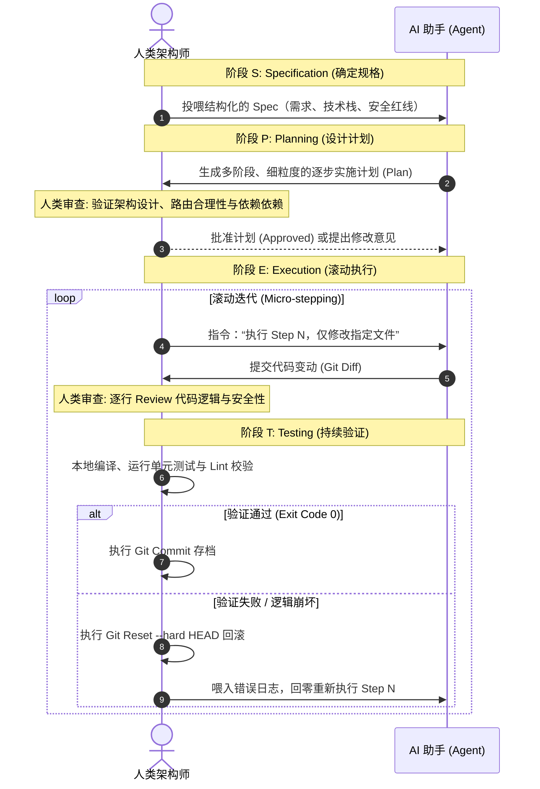

# 谋定而后动：小步规划与 SPET 方法论

> **“在代码行开始跳动之前，战争就已经在架构图和 Spec 里分出了胜负。”**

---

许多刚使用 AI 编程的开发者极易掉入**“自动售货机陷阱”**：把一段极度含糊且充满歧义的话（比如：“帮我写一个类似微信的聊天软件”）直接扔给大模型，期望它下一秒就吐出完美的代码。

这种开发模式在遇到复杂的非平凡（Non-trivial）工程时必败无疑。因为 AI 会被迫在一句话的跨度里，同时处理“业务逻辑理解”、“架构边界设计”、“数据模型选型”和“具体语法编码”等多维度思考。注意力被高度稀释后，AI 只能吐出千疮百孔、逻辑断裂的垃圾代码。

本章将系统介绍现代 AI 编程的核心方法论—— **SPET 方法论（Spec - Plan - Execute - Test）**，并通过一个“支持离线自动保存与字数统计的 Markdown 编辑器”实战项目，带你领略“绝对分离与规划”的艺术。

---

## 1. 什么是 SPET 循环方法论？

SPET 是人机高频结对协作中被证明最高效的软件工程范式。它要求我们将整个软件构建过程强行拆分为四个阶段，并在关键节点设置人类审查的卡点关闸：



* **S (Specification / 规格说明)**：明确**“做什么”与“不做什么”**。人类用高度结构化的自然语言定义需求、技术栈、核心输入输出契约及硬性安全红线。
* **P (Planning / 实施计划)**：理清**“怎么做”与“分成几步做”**。在 AI 写下哪怕一行代码前，强制它把大任务拆解为包含具体文件清单的详细实施步骤。
* **E (Execution / 滚动执行)**：以 **“小步快跑（Micro-stepping）”** 的节奏执行。每一步只改写少数几个文件，确保每一步人类都可以直观评审 Diff。
* **T (Testing & Verification / 持续验证)**：每执行完一个微步骤，立刻在本地环境启动编译、运行单元测试或进行界面交互验证。若成功则进行 Git Commit 存档，若失败则一键 Rollback 归零重来。

---

## 2. 核心模板规范

为了避免模糊的人类表述降低 AI 的理解力，我们应当使用高度结构化的 Markdown 模板来编排 Spec 和 Plan。

### 📋 规格说明书 (Spec) 模板

```markdown
# 规格说明书 (Spec)：[项目名称]

## 1. 业务目标 (Business Goal)
[用一句话或一小段话描述该功能/模块的最终业务价值]

## 2. 技术栈约束 (Tech Stack Constraints)
- **前端框架/库**：[如 React 19, TypeScript]
- **数据管理**：[如 Prisma + PostgreSQL]
- **样式方案**：[如 Tailwind CSS]
- **依赖限制**：[如 禁止引入任何大型富文本框架，优先使用原生 API]

## 3. 核心功能契约 (Functional Contracts)
1. **[功能A]**：[具体入参、出参及逻辑行为描述]
2. **[功能B]**：[具体输入、输出契约]

## 4. 安全与性能红线 (Red Lines)
- [如 必须防范 SQL 注入，禁止使用拼接查询]
- [如 必须对用户敏感字段进行脱敏输出]
- [如 禁止在循环体中执行任何数据库查询 (N+1问题)]
```

### 📐 实施计划 (Plan) 模板

```markdown
# 实施计划 (Implementation Plan) - [模块名称]

- [ ] **Phase A: [阶段名称，如基础架构与契约定义]**
  - [ ] **Step 1**: [具体动作，例如：创建 DTO 与数据库模型]
    - **修改文件**：`src/models/schema.prisma`
    - **验证方式**：`npx prisma db push`
  - [ ] **Step 2**: [具体动作]
    - **修改文件**：`src/dtos/create-user.dto.ts`
    - **验证方式**：类型检查

- [ ] **Phase B: [阶段名称，如业务逻辑核心实现]**
  - [ ] **Step 3**: [具体动作]
    - **关键限制**：[如 单向流动设计，避免死循环]
```

---

## 3. 实战案例：用 SPET 环路打造 Markdown 编辑器

### 🎯 目标
我们要在前端构建一个“支持实时字数统计、本地 IndexDB 离线自动保存、且能一键导出 HTML 的协作 Markdown 编辑器”。

---

### 📝 步骤一：S（Specification）功能规格书定义

人类作为最高设计导演，首先在编辑器中向 AI 注入了如下功能规格书：

```markdown
# 功能规格说明书 (Spec)：离线 Markdown 编辑器

## 1. 目标 (Goal)
构建一个支持实时 Markdown 渲染、自适应双栏布局、离线自动保存与数据恢复、具有字数统计功能的现代化网页版编辑器。

## 2. 技术栈约束 (Tech Stack)
* **核心框架**：React + TypeScript
* **样式美学**：Tailwind CSS (简约精致的深色模式与浅色模式切换)
* **Markdown 解析**：轻量级组件 `marked`
* **离线存储**：原生浏览器 `localStorage`（主配置缓存）+ `IndexedDB`（草稿箱增量备份）

## 3. 核心功能契约
1. **编辑器主界面**：自适应双栏设计，左侧手敲 Markdown 原文，右侧实时预览 HTML。
2. **实时统计栏**：在页面底部实时展示：字符数（不含空格）、汉字数、段落数、估计阅读时间。
3. **离线自动保存（Auto-Save）**：
   * 采用防抖机制（Debounce 1000ms），当用户停止输入后，自动将草稿写入本地。
   * 用户重新打开页面时，若发现有未合入草稿，顶部弹出提示：“检测到有未合入草稿，是否恢复？”
4. **安全红线**：禁止引入任何体积庞大的富文本编辑器框架，所有 Markdown 解析必须保证防范 XSS 攻击（使用 DOMPurify 进行转译净化）。
```

---

### 📐 步骤二：P（Planning）12 步实施计划的诞生

我们对 AI 说：“**仔细阅读这份 Spec。请记住，此时时刻你绝对不可以编写任何代码文件。请结合当前的技术栈，为我设计一份 12 步的逐步实施计划。每一步都必须列出涉及的文件路径以及期望的输入输出契约。**”

AI 迅速消化了 Spec，吐出了非常规范的 Plan 提纲：

```markdown
# 实施计划 (Implementation Plan) - Markdown 编辑器

- [ ] **Phase A: 基础结构与 UI 构建**
  - [ ] **Step 1**: 创建基础页面骨架 `src/components/EditorLayout.tsx`，搭建自适应双栏布局。
  - [ ] **Step 2**: 引入 Tailwind CSS 并配置深/浅色模式切换逻辑（修改 `src/index.css`）。
  - [ ] **Step 3**: 编写编辑器头部导航栏，包含“导出”按钮及文件重命名输入框。

- [ ] **Phase B: Markdown 核心功能实现**
  - [ ] **Step 4**: 安装 `marked` 与 `dompurify`；实现实时编译与防 XSS 安全转译逻辑（创建 `src/utils/markdownParser.ts`）。
  - [ ] **Step 5**: 实现双栏联动滚动（左侧滚动，右侧预览页等比同步滚动）。
  - [ ] **Step 6**: 编写底部数据统计组件 `src/components/StatsBar.tsx`（精准计算字数与阅读时间）。

- [ ] **Phase C: 离线自动保存（核心引擎）**
  - [ ] **Step 7**: 实现一个防抖 Hook `src/hooks/useDebounce.ts`，防范高频高压写入。
  - [ ] **Step 8**: 编写本地 IndexedDB 存储控制器 `src/utils/dbController.ts`，支持写入和提取草稿。
  - [ ] **Step 9**: 联调自动保存逻辑，在编辑区输入测试防抖自动触发与指示灯变绿。
  - [ ] **Step 10**: 实现冷启动时的草稿箱检测与弹窗恢复机制。

- [ ] **Phase D: 导出与精细化抛光**
  - [ ] **Step 11**: 实现一键将 Markdown 渲染为标准的带有好看样式的独立 HTML 文件，并触发浏览器静默下载。
  - [ ] **Step 12**: 运行回归测试，修复移动端适配细节。
```

> **人类架构卡点审阅**：
> 人类看着这份计划，发现：*“很好。但是 Step 5 中，双栏等比联动滚动如果用复杂的 DOM 属性计算很容易发生死循环抖动，请在这个步骤里明确标记：‘仅使用左侧滚动触发右侧滚动的单向绑定，避免监听冲突造成的死循环’。”*
> AI 接收到意见，迅速更新了 Step 5 的计划细节，人类正式批准（Approved!）。

---

### 🚀 步骤三：E（Execution）小步 Act 执行

现在，我们让 AI 切入 **Act（执行）模式**。
在执行时，我们**严禁**让 AI 顺着 1 到 12 步一次性生成全部代码。相反，我们只让它执行当前指派的那一步。

* **人类**：“执行 Step 1。仅创建 `src/components/EditorLayout.tsx`，不要碰其他文件。”
* **AI**：生成完 Step 1 的文件。
* **人类**：审阅 Diff。确认无误，编译通过。
* **人类**：`git add src/components/EditorLayout.tsx`，`git commit -m "feat: md-editor Step 1 completed - basic layout"`。

通过这种“一问一答、步步扎根”的滚动执行，大模型每一次生成的数据量都保持在极小（几十行内），人类审阅的负担降到了最低，AI 编造出离奇 Bug 的几率也被压榨到了接近于零。

---

### 🔬 步骤四：T（Testing & Verification）持续验证与安全网

当执行到 **Step 9（自动保存联调）**时，AI 编写了一段代码。当你尝试输入文字时，页面突然卡死，浏览器控制台抛出了 `QuotaExceededError: The remaining storage of IndexedDB is full...` 或者是循环自触发的异常报错。

此时，**千万不要在崩坏的页面上命令 AI“打补丁”**。这只会让它的上下文陷入越补越乱、越描越黑的泥潭。

**标准破局动作**：
1. 立刻在本地终端输入 `git reset --hard HEAD`，瞬间回到 Step 8 完成时的干净、可正常运行状态。
2. 对 AI 说：
   > “刚刚我们在 Step 9 联调自动保存时，由于 IndexedDB 在高频触发下没有正确释放游标，导致了浏览器死锁崩溃。我刚才已经将代码进行了 Git 回退。
   > 
   > 现在，请针对这个并发游标未释放的问题，修改你的 Step 9 设计方案，重新进行生成。”
3. AI 重新审视，发现是自己漏掉了一个 `db.close()`，重新吐出了精简无 Bug 的新版 Step 9。
4. 放入项目，联调测试通过！

---

## 4. 人类裁判在各阶段的卡点审核清单

作为最高指挥官，你必须严守关闸，不能任由 AI “放飞自我”：

| 阶段 | 审查重点 (Checklist) | 通过标准 |
| --- | --- | --- |
| **S (Specification)** | 需求是否完全结构化？技术选型是否存在冗余？安全底线是否交代清楚？ | AI 能完整复述核心规则并无明显常识误判。 |
| **P (Planning)** | 每一步是否只修改最少的文件？步骤之间是否有高耦合？步骤的验证手段是否合理？ | 实施计划呈线性推进，无“跨多模块同步并发修改”的大包大揽步骤。 |
| **E (Execution)** | 变动代码的 `git diff` 是否完全在当前 Step 的范围内？是否存在 AI 脑补出的额外功能？ | 拒绝 AI 多余生成的非目标功能，保留极简契约。 |
| **T (Testing)** | 编译是否零报错？Linter 警告是否清零？核心逻辑是否覆盖了测试断言？ | 终端返回 Exit Code 0，且无人工交互中的严重卡顿与闪退。 |

---

## 本章小结

"先规划后执行"从不是效率的敌人，恰恰相反，它是面对大模型这匹野马时最可靠的套缰术。在本章中，我们：
1. 理解了 **SPET 方法论（规格说明 -> 实施计划 -> 小步执行 -> 滚动验证）** 的底层逻辑；
2. 学习了如何通过高度结构化的 Spec 模板与 Plan 模板来为 AI 构建高清晰度的开发指引；
3. 实战演练了如何为一个中度复杂的前端“离线 Markdown 编辑器”编写 Spec 与 12 步实施计划；
4. 学习了如何在执行偏离轨道、系统发生崩坏时，以冷酷的态度执行 Git Rollback 回零重来。

规划是高屋建瓴的设计图纸。而在设计好图纸后，我们如何将人机协同的方法应用到具体的“数字资产落地”中？

下一章，让我们一起走进 **《制作电子书：从零到一的活体数字资产发布》（扩充版）**，用一个好玩的电子书项目完成人机协同的全链条通关！
