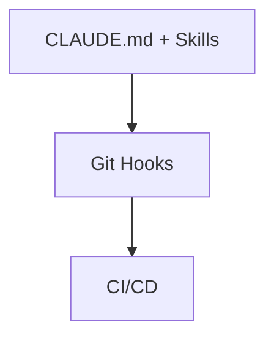

# 智能体技能（AI Agent Skills）

> “不要试图让天才背诵整本百科全书。给他一块技能插槽，在他需要时自动载入对应的技能芯片。”

在与先进的 AI Agent（如 Claude Code）结对编程时，如果我们把所有的项目背景、规范、构建命令和特定任务的提示词全部塞进全局规则中，很快就会遇到“认知载荷超载”与“上下文稀释”的问题。

为了解决这一痛点，Agent Skills（智能体技能）应运而生。它正在迅速成为 AI 编程工具的标配。如果说全局规则是常驻大脑的“全局常识”，那么 AI Skills 就是一块块按需插入的“技能芯片”。本文将系统讲解 Skill 的本质、底层运转机制、适用时机以及如何为你的项目定制专属技能。


## 什么是 AI Skill？

Skills 是 `.claude/skills/` 目录下的一组技能目录（Skill Folder）。每个 Skill 以一个独立文件夹存在，核心入口文件为 `SKILL.md`。它们的价值在于：把本该反复在 `CLAUDE.md` 或对话中重新解释的知识，变成可以按需触发的可复用模块。Anthropic 官方的定义也极为简洁： “一个 Skill 是一组指令——打包成一个简单的文件夹——它教会 Claude 如何处理特定的任务或工作流。”

从技术本质上看，Skill 是一种基于提示词的模块化能力扩展机制（Prompt-based Meta-tool）。它并不是可执行代码（不会运行 Python 或启动 HTTP 服务），而是一个按需加载的指令包。

其基本结构由顶部的 YAML Frontmatter（控制触发方式）和下方的 Markdown 指令主体组成：

```markdown
---
name: skill-name        # 技能唯一标识符 (kebab-case)
description: text       # 语义匹配的关键描述（AI 判断是否加载的重要依据）
---

# 技能标题

## 核心约束与流程说明...
```


### 两个绝佳的类比

1. 技能芯片 (Skill Chip)
   这就像黑客帝国中插在脑后的芯片。AI 平时不需要掌握这项技能，只有在执行特定任务时才临时加载。

2. 食谱与副厨师 (Cookbook vs Sous Chef)
   Skill 更像“食谱”，提供步骤与规范；AI 仍然是执行者。而子 Agent 更像一个“独立同事”，负责完成一整段工作。


## 核心优势与底层运行机制

### 渐进式披露（Progressive Disclosure）

AI Skills 能够实现“按需加载”，关键在于 Frontmatter（YAML 元数据）与渐进式披露机制的结合。它用于减少全局规则长期占用上下文的问题。

整个过程可以理解为两阶段：

### 第一阶段：轻量级注册

AI 只读取每个 Skill 顶部的 YAML 元数据（如 `name` 和 `description`），用于建立索引，不加载正文。

### 第二阶段：按需加载

当用户输入任务时，系统会根据当前请求与所有 Skill 的 `description` 做语义匹配。一旦匹配成功，对应 Skill 的 `SKILL.md` 内容才会被完整加载到上下文中。


## Skill vs 全局规则 vs 子 Agent

三者都能扩展 AI 能力，但机制完全不同：

| 维度    | 全局规则 (CLAUDE.md) | AI Skills（技能芯片） | 子 Agent（独立同事） |
| ----- | ---------------- | --------------- | ------------- |
| 本质    | 静态项目宪法           | 按需加载的指令包        | 独立执行的 AI 实例   |
| 加载机制  | 全局始终存在           | 语义匹配后加载         | 任务级启动         |
| 上下文占用 | 长期占用             | 按需短暂加载          | 独立上下文窗口       |
| 适用场景  | 全局规范、技术栈约定       | 可复用流程、工具规范      | 多步骤复杂任务       |


## 什么时候应该用 Skill？

### 决策树指南

* 是工具 / 转换 / 模板吗？ 👉 用 Skill
* 是可复用流程吗？ 👉 用 Skill
* 是领域性规则或规范吗？ 👉 用 Skill
* 需要多步骤推理与执行协调吗？ 👉 用子 Agent
* 是复杂工作流或带验证循环任务吗？ 👉 用子 Agent

核心建议：从 Skill 开始。Skill 更轻量、更易维护。只有在需要复杂编排时才升级到子 Agent。两者可以协同使用。


### 典型应用场景

* 文件转换：PDF → 文本、DOCX → 解析
* 研发规范：Git Commit 规范、代码审计流程
* 模板生成：API 文档、接口说明、邮件模板
* 标准化流程：排错步骤、部署规范、代码 review checklist


## 如何创建与部署 Skill？

### 1. 目录结构规范

Skill 分为两种作用域：

* 用户级（全局技能）：`~/.config/claude/skills/` 或 `~/.claude/skills/`
* 项目级（推荐）：`.claude/skills/`（随 Git 提交）

每个 Skill 是一个独立文件夹：

```text
your-project/
├── .claude/
│   └── skills/
│       └── git-commit/
│           ├── SKILL.md
│           ├── examples.md
│           └── scripts/
```


### 2. 编写 SKILL.md 模板

```markdown
---
name: git-commit
description: Generate Conventional Commit messages based on git diffs. Use when writing commit messages or reviewing changes for commits.
---

# Git Commit 规范生成技能

当你被要求生成 Git Commit 消息时，请遵守以下规则：

## 1. 提交格式
<type>(<scope>): <subject>

- feat: 新功能
- fix: 修复问题
- docs: 文档修改

## 2. 约束
- 标题不超过 50 字符
- 使用祈使句（add x，而不是 added x）
```


### 3. 典型脚手架 Skill 案例

#### 案例一：创建新功能模块

````markdown
---
name: new-feature
description: Create a new feature module under features/ with standard vertical slice architecture
---

# 创建新功能模块

## 目录结构

```
src/features/{module_name}/
├── router.py
├── service.py
├── repository.py
├── schemas.py
├── tests/
```

## 约束
- 所有模块必须使用统一结构
- 所有 DB 操作必须进入 repository
- router 必须在 main.py 注册

## 完成后
- 运行 typecheck
- 注册 router
````


#### 案例二：数据库迁移 Skill

````markdown
---
name: db-migration
description: Handle Alembic database migrations safely. Use when modifying database schema or models.
---

# 数据库迁移规则

## ⚠️ 硬性约束
- 不修改历史 migration 文件
- 不在 migration 中写业务逻辑
- 必须支持 downgrade

## 标准流程
```bash
alembic revision --autogenerate -m "update schema"
alembic upgrade head
alembic downgrade -1
```

## 完成标准
- 测试通过
- 可回滚
````


## 最佳实践与避坑指南

### 1. description 是关键入口

description 是 Skill 被匹配的最重要语义依据：

* ❌ 模糊：This is a git skill
* ✅ 清晰：用于生成符合 Conventional Commit 的提交信息，在用户编写 commit 或 review diff 时触发


### 2. 精细化拆分 Skill

不要创建“万能 Skill”。例如：

❌ backend-helper
✅ db-migration / api-doc-generator / log-analyzer


### 3. 控制复杂度

Skill 应保持轻量，复杂说明可以拆分到：

* examples.md
* references/


### 4. 用“参照”替代抽象描述

❌ “按照项目规范创建模块”
✅ “以 billing 模块为模板复制结构”


## 防止“脚手架遗忘”

### 三种常见问题

* 文件放错目录
* 重复造轮子
* 命名风格漂移


### 解决方案：用参照替代规则

```markdown
❌ 抽象规则
“按规范创建模块”

✓ 参照式约束
“严格复制 billing 模块结构，不允许改变目录布局”
```


## 逆向工程：从已有项目生成规范

```markdown
请分析代码库并生成 CLAUDE.md 草稿，包括：

1. 目录结构模式
2. 命名约定
3. 测试组织方式
4. import 风格
5. 潜在禁区

并说明每条规则的依据
```


## Skill 与 Hooks 的协作

可以构建三层约束体系：



* Skills：提供概率性引导
* Hooks：提供本地确定性约束
* CI：提供最终强校验

三者结合才能形成稳定工程系统。


## 跨工具支持与总结

Skill 机制已逐渐成为跨工具标准，被多种 AI 编程工具支持，实现“一次编写，多端使用”。


### 一句话总结

AI Skills 是一套“按需加载的能力模块系统”。它把工程经验拆解成可复用的技能单元，让 AI 在需要时临时加载，在不需要时保持轻量，从而解决全局规则长期占用上下文的问题。

写好 description，做好拆分，并与 CLAUDE.md、Hooks、子 Agent 协同设计，才是发挥这套系统最大价值的关键。
