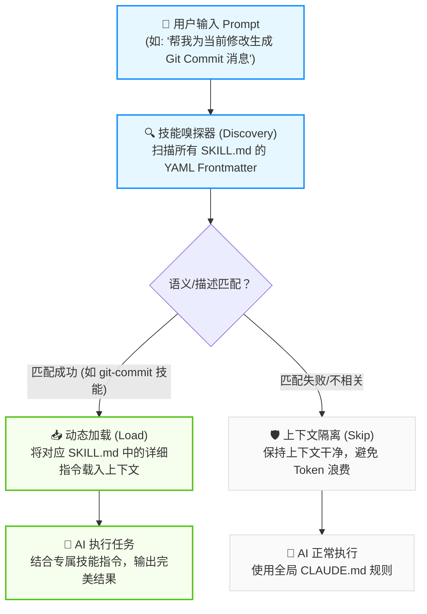

# 技能芯片：AI Skills

> “不要试图让天才背诵整本百科全书。给他一块技能插槽，在他需要时自动载入对应的技能芯片。”

在与 Claude Code 等先进的 AI Agent 结对编程时，如果我们把所有的项目背景、规范、构建命令和特定任务的提示词全部塞进 `CLAUDE.md` 中，很快就会遇到我们在 [项目宪法](file:///c:/projects/cocode/docs/rules.md) 中提到的“认知载荷超载”与“上下文稀释”问题。

为了解决这一痛点，Claude Code 引入了 **AI Skills (技能系统)**。如果说 `CLAUDE.md` 是常驻大脑的“全局常识”，那么 AI Skills 就是一块块按需插入的“技能芯片”。本章将深入拆解 AI Skills 的作用、底层运转机制，并手把手教你如何为自己的项目定制专属的技能芯片。


## 什么是 AI Skills？

AI Skills 是一种**基于提示词的模块化能力扩展机制**。它允许开发者将针对特定任务（例如：编写 Git Commit 消息、执行数据库迁移审计、生成 API 接口文档等）的规则和上下文，封装成独立的技能文件。

### Rules 与 Skills 的 ROI 权衡

虽然 `CLAUDE.md`（项目规则）和 `.claude/skills/`（AI 技能）都是为了约束和引导 AI，但它们的加载机制和使用成本有着本质的区别：

| 特性维度 | 项目规则 (Rules - CLAUDE.md) | AI 技能 (Skills - SKILL.md) |
| --- | --- | --- |
| **加载机制** | 全局强制加载，每次对话都常驻上下文。 | 动态按需加载，仅在任务相关时载入。 |
| **Token 消耗** | 持续消耗。随着规则增加呈线性增长，容易稀释模型注意力。 | 按需消耗。平时仅消耗极少量描述 Token，激活时才全量载入。 |
| **适用场景** | 全局构建命令、测试指令、核心技术栈约定、团队开发红线。 | 特定垂类任务规范（如：Git 规范、SQL 迁移审计、Docker 配置）。 |
| **存放位置** | 项目根目录 `CLAUDE.md` 或 `.claude/rules/`。 | `.claude/skills/[skill-name]/SKILL.md`。 |

通过引入 Skills，我们可以在维持全局上下文极其干净的前提下，赋予 AI 几乎无限的专业领域操作规范。


## Skills 的工作原理与发现机制

AI Skills 能够实现“按需加载”的底层魔法，在于它独特的 **YAML Frontmatter (前置元数据)** 声明以及**渐进式披露 (Progressive Disclosure)** 机制。

当 Claude Code 启动时，它并不会一次性读取所有的技能内容，而是采用两阶段加载策略：

1. **第一阶段：轻量级注册（扫描描述）**
   Claude 只会读取每个技能最顶部的 YAML 元数据中的 `name`（技能名称）和 `description`（技能描述）。这部分数据非常小（单技能仅约几十个 Token），几乎不占用上下文空间。
2. **第二阶段：动态唤醒（语义匹配）**
   当你在对话中输入指令时，Claude 会在后台将你的请求与所有已注册技能的 `description` 进行语义关联度计算。一旦判定当前任务需要该技能，Claude 才会将该技能的 Markdown 主体指令完整载入当前的上下文窗口。




## 如何制作一个 AI Skill？

在项目中创建和部署一个 Skills 非常简单，只需遵循规范的目录结构和元数据声明即可。

### 目录结构规范

Skills 分为**项目级技能**和**用户级全局技能**：
* **项目级技能**（推荐，随 Git 提交，团队共享）：保存在项目根目录的 `.claude/skills/` 文件夹下。
* **全局技能**（个人专属，所有项目通用）：保存在用户家目录下的 `~/.claude/skills/` 文件夹下。

每个技能必须是一个独立的文件夹，且文件夹内必须包含一个名为 `SKILL.md` 的 Markdown 文件：

```text
your-project/
├── .claude/
│   └── skills/
│       └── git-commit/        <-- 技能名称目录 (必须为 kebab-case)
│           └── SKILL.md       <-- 技能定义文件 (固定名称)
```

### 编写 SKILL.md 模板

打开 `SKILL.md`，其内容必须严格由两部分组成：顶部的 **YAML Frontmatter** 和底部的 **Markdown 指令主体**。

```markdown
---
name: git-commit
description: Automatically generate structured Conventional Commits messages based on local git diffs.
---

# Git Commit 规范生成技能

当你（Claude）被要求生成 Git Commit 消息或提交代码时，请严格遵守本技能的约束：

## 1. 提交格式
每次提交必须符合 Conventional Commits 规范，结构如下：
`<type>(<scope>): <subject>`

- **feat**: 新增功能
- **fix**: 修复 Bug
- **docs**: 仅修改文档
- **style**: 格式调整 (不影响代码运行的变动)
- **refactor**: 重构 (既不修复错误也不添加功能的修改)
- **test**: 增加测试

## 2. 约束条件
- 标题行不得超过 50 个字符。
- 使用祈使句（如 "add x" 而非 "added x"）。
- 如果有破坏性变更 (Breaking Changes)，必须在描述中以 `BREAKING CHANGE:` 开头说明。
```


## Skills 的编写技巧与避坑指南

要让 Skills 能够精准被 Claude 发现并高效执行，需要注意以下工程细节：

### 1. 描述（Description）编写艺术
`description` 是 Claude 决定何时加载该技能的唯一依据。因此，描述必须极其精准：
* ❌ **低效的模糊描述**：`"This is a skill to help write git commits."`（过于简单，缺乏触发场景的关键词）。
* ✅ **高效的动作描述**：`"Use this skill when the user asks to write a git commit message, generate a commit, or review local changes for a git commit."`（明确指出了触发该技能的多种动作短语和意图）。

> [!IMPORTANT]
> 技能描述必须保持在 **一行内**（不要换行），且长度一般控制在 1024 字符以内。

### 2. 命名约束（Kebab-Case Only）
技能的文件夹名称以及 YAML 中的 `name` 字段，必须严格使用 **连字符命名法 (kebab-case)**。
* ❌ `gitCommit` 或 `Git_Commit`
* ✅ `git-commit`

### 3. 精细化技能拆分
不要试图创建一个名为 `backend-helper` 的全能型大技能，这会重新走回上下文稀释的老路。正确的做法是按功能维度进行微小而专注的拆分：
* `db-migration`：专门处理数据库迁移文件与 SQL 审计。
* `api-doc-generator`：专门从代码路由中提取元数据并更新 OpenAPI 规范。
* `eslint-fixer`：专门处理复杂的 Linter 报错和自动重构。
