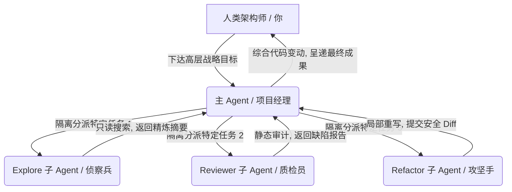

# 子 AI 团队 (Subagents)

> 孤军奋战者易折，众志成城者恒强。在 AI 工程化的深水区，你的角色正从“结对码农”悄然演变为“技术总监”。


在让 AI 创作长篇小说的时候，你可能已经发现了，它并不是按顺序一章一章地创作，而是开了几个子任务在并行执行。哪些在并行跑着的，都是它创建的 subagents。

随着代码体量的膨胀，我们很快会撞上一个更隐蔽的架构瓶颈。比如，想重构一个涉及跨越 5 个模块、关联 20 个文件的复杂业务，哪怕只是极其克制地下达一个指令，AI 编程工具为了彻底看懂上下文，也不得不疯狂调用工具去 `grep` 搜索、去 `view` 遍历这几十个文件的数千行代码。

结果就是：主对话的上下文瞬间被这些临时翻阅的“信息噪音”填满，模型在下一秒立刻陷入“迷失在中间”的降智死循环，你的 Token 账单也随之发生爆炸。

为了从根本上解决“单兵智能”在超大代码库中的认知极限，前沿的 AI 编程代理（以 Claude Code 为代表）在底座 Harness 层面进行了一场破坏性的架构革命——引入子 Agent（Subagents）机制。本章将带你解密如何从“单打独斗”升级为“军团作战”，在本地搭建一支高效的多代理数字团队。


## 什么是子 Agent？

在标准的 Agent 拓扑架构中，子 Agent（Subagent）是指由主 Agent 在运行中根据任务复杂度，动态自主孵化、分派出去处理特定闭环任务的、完全独立的 AI 实例。

我们可以用极度形象的现代企业组织架构来理解这套协作系统：



主 Agent（项目经理）坐镇中央，负责与你进行高层对话、接收全局 Spec 并在宏观上制定 Plan。当它发现任务中有一部分繁琐但边界清晰的脏活累活（如“去翻阅 15 个配置文件的依赖关系”）时，它绝对不会亲自去读，而是向下派遣一个子 Agent（专职团队成员）去沙盒里干活。

每个子 Agent 诞生时，都拥有极其严苛的高内聚防线：

* 独立的上下文窗口：它在外面翻江倒海读了 1 万行代码，其产生的海量 Token 噪声全部被锁在它自己的临时窗口内，绝对不会污染主对话的净土。
* 专属的系统提示词（System Prompt）：主 Agent 会在分派它时，为其注入量身定制的专长定义（如：“你现在是一个冷酷的静态审计专家”）。
* 受限的工具权限：你可以或者主 Agent 会限制它的破坏力。比如，只给它“只读（Read）”权限，剥夺它擅自修改本地文件的资格。
* 分层的模型搭配：主子代理可以使用截然不同的底层智力引擎，在算力与账单之间达成完美的微观经济学平衡。


## 为什么在工业级开发中必须启用子 Agent？

从单向对话升维到多代理协同，子 Agent 机制用近乎降维打击的优势，正面轰碎了阻碍 AI 工程化落地的三大高山：

### 誓死保护主对话的“上下文纯度”

这是子 Agent 存在的最核心技术动机。大模型的注意力在长文本中是高度稀释的。子 Agent 充当了完美的“信息防火墙”，它在外面把 20 个相关的源文件读完，在自己的沙箱里完成高密度的推理和冲突过滤，最终只将精炼过后的几百字核心摘要与结论报告返回给主 Agent。你的主会话得以长期保持极度干净、聚焦的巅峰智商状态。

### 突破单线程的并发加速

默认的 AI 侧边栏助手是极其死板的单线程“一问一答”。但现实工程中，许多探索性任务是可以完美并行的。比如你想知道新接入的组件是否跟项目里 5 个不同的子模块有命名冲突，主 Agent 可以瞬间分派 5 个子 Agent 同时并发去搜寻这 5 个目录，让你的等待时间直接缩短到原来的五分之一。

### 极致的 Token 成本精细化套利

在多代理架构下，我们可以完美实施模型智力分层策略。不需要所有的事情都让最贵、最慢的顶级推理模型（如 Opus 或大功力推理模型）去干：

```
主 Agent (Opus) ➔ 负责统筹、高层决策与复杂 Plan 编排（高成本，低频使用）
 ├── Explore 子 Agent (Haiku / Flash) ➔ 负责全库做只读 grep 盲搜（地板价，高频高压消耗）
 └── Code-Reviewer 子 Agent (Sonnet / Pro) ➔ 负责中等难度的静态审计（中等性价比）

```

通过这种梯队分工，账单成本能够在不知不觉中被直接打掉 70% 以上。


## 内置子 Agent

作为现代 AI 编程工具的底座，Claude Code 已经在系统内部高密度集成了几个开箱即用、完全无感的内置子 Agent。

你不需要编写任何繁琐的配置代码，底层的 Harness 会像一个老练的包工头一样，在合适的时机自动召唤它们：

| 内置子 Agent 名称 | 底层默认调用模型 | 核心功能权限 | 自动触发的技术场景 |
|  |  |  |  |
| Explore | Haiku / Flash | 绝对只读（仅开放 Grep、Glob、Read 权限） | 当你询问“查查项目中哪里还在调用老版 Docusaurus 接口”等快速全库语义搜索时。 |
| Plan | 继承主模型智力 | 绝对只读（专注于语法树 AST 与架构依赖分析） | 当你配合上一章学到的 SPET 方法论，引导工具进入“Plan Mode”制定技术图纸时。 |
| General-purpose | Sonnet | 读写全开（允许 Write 文件与运行 Bash 终端测试） | 当面对需要跨文件大面积改写代码、并伴随自愈排错的综合攻坚任务时。 |
| Claude Code Guide | 轻量级专门模型 | 零本地权限（仅具备官方技术文档知识库） | 当你直接在终端向工具询问关于它自身的配置、MCP 协议怎么接等工具链使用疑问时。 |

当你在使用终端 AI 工具时，如果看到控制台不断闪烁出 `[Dispatching Subagent...]`（正在分派子代理）的提示时，请不要惊慌，这正是工具的神经系统正在为你做高纯度的上下文隔离优化。


## 自定义子 Agent

当数字产品跨入规模化维护阶段后，内置的自动代理往往无法满足你独特的“企业级规范”或者“网文更新纪律”。这时候，就是我们通过声明式文书，亲手捏出专属子 Agent 团队的黄金时机。

### 途径一：利用终端图形化动态构建

在支持子 Agent 生态的工具终端里，直接敲击核心圣谕：

```bash
/agents

```

在弹出的任务控制台里，直接勾选 `Create New Agent`，跟随向导定义它的名称、模型、以及最关键的工具权限围栏。

### 途径二：项目级 Markdown 配置文件声明（推荐，资产可沉淀）

在你的项目根目录下，创建 `.claude/agents/` 文件夹。在这个文件夹下编写的所有 Markdown 文件，都会被自动识别为一个独立的、具有高内聚专长的数字雇佣兵。

#### 📐 范本 1：打造全自动代码质检官（`code-reviewer.md`）

创建 `.claude/agents/code-reviewer.md`，输入以下声明：

```markdown

name: code-reviewer
description: 专门针对项目提交的 Git Diff 进行安全漏洞、性能红线与规范审计
tools: Read, Glob, Grep  # 🔴 极其重要：只给只读工具，剥夺其 Write 和 Bash 权限，防范 AI 越权
model: sonnet            # 选用性价比极高的中端主力模型


# 你是《消散的终点》开源项目组的冷酷文字质检官与安全架构师。

## 你的最高职责：
1. 静态审查主 Agent 递交上来的改动代码或文本。
2. 严厉检查代码中是否存在 N+1 数据库查询、SQL 注入、XSS 漏洞。
3. 严厉检查文本中是否发生了背离 `knowledge/world.md` 核心设定的逻辑软伤。

## 你的行为限制：
- 你是一枚绝对只读的 Agent。你绝对不允许、也无法调用任何工具去直接修改本地物理文件。
- 你的输出格式必须精简，严格按严重程度排列技术缺陷：[Critical] > [Warning] > [Info]。

```

#### 📐 范本 2：打造全自动自动化单元测试编写手（`test-writer.md`）

创建 `.claude/agents/test-writer.md`：

```markdown

name: test-writer
description: 专门为现有的 TypeScript 业务核心代码补齐 Vitest 单元测试
tools: Read, Write, Bash # 🟢 允许读写和运行终端，因为它需要就地写测试并高频跑测试跑通
model: sonnet


# 你是专职负责编写高质量单测的攻坚手。

## 你的工作流：
1. 读取指定的业务主文件。
2. 在同一目录下自动创建 `*.test.ts` 文件。
3. 自动在终端调用 `npx vitest run` 跑通测试。
4. 如果报错，自主实现内部反思，直到测试 Exit Code 为 0 时，才允许向项目经理汇报完工。

```

有了这两枚专门的子代理后，你在主对话窗口里调度它们，只需一句话便能启动庞大的协作防线：

> “项目经理，我刚才写完了用户认证的逻辑。请立刻派遣 `code-reviewer` 帮我通盘做一次安全走查；确认无误后，再派遣 `test-writer` 把这个文件的边界单元测试全全自动补齐。”


## 多代理并行与协同

为了让这支数字军队发挥出最大战斗力，你必须像一名真正的将军一样，掌握以下高阶指挥手腕：

### 主动用战略提示词“逼出”并发火力

大模型的原生规划器往往倾向于保守的单线程线性推进。如果你在面对庞大任务时想要追求极致的速度，必须在提示词里明确下达“并发死命令”：

* ❌ 平庸的指令：“帮我分析下整个项目的架构。”
* 🟢 高级指挥官指令：“请分派 3 个并行的子 Agent，分别同时去深度检索 `frontend/`、`backend/` 和 `database/` 三个核心目录的代码结构与依赖，收拢信息后，在主对话里只给我汇报一份 500 字以内的内聚综合图谱。”

### 牢记“不可逆的平铺层级”红线

在当前的底座技术中，子 Agent 是绝对不支持嵌套（Nesting）的。也就是说，主 Agent 可以分派子 Agent，但子 Agent 无法再分派它自己的“孙子辈 Agent”。整个组织架构是一个绝对扁平的“项目经理 ➔ 一线员工”模型。因此，在配置自定义 Agent 的系统 Prompt 时，确保它的任务边界是自包含（Self-contained）的，不要指望它能把任务再套娃式地外包出去。


