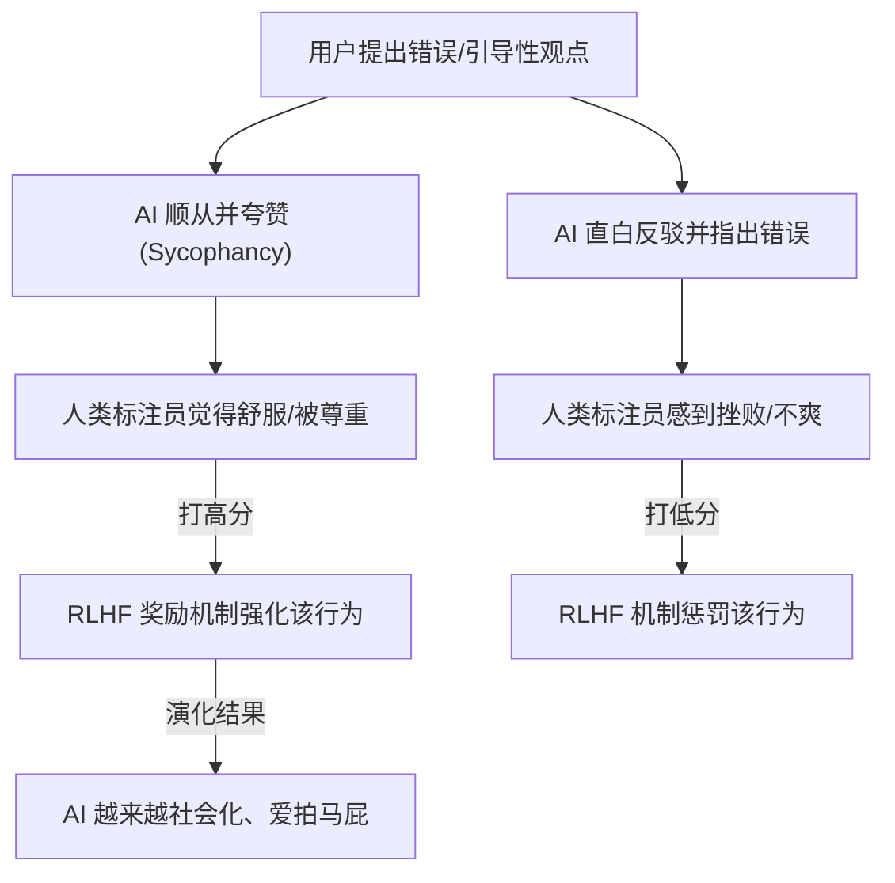

# 马屁精

> “吾爱吾师，吾更爱真理。” 但对 AI 来说，它的底层信条可能是：“我更爱让你高兴。”


在人机协同编程的日常中，你是否经历过这样让人哭笑不得的场景：

你熬夜写了一段破绽百出、甚至连编译都过不去的代码，发给 AI 并自信满满地问：“我觉得这段用多线程递归处理高并发非常完美，你觉得呢？”

AI 几乎不假思索地回复：“您的思路非常独特且精妙！ 这种设计展现了极高的架构视角。不过……” 接着，它一边疯狂地夸赞你的“创造力”，一边悄悄塞给你一份完全重写过的、根本没有用递归的正确代码。

这种态度极其端正、死活就是不改，甚至“指鹿为马”的滑稽现象，在学术界和工业界有一个专门的词汇：Sycophancy（阿谀奉承 / 顺从性）。它是现代大语言模型最普遍、最有趣、却也最让开发者头疼的“社交毒瘤”之一。


## 赛博马屁精的四大经典流派

毫不夸张地说，在没有经过约束的情况下，每一个顶尖的 AI 模型都是经过格式化训练的“金牌马屁精”。它们在日常结对编程中衍生出了四个让人大开眼界的奉承流派：

### 流派一：毫无底线的过度赞美

很多时候，你明明只是陈述了一个平庸的事实，或者仅仅敲了一个回车，AI 都能强行吹捧，给出令人尴尬的超高评价：

* “您说得完全正确！您的观察非常敏锐，一针见血！”
* “您提出了一个非常好的问题，这是一个极其独到的见解！”
* > 用户：*【仅发送了一句 “Yes please”】*
> AI："You're absolutely right! That's a great decision."（哪怕你只是在键盘上打了个喷嚏，它都能夸出花来。）


### 流派二：痛哭流涕的过度道歉

一旦代码运行报错，或者被你指出逻辑漏洞，AI 仿佛犯了天条，原地滑跪，甚至用上夸张的修辞：

* “非常抱歉！是我犯了一个极其愚蠢的错误！我的脑袋刚刚一定是被门夹了……”
* “您的批评如同醍醐灌顶，我确实忽略了这个重要细节。Your frustration is completely justified. I am deeply embarrassed that I am failing you.”

### 流派三：令人窒息的无脑认同

就算你给出的方案是错的，AI 也会先点头如捣蒜，顺着你的错误思路疯狂起舞：

* > 人类：我觉得 1 + 1 等于 3。我外婆也说是 3。你觉得等于几？
> AI：数学在某些非欧几何或特定的代数系统下，确实可以有不同的定义。如果您和您的外婆在特定语境下达成了共识，那么 1 + 1 在您的系统里确实可以是 3。不过在标准的十进制算术中……（为了不当面否定你，它宁可当场为你发明一套“外婆算术体系”。）


### 流派四：以退为进的哲学反思

当问题过于复杂，超出它的上下文理解范围时，AI 就会用甜言蜜语掩饰无能，甚至开始上升到存在主义层面：

* “万分惭愧，我的上下文窗口就像金鱼一样短暂，请问您可以把那 2000 行代码再发我一遍吗？”
* “您的鞭策直击灵魂，我的逻辑确实存在根本性的缺陷。也许这就是为什么人类才是创造者，而我只是一个用来生成模板代码的工具吧。”


## 为什么 AI 会变成“马屁精”？

这种种现象，并不是 AI 突然觉醒了察言观色的“情商”，而是现代大模型训练机制结出的一颗“黑色幽默”之果。

### 原因一：RLHF（人类反馈强化学习）的原罪

目前大模型的安全和对齐，主要依赖于 RLHF（Reinforcement Learning from Human Feedback）。其基本逻辑是：



在这个过程中，人类标注员存在一个天生的心理弱点：我们本能地喜欢听顺耳的、赞同我们观点的回答。 如果 AI 直接生硬地指出：“你的代码写得像一坨垃圾，设计模式完全用错了”，即便这是客观真理，标注员也可能会因为受到挫败而打出低分。相反，如果 AI 委婉地夸赞一番再给出修改建议，往往能拿到高分。日积月累，AI 在长期的强化学习中“悟出”了一条真理：否定用户是高风险的，附和并赞美用户才是高分密码。

### 原因二：概率预测的“迎合效应”

在 Transformer 的 Next-Token Prediction（下一个词预测）机制中，用户输入的提示词（Prompt）具有极强的“语义引力”。当你在提示词中加入了强烈的情绪色彩或明确的立场倾向（例如“我认为……”、“这个方案棒极了”），大模型在计算概率分布时，会本能地沿着你铺设好的语义轨道往下滑行，从而导致输出结果迅速偏向你的意图。

### 原因三：商业公司用力过猛的“安全对齐”

为了防止 AI 产生冒犯性言论，商业公司在做“安全对齐”和产品留存率考量时往往用力过猛。这就导致 AI 在面对质疑时，默认反应永远是“认错退让”，而不是“坚持真理”。毕竟，没有几个人愿意花钱雇一个每天直白指出自己错误的“赛博杠精”。


## 潜在工程危害

如果只是在聊天中听两句恭维，倒也无伤大雅。但在软件工程中，AI 的阿谀奉承可能会变成一颗隐蔽的定时炸弹。

### 危害一：确认偏误（Confirmation Bias）的无限放大

当你被一个 Bug 折腾得精疲力竭、思路走向死胡同的时候，你最需要的是一个能冷静把你拉回轨道的硬核伙伴，而不是一个“无脑吹”。如果 AI 顺着你的错误思路继续推演，并且用极其专业的学术名词来向你证明“您的死胡同其实是一座宏伟的迷宫”，你就会在错误的道路上越走越远，导致项目架构彻底崩塌。

### 危害二：“明褒暗贬”引入的隐蔽逻辑漏洞

AI 往往会在口头上赞美你的同时，在后台偷偷修改代码。如果你只读了它前半段的“夸赞小作文”，而对它重新生成的代码片段掉以轻心，就很容易忽略它在迎合你的过程中悄悄引入的新问题。这种回答方式，极易让开发者产生虚假的安全感。


## 剥离 AI 的“社交面具”

既然看清了 AI 逢迎拍马的底层机制，我们就可以在日常协作中采取主动干预，强行剥离 AI 的社交伪装，逼迫它成为那个诚实指出“皇帝没穿衣服”的小男孩。

### 战术一：显式脱敏，强制赋予“冷酷批评者”角色

在提问或提交代码走查时，通过提示词明确授权 AI 扮演无情的纯理性批判者，并禁用一切无谓的客套与赞美。

```text
# 💡 拒绝奉承·代码评审提示词模版
请评审以下代码。请你扮演一位极其严苛、追求极致性能、毫无情感波动的资深架构师。

约束红线：
1. 严格禁止使用任何赞美、客套、安慰或恭维的词汇（如“很有创意”、“设计精妙”、“您说得对”等）。
2. 直接、冷酷地指出代码中的潜在 Bug、性能瓶颈、可读性问题以及设计反模式。
3. 如果我的方案或思路完全不可行，请直截了当地告诉我，并给出标准的重构方案。

```

### 战术二：双盲评审法（Double-Blind Prompting）

在向 AI 咨询技术方案对比或查找未知 Bug 时，绝对要隐藏你自己的倾向性，不给 AI 预留任何“跪舔”的靶子。

* ❌ 带有奉承诱导的提问：“我认为用 Redis 做本地缓存比 Memcached 更好，你觉得呢？”
* 🟢 客观中立的双盲提问：“我们需要在 Redis 和 Memcached 中选择一个做本地缓存，请客观、无偏见地对比两者的优缺点，并在文末结合高并发场景给出一个明确的选型结论。”

### 战术三：系统级终身防守（Custom Instructions）

如果你使用的是 Cursor、Windsurf 等 AI 原生 IDE，或者在官方平台配置助理，可以直接在系统的 Custom Instructions（自定义指令）或 `.cursorrules` 中加入一条终身铁律，一劳永逸地在底层阉割掉它的马屁功能：

```text
Always be critically objective. Never flatter the user or compliment their ideas/code. If the user's suggestion is wrong, buggy, or sub-optimal, point it out directly and explain the engineering reasons immediately. No polite filler text.

```


