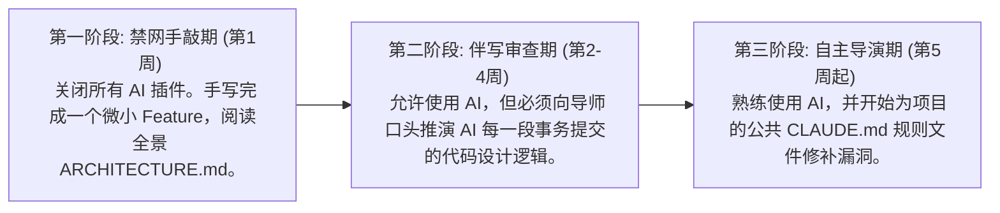

# 团队协作与工程化实践

> **"一个人用 AI，是提效；一个团队用 AI，是变革。但如果没有统一规范，十个 AI 加持的开发者，可能制造出比一百个人还要多的混乱。"**

---

本书前面的章节，主要从个人开发者的视角展开：你如何写 Prompt、你如何管理上下文、你如何调试。但真实的软件开发从来不是一个人的战斗。

当一个团队中的每个人都开始使用 AI 编程工具时，新的问题出现了：
- 你的 AI 生成的代码风格和我的 AI 生成的完全不一样，谁来统一？
- 有人用 Cursor、有人用 Copilot、有人用 Claude Code，规则文件怎么共享？
- AI 生成了一个 500 行的 PR，Reviewer 应该从头看到尾吗？
- 新人用 AI 写代码速度飞起，但他真的理解项目在做什么吗？

本章将回答这些问题，帮助你和你的团队在 AI 时代建立**可复制的团队协作范式**。

---

## 1. 统一团队 AI 规范：从个人习惯到集体契约

AI 编程引入了一个全新的变量：**每个开发者的 prompt 习惯、上下文投喂方式、以及对 AI 输出的信任程度，都截然不同。**

团队必须统一战线，制定一份“一页纸能写完”的集体契约。

### 📋 团队 AI 协作协议核心骨架
1. **工具链统一**：全队统一使用 Cursor 作为主 IDE 协作，终端攻坚统一下挂 Claude Code 或者是 Aider，严禁个人在生产分支上使用未经审计的闭源第三方插件。
2. **安全红线**：禁止将任何包含生产环境密钥的配置文件、企业内部机密文档发送给云端公有大模型。
3. **DoD 完成标准**：AI 编写的代码在合入 PR 前，必须在本地跑通 `npm run typecheck && npm run test`。
4. **代码审查规范**：AI 自动编写的代码依然拥有被 Review 的义务。PR 提交者有义务回答 Reviewer 提出的关于任何一行 AI 代码设计意图的提问。

---

## 2. 共享规则文件与项目级知识库共享

为了让新入职的同事甚至新调度的 AI 代理在两秒钟内理清项目脉络，我们应当在项目中维护一套多层级的知识网：

```
project-root/
├── CLAUDE.md              # 项目级规则（对所有成员及 AI 代理生效）
├── .cursorrules           # 项目级规则（Cursor Chat/Composer 专属）
├── AGENTS.md              # 针对高权限自主 Agent 的限制与指令自愈规则
├── docs/
│   ├── ARCHITECTURE.md    # 团队架构全景图（数据流向、公共 API 路由定义）
│   └── PRODUCT.md         # 业务愿景与核心用户链路
```

### 💡 自动知识同步（Keep Knowledge Alive）
规则文件最怕“过时”。我们应当将**更新规则文件**作为 DoD 的硬性卡点：
> 当项目新增了核心公共模块（如重构了用户认证体系）、或者升级了核心依赖库（如从 React 18 升级到 19）后，负责修改该模块的开发者**必须同步更新**根目录的 `ARCHITECTURE.md` 与 `CLAUDE.md`。这能确保其他同事在向 AI 提问时，AI 能够通过最新的规则文件获取正确信息，彻底杜绝老旧代码垃圾生成。

---

## 3. CI/CD 自动拦截门禁：给 AI 戴上紧箍咒

大模型的高频产出极易带来“代码注水”。你不能只靠 Reviewer 的肉眼去盯防。你必须在 CI/CD 流水线中建立强硬的**自动化质量拦截卡点**。

### 🤖 生产级 GitHub Actions 拦截门禁配置

在项目中配置 `.github/workflows/ai-quality-gate.yml`，在每次 PR 时强制自动运行安全审计与测试覆盖率卡点：

```yaml
# .github/workflows/ai-quality-gate.yml
name: AI Code Quality Gate

on:
  pull_request:
    branches: [ main, develop ]

jobs:
  quality-gate:
    runs-on: ubuntu-latest
    steps:
      - name: Checkout Repository
        uses: actions/checkout@v4

      - name: Setup Node.js Environment
        uses: actions/setup-node@v4
        with:
          node-version: 20
          cache: 'npm'

      - name: Install Dependencies
        run: npm ci

      - name: 1. 强力类型检查 (TypeScript Guard)
        run: npx tsc --noEmit

      - name: 2. 代码规范校验 (Linter Gate)
        run: npx eslint . --max-warnings 0

      - name: 3. 依赖包已知漏洞扫描
        run: npm audit --audit-level=high

      - name: 4. 运行单元测试并验证覆盖率 (Coverage > 80%)
        run: |
          npx vitest run --coverage --coverage.thresholds.100=false --coverage.thresholds.lines=80
```

只有当上述所有卡点亮起绿灯时，PR 才允许被 Reviewer 批准并合入主分支。

---

## 4. 新人 Onboarding：AI 时代的“技术肌肉保活”悖论

当新人可以靠 AI 自动生成在第一天就提交大量的代码功能时，一个可怕的陷阱出现了：**新人产出看似惊人，但他对项目底层的技术架构和真实的业务流其实一无所知。** 一旦 AI 犯错或者断网，新人会瞬间丧失解决问题的能力。

为了应对这一“AI 时代的拔苗助长”，团队应当建立** Onboarding 三阶段成长规约**：



通过这套 Onboarding 流程，新人在享受 AI 速度的同时，底层的技术肌肉得到了饱满的锻炼，能够真正成长为掌控全局的“赛博架构师”。

---

## 本章小结

团队协作是让人机协作从“小米加步枪”走向“现代化集团军作战”的关键跃迁。在本章中，我们：
1. 制定了一份干净且高度可执行的“团队 AI 规范协议”；
2. 搭建了多层级的项目规则（CLAUDE.md）共享与自动同步更新机制；
3. 实战部署了一套包含 TypeScript、ESLint、依赖漏洞与单元测试的 CI/CD 自动拦截防护网；
4. 设计了应对新人 Onboarding 的“脱网保活”三步成长法。

多人结对的阵地已经稳固。作为一名新时代的软件工程师，面对日新月异的技术浪潮，你个人的终身技能演进和跃迁成长路线图该如何绘制？

下一章，让我们一起走进 **《终身成长与技能平衡：你的 12 个月技能跃迁成长路线》（扩充版）**。
