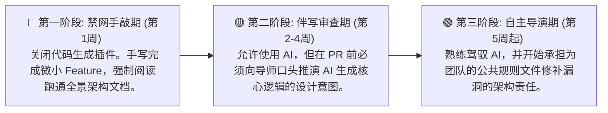

# 团队协作

> “上下同欲者胜。” ——《孙子兵法》

本书前面的章节，主要从个人开发者的视角展开：你如何写 Prompt、如何管理上下文、如何化身代码判官把控底线。但真实的商业软件开发，从来不是一个人的单打独斗。

当团队里的每个人都开始狂暴地挂载 AI 编程工具时，产出速度迎来了爆炸式增长，但全新的工程灾难也随之爆发：

- 代码风格割裂：你的 AI 习惯用函数式编程，我的 AI 偏爱面向对象，系统迅速沦为毫无设计可言的“缝合怪”。
- 审查瘫痪（Review Bottleneck）：以前一周出 1 个 PR，现在一人一天能丢出 5 个 500 行的 PR。Reviewer 根本看不过来，彻底放弃抵抗直接点 Approve。
- 隐性知识失效：老员工靠脑子里的“历史填坑经验”避险，但无状态的 AI 不知道这些坑，导致相同的 Bug 被不同的人反复生成。
- “影子 AI”泛滥：为了追求速度，员工私下将包含机密的生产代码发送给未经审计的公有云模型，带来极大的安全隐患。

本章将为你系统梳理，如何将人机协作从个人的“单兵游击战”，升级为防范熵增、高纪律性的“现代化集团军作战”范式。

## 协作的瓶颈从“写得慢”变成了“想得不一致”

在 AI 时代，团队协作的底层逻辑发生了剧变：AI 把团队合作里最费时的“打字执行”部分压扁了，但也把最容易被忽略的“理解偏差”放大了。

以前的合作是拼人力、拼技能，靠流程保证不出错；现在的合作是拼上下文、拼判断力，靠护栏保证不跑偏。

### 分工模式

过去，团队分工是前端做前端，后端做后端。现在，一个人带着几个 AI 代理（Agent），一下午就能端到端跑通一个全栈功能。因此，开发者的核心价值不再是“我会写这块代码”，而是“我懂这块业务的全部上下文，并能判断 AI 的产出对不对”。

结果就是：团队的建制可以变得更小，但个人的责任变得更大。2-3 人的全栈小队 + AI，能比以前 8 人的职能团队跑得快得多，反馈循环也可以被极限压缩。

### 角色进化

在这样的敏捷建制下，资深开发者的职责将从“带头写核心代码”跃迁为“意图架构师”：

- 验收卡前置（Vibe, then Verify）：开工前先写一张“验收卡”（3-5 条可测试的断言）。AI 可以随便生成，但代码合入前 Reviewer 只看这张卡过没过。没有验收卡，严禁唤醒 AI。
- 设计接口边界：人类负责定义模块契约与数据流向，AI 负责填充内部实现。

## 建立团队 AI 契约

AI 编程引入了一个全新变量：每个开发者的 Prompt 习惯、对 AI 输出的信任程度截然不同。为了约束这种非确定性的生产力，团队必须制定一份“一页纸能写完”的强制性集体契约。

### 团队 AI 协作协议核心骨架

- 工具链统一与影子 AI 治理：不要一味封堵，应提供企业官方支持的合规 AI 工具（如企业版 Cursor 或 GitHub Copilot）。严禁将任何包含生产环境密钥的配置文件、企业机密发送给不受控的云端模型。
- 明确人类兜底（Code Ownership）：仓库里每个核心模块必须有一个真人 Owner。AI 可以写 90% 的代码，但必须有一个人类按下 Merge 键，并对那 90% 负责到底。出问题找得到人，团队才敢放手让 AI 跑。
- 让 AI 代码“显形”：在复杂的 AI 生成逻辑上方添加简单的注释标记（如 `// AI-GENERATED: Claude 3.5 Sonnet`，`// REVIEWED-BY: 张三`）。这不需要繁琐的文档，只需让下一个接手的人知道他面对的是什么。
- 审查答辩义务：PR 提交者有义务回答 Reviewer 提出的关于任何一行 AI 代码设计意图的提问。答不上来“为什么这么写”，PR 直接驳回。

## 显性化项目知识库

在过去，团队的默契存在于老员工的脑子里。但在 AI 时代，没写下来的业务上下文，就等于不存在。团队必须将隐性的“部落经验”固化为机器可读的规则文件。

为了让新入职的同事，甚至新调度的 AI 代理在两秒钟内理清项目脉络，我们应当在项目中维护一套多层级的“共享大脑”网络：

```plaintext
project-root/
├── CLAUDE.md              # 项目级全局规则（声明架构意图、安全禁忌，对全员及AI生效）
├── .cursor/rules/         # Cursor 新版规则目录（.mdc 文件，旧版 .cursorrules 已 Legacy）
├── AGENTS.md              # 跨工具通用规则入口，针对高权限自主 Agent 的边界限制
├── .claude/skills/        # 团队共享的 Skills 指令库（原 .ai-skills/，统一命名）
├── docs/
│   ├── ARCHITECTURE.md    # 团队架构全景图（微服务边界、数据流向、公共 API 路由定义）
│   └── PRODUCT.md         # 产品决策日志（只写 3 行：为什么当初没做 A 而是做了 B）
```

### 自动知识同步（Keep Knowledge Alive）

规则文件最怕“过期”。过期的规则会让 AI 持续生成带有历史毒性的幻觉代码。我们必须将更新规则作为代码合并的硬性卡点（DoD）：

> 当项目新增了核心公共模块，或重构了基础组件后，负责该模块的开发者必须同步更新根目录的 `ARCHITECTURE.md` 与 `CLAUDE.md` / `.cursor/rules/`。只有这样，下一个接手的人在唤醒 AI 时，才能拿到最新的世界观。

## 部署拦截防线

大模型的高频产出极易带来“代码注水”。面对一天 5 个大型 PR 的冲击，单靠 Reviewer 的肉眼排雷是不现实的；你也不能用 AI 来审查 AI 生成代码的安全性（因为它们的盲区可能重合）。

你必须在 CI/CD 流水线中建立强硬的自动化质量拦截卡点——用确定性的机器规则，去框死非确定性的 AI 产出。

### 生产级 GitHub Actions 护栏配置示例

在项目中配置 `.github/workflows/ai-quality-gate.yml`，在每次发起 Pull Request 时，强制让机器先做“恶人”：

```yaml
# .github/workflows/ai-quality-gate.yml
name: AI Code Quality Gate

on:
  pull_request:
    branches: [ main, develop ]

jobs:
  quality-gate:
    runs-on: ubuntu-latest
    steps:
      - name: Checkout Repository
        uses: actions/checkout@v4

      - name: Setup Environment
        uses: actions/setup-node@v4
        with:
          node-version: 20
          cache: 'npm'

      - name: 1. 强力类型检查 (TypeScript Guard)
        # 拦截 AI 最爱犯的空指针与隐式 Any 错误
        run: npx tsc --noEmit 

      - name: 2. 规范与死代码校验 (Linter Gate)
        # 拦截高圈复杂度以及风格撕裂
        run: npx eslint . --max-warnings 0 

      - name: 3. 安全漏洞与依赖包扫描 (SAST & SCA)
        # 极度重要：拦截 AI 幻觉引入的不存在包或带有 CVE 漏洞的旧依赖
        # npm audit 默认高危会返回非零退出码，需确保 lockfile 存在
        run: npm audit --audit-level=high

      - name: 4. 运行单元测试并强制覆盖率 (Coverage > 80%)
        # 要求 AI 必须同步生成断言测试，低于 80% 机器直接打回
        # vitest 覆盖率阈值应在 vitest.config.ts 中配置 coverage.thresholds
        run: npx vitest run --coverage
```

只有当上述所有卡点亮起绿灯时，这份 AI 混编的代码才配进入人类 Reviewer 的视野。 此时，人类不再需要去抠语法错误，只需关注一件事：“验收卡满足了吗？系统架构被破坏了吗？”

##  新人培养

### 新人 Onboarding

当新人可以在入职第一天就靠 AI 飞速提交大段核心功能时，陷阱也随之而来：他对项目底层的技术架构和真实的流转机制其实一无所知。一旦断网或 AI 抽风，新人会瞬间丧失解决底层 Bug 的能力。

为了应对这种“拔苗助长”带来的技术肌肉萎缩，团队应当建立硬核的“Onboarding 三阶段成长规约”：


```mermaid
graph LR
    Stage1["🔴 第一阶段: 禁网手敲期 (第1周) <br> 关闭代码生成插件。手写完成微小 Feature，强制阅读跑通全景架构文档。"] --> Stage2["🟡 第二阶段: 伴写审查期 (第2-4周) <br> 允许使用 AI，但在 PR 前必须向导师口头推演 AI 生成核心逻辑的设计意图。"]
    Stage2 --> Stage3["🟢 第三阶段: 自主导演期 (第5周起) <br> 熟练驾驭 AI，并开始承担为团队的公共规则文件修补漏洞的架构责任。"]
```

### 从“速度”到“持久度”

团队全面拥抱 AI 之后，传统的绩效与工程度量指标已经失效，必须立刻扭转指挥棒。

❌ 必须立刻停止追踪的虚荣指标：

- AI 建议采纳率：高采纳率不等于高质量，反而极有可能意味着员工的盲目信任与认知懒惰。
- 代码行数 / PR 数量：AI 一秒钟就能生成一千行垃圾，代码产量不再是竞争优势。
- 开发交付速度：只看初版速度毫无意义，因为维护期的灾难往往被隐藏了。

✅ 必须开始追踪的生存指标：

- 代码短期流失率（Churn Rate）：AI 生成的代码在合入主干后，两周内被完全重写或删除的频率。如果极高，说明团队正在疯狂“制造屎山”。
- 缺陷逃逸率（Defect Escape Rate）：由 AI 引入的、绕过测试护栏并引发线上事故的 Bug 比例。
- 架构劣化指数（Architectural Erosion）：系统整体的圈复杂度（Cyclomatic Complexity）是否因为 AI 的随意打补丁而呈现陡峭的上升曲线？


AI 时代的团队协作，本质上是一场关于“业务上下文”和“架构控制力”的战役。

表现最顶尖的团队，是那些能够将隐性知识转化为机器可读规则、用确定性的流水线防线兜底非确定性的 AI，并让人类开发者坚决捍卫最终裁决权的团队。在这个纪元，靠体力单打独斗的“10x 程序员”终将谢幕，取而代之的，是能够高效统帅“人类 + 多智能体”混合军团的“10x 架构指挥官”。

前方的多人协作阵地已经稳固。作为一名新时代的软件工程师，面对日新月异的技术浪潮，你个人的终身技能演进和跃迁成长路线图该如何绘制？