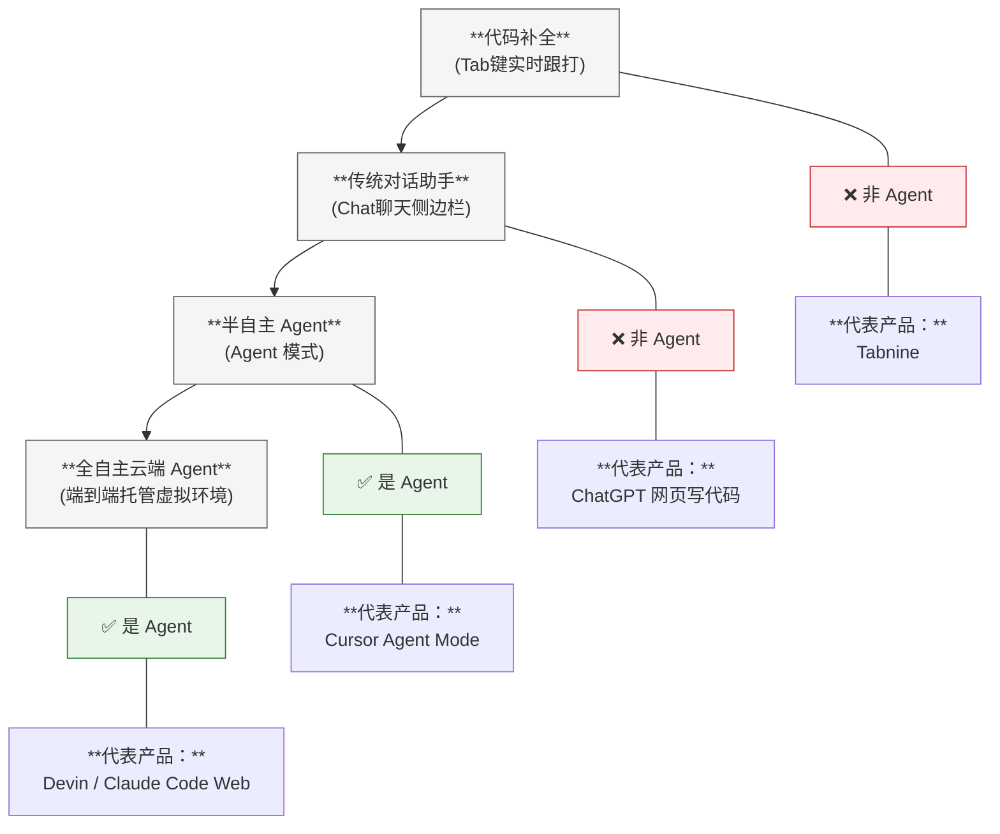
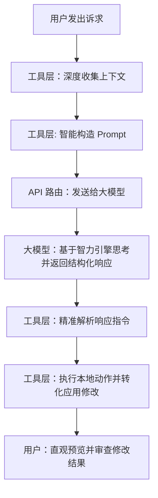

既然上一章已经对 AI Agent 的通用概念、闭环机制做了完整的解构，那么这一章的承接逻辑应当是“通用架构在垂直领域的具象化落地”。

我们需要删掉重复的“什么是 Agent”以及“Agent 与普通对话对比”的基础科普，直接**调取读者在上一章建立的认知储备**，将焦点精准对准“编程工具是如何一步步 Agent 化的”，以及“Agent 标准组件在 IDE/终端里对应什么”。

以下是调整过渡逻辑后的完整章节内容：

---

# AI 编程工具

> 工欲善其事，必先利其器。

大语言模型虽然功能强大，但如果每写一小段编程都要去网页上问一问，那也还是不方便的。

好在如今市面上已经有众多的编程工具，可以协助我们调用大语言模型，让编程变得更简单。在人机协同中，大模型扮演着“大脑”的角色，而工具则是“躯干”。

随着 AI 编程技术迈入新阶段，编程工具已经从最初的“代码自动补全插件”演变成覆盖软件开发全生命周期的庞大生态。本章将为你系统拆解 AI 编程工具与大模型之间的底层纽带、核心分类以及在实际开发中的选型闭环，帮助你构建一套坚固、高效率的 AI 开发阵地。

---

## 认知进化：工具与模型的分工

### 什么是 AI 模型？

AI 模型（如 Claude、GPT、Gemini、DeepSeek）是由 AI 厂商训练的大型语言模型。它们是纯粹的“智力引擎”。你给它文本输入，它返回文本输出。模型本身不能直接读取你的本地文件，无法运行编译命令，更无法直接修改你的项目代码。它只是一个高智商的“思考者”。

### 什么是 AI 编程工具？

AI 编程工具（如 Cursor、GitHub Copilot、Claude Code、Google Antigravity）是围绕模型构建的应用工具。它们是协助“大脑”与外界交互的“执行躯干”。工具层负责完成以下高频的工程任务：

* **上下文收集**：自动读取你代码库中的文件、索引依赖、解析抽象语法树（AST）。
* **Prompt 构造**：把你的开发诉求、相关上下文代码、本地报错信息和底层系统规则文件打包，组装成结构化的 Prompt 发送给模型。
* **动作转化执行**：接收模型返回的指令，将其转化为实际的本地操作（如精准修改文件、自动在终端运行测试命令）。
* **用户界面呈递**：在编辑器中提供直观的代码差异（Diff）预览、侧边栏对话和权限审批机制。

### 三位一体的类比模型

我们可以用人体系统来清晰类比这套协作框架：

| 角色 | 核心类比 | 职责说明 |
| --- | --- | --- |
| **AI 模型** | 大脑 | 负责高难度的逻辑思考、语义推理与代码生成 |
| **AI 编程工具** | 身体 + 感官 | 负责看（读取代码、捕捉报错）、听（接收指令）、做（读写文件、运行测试） |
| **工具层 Harness（底层框架）** | 神经系统 | 决定信息如何加工与传递，是拉开工具之间差距的关键工程设计 |

没有工具，模型就是一个“装在瓶子里的大脑”——空有屠龙之技却无法改变物理世界；没有模型，工具就是一个“没有灵魂的空壳”——有手有脚却盲目无知。

---

## 从通用 Agent 到编程 Agent：概念的落地承接

在上一章中，我们已经系统拆解了 AI Agent（智能代理）的顶层架构与其“感知-推理-行动-评估”的自主闭环。我们知道，Agent 的核心魅力在于它突破了传统“一问一答”的被动响应模式，拥有了操控外部工具的“手脚”与自我修正的“反思能力”。

那么，当这种通用的 Agent 哲学落地到软件工程领域时，它演化出了怎样的形态？

**一句话概括：现代主流的 AI 编程工具本质上就是专精于软件开发领域的垂直 AI Agent。** 就像无人驾驶汽车是专精于物理道路的 Agent 一样，Cursor、Claude Code 等工具则是穿行于代码世界里的 Agent。

### 兵器的演进：编程工具的 Agent 化历程

回顾技术发展史，AI 编程工具并不是一夜之间跨入 Agent 时代的，而是伴随着大模型能力的进化，经历了三个特征鲜明的技术代际：

#### 第一代：代码补全时代（2021-2023）

* **代表产品**：早期的 GitHub Copilot、Tabnine
* **工作流**：`开发者打字 ➔ AI 预测下一行 ➔ 开发者按 Tab 键接受`
* **Agent 程度**：零。此时的工具没有任何外部工具调用能力，不具备自主性。它不是 Agent，只是一个基于概率的“智能高级输入法”。

#### 第二代：对话式助手时代（2023-2024）

* **代表产品**：网页端 ChatGPT 写代码、Copilot Chat 侧边栏
* **工作流**：`开发者提问 ➔ AI 生成代码片段 ➔ 开发者手动复制粘贴到 IDE 中`
* **Agent 程度**：极低。虽然能理解复杂的业务需求并生成高质量代码，但由于没有给模型配备工具（无法直接读写本地文件、无法运行编译），它仍然不是 Agent，只是一个“更懂编程的问答系统”。

#### 第三代：自主型编程 Agent 时代（2024-至今）

* **代表产品**：Cursor Agent Mode、Claude Code、Aider
* **工作流**：`开发者描述目标 ➔ AI 自主检索代码库 ➔ 制定修改计划 ➔ 精准重写文件 ➔ 自动在终端运行测试 ➔ 发现测试失败 ➔ 自主分析日志原因 ➔ 再次修改代码 ➔ 重新测试直至通过 ➔ 向人类报告完成`
* **Agent 程度**：完全体。**有手脚（工具调用）、有主见（自主决策）、有闭环（重试修正）。这就是标准的 Agent 落地形态。**

### 架构映射：Agent 组件在编程工具中的工程实现

承接上一章学到的 Agent 标准组件架构，我们可以非常精准地将其映射到日常使用的 AI 编程工具中：

| Agent 通用组件架构 | 在 AI 编程工具中的具体实现 |
| --- | --- |
| **LLM（智力大脑）** | 底层接入的 Claude 3.5 Sonnet、OpenAI o1/o3、DeepSeek-R1 等前沿大模型 |
| **Tools Messengers（动作手脚）** | 文件系统读写 API、终端命令行执行器、代码库语义搜索器、内置浏览器、Linter 静态检查工具 |
| **短期记忆（Memory）** | 实时对话历史、当前被裁剪和拼接的上下文窗口（Context Window） |
| **长期记忆（Knowledge）** | 项目全局配置文件（如 `.cursorrules`、`AGENTS.md`）、企业内部架构文档 |
| **规划能力（Planning）** | 工具内置的“Plan Mode”（在动手改代码前，先强制生成多步骤技术拆解方案） |
| **感知能力（Perception）** | 全库向量索引、依赖树解析、抽象语法树（AST）动态分析 |
| **评估能力（Evaluation）** | 自动化测试框架（如 Jest、Pytest）、代码编译器报错拦截 |
| **反馈循环（Loop）** | 遇到执行错误时触发的自主修正：`测试失败 ➔ 提取日志 ➔ 自我反思 ➔ 重新生成代码 ➔ 重新编译` |

### 警惕混淆：工具生态的光谱分布

需要特别提醒的是，当前的 AI 编程工具生态并不是非黑即白的，它实际上呈现出一条**从“非 Agent”向“完全 Agent”过渡的连续光谱**：

**判定一个工具是否跨入 Agent 门槛的黄金标准，关键在于看它是否同时具备“工具自主调用”与“无需人类插手的多轮反思闭环”。**

### 概念沙盒：用 Agent 视角解构一个自动化脚本

为了让你彻底看清其底层逻辑，我们可以尝试用上一章的 Agent 理论来解构一个最简单的自动化小实验：假设我们要用 Python 编写一个调用大模型 API 来自动控制 Windows 操作系统的脚本程序。在这个微型系统中：

* **大脑（LLM）**：你通过网络请求调用的 OpenAI 或 DeepSeek API。
* **手脚（Tools）**：你利用 PyAutoGUI 库编写的模拟鼠标点击、键盘输入和读取屏幕截图的本地函数。
* **决策机制（Function Calling）**：大模型根据当前的屏幕截图状态，自主做出逻辑推断，决定接下来调用哪个函数（例如它发现需要保存文件，于是决定调用“点击保存按钮”的函数）。
* **反馈循环（Agent Loop）**：点击后 Windows 系统的新状态（操作成功或者弹出了报错弹窗）作为新的输入再度反馈给大模型，由它来决定是继续下一步，还是进行错误重试。

这个练习项目虽然体量微小，但其底层工作的哲学与 Cursor 或 Claude Code 完全如出一辙。它们之间唯一的区别仅在于：商业级编程 Agent 的工具箱里装的是“AST 解析、Git 提交、Linter 检查和测试运行器”，而你的简易 Agent 工具箱里装的是“Windows 底层操作系统 API”。

---

## 架构解析

一个典型的 AI 编程工具，其底座框架（Agent Harness）才是决定最终体验的胜负手。同一个大模型在不同的编程工具中表现可能大相径庭，原因就在于各家工具的 Prompt 构造策略与上下文管理技术存在巨大差异。优秀的工具通过自研的检索增强（RAG）和针对特定模型的指令调优，可以让中等模型释放出不亚于顶级模型“裸跑”的真实战斗力。

以下是 AI 编程工具（即编程 Agent）与大模型 API 交互的标准闭环工作流：

### 工具与模型的多元绑定策略

当前市面上的主流 AI 工具在对待模型的态度上，主要分为三大派系：

* **模型无关（Model-agnostic）的自由派**：以 Cursor 和 GitHub Copilot 为典型代表。它们不绑定任何单一模型提供商，而是构建了一个包容的生态网，允许用户在不同任务间自由切换大模型。它们的核心竞争力不在于模型本身，而在于如何为不同的前沿模型调优指令配置，甚至在后台引入了“自动模型选择”功能，能够根据任务的复杂度，自动把简单的补全路由给快速小模型，把复杂的重构路由给前沿推理大模型。
* **厂商专属的深度绑定派**：以 Google 的 Antigravity 为典型代表。它虽然名义上开始兼容外部前沿模型，但骨子里依然是全栈针对自家 Gemini 系列模型的底层特性（如百万级超长文本、特定的工具调用格式）进行极致的量身定制，把 Agent 循环与模型的推理风格做深度磨合，以求将单一生态的智力极限发挥到巅峰。
* **自研与外部双轨并行的混合派**：以 Anthropic 的 Claude Code 为代表。它为自己的 Claude 系列模型做了深度优化，但也允许用户通过自带密钥（BYOK）接入外部通用大模型处理。但效果肯定不及使用自家的模型。

---

## AI 编程工具分类

当前的 AI 编程工具生态已经远超早期简单的“IDE 插件”形态。根据业内最新的分类框架，这些工具可以按照交互与自动化模式划分为以下六大类别：

### 1. AI 原生 IDE

从底层架构阶段就围绕 AI 体验重新设计的独立编辑器。AI 在这里不是“菜单里的附属插件”，而是深度嵌入编辑心流的核心组织者。

* **代表产品**：Cursor（当前全球市场份额与讨论度最高的头部产品，主打强大的 Agent 模式与全项目代码块重写）、Windsurf（以极度顺滑的持续上下文感知引擎著称）、Kiro（针对合规行业打造的规格驱动开发工具）、Antigravity（依托 Google 研发的原生并发代理 IDE）。
* **优点**：工作流连贯性处于顶级，内联对话、全库索引、自动化脚本运行与可视化的代码 Diff 审查一气呵成。
* **缺点**：存在一定的编辑器迁移成本（多数基于 VS Code 深度定制改造）；在极庞大的万级文件大型代码库中，全库索引对本地资源的消耗较为明显。

### 2. 传统 IDE 插件

以插件形式接入你现有的开发环境，不打破你多年积累的快捷键与编辑器偏好。

* **代表产品**：GitHub Copilot（企业合规与工程落地领域的绝对巨头）、Cline（完全开源、自由度极高的强力 Agent 插件）、Continue（主打开源且全面支持本地私有化模型部署的优秀框架）、JetBrains AI Assistant（深度融合 IntelliJ 原生重构能力的官方插件）。
* **优点**：零迁移成本。完美保留了你在 IntelliJ、Vim、Xcode 或老版 VS Code 中的所有个人配置。企业级插件提供极佳的 SLA保障、审计日志与知识产权保护。
* **缺点**：受限于宿主编辑器的插件架构，AI 无法像原生 IDE 那样深度控制界面行为，Agent 的跨文件自主破坏性修改能力相对克制。

### 3. 终端代理 (CLI Agent)

完全运行在你的 Shell 终端中，采用对话式交互，直接拥有阅读文件、运行测试、执行各种终端命令的 Linux 级别最高执行权限。

* **代表产品**：Claude Code（在终端推理、大规模项目排查和 Linux 级沙盒隔离中表现极为强悍的终端利器）、Aider（最成熟、广受极客好评的开源 CLI 工具，支持自动 Git 提交与多模型挂载）、Gemini CLI。
* **优点**：自主性和破坏力最强，天然融入 Git 工作流与 CI/CD 脚本。其上下文窗口往往极为庞大，跨文件的全局深度 Bug 排查和大规模工程重构能力显著超越普通 IDE 插件。它能直接捕获编译或运行报错，实现本地的“执行-报错-反思-重试”闭环。
* **缺点**：学习曲线较为陡峭，缺乏直观的 GUI 可视化 Diff 界面，需要开发者对自己的命令行掌控力充满信心。

### 4. PR / 代码审查代理

不打断你写代码的实时心流，而是扮演一个在后台默默工作的异步“数字代码评审员”。

* **代表产品**：CodeRabbit（目前最专业的 AI 审查工具，能提供逐行级别的对话式代码评审）、GitHub Copilot Code Review。
* **优点**：完全异步工作。当你向 GitHub/GitLab 提交 Pull Request 后自动触发，能够敏锐捕捉到人类容易遗漏的安全漏洞、边界死循环与风格不一致问题。
* **缺点**：擅长查找局部技术硬伤，但在面对强业务逻辑正确性的判定时，理解深度仍然无法完全替代资深人类架构师。

### 5. 云端自主代理

提供高权限、长周期的最高阶段自主性。你只需要丢给它一个自然语言描述的任务（如“修复 GitHub 第 102 号 Issue 并跑通测试”），它就会在远程隔离环境中独立工作数小时，直接交付最终结果。

* **代表产品**：Devin（全球最早引起轰动的全自主 AI 软件工程师原型）、Claude Code Web、Cursor Cloud Agents。
* **优点**：极高程度地解放人类生产力。适合明确定义的、耗时长的任务，开发者可以同时处理其他核心工作，让 AI 在后台并行干活。
* **缺点**：实时控制感最弱，任务执行质量容易出现波动，一旦任务失败或陷入死循环，在按需计费模式下依然会产生高额的算力开销。

### 6. Web 应用生成器 (Vibe Coding 平台)

面向非专业开发者或全职工程师快速验证原型的全新形态。你只需要说出一句话，它就能在几分钟内从零为你生成一个包含全栈代码、数据库并完成一键上线的完整 Web 应用。

* **代表产品**：Bolt（基于浏览器内全栈运行的代表作）、Lovable（前端 UI 设计美感极强的生成平台）、v0（Vercel 打造的顶级 Next.js 生态技术界面生成器）、Replit Agent。
* **优点**：零编码门槛。从想法到可运行实体的速度快到令人发指，是快速搭建 MVP（最小可行性产品）和内部测试工具的绝佳武器。
* **缺点**：生成的代码往往属于“黑盒”，难以进行精细的后期维护与大规模重构，定制化能力较弱，不适合直接拿来作为企业生产环境的底层底座。

---

## 工具选型决策框架

面对如此庞大的兵器谱，如何选择最适合自己的装备？我们需要从性能体验、技术水平和综合成本三个核心维度来构建决策链。

### 性能与价格定位

在当前的市场格局下，不同工具与背后模型的搭配呈现出明确的梯度特征：

* **顶级推理/性能标杆 (高资费/固定月费)**
* Anthropic Claude 系列 (Sonnet / Opus) ➔ 编程逻辑与高级推理性能最强
* OpenAI 推理系列 (o1 / o3) ➔ 算法推演与长时思考能力顶尖

* **中端性价比均衡 (中等资费)**
* Google Gemini 系列 (Pro / Flash) ➔ 超长上下文容纳力与慷慨的免费额度

* **绝对价格底线 (极低成本/地板价)**
* DeepSeek 系列 (V4 / R1) ➔ 以极低的地板价成本提供媲美第一梯队的惊人编码表现

总结下来：

* **如果你追求极致的性能与推理正确率**：以 Claude 系列或 OpenAI 推理大模型为大脑的工具（终端运行 Claude Code 搭配 Claude Sonnet）是无二之选。它们在处理复杂的系统重构、深层 Debug 时具备最高的首发正确率，能够大幅节约由于 AI 犯错导致人类去擦屁股的时间。相应地，这类商业软件的 Pro/Max 订阅或官方高级接口开销属于市场中高端水平。
* **如果你对成本高度敏感，追求极致省钱**：使用支持自定义 API 的 Agent 工具（如 Cline 或 Aider）搭配 **DeepSeek 模型** 是目前的绝对低成本之王。DeepSeek 凭借行业颠覆性的极低地板价，让每一百万 Token 的消耗成本降到了海外大厂的几十分之一，能让你彻底摆脱“Token 焦虑”。而 Google Gemini 提供的巨量免费测试额度也是初学者零成本起步的不错选择。

### 分层组合策略

专业开发者从来不会寄希望于“一个工具吃遍天”，而是通过合理的编排，形成多兵种协同的数字化阵地：

* **前线轻骑兵（Tab 实时补全）**：交给速度极快、工具内置的轻量小模型（如 Copilot 自带的高速补全或 Windsurf 的自研小模型），提供毫米级的预测跟打响应。
* **中军主力团（日常功能编写、小范围修改）**：在 Cursor 等原生 IDE 中唤醒中端前沿模型（如 Claude Sonnet），在侧边栏进行高效的模块化开发。
* **攻坚特种部队（复杂大重构、架构排毒、全局 Bug 追踪）**：果断切到终端，召唤 Claude Code 或 OpenAI 推理大模型，给它开足马力进行长达数分钟的深度思考与文件改写。
* **后方质检员（异步合规与 CR 审查）**：在托管平台上挂载 CodeRabbit，在你喝咖啡的间隙，自动以第三者的视角为你审查代码的安全漏洞。

---

## 未来趋势

1. **工具的 Harness 往往比模型本身更重要**：
不要盲目崇拜模型的原始智力得分。一个精细化打磨、拥有极佳上下文检索能力、懂得如何优雅剪裁代码碎片、防止上下文腐烂（Context Rot）的“聪明工具层”，能够让一个中端模型发挥出超越顶级大模型在简陋工具中“裸跑”的真实表现。
2. **模型是流水的老兵，工具才是铁打的营盘**：
在 AI 领域，底层的核心大模型几乎每隔几个月就会迎来一次洗牌和代际更迭。但你在特定工具（如 Cursor 或 Claude Code）中积累起来的 \`.cursorrules\`（规则定义文件）、团队开发习惯和技能沉淀是具有高粘性和持久价值的。因此，选工具看工作流生态，选模型看具体任务。
3. **多模型混合智能路由正成为行业铁律**：
未来的竞争焦点正在从单一的“看谁家模型更强”，演变为“看谁家的 Harness 调度框架更聪明”。优秀的编程工具会像熟练的包工头一样，把简单的搬砖活儿自动分给便宜的小模型，把高难度的图纸设计自动分给高成本的推理大模型，从而在性能与账单之间帮你实现完美的平衡。