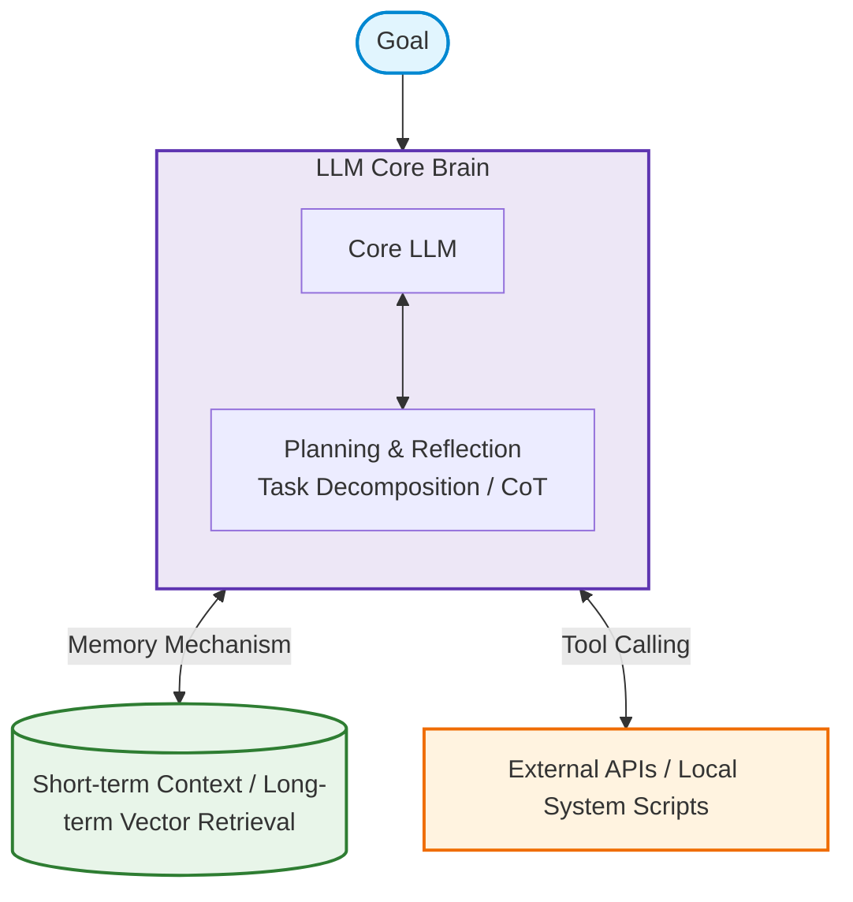
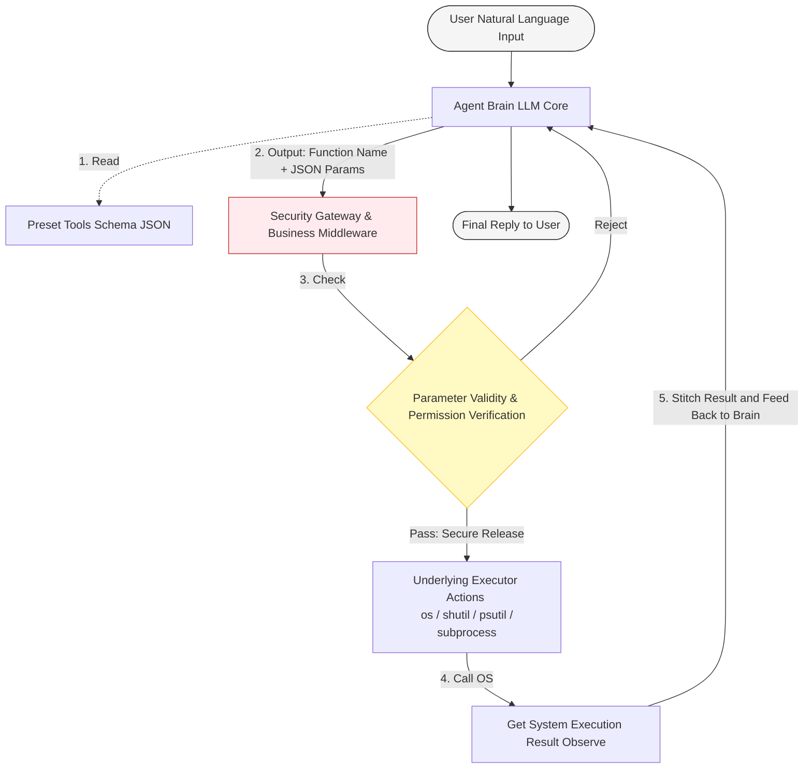

# AI Agent

> "Knowledge is the beginning of action; action is the completion of knowledge." — Wang Yangming

The application form of AI is evolving from the initial "generative dialogue tool (Chatbot)" to an "Artificial Intelligence Agent (AI Agent)" capable of autonomous execution.

This chapter will provide an in-depth analysis of the underlying principles, core architecture, and advanced roadmap of AI Agents. Combined with an end-to-end Windows system command assistant project, it will demonstrate how to build a practical and secure Agent system from scratch.

## What is an AI Agent?

If early ChatGPT or pure chat large models were "strategists" (Q&A driven, all talk and no action), then an AI Agent is a "special agent or digital assistant." Developers only need to give it a macroscopic goal, and it will autonomously break down tasks, plan routes, consult documentation, call external tools, and ultimately deliver results.

### The Core Difference Between Chatbot and AI Agent

In engineering implementation, there are fundamental differences in their technical boundaries and interaction paradigms:

| Feature Dimension | Traditional Chatbot | AI Agent |
| --- | --- | --- |
| **Interaction Mode** | Strongly relies on the user's single "prompt-response" drive | Goal-driven, with intermediate processes running autonomously |
| **Execution Capability** | Limited to passive generation of text, code, or images | Has operational space, can call APIs to read/write databases, systems, or SaaS software |
| **Reflection Mechanism** | No autonomous reflection, requires users to point out errors before correcting | Possesses self-reflection and multi-turn Chain of Thought (CoT) |
| **Role Positioning** | Knowledge base Q&A, content auxiliary generation tool | "Digital employee" independently completing complex workflows |

---

## The Four Core Elements of an AI Agent

A complete AI Agent architecture is essentially a combination centered around a large model brain, connected to various engineering infrastructures. It consists of the following four core elements:



1. **Goal:** The user's top-level input (e.g., "Help me move files older than 30 days in the download folder to the recycle bin").
2. **Planning:** After receiving the goal, the brain initiates a **thinking loop**. It breaks down a large task into multi-step subtasks and utilizes a self-reflection mechanism to dynamically adjust the route during operation.
3. **Memory:**
   - **Short-term Memory:** Maintains the context window and intermediate variables of the current session.
   - **Long-term Memory:** Combined with an external Vector DB or Retrieval-Augmented Generation (RAG), saves historical configurations, knowledge bases, and user preferences.


4. **Tools:** This is the most crucial element distinguishing an Agent from a regular chatbot. An Agent has execution capabilities and can call external Webhooks, underlying code execution environments, operating system APIs, and even browsers.

---

## Developer Advancement Roadmap

For backend or system engineers, getting into AI Agent programming requires restraining the reliance on high-level abstraction frameworks and following the engineering roadmap of "hand-coding first, framework later, starting small."

### Phase 1: Understand and Hand-code the ReAct Loop

ReAct (Reason-Act-Observe) is the ancestral foundation of all Agents. In the early stages of learning, **it is strongly recommended NOT to use advanced frameworks like LangChain right away**.

- **Reason:** Advanced frameworks encapsulate too much black-box logic (like automatic prompt splicing, hidden implicit loops). Once the large model hallucinates or state transfer errors occur, it is extremely difficult for developers to perform white-box debugging.
- **Practice Method:** Directly use native Python code combined with an official LLM SDK (such as DeepSeek or OpenAI SDK). Utilize the large model's `Function Calling` feature, and implement the closed loop of "brain thinking -> returning tool name and parameters -> local code execution -> feeding results back to the large model" using a `while` loop yourself.

### Phase 2: Introduce State Machines and Production-grade Frameworks

When business scenarios become complex, featuring multi-branch decisions and complicated long-term workflows, a pure `while` loop will evolve into unmaintainable "spaghetti code." This is the best time to introduce a framework:

- **LangGraph:** A control flow framework based on State Machines and Directed Acyclic Graphs (DAG). It abstracts each step of the Agent into a Node and an Edge, making it highly suitable for building backend Agents that require high determinism and precise engineering control.
- **Official Native Agent SDKs**: Lightweight SDKs launched by major model vendors (combined with the MCP protocol) can provide native performance closer to the underlying layer.

---

## Practical Project Design: Windows System Command Assistant

To fully practice the above concepts, this section designs a typical system-level Agent application—the **Windows System Command Assistant**. This project aims to securely control the system to execute common tasks via natural language.

### Core Architecture and Workflow

The entire system follows a strict input interception and execution isolation design:



### Core Security and Design Principles (Backend Perspective)

In operating system-level Agent development, security defense is the top priority:

1. **Absolutely forbid "generalized" tools, promote "atomic" design:**
- ❌ *Incorrect Example:* Encapsulating an all-purpose `run_terminal_command(cmd: str)` tool to let AI directly generate and execute PowerShell commands. This leads to **Prompt Injection attacks**. If a malicious input is `&& del /f /s /q C:\Windows`, the system will suffer a devastating blow.
- *Correct Example:* Strictly limit AI permissions. Developers write highly cohesive, low-permission local Python functions (like `kill_process`), and the AI only has the right to deliver parameters, never touching the underlying Shell execution permissions.


2. **Circuit Breaker Mechanism:** The Agent runs in a loop. If a Prompt is ambiguous, the model might fall into an infinite loop of "call tool -> fail -> call again." `MAX_LOOPS = 5` must be hard-coded at the code level to prevent accidental token exhaustion.
3. **Introduce "Human-in-the-loop":**
For high-risk operations like deleting files or terminating processes, the tool function must forcefully suspend and wait for a `[Y/N]` confirmation inputted in the console.
4. **Log and Observability:**
The large model's `Thought` process and `Tool Calls` behaviors for every step must be fully printed. This is the only debugging method in non-deterministic programming.

### Core Tool Library Specification Declaration

A standard system-level Agent typically contains the following 6 atomic tools with clear boundaries:

- `get_system_stats()`: Gets real-time CPU and memory usage based on the `psutil` module.
- `open_app(app_name)`: Safely launches a process via `subprocess.Popen` based on a whitelist restriction (e.g., only allowing `notepad`, `calc`).
- `list_desktop_pdfs()`: Dynamically obtains the current system user's desktop path, scans, and formats the metadata output of all `.pdf` files.
- `clean_downloads_folder(days)`: Scans the download directory, filters files exceeding a specified number of days, and triggers safe confirmation before moving or cleaning via `shutil`.
- `kill_process(process_name)`: Iterates through and terminates a specified application via `psutil` based on a blacklist restriction (forbidding the termination of core system processes like `explorer.exe`, `svchost.exe`).
- `set_reminder(minutes, message)`: Uses `threading.Timer` to start an asynchronous background thread to avoid blocking the main thread, triggering a reminder at the system layer when the time is up.


### Automated Code Generation Master Prompt

In actual development, we can utilize the following structured, advanced Prompt to drive the large model to generate the complete production-grade single-file source code of the aforementioned Windows System Command Assistant in one go. This prompt is quite long because it includes detailed instructions. We have placed this prompt separately in the [Appendix](ai_agent_prompt) for easy viewing.

Don't think such a long prompt is hard to write; in fact, it was also generated with the help of AI. We can give our initial vague requirements to AI and let it generate a detailed prompt. Then, based on the AI-generated prompt, we can modify and optimize it as needed. This process can be repeated iteratively until we are satisfied with the AI-generated prompt.


### Generation Results

Finally, we give the optimized prompt to AI and let it generate the final complete source code. Here we let AI generate a single Python file containing all the above features. We don't even need to master Python to run it. However, if you are interested in Python, you can refer to this book [Python Secrets](https://py.qizhen.xyz/).


### How to Install and Run the Python Script

If you are not yet familiar with Python, you can follow these steps to run this AI Agent on a Windows system:

#### 1. Install Python
1. Visit the [Python Official Website](https://www.python.org/downloads/), and download the latest stable installer for Windows (e.g., 3.11 or 3.12).
2. Double-click the installer, and at the bottom of the installation interface, **be sure to check "Add python.exe to PATH"** (adding Python to the system environment variables), then click "Install Now" to complete the installation.

#### 2. Prepare the Code File
Copy the AI-generated code into a text file and save it as `win_agent.py`. We have also stored a copy of the AI-generated code in the appendix: [AI Agent Complete Source Code](ai_agent_code). You can also copy it, create a new text file named `win_agent.py` on your computer, paste the code in, and save it.

#### 3. Install Dependency Libraries
Open a command-line tool (like PowerShell or CMD), and run the following command to install the third-party libraries required by the script:
```bash
pip install openai psutil win10toast
```
*(Note: `win10toast` is used for Windows system notifications. If you encounter network or compatibility issues during installation, this dependency is not absolutely necessary; not installing it will not affect the core functioning of the Agent.)*

#### 4. Configure API Key and Run
Because this Agent runs based on a large model, you need to prepare a DeepSeek API Key.

In the command line, enter the following commands to configure the environment variable and start the script:

* **If using PowerShell (Recommended)**:
  ```powershell
  $env:DEEPSEEK_API_KEY="YOUR_DEEPSEEK_API_KEY"
  python win_agent.py
  ```

* **If using traditional CMD**:
  ```cmd
  set DEEPSEEK_API_KEY=YOUR_DEEPSEEK_API_KEY
  python win_agent.py
  ```

After running successfully, you can enter various natural language commands in the persistent command line (e.g., "check C drive space" or "remind me of a meeting in 1 minute") to experience this local system-level agent equipped with a security defense gateway.


A while ago, OpenClaw was quite popular online. It is actually a similar AI Agent, just with more powerful features. The AI programming tools we are going to introduce in the next chapter are also based on this principle, except they are optimized specifically for the scenario of software development.