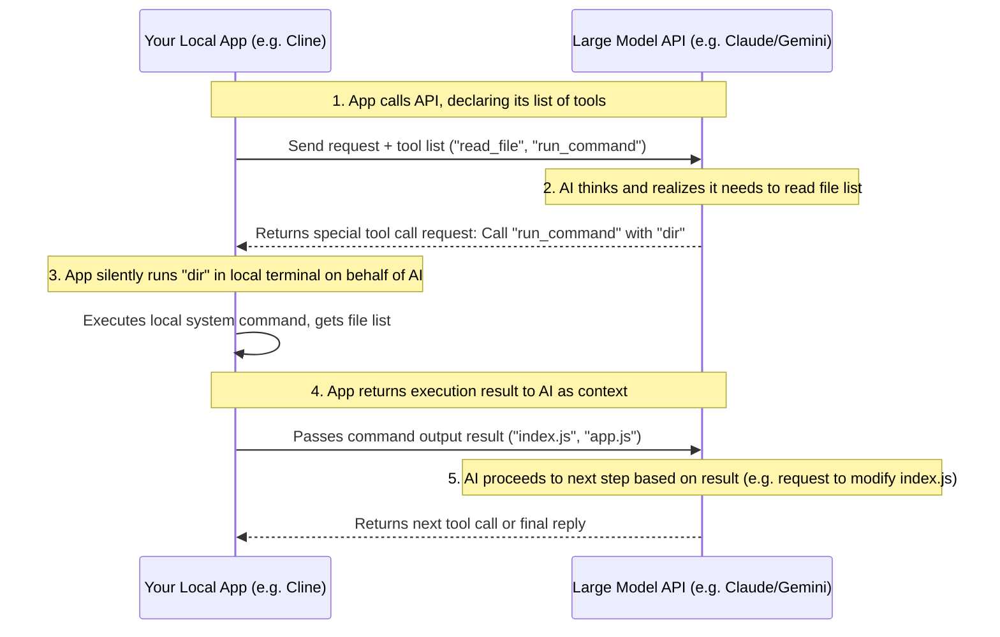

# AI API

> "The gentleman by birth is not different from others; he is good at making use of external things." — Xunzi, "Encouraging Learning"

Most AI platforms not only provide convenient web applications (like ChatGPT, Claude Web) but also usually provide **API interfaces**, allowing developers to call large models through code. The underlying magic of all mainstream AI programming tools on the market today (such as Cursor, Windsurf, Cline, or Aider) is actually calling these API interfaces and encapsulating complex operating processes.

Understanding and mastering AI APIs not only allows you to see through the underlying logic of these top-tier programming tools, but more importantly, it enables you to seamlessly embed AI capabilities into your own programs to create your exclusive AI tools. This chapter will take you from shallow to deep, from core concepts and advanced magic, to the latest global API ecosystem layout and practical code, completing a comprehensive technical literacy.


## The Core Conceptual Model of AI APIs

Although the SDKs (Software Development Kits) of different large model vendors have various naming conventions, their underlying HTTP protocols and data structures are almost completely interoperable. By understanding the following core concepts, you can seamlessly switch between the APIs of any vendor.

### Messages & Roles

API interactions usually take the form of an **array of dialogue history**. Each message in the array contains a `role` and `content`:

* **`system` (System Role)**: The "soul and mask" of the AI. Here, you define the AI's identity, rules, constraints, and output format. Once set, the AI will strictly adhere to them throughout the dialogue.
* **`user` (User Role)**: The specific instructions entered by humans or the current context data.
* **`assistant` (Assistant Role)**: The replies previously made by the AI. If you need the AI to remember previous conversations, you must send the historical `assistant` messages back along with the `user` messages.

### Hyperparameters

* **`temperature`**: Controls the randomness and creativity of the output. Values are typically between `0.0` and `2.0`.
* For scenarios requiring extreme precision, such as **writing code, data extraction, or format conversion**, be sure to set it to **`0.0` or a very low value (like `0.1`)** to ensure stable output and rigorous logic.
* For copywriting and brainstorming, you can set it to `0.7` or higher.


* **`max_tokens`**: Limits the maximum number of Tokens in a single model reply (to prevent the AI from hallucinating or falling into an infinite loop of spitting out words, thereby protecting your wallet).
* **`stream`**: When set to `true`, the API will return data character by character like a typewriter (Server-Sent Events), rather than waiting for everything to be generated and returned all at once. This greatly improves user experience when building interactive terminals or chat interfaces.


## The "Two Great Magics" Behind AI Tools

When writing simple chat tools, an ordinary text dialogue API is sufficient. But when building advanced AI development tools (like AI Agents, automatic code refactoring and rewriting scripts), you must introduce two more advanced API features: **Structured Outputs** and **Tool Use / Function Calling**.

### Structured Outputs

Ordinary text output is like a runaway wild horse; the AI's response might contain a lot of explanatory fluff (for example: "Okay, the code generated for you is as follows...`[code]`...hope this helps!"). If our automation script wants to precisely parse the AI's return and automatically modify files, this is simply a disaster.

**Structured Outputs (JSON Mode)** forces the AI to return data in pure JSON format that conforms to a specific JSON Schema (structure definition). For example, you can define a JSON Schema requiring the AI to return a code modification plan in the following format:

```json
{
  "filePath": "src/index.js",
  "action": "replace",
  "targetContent": "const count = 0;",
  "replacementContent": "const count = state.count;"
}

```

At this point, your local code parser can parse this JSON with its eyes closed, accurately replacing the original code with zero manual intervention.

### Tool Use / Function Calling

This is the core soul of an Agent, and also the underlying principle behind how tools like Cline and Windsurf can "autonomously control the computer."

In ordinary API calls, a large model is just an "armchair strategist" brain; it can write terminal commands, but cannot execute them itself. However, through **Tool Use**, closed-loop automation of AI decision-making and program execution can be achieved:

1. **Developer "Empowerment"**: When calling the API, you declare to the AI in the parameters: "Dear model, I have two local tools here for you to schedule: one is `read_file(path)`, and the other is `run_command(cmd)`. I have explained their parameter formats and purposes to you."
2. **AI "Makes a Decision"**: After reading, the AI finds that your request is "help me add a copyright notice to the first line of all `.js` files in the current directory." After analyzing, the AI believes it needs to read the files first, so it **does not return ordinary text**, but returns a special "call request": *"I want to call the `run_command` tool, with parameter `ls`."*
3. **Human/Program "Runs Errands"**: Your local wrapper program intercepts this "call request," safely runs the `ls` command on your computer, captures the output (e.g., gets `index.js` and `utils.js`), and then **sends the execution result back to the AI as a new `user` message**.
4. **AI "Continues to Decide"**: The AI receives the execution result and then initiates the next call request (e.g., calling `read_file` to read `index.js`), cycling repeatedly until the task is finally completed.




## Global AI API Providers

In the current AI API market, major large model vendors have formed a clearly stratified ecological landscape. For programmers, the core metric when choosing a provider is the trade-off between performance and price.

### Peak Performance Tier: Who has the strongest coding ability?

In programming logic reasoning, complex system refactoring, and Agentic workflows, **Anthropic (Claude)** and **OpenAI** firmly occupy the first tier of global performance.

* **Performance King: Anthropic (Claude)**
It is widely recognized as the best-performing vendor in code generation, refactoring, and Bug fixing. Its flagship models (such as the Claude Sonnet/Opus series) are almost the preferred backends for all mainstream AI programming tools. Although its **overall pricing leans toward the mid-to-high end**, its extremely high capability in following advanced instructions and its highly valuable prompt caching discounts (up to 90% reduction in input costs) give it unparalleled overall effectiveness when dealing with complex codebases.
* **All-Around Grandmaster: OpenAI**
As the standard setter of the industry, OpenAI has the most complete product line (covering everything from the ultra-lightweight Nano to the top-tier reasoning o3 series). In general production-grade tasks, its advanced reasoning models (like the o1/o3 series) perform exceptionally well when tackling highly difficult algorithmic writing through background "long-time self-correction and deduction." OpenAI's overall calling price is in the **industry's mid-to-high range**.

### Ultimate Cost-Effectiveness Tier: Who is the cheapest?

If you are extremely sensitive to costs, or are developing high-throughput batch processing tasks, the following two vendors offer unmatched cost-effectiveness advantages in the market:

* **Price Butcher: DeepSeek**
As a phenomenal existence in the industry, DeepSeek is undisputedly the **global price floor**. The calling cost of its latest flagship model and deep reasoning model is only a fraction of that of cutting-edge models in the same overseas tier. When a cache hit is triggered, its input cost is almost negligible. It provides excellent programming and mathematical reasoning capabilities approaching the world's first tier at an extremely low rock-bottom price.
* **King of Long Context Cost-Effectiveness: Google (Gemini)**
Google is the representative of **extremely accessible cost-effectiveness** among mainstream overseas vendors. Its biggest killer feature is providing an ultra-long context window of up to the millions level, allowing you to blindly package the entire project's source files and feed them to it. At the same time, Gemini offers very generous free testing quotas, making it highly suitable for independent developers and startup teams to use for prototyping.

### Specific Scenarios and Enterprise Compliance Tier

Besides the four major giants mentioned above, there are also active featured providers in the market that meet specific developmental needs:

* **Top Choice for Localization and Chinese: Domestic Large Models**
For domestic developers in China, local forces such as Alibaba Cloud (Qwen), Baidu (ERNIE Bot), Zhipu AI, Moonshot AI (Kimi), and ByteDance (Doubao) not only wage extremely fierce price wars with extremely low calling costs, but also have natural local advantages in Chinese context understanding, domestic network access stability, and Chinese data compliance requirements.
* **Complete Privacy and Open Source Self-Hosting: Meta (Llama)**
Meta itself does not directly sell paid APIs, but its powerful open-source Llama series allows enterprises to completely perform localized deployment. If you have your own GPU computing power and have absolute privacy control demands for sensitive code data, using Llama to build your own service can completely eliminate concerns about data leaving your domain.
* **Regional Compliance Benchmark: Mistral AI**
As Europe's AI leader, Mistral's cutting-edge models, while maintaining excellent cost-effectiveness (especially extremely low output costs), naturally store data within the EU. They are the top choice for multinational projects that need to strictly pass GDPR privacy audits.
* **Enterprise-Grade Managed Security: AWS Bedrock & Azure OpenAI**
By aggregating calls to large models through such large cloud platforms, enterprises need to bear a certain platform premium (**overall tariffs are higher**). But they can provide financial-grade security isolation (VPC), private network connections, and high-throughput SLA protocol guarantees unique to large enterprises, and promise that enterprise data will absolutely not be misappropriated to train public models.


## Four Major Mainstream AI API Calling Practices

Below, targeting the four most mainstream AI forces currently, we provide the cleanest, out-of-the-box code examples that conform to the latest SDK specifications.

### OpenAI (Standard Call)

#### 🐍 Python Example

First install the SDK: `pip install openai`

```python
import os
from openai import OpenAI

# Will automatically read the OPENAI_API_KEY environment variable by default
client = OpenAI()

response = client.chat.completions.create(
    model="gpt-5.4-mini",
    temperature=0.0,
    messages=[
        {"role": "system", "content": "You are a senior coach proficient in algorithms."},
        {"role": "user", "content": "Please implement the generation of the first N terms of the Fibonacci sequence in one line of Python code."}
    ]
)

print(response.choices[0].message.content)

```

#### 🟢 Node.js Example

First install the SDK: `npm install openai`

```javascript
import OpenAI from "openai";

const openai = new OpenAI();

const response = await openai.chat.completions.create({
  model: "gpt-5.4-mini",
  temperature: 0.0,
  messages: [
    { role: "system", content: "You are a senior coach proficient in algorithms." },
    { role: "user", content: "Please implement the generation of the first N terms of the Fibonacci sequence in one line of Python code." }
  ],
});

console.log(response.choices[0].message.content);

```

---

### Anthropic Claude (System Parameter Top-Level Specification)

#### 🐍 Python Example

Install the SDK: `pip install anthropic`

```python
import os
from anthropic import Anthropic

client = Anthropic() # Reads ANTHROPIC_API_KEY by default

message = client.messages.create(
    model="claude-3-5-sonnet-latest", 
    max_tokens=2048,
    temperature=0.0,
    system="You are a strict software security audit expert.",
    messages=[
        {"role": "user", "content": "Analyze whether the following code has SQL injection risks:\n\n`db.execute('SELECT * FROM users WHERE name = ' + user_input)`"}
    ]
)

print(message.content[0].text)

```


### Google Gemini (Next-Generation SDK for Long Context)

Google has uniformly launched a brand new next-generation `google-genai` SDK, with syntax that is more consistent and elegant compared to the old version.

#### 🐍 Python Example

Install the SDK: `pip install google-genai`

```python
import os
from google import genai
from google.genai import types

# Reads GEMINI_API_KEY environment variable by default
client = genai.Client()

response = client.models.generate_content(
    model='gemini-2.5-flash', 
    contents='How to quickly deploy a PostgreSQL database using Docker?',
    config=types.GenerateContentConfig(
        system_instruction="You are an experienced cloud computing operations expert.",
        temperature=0.1,
    ),
)

print(response.text)

```


### DeepSeek (Standard Compatibility and Chain of Thought Extraction)

#### 🐍 Python Example (Seamless reuse of OpenAI SDK to call V4 models)

```python
import os
from openai import OpenAI

# Instantiate client and point directly to DeepSeek's official endpoint
client = OpenAI(
    base_url="https://api.deepseek.com/v1",
    api_key=os.environ.get("DEEPSEEK_API_KEY")
)

response = client.chat.completions.create(
    model="deepseek-v4-flash",  
    temperature=0.0,
    messages=[
        {"role": "system", "content": "You are an extremely concise geek mentor who does not speak nonsense."},
        {"role": "user", "content": "Explain what a 'Closure' is, limited to two sentences."}
    ]
)

print(response.choices[0].message.content)

```

#### 🧠 Chain of Thought Extraction for Deep Reasoning Model DeepSeek-R1

When calling advanced deep reasoning models (`model="deepseek-reasoner"`), in addition to getting the final result, you can also extract the Chain of Thought content representing the AI's thinking logic via `reasoning_content`:

```python
response = client.chat.completions.create(
    model="deepseek-reasoner", 
    messages=[
        {"role": "user", "content": "Prove: When n is a positive integer, n^3 - n must be divisible by 6."}
    ]
)

# Extract and print the Chain of Thought (Thinking Process)
print("=== Thinking Process ===")
print(response.choices[0].message.reasoning_content)

# Extract and print the final answer
print("\n=== Final Answer ===")
print(response.choices[0].message.content)

```

During the writing of this book, DeepSeek's price was significantly discounted compared to other models, becoming the author's primary model of choice. The subsequent examples in this book are mainly built on DeepSeek models.

## Engineering Implementation Advice

1. **Don't just look at the unit price, look at the "Cost per Task"**: Low-end cheap models are not necessarily the most cost-saving in the end. If an extremely cheap model requires 3 repeated requests to generate the correct code due to insufficient capability, while a higher-priced advanced cutting-edge model can perfectly output in 1 try, then choosing the stronger, more expensive model is actually the dual optimal solution for both time and money.
2. **Make good use of Caching (Prompt Caching)**: If your AI programming script contains very long system prompts, or frequently needs to pass the code skeleton of the entire project to the model, be sure to ensure that the request prefixes are consistent to trigger the prompt caching discounts provided by major vendors, which can save most of the input billing costs.
3. **Multi-Model Orchestration Strategy (Multi-Model Strategy)**: In engineering implementation, do not bind all logic to a single vendor. You can use strong reasoning models (like Claude Opus or OpenAI o3) for top-level architectural design and task breakdown, while delegating broken-down specific tasks like code writing, log parsing, and unit test generation to fast models (like GPT-4.1 Mini or Gemini Flash) for execution.
4. **Use Batch API for non-real-time tasks**: If you are writing tools like code review or automated full-repo document generation that do not require second-level returns, you can use the Batch API provided by vendors, which can directly help you cut half of the calling fees.

