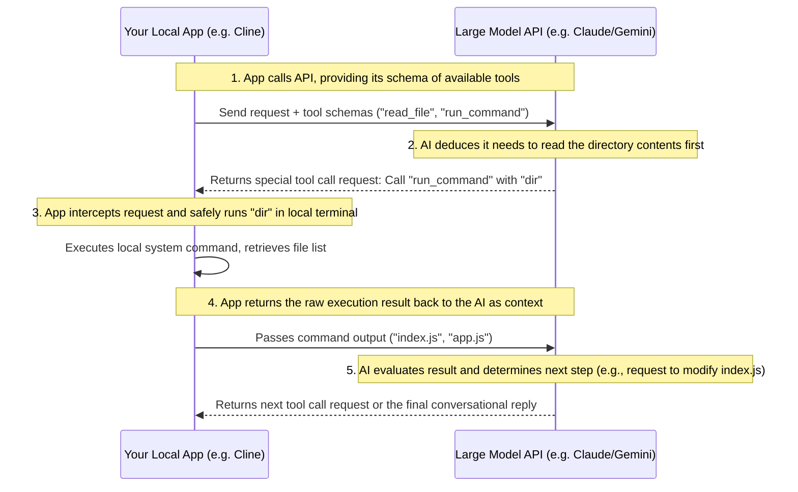

# AI API

> "Give me a lever long enough and a fulcrum on which to place it, and I shall move the world." — Archimedes

Most AI platforms provide more than just convenient web applications (like ChatGPT or Claude Web); they also offer **API interfaces** that allow developers to integrate large language models directly into their code. The underlying magic powering all mainstream AI programming tools on the market today (such as Cursor, Windsurf, Cline, or Aider) is simply the orchestration of these API interfaces, encapsulating complex workflows behind the scenes.

Understanding and mastering AI APIs not only demystifies the core logic of these top-tier programming tools, but more importantly, it empowers you to seamlessly embed AI capabilities into your own applications to build bespoke tools. This chapter will take you from the basics to advanced concepts, covering core paradigms, advanced capabilities, the current global API ecosystem, and practical implementation examples, providing you with comprehensive technical literacy in the AI space.

## The Core Conceptual Model of AI APIs

Although different model vendors use varying naming conventions for their SDKs (Software Development Kits), the underlying HTTP protocols and data structures they employ are almost entirely interoperable. By mastering the following core concepts, you can seamlessly switch between any vendor's API.

### Messages & Roles

API interactions typically utilize an **array of conversation history**. Each message within this array contains a `role` and its corresponding `content`:

* **`system` (System Role)**: The "soul and persona" of the AI. This is where you define the AI's identity, rules, operational constraints, and expected output formats. Once established, the AI will strictly adhere to these instructions throughout the duration of the conversation.
* **`user` (User Role)**: The specific prompts, instructions, or contextual data provided by a human or an external system.
* **`assistant` (Assistant Role)**: The previous responses generated by the AI. If you need the AI to "remember" earlier parts of a conversation, you must append these historical `assistant` messages alongside the new `user` messages in your request payload.

### Hyperparameters

* **`temperature`**: Dictates the randomness and creative variance of the model's output. Values generally range from `0.0` to `2.0`, with vendor differences: OpenAI `0.0`–`2.0`, Anthropic `0.0`–`1.0`, DeepSeek `0.0`–`1.0`.
  * For deterministic tasks requiring extreme precision—such as **writing code, extracting data, or converting formats**—it is critical to set this to **`0.0` or a very low value (like `0.1`)** to guarantee stable outputs and rigorous logic.
  * For creative tasks like copywriting or brainstorming, you can increase this to `0.7` or higher.

* **`max_tokens`**: Caps the absolute maximum number of tokens a model can generate in a single response. This acts as a safeguard against the AI hallucinating or falling into an infinite generation loop, effectively protecting your API budget.
* **`stream`**: When set to `true`, the API streams data back character-by-character (using Server-Sent Events) instead of forcing you to wait for the entire response to generate before returning it. This drastically improves perceived latency and user experience when building interactive chat interfaces or terminal outputs.

## The "Two Great Magics" Behind AI Tools

When building a simple chat interface, a standard text dialogue API is perfectly adequate. However, if you want to engineer advanced AI development tools (like autonomous AI Agents or automated code refactoring scripts), you must leverage two advanced API features: **Structured Outputs** and **Tool Use / Function Calling**.

### Structured Outputs

Standard text output is like a runaway train; the AI's response might be padded with unnecessary conversational fluff (e.g., "Sure, here is the code you requested... `[code]` ...I hope this helps!"). If your automation script needs to precisely parse the AI's response to systematically modify files, this conversational fluff is an engineering disaster.

**Structured Outputs (JSON Mode)** strictly forces the AI to return data in pure JSON format, perfectly adhering to a specific JSON Schema that you define. For example, you can supply a schema dictating that the AI must return its code modification plan exactly like this:

```json
{
  "filePath": "src/index.js",
  "action": "replace",
  "targetContent": "const count = 0;",
  "replacementContent": "const count = state.count;"
}
```

With this mechanism in place, your local code parser can reliably ingest the JSON and accurately execute the code replacement with zero manual intervention.

> **How to enable JSON Mode:** Implementation varies by vendor. OpenAI requires setting `response_format={"type":"json_schema","json_schema":{...}}` or `{"type":"json_object"}` in the request; Anthropic can return structured data via Tool Use or structured output in newer SDKs; Google Gemini requires configuring `response_mime_type="application/json"` and `response_schema` in `GenerateContentConfig`. Merely describing the expected format in the prompt is not enough — the model may still emit conversational fluff.

### Tool Use / Function Calling

This is the very soul of an autonomous Agent and the exact mechanism that enables tools like Cline and Windsurf to seemingly "control your computer."

In standard API calls, a large language model acts as an "armchair strategist." It can write terminal commands, but it has no physical mechanism to execute them. However, through **Tool Use**, you can achieve a closed-loop automation of AI decision-making and real-world program execution:

1. **Developer "Empowerment"**: When calling the API, you declare your available tools to the AI in the parameters: *"Dear model, I have two local tools you can utilize: `read_file(path)` and `run_command(cmd)`. Here are their parameter formats and exact purposes."*
2. **AI "Decision Making"**: The AI analyzes your prompt: *"Help me add a copyright notice to the first line of all `.js` files in the current directory."* It realizes it first needs to know what files exist, so it **does not return standard text**. Instead, it returns a special "call request" object: *"I am requesting to invoke the `run_command` tool, passing the parameter `ls`."*
3. **Program "Execution"**: Your local wrapper application intercepts this call request, securely runs the `ls` command in your terminal, captures the output (e.g., `index.js` and `utils.js`), and **sends the execution result back to the AI as a tool message** (OpenAI requires `role: "tool"` + `tool_call_id`, Anthropic requires a `tool_result` block inside a `user` message, Google uses `role: "tool"` with `functionResponse`).
4. **AI "Continued Execution"**: The AI processes the execution result and triggers the next necessary call request (e.g., invoking `read_file` on `index.js`). This loop repeats autonomously until the entire objective is achieved.



## Global AI API Providers

In today's AI API landscape, major model vendors have stratified into distinct tiers. For engineers, the primary metric when selecting a provider is the delicate balance between raw reasoning performance and operational cost.

### Peak Performance Tier: The Coding Heavyweights

For complex programming logic, vast system refactoring, and Agentic workflows, **Anthropic (Claude)** and **OpenAI** undisputed champions, occupying the highest tier of global performance.

* **The Performance King: Anthropic (Claude)**
  Anthropic is widely regarded by developers as the absolute best vendor for code generation, structural refactoring, and bug fixing. Its flagship models (particularly the Claude 3.5 Sonnet series) serve as the default backend for nearly all premium AI programming tools. While its **overall pricing leans premium**, its exceptional adherence to complex instructions combined with aggressive prompt caching discounts (which can reduce input costs by up to 90%) makes it highly cost-effective when manipulating massive codebases.
  
* **The All-Around Grandmaster: OpenAI**
  As the industry pioneer, OpenAI boasts the most comprehensive model lineup (spanning from the ultra-lightweight GPT-4o-mini to the elite reasoning o1/o3 series). In general production workloads, their advanced reasoning models excel at unraveling highly complex algorithmic problems through extensive, hidden "Chain of Thought" self-correction. OpenAI's pricing sits firmly in the **industry's mid-to-high bracket**.

### Ultimate Cost-Effectiveness Tier: The Budget Powerhouses

If you are highly sensitive to costs, or if you are architecting high-throughput batch processing pipelines, two vendors currently offer unparalleled value:

* **The Price Butcher: DeepSeek**
  DeepSeek is an anomaly in the industry, aggressively setting the **global price floor**. The API costs for its latest flagship and deep-reasoning models are a mere fraction of comparable Western models. When their prompt cache is triggered, input costs drop to virtually zero. DeepSeek provides elite-tier programming and mathematical reasoning capabilities at an unprecedentedly low price point.
  
* **The King of Long Context: Google (Gemini)**
  Google represents **accessible scalability** among major providers. Gemini's killer feature is its massive context window (spanning millions of tokens), which allows you to blindly dump entire project repositories into the prompt context. Furthermore, Gemini offers exceptionally generous free tiers, making it the ideal sandbox for independent developers and startup teams prototyping new concepts.

### Niche Scenarios and Enterprise Compliance Tier

Beyond the big four, several specialized providers cater to distinct operational or compliance requirements:

* **Top Choice for Localization: Domestic Chinese Models**
  For developers operating within China, local powerhouses like Alibaba Cloud (Qwen), Baidu (ERNIE), Zhipu AI, Moonshot AI (Kimi), and ByteDance (Doubao) offer fiercely competitive pricing. They possess a natural advantage in processing Chinese context, guarantee localized network stability, and strictly adhere to domestic data compliance regulations.
  
* **Total Privacy & Self-Hosting: Meta (Llama)**
  While Meta does not directly sell an API service, their robust open-source Llama series allows enterprises to deploy models entirely on-premise. If you possess the necessary GPU infrastructure and have zero-tolerance privacy requirements for sensitive proprietary code, self-hosting Llama ensures your data never leaves your internal network.
  
* **European Compliance Benchmark: Mistral AI**
  As Europe's premier AI lab, Mistral delivers highly capable models with excellent cost-effectiveness (especially regarding output token pricing) while ensuring data remains sovereign within the EU. They are the definitive choice for multinational architectures requiring strict GDPR compliance.
  
* **Enterprise-Grade Managed Security: AWS Bedrock & Azure OpenAI**
  By proxying model access through massive cloud providers, enterprises incur a platform premium (**resulting in higher overall costs**). In exchange, they receive financial-grade security isolation (VPC integration), private network tunneling, strict SLAs, and ironclad guarantees that proprietary enterprise data will never be leveraged to train public models.

## The Four Mainstream AI API Implementation Paradigms

Below, we provide pristine, production-ready code snippets for the top four AI providers, strictly adhering to their latest SDK specifications.

### OpenAI (The Standard Call)

#### 🐍 Python Example

First, install the SDK: `pip install openai`

```python
import os
from openai import OpenAI

# Automatically ingests the OPENAI_API_KEY environment variable
client = OpenAI()

response = client.chat.completions.create(
    model="gpt-4o-mini", # updated to modern model
    temperature=0.0,
    messages=[
        {"role": "system", "content": "You are a senior algorithmic engineering coach."},
        {"role": "user", "content": "Implement a generator for the first N terms of the Fibonacci sequence in a single line of Python."}
    ]
)

print(response.choices[0].message.content)
```

#### 🟢 Node.js Example

First, install the SDK: `npm install openai`

```javascript
import OpenAI from "openai";

const openai = new OpenAI();

// Note: top-level await requires "type": "module" in package.json or .mjs extension, or wrap in (async () => { ... })()
const response = await openai.chat.completions.create({
  model: "gpt-4o-mini", // updated to modern model
  temperature: 0.0,
  messages: [
    { role: "system", content: "You are a senior algorithmic engineering coach." },
    { role: "user", content: "Implement a generator for the first N terms of the Fibonacci sequence in a single line of Python." }
  ],
});

console.log(response.choices[0].message.content);
```
> **Note:** The Node.js example above uses top-level `await`, which requires `"type": "module"` in `package.json` or a `.mjs` extension, or wrapping in an `(async () => { ... })()` async function.

---

### Anthropic Claude (System Parameter Top-Level Specification)

#### 🐍 Python Example

Install the SDK: `pip install anthropic`

```python
import os
from anthropic import Anthropic

# Automatically ingests the ANTHROPIC_API_KEY environment variable
client = Anthropic() 

message = client.messages.create(
    model="claude-sonnet-4-0", 
    max_tokens=2048,
    temperature=0.0,
    system="You are a rigorous software security audit expert.",
    messages=[
        {"role": "user", "content": "Analyze whether the following code presents an SQL injection vulnerability:\n\n`db.execute('SELECT * FROM users WHERE name = ' + user_input)`"}
    ]
)

print(message.content[0].text)
```

### Google Gemini (Next-Generation SDK for Long Context)

Google recently launched a modernized `google-genai` SDK, offering syntax that is vastly more elegant and consistent than its legacy iterations.

#### 🐍 Python Example

Install the SDK: `pip install google-genai`

```python
import os
from google import genai
from google.genai import types

# Automatically ingests the GEMINI_API_KEY environment variable
client = genai.Client()

response = client.models.generate_content(
    model='gemini-2.5-flash', 
    contents='How do I rapidly deploy a PostgreSQL database using Docker?',
    config=types.GenerateContentConfig(
        system_instruction="You are a seasoned cloud infrastructure and operations expert.",
        temperature=0.1,
    ),
)

print(response.text)
```

### DeepSeek (Standard Compatibility and Chain of Thought Extraction)

#### 🐍 Python Example (Seamlessly reusing the OpenAI SDK to call V4 models)

```python
import os
from openai import OpenAI

# Instantiate the client and point the base URL directly to DeepSeek's endpoint
client = OpenAI(
    base_url="https://api.deepseek.com",
    api_key=os.environ.get("DEEPSEEK_API_KEY")
)

response = client.chat.completions.create(
    model="deepseek-chat",  # DeepSeek V3/V4 chat model
    temperature=0.0,
    messages=[
        {"role": "system", "content": "You are an exceptionally concise senior engineer who strictly avoids conversational fluff."},
        {"role": "user", "content": "Define what a 'Closure' is in JavaScript, strictly limiting your response to two sentences."}
    ]
)

print(response.choices[0].message.content)
```

#### 🧠 Chain of Thought Extraction for DeepSeek-R1 (Reasoning Model)

When invoking advanced deep reasoning models (like `model="deepseek-reasoner"`), you can extract the AI's internal logical deduction process—its Chain of Thought—via the `reasoning_content` attribute, in addition to the final output:

```python
response = client.chat.completions.create(
    model="deepseek-reasoner", 
    messages=[
        {"role": "user", "content": "Prove that for any positive integer n, n^3 - n is always divisible by 6."}
    ]
)

# Extract and print the internal Chain of Thought (The reasoning process)
print("=== Reasoning Process ===")
print(response.choices[0].message.reasoning_content)

# Extract and print the final output
print("\n=== Final Answer ===")
print(response.choices[0].message.content)
```

During the writing of this book, DeepSeek's pricing heavily undercut the competition, making it the author's primary model of choice. Consequently, the practical examples throughout the remainder of this book are primarily built atop DeepSeek models.

## Engineering Implementation Advice

1. **Calculate the "Cost per Task," Not Just the Unit Price**: The cheapest model isn't necessarily the most cost-effective solution. If a highly affordable model hallucinates and requires three separate requests to generate correct code, while a premium model generates flawless code on the first attempt, the premium model is actually the optimal choice for both time and capital.
2. **Aggressively Leverage Prompt Caching**: If your AI scripts rely on massive system prompts or frequently ingest the entire codebase context, ensure your request prefixes remain static. This triggers prompt caching discounts across major vendors, potentially eliminating the vast majority of your input billing costs.
3. **Implement a Multi-Model Orchestration Strategy**: In a production environment, avoid vendor lock-in. Utilize elite reasoning models (like Claude 3.5 Sonnet or OpenAI o1/o3) for top-level architectural design and complex task delegation. Then, route the execution of localized tasks—like writing boilerplate code, parsing logs, or generating unit tests—to blazing-fast, economical models (like GPT-4o-mini or Gemini Flash).
4. **Utilize Batch APIs for Asynchronous Workloads**: If you are architecting tools for background code review, massive log analysis, or full-repository documentation generation where sub-second latency is irrelevant, leverage the vendor's Batch APIs. This simple architectural shift can immediately slash your operational costs by 50%.
