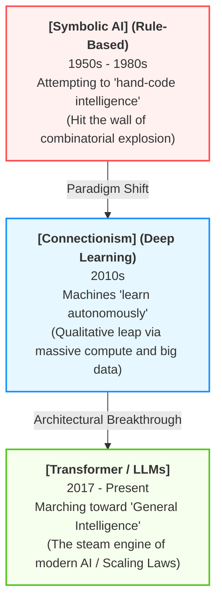
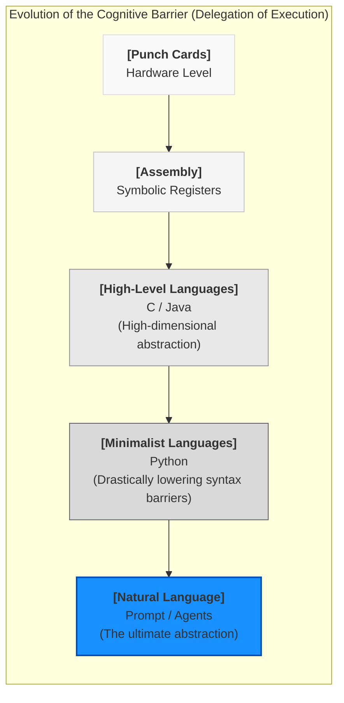
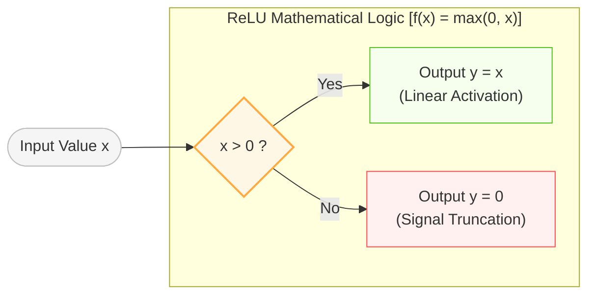
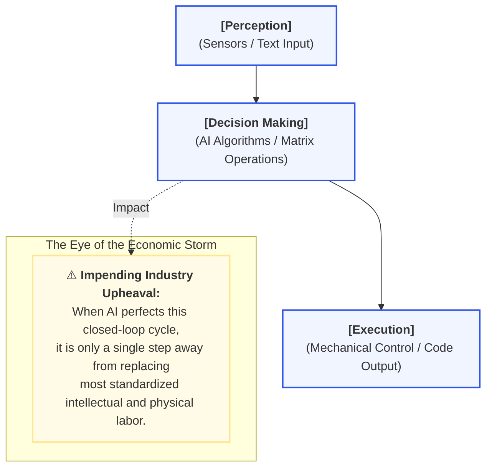

# Background: A Brief History of AI Evolution

> "History doesn't repeat itself, but it often rhymes." — Mark Twain

For decades, the core paradigm of software engineering has remained immutable: humans do the thinking, and computers do the executing. Today, however, the rise of Large Language Models (LLMs) has empowered machines to aggressively encroach upon the exclusively human domain of "thinking."

When developers first witness Cursor autonomously refactoring a massive project, Claude seamlessly fixing broken tests, or GitHub Copilot generating an entire, complex function in a single breath, they often experience a profound sense of dissonance. On one hand, they marvel at this seemingly magical leap in productivity; on the other, a lingering anxiety sets in: *if AI can already write code this autonomously, am I still needed?*

This anxiety is entirely justified. We are not experiencing a routine software tooling upgrade; we are witnessing the fundamental reconstruction of the software industry's means of production. This chapter will take you back to the origins of AI, trace the evolutionary lineage of machine intelligence and AI-assisted programming, and dismantle the underlying logic of exactly how large language models "understand" code. Understanding this history clarifies what this technological revolution has fundamentally changed—and what remains the same.

## A Brief History of AI: From Logic Machines to Probabilistic Intelligence

Humanity's obsession with "creating machines that can think" was born almost concurrently with the modern computer itself. Over the past seventy years, the development of artificial intelligence hasn't been a smooth, upward trajectory, but rather a protracted war marked by repeated failures and resurrections. It has progressed through three distinct paradigm shifts:



### Symbolic AI: The Attempt to "Hand-Code Intelligence"

The core philosophy of early AI research was beautifully simple: because human thought can be described through logic and symbols, if we can just encode all the logical rules of the world, the machine will naturally become intelligent.

Scientists set out to construct massive, hard-coded rule engines. For example: `Rule 1: If (weather == sunny AND temperature > 25) Then recommend short sleeves`. This era of **Symbolic AI** gave birth to "expert systems" that performed astonishingly well in domains with strict, closed-boundary rules, such as chess and mathematical theorem proving. For a brief moment, it made humanity believe that Artificial General Intelligence (AGI) was just around the corner.

However, the real world is not a neatly organized chessboard. Human language is riddled with ambiguity, visual data is full of noise, and environmental variables are practically infinite. If you want to teach a rule-based machine what a "cat" is, you quickly sink into a quagmire: Does a black cat count? What about a cartoon cat? What if only half of its face is visible? What if the lighting is poor? As edge cases multiply, the necessary rules expand exponentially, eventually slamming into the impenetrable wall of "combinatorial explosion." Consequently, AI entered its first long, bitter winter.

### Deep Learning: Machines Begin to "Learn Autonomously"

In stark contrast to "hand-coding rules," another faction of researchers proposed a radically different approach: stop spoon-feeding rules to the machine. Instead, feed it massive amounts of raw data and let it induce the rules itself. This approach, known as **Connectionism**, is the foundation of modern machine learning and deep learning.

The weapon of choice for deep learning is the **Artificial Neural Network (ANN)**. Inspired by biological neural pathways, ANNs process input signals through layers of weighted summations and activation functions. Fundamentally, a neural network is just an unfathomably massive "high-dimensional function fitter."

For decades, this approach remained marginalized because it was desperately starved of two critical resources: compute and data. It wasn't until around 2010 that the explosion of GPU technology unlocked terrifying parallel computing capabilities, while the mobile internet boom provided an unprecedented deluge of training data. In 2012, a neural network named AlexNet utterly decimated the competition in the ImageNet visual recognition challenge, officially heralding the golden age of Deep Learning.

In the years that followed, AI aggressively conquered vertical domains like speech recognition, facial mapping, and autonomous driving. Yet, the AI of this era was still highly specialized: an AI that could play Go couldn't hold a conversation, and an AI that recognized tumors couldn't drive a car. It wasn't until the sudden invention of the Transformer architecture that the silos between these domains were finally shattered.

### The Transformer: The "Steam Engine" of Modern AI

In 2017, researchers at Google published a landmark paper titled "Attention Is All You Need," introducing the **Transformer** architecture.

Compared to legacy Recurrent Neural Networks (RNNs), the Transformer delivered two epic breakthroughs: it could flawlessly capture ultra-long-distance contextual dependencies, and it was natively designed for massive GPU parallelization. If legacy AI models read text like a monk scrutinizing a manuscript word-by-word, the Transformer reads like a savant scanning the entire page in a single glance. This architectural superiority allowed model parameter counts to shatter previous physical limitations, scaling virtually infinitely.

Subsequently, OpenAI aggressively proved the now-famous **Scaling Laws**: as you proportionally increase model parameters, training data, and compute power, the model's capabilities scale predictably—until it crosses a critical threshold and exhibits sudden "emergent capabilities." The release of the GPT series, culminating in the cultural detonation of ChatGPT in 2022, proved to the world that AI was no longer just a rigid pattern classifier. It possessed conversational fluency, multi-step logical reasoning, creativity, and genuinely terrifying programming capabilities.

## The Evolution of AI Programming: A History of Delegating Power

Source code is the ultimate fertile soil for AI. Because code is essentially a highly structured, strictly deterministic language, it is far less ambiguous than human speech. The history of AI-assisted programming is essentially a timeline of human developers gradually delegating "execution and architectural power" to machines:

| Evolutionary Stage | Representative Tech | Interaction Paradigm | Core Role of the Human Programmer |
| --- | --- | --- | --- |
| **Gen 1: Syntax Completion** | IDE IntelliSense | Auto-completes variables, class names, and standard APIs | Keyboard Operator (Pure physical coding) |
| **Gen 2: Code Continuation** | GitHub Copilot | Auto-generates functions and snippets based on local context | Line-level Supervisor (Line-by-line code review) |
| **Gen 3: Conversational Coding** | ChatGPT / Cursor | Generates modules and debugs via natural language prompts | R&D Coach (Orchestrating module logic) |
| **Gen 4: Agentic AI** | Claude Code / Windsurf | Autonomously plans, reads/writes files, runs tests, and fixes bugs | Architect and Final Judge (Setting boundaries) |

We have transitioned from tools that save us a few keystrokes to autonomous AI Agents capable of scanning an entire project's architecture, analyzing complex dependencies, rewriting multiple files simultaneously, invoking the terminal to run test suites, and self-correcting when errors arise. AI has evolved from a passive "autocomplete plugin" into a tireless, 24/7 junior engineering team.

This evolution brings a profound paradigm shift to software engineering: the raw ability to type out implementation code is rapidly depreciating, while the value of system-level design, architectural abstraction, and constraint management is scaling infinitely.

## Why Can Large Models Write Code?

When a developer first watches an AI effortlessly write flawless code, a kind of sci-fi mysticism often takes hold: *has the machine truly understood the profound logic of programming?*

### Intelligence Forged by Probability

Looking purely at the underlying technical principles, what large language models actually do is remarkably simple, almost anti-climactic: "Given the preceding sequence of tokens, predict the single most mathematically probable next token."

When a model analyzes the following context:

```javascript
function add(a, b) {
    return
```

It calculates the strongest probabilistic vector based on the exabytes of open-source GitHub repositories it ingested during its training phase, and naturally predicts:

```javascript
    a + b;
}
```

The AI isn't reading a textbook on JavaScript syntax; it is executing statistical pattern matching against the entire known universe of software. In engineering reality, code is heavily laden with stable, repetitive patterns: CRUD operations follow strict paradigms, API implementations use boilerplate structures, and standard algorithms are highly deterministic. When you scale this probabilistic prediction engine to hundreds of billions of parameters, it surfaces an output that looks indistinguishably like genuine "logical reasoning."

### Why Does AI Excel at Code Over Human Speech?

Intuitively, we assume everyday conversation is "easier" than software engineering. For a large language model, the exact opposite is true: code is its most native, standardized tongue.

Natural language is saturated with ambiguity, metaphors, and contextual noise (e.g., does "Apple" mean the fruit or the tech giant? Does "I'm on it" mean I've started the task, or that I'm physically standing on an object?). Source code, however, possesses extreme "information density" and operates under "absolutely strict rules." Type definitions, control flow statements, stack traces, and data schemas express logic explicitly and unambiguously. This strict structure makes it incredibly easy for the Transformer's Attention mechanism to isolate and map the underlying patterns.

### Will Programmers Be Replaced?

Will AI replace programmers? The stark reality is this: the survival space for traditional "code typists"—developers who simply translate well-defined specs into syntax—will be compressed to near zero.

If you analyze the history of programming languages, the overarching trajectory has always been aimed at "lowering the cognitive barrier for humans":



From writing raw assembly code to adopting Python, humans have relentlessly built layers of abstraction to make computers easier to control. Historically, the final, impenetrable barrier to the holy grail of "programming via natural language" was the machine's inability to parse human ambiguity. Today, LLMs have completely obliterated that barrier.

Make no mistake: underlying system architectures, highly optimized core algorithms, and latency-critical hardware integrations will always require a cadre of elite, hardcore software engineers. However, the sheer volume of jobs dedicated to routine application development and basic CRUD operations will shrink dramatically. Given the massive influx of talent the software industry absorbed during the tech boom of the last decade, this impending supply-demand imbalance suggests that average developers are facing a severe, unprecedented industry winter.

In the face of this irreversible technological torrent, anxiety, resistance, or willful ignorance are useless strategies. When an AI can pump out code ten times faster than a human, the value of a programmer isn't erased—it is profoundly displaced.

Your future core competency will no longer be memorizing the esoteric syntax of a specific framework or bragging about your typing speed. In a world where the cost of generating code trends toward zero, an elite programmer's moat will be defined by three new personas:

- **The Domain Modeler:** AI excels at generating code, but it cannot navigate the messy, dynamic, politically charged reality of human business. The truly scarce talent of the future will be the engineer who can plunge into chaotic business requirements, untangle the mess, and abstract it into an elegant, rigorous, and logically sound system model.
- **The Final Judge:** The software pipeline of the near future will be: "AI generates relentlessly; Humans cross-validate ruthlessly." Because large models inherently hallucinate and lack any concept of engineering accountability, they will generate technical debt that looks beautifully elegant but hides lethal traps. The disciplines of rigorous testing, architecture reviews, and boundary governance will become paramount. Humans must retain the "final right of judgment."
- **The Guardian of Order:** When code costs nothing to write, system complexity will spiral out of control exponentially. The greatest engineering challenge of the next decade won't be writing the application; it will be preventing a sprawling, AI-generated monolith from collapsing under its own weight, ensuring the entire architecture remains stable and strictly under human control.

The most powerful programmers of tomorrow will not be the ones who write the best code. They will be the ones who know exactly how to harness AI, how to constrain it, and how to master the fundamental essence of systems architecture.

## Will AI Develop Consciousness?

If large models increasingly mimic human reasoning and can write complex code, are they quietly inching toward genuine "awakening"?

In the tech industry, the "machine threat theory" is reliably recycled every decade. However, viewed strictly through the lens of engineering and advanced mathematics, there remains an unbridgeable chasm between large language models and actual "consciousness." For the foreseeable future, we do not need to worry about AI possessing an autonomous soul.

### The Reality of the Algorithm: High-Dimensional Function Fitting

Today's dominant AI algorithms—whether they are LLMs writing code or Diffusion Models painting landscapes—are fundamentally grounded in Artificial Neural Networks (ANNs).

Mathematically, any complex real-world problem can be abstracted into a super-function. For example, "conversation" is a function that takes a string of text as input and returns a string of text as output. "Programming" takes a natural language prompt and returns source code. Because these functions possess billions of variables, they cannot be expressed by a single, neat algebraic equation.

To solve this, deep learning utilizes a technique akin to high-dimensional series decomposition—it breaks down an incomprehensibly complex function into the linear and non-linear superpositions of trillions of extremely simple, basic functions.

In an LLM, the role of these "fundamental building blocks" is typically played by the brutally simple ReLU (Rectified Linear Unit) function, or its modern variants like SwiGLU.

$$\text{ReLU}(x) = \max(0, x)$$



This is the ultimate secret of large language models: hundreds of billions of mathematical operations, as simple as a piecewise linear graph, are woven together through complex weight connections to fit a network capable of generating high-level code. Every single step is deterministic matrix multiplication. It is the apex of highly precise mathematical fitting; it has absolutely nothing to do with biological "self-awareness."

### Dispelling the Myths of AI Awakening

Arguments predicting the imminent awakening of AI generally rely on two logical fallacies:

- **Myth 1: "Neural networks simulate the human brain. The brain is conscious, therefore the AI will become conscious."**
  This is a massive conceptual leap. Artificial neural networks are engines for function fitting; they are *not* biological brain simulations. The physical structures are fundamentally different:
   1. **Dynamic vs. Static:** The human brain is highly dynamic; neurons actively forge new connections and prune dead ones while you think (neuroplasticity). An artificial neural network is entirely static once training completes. Only its weight parameters shift; its underlying architecture cannot autonomously reorganize itself.
   2. **Mesh vs. Layers:** The brain is a true, densely connected, deeply non-linear 3D mesh. Current AI models rely on highly structured, sequential layer-by-layer propagation. Furthermore, neuroscience has barely scratched the surface of how the human brain actually operates; some physicists hypothesize human consciousness relies on undiscovered quantum effects. These are properties that an AI running matrix math on a piece of silicon completely lacks.

- **Myth 2: "Quantity breeds quality. With enough parameters, consciousness will spontaneously emerge."**
  This treats computer science like magical thinking. If the foundational algorithm lacks any architectural mechanism for "self," "motivation," or "awareness," scaling the parameters to infinity will not magically conjure those traits. Expecting parameter scaling to spawn consciousness is like dumping all the raw chemical elements of a human body into a vat, stirring vigorously, and expecting them to spontaneously assemble into a living, breathing person. We often wish that things we don't fully understand will yield miracles, but reality rarely obliges.

The breathtaking intelligence displayed by modern AI is awe-inspiring, but it remains exactly what it is: a cold, incredibly powerful tool forged by mathematics.

## The Fate of the Ordinary Worker in the Tech Torrent

If large models don't possess consciousness, does that mean they pose no substantive threat? Quite the contrary. The most dangerous historical scenario has never been a machine gaining a soul; it is a machine deconstructing established economic and social structures at unprecedented speed and unrivaled low cost.

Tech optimists frequently argue that the AI revolution will spawn millions of new jobs. However, they routinely ignore a brutal reality: can the workers mercilessly displaced by this technological torrent seamlessly cross the massive "skills gap" to become Prompt Engineers or AI Systems Architects?



Today, AI is just one small integration away from operating factory machinery, diagnosing patients, or autonomously navigating complex enterprise software suites. It is practically guaranteed that teachers, translators, graphic artists, lawyers, and software developers will all be swept into the vortex of this revolution.

Looking back from the vantage point of the future, history is always shockingly repetitive. We love to read the grand, sweeping narratives of human progress. Yet, behind those heroic epics, ordinary people are often relegated to the margins, fading into the dust of progress. History is cruel: in its nascent stages, every massive leap in "social productivity" is accompanied by the severe compression and elimination of the working class that sustained the previous era.

The evolution of social and economic structures always lags desperately behind the explosive advancement of technological productivity. In the early days of a major paradigm shift, wealth, leverage, and resources inevitably concentrate in the hands of the very few who master the new technology and control the raw compute power. Conversely, this creates an exceedingly hostile environment for the majority of everyday people who rely on single, specialized skills and cannot adapt in time.
