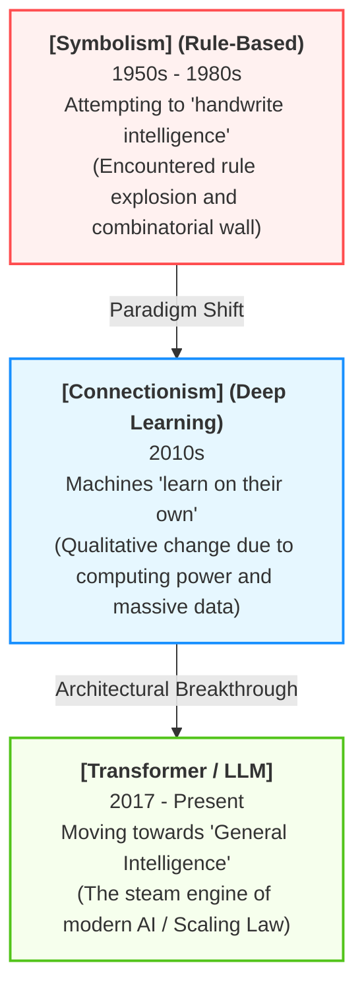
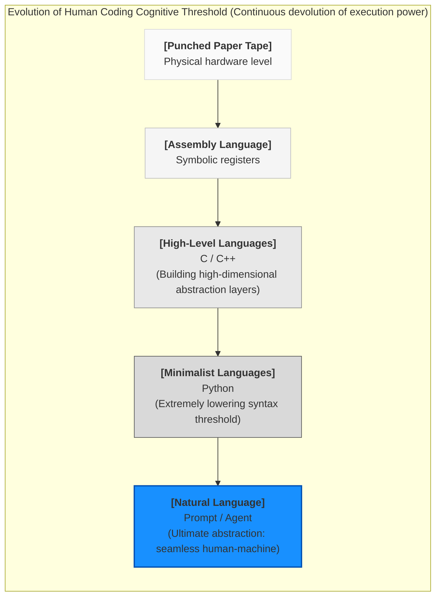
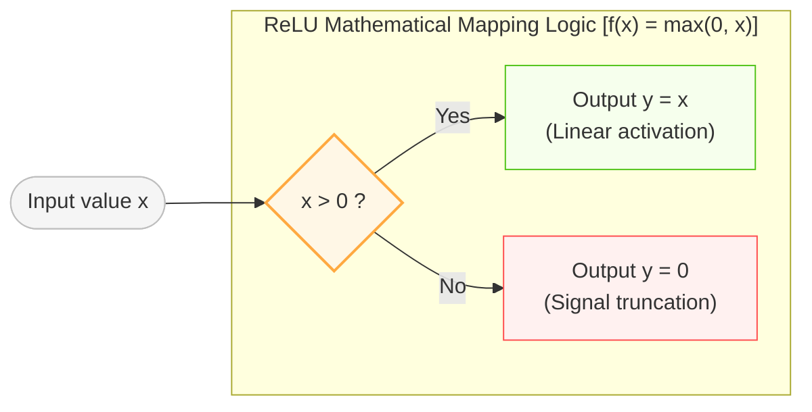
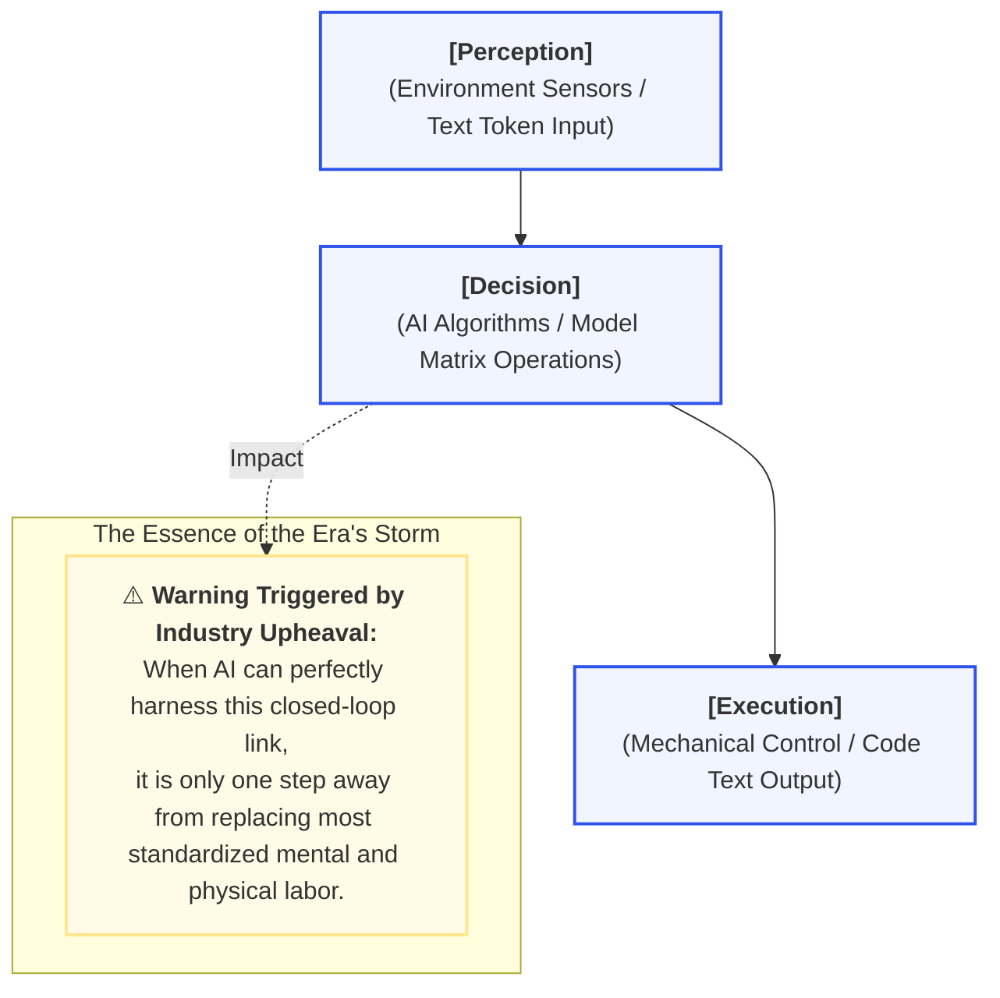

# Background: A Brief History of AI Evolution

> "History doesn't repeat itself, but it often rhymes." — Mark Twain

Over the past few decades, the core paradigm of software engineering has remained unchanged: humans are responsible for thinking, and computers are responsible for executing. Today, however, the emergence of Large Language Models (LLMs) has allowed machines to deeply intervene in the exclusive human domain of "thinking."

When developers first experience Cursor automatically refactoring a project, Claude Code autonomously fixing tests, or GitHub Copilot completing an entire complex function in one breath, they often feel a strong sense of contradiction. On one hand, they marvel at this almost magical leap in productivity; on the other hand, there is a lingering inner unease: if AI can already write code autonomously, am I still needed?

This anxiety is not surprising. We are not facing a routine tool upgrade, but a reconstruction of the underlying production relations of the software industry. This chapter will take you back to the starting point of AI, sort out the development context of artificial intelligence and AI programming, and dismantle the underlying logic of how large models "understand code." Understanding history can help us see clearly: what exactly has this technological revolution changed? And what hasn't changed?


## A Brief History of AI: From Logic Machines to Probabilistic Intelligence

Humanity's obsession with "creating machines that can think" was born almost simultaneously with modern computers themselves. Over the past seventy years, the development of artificial intelligence has not been a smooth upward curve, but rather a long war of continuous failures and resurrections. It has roughly gone through three key paradigm stages:



### Symbolism: Humans Attempt to "Handwrite Intelligence"

The core idea of early AI was very simple: since human thought can be described by logic and symbols, as long as all logical rules are written out, the machine will naturally possess intelligence.

Thus, scientists began to build massive rule systems. For example: "`Rule 1: If (weather == sunny AND temperature > 25) Then wear short sleeves`". This is the so-called **Symbolism**. That era gave birth to a large number of "expert systems," which performed astonishingly well in fields with extremely clear rule boundaries, such as chess and mathematical theorem proving, once making humanity believe that artificial general intelligence was imminent.

However, the real world is not as orderly as a chessboard. Human language is full of ambiguity, image recognition is full of noise, and the variables in real environments are nearly infinite. If you want a machine to understand what a "cat" is, you will quickly fall into a quagmire of rules: Does a black cat count? Does a cartoon cat count? What if it's only half a face? What if the lighting is blurry? As boundary conditions increase, rules begin to expand exponentially, eventually crashing into the high wall of "combinatorial explosion." AI welcomed its first winter.

### Deep Learning: Machines Begin to "Learn on Their Own"

Unlike "handwriting rules," another group of researchers proposed completely opposite ideas: do not tell the machine the rules; let the machine induce the rules itself from massive amounts of data. This is **Connectionism**, also known as machine learning and deep learning.

The core weapon of deep learning is the **Artificial Neural Network (ANN)**, which mimics the connection method of biological neurons, generating outputs after processing input signals, weighted summation, and activation functions. Essentially, a neural network is an extremely massive "high-dimensional function fitter."

For a long time in the past, this method remained lukewarm because it relied heavily on computing power and data—two scarce resources. It wasn't until around 2010 that the explosion of GPUs brought terrifying parallel computing capabilities, and the development of the mobile internet contributed unprecedented massive amounts of data. In 2012, AlexNet won the ImageNet image recognition competition with an overwhelming advantage, officially announcing the comprehensive arrival of the deep learning era.

In the following years, AI frantically conquered fields such as speech, face recognition, and autonomous driving. But the AI at this time was still only a "specialist": an AI that plays chess cannot chat, and an AI that recognizes pictures cannot drive. It wasn't until the sudden emergence of the Transformer architecture that the barriers between vertical fields were broken.

### Transformer: The "Steam Engine" of Modern AI

In 2017, Google published the epoch-making paper "Attention Is All You Need," proposing the **Transformer** architecture.

Compared to traditional Recurrent Neural Networks (RNNs), the Transformer ushered in two epic breakthroughs: it can perfectly capture ultra-long-distance context dependencies, and it is extremely suitable for GPU parallel computing. If past AI was more like an ascetic monk reading word by word, the Transformer is more like a genius who can "scan the whole page at a glance." This allowed the parameter scale of models to break physical limits for the first time, capable of truly infinite expansion.

Subsequently, OpenAI firmly practiced the world-shocking **Scaling Law**: as the number of model parameters, training data volume, and computational power continue to expand, the model's capabilities will continue to evolve, and produce an "emergence of capabilities" when crossing a certain critical point. The birth of the GPT series and the detonation of ChatGPT in 2022 made the world realize that AI is no longer just a rigid "classifier"; it has begun to possess conversational abilities, multi-step reasoning, creativity, and extremely terrifying programming capabilities.


## The Evolution of AI Programming: How Programmers Step by Step "Devolve Power"

Code is naturally suited soil for AI. Because code is essentially a language, and it is more regular, strictly structured, and logically deterministic than natural language. Looking throughout the development history of AI programming, it is essentially a history of programmers gradually ceding "code execution power and construction power" to machines:

| Development Stage | Representative Tech | Interaction Mode | Core Role of Programmer |
| --- | --- | --- | --- |
| **1st Gen: Syntax Completion** | IDE IntelliSense | Auto-completes variables, class names, and APIs | Keyboard operator (pure physical coding) |
| **2nd Gen: Code Continuation** | GitHub Copilot | Auto-generates functions and snippets based on context | Line-level supervisor (line-by-line code review) |
| **3rd Gen: Conversational Programming** | ChatGPT / Cursor | Generates modules and debugs via natural language dialogue | R&D coach (organizing module logic) |
| **4th Gen: Agentic AI** | Claude Code / Windsurf | Autonomously plans, reads/writes files, runs tests, and fixes | Architect and final judge (setting boundaries) |

From the initial "typing a few less characters" to today's AI Agents that can autonomously read the entire project architecture, analyze dependencies, modify multiple files, call the terminal to run tests, and self-iterate and fix after errors... AI is transforming from an "auxiliary plug-in" into a 24/7 online, tireless junior engineering team.

Along with this comes a profound shift in the focus of software engineering: the pure ability to implement code has begun to sharply depreciate, while the capabilities of system design and constraint management have been infinitely amplified.


## Why Can Large Models Write Code?

When many people first see AI write perfect code, they develop a kind of sci-fi worship: has it truly understood the esoteric meaning of programming?

### Intelligence Constructed by Probability

From the perspective of underlying technical principles, what large language models do is extremely pure, even surprisingly simple: "Based on the existing Tokens, predict the next most likely Token to appear."

When the model sees the following context:

```javascript
function add(a, b) {
    return

```

It will calculate the strongest trend in the probability space based on the massive amounts of open-source code it swallowed during the training phase, thereby continuing to write:

```javascript
    a + b;
}

```

It is not learning rigid syntax textbooks, but the statistical laws of the entire software world. Because in engineering reality, there are a large number of stable patterns: CRUD operations are highly repetitive, API calls have fixed paradigms, and common algorithms possess clear structures. When the model scale is large enough, this probability prediction based on massive data will emerge with extremely realistic "logical reasoning capabilities" on the surface.

### Why is AI Even Better at Code?

Intuitively, humans feel that everyday speech (natural language) is simpler than programming code, but for large models, the exact opposite is true: code is its most standard, most standardized native language.

Natural language is full of ambiguity, metaphors, and environmental noise (for example, "Apple" can represent a fruit or a company; "I'm there" might mean actually arrived, or still stuck on the road). But code is different; code has extremely high "information density" and "absolutely stable rules." Type definitions, control flows, call chains, and data structures in code all explicitly express logic in an unambiguous way. This makes the attention mechanism of the Transformer extremely easy to capture the patterns within.

### Will Programmers be Replaced?


Will programmers be replaced? The answer is: the survival space for programmers who play the role of "code typists" in the conventional sense will be maximally compressed.

Looking back at the history of programming languages, its core trajectory is undoubtedly evolving towards "lowering the threshold of human cognition":



From obscure assembly language to Python, which drastically lowered the threshold for programming, humans have always been building increasingly easy-to-use abstraction layers. In the past, the greatest technical barrier leading to the ultimate goal of "natural language directly driving computers" was that machines could not accurately parse the natural fuzziness of human language. Today, the breakthrough of LLMs has essentially completely cleared this obstacle.

Underlying architectures, core algorithms, and system-level development that requires extremely high performance will still need a small number of top-tier hardcore professional programmers to hold the line. But the demand for conventional application-layer development and CRUD business positions will inevitably shrink off a cliff. Considering the massive software talent reserve accumulated during the industry's expansion period over the past decade or so, the future imbalance between supply and demand will likely cause ordinary programmers to face an unprecedented industry winter.

In the face of this irreversible technological torrent, blindly being anxious, resisting, or pretending to turn a blind eye will not help. When AI can pour out code at ten times the speed, the value of programmers hasn't completely disappeared, but it is undergoing a profound displacement.

Future core competitiveness will no longer be mastering the syntax details of a specific programming language, or competing on the muscle memory on the keyboard. In an era where code generation costs approach zero, the moat of an excellent programmer will be redefined by the following three brand-new identities:

- **Domain Modeler:** AI is proficient in code, but it cannot understand the chaotic, dynamic, and game-filled real business world. What will be truly scarce in the future are people who can deeply understand complex business scenarios, sort out chaotic requirements, and abstract them into elegant, rigorous, and reproducible system models.
- **AI's Final Judge (The Judge):** Future software development will likely become "AI is responsible for crazy generation, humans are responsible for cross-validation." Due to the natural hallucinations and lack of engineering responsibility in large models, they will produce technical debt that looks elegant but hides deadly traps at an alarming speed. The importance of testing, code review, and boundary constraint governance will be infinitely amplified. Humans must firmly grasp the "final right of judgment."
- **Guardian of Order:** When writing code becomes effortless, the complexity of systems will spiral out of control exponentially. The biggest engineering challenge in the future is how to maintain a high degree of consistency across the system amidst overwhelming AI-generated code, prevent wild architectural decay, and ensure that the entire behemoth continues to run stably under human control.

Truly powerful programmers are no longer the ones who write the best code, but those who are best at harnessing AI, constraining AI, and understanding the essence of systems.


## Will AI Develop Consciousness?

Since large models behave more and more like "living humans" when writing code and reasoning, are they quietly moving towards "awakening"?

In an era where technological concepts emerge endlessly, the "machine threat theory" is hyped up every dozen years or so. However, if we look at it from a purely engineering and mathematical perspective, there is still an insurmountable chasm between large models and true "consciousness." At least in the foreseeable future, we don't need to worry about AI possessing a true autonomous soul.

### The Essence of Algorithms: Superposition and Fitting of High-Dimensional Functions

Currently, the most mainstream AI algorithms, whether Large Language Models (LLMs) that write code or Diffusion Models that draw pictures, are essentially based on Artificial Neural Networks (ANNs).

Mathematically, we can abstract any complex real-world problem into a super function. For example, "chatting" is a function that inputs a piece of text and outputs another piece of text; "programming" is a function that inputs natural language requirements and outputs code text. Because the variables of these functions are extremely huge, they cannot be expressed with a concise physical formula.

To solve this problem, modern deep learning adopts a method similar to high-dimensional series decomposition—decomposing a complex function that cannot be looked at directly into linear and non-linear superpositions of billions or trillions of extremely simple basic functions.

In large language models, the role of these "underlying building blocks" is usually played by the extremely simple ReLU (Rectified Linear Unit) function or its variants (such as SwiGLU).


$$\text{ReLU}(x) = \max(0, x)$$



This is the entire secret of large models: hundreds of billions of mathematical functions as simple as polylines, through complex weight connections and linear superpositions, eventually fit a complex network capable of writing high-order code. Every step here is built on strict mathematical operations and matrix multiplication; it is the result of highly precise mathematical fitting, having nothing to do with biological "self-consciousness."

### Dispelling Two Cognitive Misunderstandings About AI Awakening

The arguments supporting the imminent awakening of AI are usually based on two specious arguments:

- **Misunderstanding 1: "Artificial neural networks are simulations of the human brain, so since the human brain has consciousness, AI will have consciousness."**
This is a common conceptual substitution. The core of artificial neural networks is function fitting, not biological human brain simulation. The two have fundamental and massive differences in physical structure:
   1. Dynamic vs. Static: The neural network of the human brain is dynamic; neurons constantly build new connections and prune old connections during the thinking process. The architecture of artificial neural networks, however, is completely static and rigid after training ends; only weight parameters change, and its synaptic structure cannot reorganize autonomously.
   2. Mesh vs. Layered: The human brain is a true, complex, deeply non-linear three-dimensional mesh connection; while current AI models are essentially highly regular layered linear propagations. Furthermore, humanity still only glimpses the tip of the iceberg regarding the operating mechanism of its own brain. Some physicists believe that human thought activities may include quantum effects or undiscovered physical laws. These are all things that AI algorithms running on classical computer chips and performing deterministic mathematical calculations completely lack.


- **Misunderstanding 2: "Quantitative change leads to qualitative change; with enough parameters, AI will suddenly have a flash of insight and generate consciousness."**
This kind of thinking treats technology as magic. If there is no architectural design regarding "self, motivation, consciousness" at the bottom of the algorithm, no amount of parameters will produce similar capabilities. Expecting parameter stacking to spontaneously generate consciousness is like putting all the chemical elements that make up life into a glass bottle, shaking it, and expecting these molecules to spontaneously arrange themselves into a living cell. Sometimes we have beautiful wishes, hoping that things we don't understand can spontaneously generate magic and miracles, but ultimately these wishes almost always fall flat.

The highly complex intelligence displayed by current AI excites us, but it is still a cold tool forged by mathematical formulas.

## The Historical Fate of Ordinary People Under the Technological Torrent

Since large models do not have consciousness, does that mean they cannot pose a substantive threat to human society? The answer is exactly the opposite. The most dangerous thing has never been a tool gaining a soul, but a tool beginning to deconstruct existing social production relations on a massive scale with unrivaled low cost and high efficiency.

Many tech optimists will argue: the arrival of AI will also create a large number of new jobs. However, a cruel reality is deliberately ignored: can those who are mercilessly eliminated by the technological torrent in a short period of time truly cross the huge "skills gap" painlessly and transform themselves into AI data annotators or system maintenance experts?



Currently, AI is only one step away from operating mechanical equipment in factories, performing surgeries, or autonomously calling various tools in the software world. It is foreseeable that industries such as teachers, secretaries, translators, artists, doctors, lawyers, and programmers will none be able to stay out of the storm of this technological revolution detonated by probabilistic intelligence.

Looking back from the threshold of the future, history is always surprisingly similar. People always relish those magnificent grand narratives in historical books. However, behind these heroic epics are ordinary folks who are often relegated to the background and fade into dust. History cruelly shows: in its early stages, every so-called "huge progress" in social productivity is often accompanied by a severe compression and elimination of the living space of grassroots practitioners.

The evolution speed of production relations always lags behind the rapid advance of productivity. In the early stages of major technological transitions, wealth and resources inevitably concentrate in the hands of a very few who master new technologies and possess massive computing power. Conversely, this will lead to an even more difficult situation for the majority of ordinary people who have single skills and have not yet adapted to the changes.

