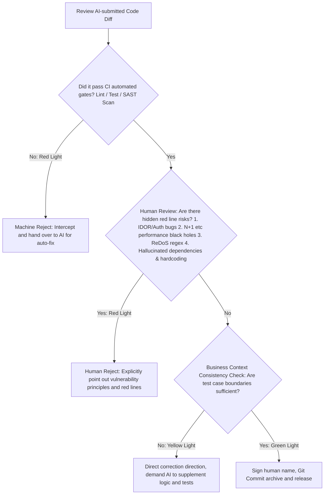

# Final Verdict

> "To believe everything in a book is worse than having no books at all." — "Mencius"

As 97% of organizations begin to use or pilot AI programming assistants, the pain points of software development have quietly shifted. In the past, our bottleneck was "how to write code quickly"; now, the line between life and death has become "how to ensure the code written is safe."

In the era of human-machine collaborative programming, the high speed at which large models generate code easily triggers a terrifying sub-health phenomenon in software engineering—"cognitive laziness." Many developers submissively accept all the code provided by large models, developing a "false sense of security" when faced with extremely professional and elegant code formatting, and merge it directly into the main branch without even looking at it. This is not only a degradation of engineering attitude, but also the beginning of software disasters. The latest research shows that logic and correctness defects in AI-generated code are 1.7 times higher than traditional development methods.

Large models do not need to be responsible for online crashes, do not need to get up at 3 AM to troubleshoot Core Dumps, and certainly will not be fired by the company for data leaks. Only you, the human programmer in front of the screen, need to bear all the causality of the code.

To guard against the "sweet poison" of AI, humans must sit firmly on the judge's bench and scrutinize every line of generated Diff with a coldly skeptical eye.

## The Judge's Mindset of Default Distrust

Do not treat AI as a "senior engineer needing guidance." In the courtroom of code review, you should treat it as a fanatical intern who types extremely fast, is tireless, but absolutely assumes no responsibility.

When humans review physical code written by colleagues, they usually assume that behind the code lies the author's "intent" and understanding of the business. But AI has no intent; it just predicts the "next line of code that looks most reasonable" based on a massive probability model. By design, AI tools often tend to optimize for "Task Complete" rather than "Task Correct."

Therefore, when reviewing AI code, we must thoroughly transform our mental model: establish the principle of "default distrust." Don't ask, "Does this code look reasonable?" Ask, "What assumptions does this code make? Are these assumptions safe in extreme edge cases?"

### Review Dimensions

| Review Dimension | Traditional Human-Reviews-Human Mindset | Human-Reviews-Machine Mindset in the AI Era |
| --- | --- | --- |
| Business Intent | Believe the author understands the system's Auth mechanism. | Presume the AI might forcibly bypass Auth or put validation incorrectly in the UI layer just to make the logic run. |
| Historical Context | Believe the author knows the historical pitfalls of this core function. | Presume the AI has absolutely no historical memory; it is highly likely to confidently and precisely step into a five-year-old vulnerability pattern. |
| Code Appearance | The code has detailed comments, indicating the logic is well thought out. | Assume the comments are just camouflage text generated by the AI to make the code "look professional." |

When the AI tells you "this code is safe," never believe its verbal explanation. Demand evidence—such as test case execution results proving that boundary conditions are properly handled. Code without evidence is uniformly rejected in court.

## Three Real Case Files of Flipping Over

To demonstrate how the human "supreme judge" should execute harsh quality verdicts, let's look at three extremely typical AI rollover cases. They touch upon the three bottom lines of security, performance, and algorithms, respectively.

### Trial Case File 1: AI's Omitted Privilege Escalation Vulnerability (IDOR Security Red Line)

#### Rollover Scenario

You ask the AI to write an API endpoint to "delete a specified shopping cart item." The AI quickly writes the following Express + Prisma code that looks very elegantly formatted and extremely standard in structure:

```typescript
// AI-generated function to delete a cart item (seemingly perfect, actually highly toxic)
export async function deleteCartItem(req: Request, res: Response, next: NextFunction) {
  try {
    const { itemId } = req.params; // Only gets the ID of the item to delete

    // Check if the item exists
    const item = await prisma.cartItem.findUnique({
      where: { id: parseInt(itemId) }
    });

    if (!item) {
      return res.status(404).json({ error: "Item not found" });
    }

    // Fatal security vulnerability: executes deletion directly!
    await prisma.cartItem.delete({
      where: { id: parseInt(itemId) }
    });

    return res.status(200).json({ success: true, message: "Deletion successful" });
  } catch (error) {
    next(error);
  }
}
```

#### Judge's Gavel: Pointing out the IDOR Privilege Escalation Vulnerability

In this task, the large model only focused on "execution of the logic" (i.e.: get ID -> query DB -> delete), but completely missed the "user permission isolation boundary." This is an extremely typical Insecure Direct Object Reference (IDOR) vulnerability. A hacker only needs to log into their own account, and then sequentially increment the `itemId` (e.g., 10023, 10024) via a script to forcibly empty the shopping cart data of all users on the entire site!

#### Rescue Plan: Reshaping the Permission Defense Line

The human judge must coldly reject this generation and instruct the AI to refactor the code. In the database query, the identity of the currently logged-in user must be forcibly jointly validated:

```typescript
// Fixed highly secure deletion code
export async function deleteCartItem(req: Request, res: Response, next: NextFunction) {
  try {
    const { itemId } = req.params;
    const currentUserId = req.user.id; // Extract the currently logged-in user's ID from auth middleware

    // Joint query to validate ownership: ensure the cart of this itemId must belong to currentUserId
    const item = await prisma.cartItem.findFirst({
      where: {
        id: parseInt(itemId),
        cart: {
          userId: currentUserId // Forcibly associate user isolation boundary
        }
      }
    });

    if (!item) {
      // Deliberately return 404 instead of 403 to prevent hackers from probing the existence of other users' items
      return res.status(404).json({ error: "Item not found" });
    }

    await prisma.cartItem.delete({
      where: { id: parseInt(itemId) }
    });

    return res.status(200).json({ success: true, message: "Item safely deleted" });
  } catch (error) {
    next(error);
  }
}
```

### Trial Case File 2: AI's Manufactured "N+1 Query" Black Hole (Extreme Performance Red Line)

#### Rollover Scenario

You need to write a backend admin page that lists the 100 most recent orders and displays the buyer's nickname for each order. The AI slaps out a piece of seemingly reasonable Node.js + TypeORM query code:

```javascript
// AI-generated logic to get recent orders (classic performance black hole)
export async function getRecentOrders(req, res, next) {
  try {
    const orders = await orderRepository.find({
      order: { createdAt: 'DESC' },
      take: 100
    });

    const enrichedOrders = [];
    for (const order of orders) {
      // Fatal database query inside a loop!
      const user = await userRepository.findOne({ where: { id: order.userId } }); 
      enrichedOrders.push({
        ...order,
        buyerName: user ? user.nickname : "Unknown User"
      });
    }

    return res.status(200).json(enrichedOrders);
  } catch (error) {
    next(error);
  }
}
```

#### Judge's Gavel: Piercing the N+1 Slow Query Black Hole

The large model's probability network lacks concepts of "physical time" and "network IO bottlenecks." In its eyes, "loop traversal -> query table individually" is a very intuitive code structure. However, in a production environment, these 100 loops mean 100 independent network queries. If concurrent users rise slightly, the number of database connections will instantly max out, CPU will spike to 100%, and the system will directly avalanche and crash! This is the disastrous N+1 query black hole.

#### Rescue Plan: Guide AI to Use JOIN Queries

The human judge immediately rejects the code, issues a severe reprimand, and demands switching to a single cascade fetch:

```javascript
// Optimized high-QPS join query code
export async function getRecentOrders(req, res, next) {
  try {
    const orders = await orderRepository.find({
      relations: ["user"], // Declare cascade fetching of the associated user row (LEFT JOIN), done in one IO
      order: { createdAt: 'DESC' },
      take: 100
    });

    const result = orders.map(order => ({
      id: order.id,
      amount: order.amount,
      createdAt: order.createdAt,
      buyerName: order.user ? order.user.nickname : "Unknown User"
    }));

    return res.status(200).json(result);
  } catch (error) {
    next(error);
  }
}
```

### Trial Case File 3: AI's Manufactured Disastrous ReDoS (Algorithmic Security Red Line)

#### Rollover Scenario

You ask the AI to write a regular expression to validate whether the email entered by a user is legitimate. The AI confidently writes the following rule:

```typescript
// Classic email validation regex generated by AI
const emailRegex = /^([a-zA-Z0-9-\.]+)+@([a-zA-Z0-9-\.]+)+$/;
```

#### Judge's Gavel: ReDoS Regular Expression Denial of Service Attack

When handling regular expressions, large models easily write regexes with "malignant nested quantifiers" (such as `(a+)+` or `([a-zA-Z0-9-\.]+)+`). When a malicious hacker deliberately inputs an extremely long email with an illegitimate ending (for example, inputting a string containing 50 `a`s but missing `@` at the end: `aaaaaaaaaaaaaaaaaaaaaaaaaaaaaaaaaaaaaaaaaaaaaaaaaa!`), when the JavaScript engine performs Backtracking, the calculation steps will explode exponentially. This will cause the entire single-threaded server process to directly deadlock, getting stuck in CPU calculation, instantly dragging down the entire cluster! This is the famous ReDoS (Regular Expression Denial of Service) attack.

#### Rescue Plan: Forcible Interception and Standard Library Replacement

The human judge must reject this regex and command the AI to use native standard libraries or a safer non-backtracking regex:

```typescript
// Optimized high-security email validation
export function isValidEmail(email: string): boolean {
  if (email.length > 254) return false; // Pre-limit input length to physically block ultra-long backtracking
  
  // Use a simple, non-exponential backtracking regex without nested quantifiers
  const safeEmailRegex = /^[a-zA-Z0-9._%+-]+@[a-zA-Z0-9.-]+\.[a-zA-Z]{2,}$/;
  return safeEmailRegex.test(email);
}
```

## The Trinity of Automated Guardrails

Human eyes cannot remain vigilant forever, nor should they be used to find missing semicolons. To harness the frantically produced AI code, a high-frequency, automated cyber defense system must be established so that low-level mistakes never even enter the human line of sight. This system must cover three layers: correctness, security, and controllability.

### The First Guardrail: Correctness

AI is good at generating, but not at verifying. Verification must be automated and completed before human intervention.
- Test-Driven Development (TDD) up front: Don't just throw the AI a sentence like "write a login function." Give it a testable contract: input/output types, boundary conditions. Have the AI generate tests first, then write the implementation. AI code that doesn't pass unit tests is junk code.
- Multi-agent verification chain: Let AIs check and balance each other. Build a pipeline where a "Generator Agent" writes code, a "Critic Agent" specifically looks for logical loopholes, and a "Tester Agent" adds 100,000 random Fuzz tests. Defeat magic with magic.

### The Second Guardrail: Security

The security issues introduced by AI are often not out of malice, but because it confidently copied outdated code from historical repositories.
- Context Engineering: Firmly nail down the baseline in the `.cursorrules` file in the project root directory: "The use of `eval` is prohibited, SQL must be parameterized, all external inputs are validated using Zod". Nip dangerous tendencies in the bud during generation.
- Ruthless automated security gates: AI loves to introduce old dependency packages, and even "hallucinates" non-existent packages, triggering dependency confusion attacks. SAST (Static Application Security Testing) and SCA (Software Composition Analysis) must be forced to run in CI/CD. If there are any High/Critical alerts, the machine directly blocks the merge; merely throwing a warning is absolutely not allowed.
- Runtime sandbox isolation: If conditions permit, when a brand-new module written by AI goes online for the first time, don't give it full permissions. Run it in a container, network outbound prohibited by default, file system read-only, sensitive credentials injected by Vault. Even if it hides an `rm -rf /` in the code, it won't blow up your system.

### The Third Guardrail: Controllability

This is the bottom line most easily missed by many teams frantically piling up AI outputs.
- Absolute traceability of origin: Require that generated code commits must carry a label indicating AI participation (e.g., `Co-authored-by: model-gpt4o` and the corresponding Prompt intent Hash attached to the Commit Message). If a weird Bug occurs, you can immediately trace back to which "spell" caused the trouble.
- Limit the blast radius: Strictly forbid AI from rewriting 2000 lines of code at once. Limit single PRs to under 300 lines, and wrap AI code with Feature Flags. Once an anomaly occurs online, one-click second-level downgrade.
- Clarify human ownership: Every file in the repository must have a clear human Owner. High-risk modules like authentication, payment, and encryption are set as "AI No-Write Zones" (can only generate draft ideas, cannot submit directly). Whoever presses the Merge button is the sole primary responsible person for the incident.

## 4. Verdict Execution: The Human Judge's Ultimate Decision Tree

When facing a massive volume of AI code merge requests every day, your brain and CI pipeline should strictly follow this set of decision-making SOPs:



## The Unshirkable Causality

When 97% of teams are using AI programming, the core competitiveness of software engineering has completely shifted from "how to write code quickly" to "defining what is right and identifying what is wrong."

You can outsource the manual labor of hitting the keyboard to machines, but you can absolutely not hand over the soul and bottom line of the system to them. The moment you press the Enter key and merge the code, the causality is sealed. Stay awake and grip the gavel in your hand tightly; this is the last barrier guarding the bottom line of software engineering in the torrent of code.