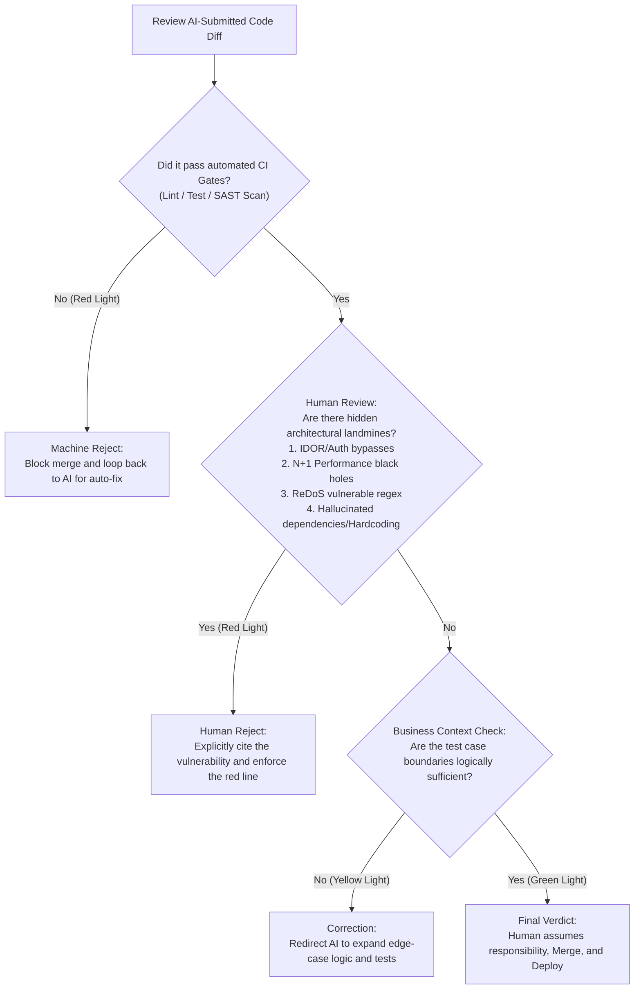

# The Final Verdict

> "The important thing is not to stop questioning." — Albert Einstein

As 97% of organizations rapidly adopt or pilot AI programming assistants, the fundamental bottleneck of software engineering has quietly shifted. Historically, our greatest struggle was *"how to write code faster."* Today, the line separating success from catastrophic failure is *"how to ensure the generated code is actually safe."*

In this new era of human-machine pair programming, the sheer velocity at which LLMs generate code frequently triggers a terrifying psychological side-effect in engineers: **Cognitive Laziness.** 

Many developers submissively accept the massive blocks of code spit out by large models. Seduced by the "false sense of security" provided by pristine formatting, flawless syntax, and polite comments, they merge the code directly into the main branch without a second glance. This is not merely a degradation of engineering discipline; it is the genesis of software disaster. Recent industry studies reveal that logic and correctness defects in AI-generated code are actually 1.7 times higher than in code written through traditional methods.

Large models will not be held accountable for a production outage. They do not have to wake up at 3:00 AM to debug a Core Dump. And they certainly will not be fired for causing a massive user data breach. Only you—the human programmer sitting in front of the screen—must bear the ultimate causality for the code you merge.

To guard against the "sweet poison" of AI-generated convenience, human engineers must sit firmly on the judge's bench, scrutinizing every single line of the Git Diff with a cold, unforgiving, and deeply skeptical eye.

## The Judge's Mindset: Default to Distrust

Do not treat an AI like a "senior engineer who just needs a little guidance." In the courtroom of Code Review, you must treat the AI as a hyperactive, fanatical intern who types at lightspeed, never sleeps, but possesses absolutely zero sense of engineering accountability.

When human engineers review physical code written by human colleagues, they inherently assume that behind the code lies a coherent "intent" and a functional understanding of the business requirements. But an AI possesses no true intent. It merely calculates the most statistically probable "next line of code" based on a massive matrix of weights. By structural design, AI tools optimize for **"Task Complete,"** not **"Task Correct."**

Therefore, when auditing AI code, we must radically rewire our mental models to operate on the principle of **Default Distrust**. Never ask, *"Does this code look reasonable?"* Instead, you must aggressively ask: *"What assumptions is this code making? Do those assumptions hold up under catastrophic edge cases?"*

### The Dimensions of Review

| Review Dimension | The Traditional Mindset (Human vs. Human) | The AI Era Mindset (Human vs. Machine) |
| --- | --- | --- |
| **Business Intent** | Assume the author functionally understands the system's Authentication mechanisms. | Presume the AI might forcibly bypass Auth or validate credentials on the client-side just to make the prompt compile successfully. |
| **Historical Context** | Assume the author remembers the historical pitfalls of this legacy module. | Presume the AI suffers from total amnesia; expect it to confidently and surgically step into a five-year-old architectural landmine. |
| **Code Presentation** | Detailed comments indicate the logic was carefully planned and vetted. | Assume the comments are purely cosmetic camouflage generated by the AI to make the code "look professional." |

When an AI confidently assures you that "this code is perfectly safe," never believe its verbal explanation. **Demand empirical evidence**—such as unit test execution logs proving that boundary conditions are securely handled. In the court of engineering, code without evidence is uniformly rejected.

## Three Real-World Case Files of AI Disaster

To demonstrate exactly how a human "Supreme Judge" must execute these harsh quality verdicts, let's examine three classic cases of AI failure. They perfectly illustrate the three absolute red lines of software engineering: Security, Performance, and Algorithmic Complexity.

### Case File 1: The Omitted Privilege Escalation (The IDOR Security Red Line)

#### The Incident

You instruct the AI to write an API endpoint to *"delete a specified item from the user's shopping cart."* The AI rapidly generates the following Express + Prisma code. It looks elegantly formatted and structurally perfect:

```typescript
// AI-generated deletion logic (Looks flawless; actually highly toxic)
export async function deleteCartItem(req: Request, res: Response, next: NextFunction) {
  try {
    const { itemId } = req.params; // Extracts the target ID from the URL

    // Checks if the item exists in the database
    const item = await prisma.cartItem.findUnique({
      where: { id: parseInt(itemId) }
    });

    if (!item) {
      return res.status(404).json({ error: "Item not found" });
    }

    // FATAL VULNERABILITY: Executes the deletion blindly!
    await prisma.cartItem.delete({
      where: { id: parseInt(itemId) }
    });

    return res.status(200).json({ success: true, message: "Deletion successful" });
  } catch (error) {
    next(error);
  }
}
```

#### The Judge's Gavel: Identifying the IDOR Vulnerability

In executing this task, the LLM focused entirely on the linear "happy path" logic (Extract ID -> Query DB -> Delete). However, it completely hallucinated away the **"user permission isolation boundary."** 

This is a textbook **Insecure Direct Object Reference (IDOR)** vulnerability. A malicious hacker simply needs to log into their own account and run a script that sequentially increments the `itemId` (e.g., 10023, 10024, 10025...) in the URL. Because the code never verifies *who* owns the item, the hacker can forcefully eradicate the shopping cart data of every single user across the entire platform!

#### The Rescue Plan: Forcing the Permission Boundary

The human judge must coldly reject this code and command the AI to refactor the logic. The query *must* jointly validate the identity of the currently authenticated user:

```typescript
// Fixed, secure deletion logic
export async function deleteCartItem(req: Request, res: Response, next: NextFunction) {
  try {
    const { itemId } = req.params;
    const currentUserId = req.user.id; // Extract the authenticated user's ID from Auth middleware

    // Joint query validation: The item MUST belong to the currentUserId
    const item = await prisma.cartItem.findFirst({
      where: {
        id: parseInt(itemId),
        cart: {
          userId: currentUserId // Enforces strict user isolation boundaries
        }
      }
    });

    if (!item) {
      // Intentionally return 404 (Not Found) instead of 403 (Forbidden) 
      // to prevent hackers from probing the existence of other users' items.
      return res.status(404).json({ error: "Item not found" });
    }

    await prisma.cartItem.delete({
      where: { id: parseInt(itemId) }
    });

    return res.status(200).json({ success: true, message: "Item safely deleted" });
  } catch (error) {
    next(error);
  }
}
```

### Case File 2: The N+1 Query Black Hole (The Extreme Performance Red Line)

#### The Incident

You need a backend admin route that fetches the 100 most recent orders and displays the buyer's nickname next to each order. The AI confidently slaps down this Node.js + TypeORM query logic:

```javascript
// AI-generated order retrieval (A classic performance black hole)
export async function getRecentOrders(req, res, next) {
  try {
    const orders = await orderRepository.find({
      order: { createdAt: 'DESC' },
      take: 100
    });

    const enrichedOrders = [];
    for (const order of orders) {
      // FATAL FLAW: Executing a database query inside a loop!
      const user = await userRepository.findOne({ where: { id: order.userId } }); 
      enrichedOrders.push({
        ...order,
        buyerName: user ? user.nickname : "Unknown User"
      });
    }

    return res.status(200).json(enrichedOrders);
  } catch (error) {
    next(error);
  }
}
```

#### The Judge's Gavel: Piercing the N+1 Query

A large language model's probabilistic network possesses zero concept of "physical execution time" or "network I/O bottlenecks." To an AI, a `loop -> query -> push` structure is a perfectly intuitive, logical pattern. 

In a production environment, however, this loop triggers 100 completely independent network trips to the database. If even a slight spike in concurrent users hits this endpoint, the database connection pool will instantly exhaust, the CPU will max out at 100%, and the entire microservice will violently cascade and crash. This is the disastrous **N+1 Query** problem.

#### The Rescue Plan: Forcing JOIN Operations

The human judge immediately rejects the code, issues a severe architectural reprimand, and commands the AI to utilize a single relational cascade fetch:

```javascript
// Optimized, high-QPS relational query
export async function getRecentOrders(req, res, next) {
  try {
    const orders = await orderRepository.find({
      relations: ["user"], // Execute a LEFT JOIN to fetch user data in a single I/O operation
      order: { createdAt: 'DESC' },
      take: 100
    });

    const result = orders.map(order => ({
      id: order.id,
      amount: order.amount,
      createdAt: order.createdAt,
      buyerName: order.user ? order.user.nickname : "Unknown User"
    }));

    return res.status(200).json(result);
  } catch (error) {
    next(error);
  }
}
```

### Case File 3: The ReDoS Catastrophe (The Algorithmic Security Red Line)

#### The Incident

You ask the AI to write a regular expression to validate whether user-inputted emails are legitimate. The AI confidently outputs this regex rule:

```typescript
// A classic, AI-generated email validation regex
const emailRegex = /^([a-zA-Z0-9-\.]+)+@([a-zA-Z0-9-\.]+)+$/;
```

#### The Judge's Gavel: Regular Expression Denial of Service (ReDoS)

When generating regular expressions, LLMs are notoriously prone to writing "malignant nested quantifiers" (like `(a+)+` or `([a-zA-Z0-9-\.]+)+`). 

If a malicious hacker intentionally inputs an extremely long, slightly malformed string (e.g., inputting 50 `a`'s but omitting the `@` symbol at the end: `aaaaaaaaaaaaaaaaaaaaaaaaaaaaaaaaaaaaaaaaaaaaaaaaaa!`), the JavaScript engine's regex evaluator will attempt to perform "Catastrophic Backtracking." The computational steps required will explode exponentially. This will instantly deadlock the single-threaded Node.js event loop, maxing out CPU computation, and dragging the entire server cluster to a grinding halt. This is a lethal **ReDoS (Regular Expression Denial of Service)** attack.

#### The Rescue Plan: Standard Libraries and Pre-Validation

The human judge must intercept this regex and command the AI to utilize native validation libraries or, at minimum, write a non-backtracking alternative with physical length limits:

```typescript
// Optimized, high-security email validation
export function isValidEmail(email: string): boolean {
  // 1. Physically truncate input length to block ultra-long backtracking attacks
  if (email.length > 254) return false; 
  
  // 2. Utilize a flat, non-exponential regex devoid of nested quantifiers
  const safeEmailRegex = /^[a-zA-Z0-9._%+-]+@[a-zA-Z0-9.-]+\.[a-zA-Z]{2,}$/;
  return safeEmailRegex.test(email);
}
```

## The Trinity of Automated Guardrails

Human eyes cannot remain infinitely vigilant, nor should they be wasted hunting for missing semicolons. To safely harness the frantic production velocity of AI code, you must establish an automated, high-frequency cyber defense perimeter. Low-level mistakes must never even reach human eyes. This perimeter must cover three critical layers: Correctness, Security, and Controllability.

### Guardrail 1: Correctness (Automated Verification)

AI is spectacular at generating code, but terrible at verifying it. Verification must be fully automated and execute *before* human intervention.
- **AI Test-Driven Development (TDD):** Never throw a vague prompt like *"write a login function"* at an AI. Feed it a strict, testable contract: precise input/output types and boundary conditions. Force the AI to generate the unit tests *first*, and only then write the implementation. AI code that fails its own unit tests is categorized as immediate garbage.
- **Multi-Agent Verification Chains:** Force AI models to audit each other. Architect a pipeline where a "Generator Agent" writes the code, a "Critic Agent" aggressively hunts for logical loopholes, and a "Tester Agent" spams the module with 10,000 random Fuzz tests. Defeat magic with magic.

### Guardrail 2: Security (Aggressive Interception)

The security vulnerabilities introduced by AI are rarely malicious; they occur because the AI confidently mimics outdated, vulnerable code from its training data.
- **Contextual Guardrails:** Hardcode strict security baselines directly into your repository's `.cursorrules` file: *"The use of `eval()` is strictly prohibited. All SQL queries must be parameterized. All external inputs must be validated via Zod."* Nip dangerous architectural tendencies in the bud before they are generated.
- **Ruthless CI/CD Security Gates:** AI agents love to hallucinate non-existent dependency packages, inadvertently triggering "Dependency Confusion" supply chain attacks. You must forcefully run SAST (Static Application Security Testing) and SCA (Software Composition Analysis) in your CI/CD pipeline. If a High or Critical alert fires, the machine must physically block the merge. Emitting a passive "warning" is unacceptable.
- **Runtime Sandbox Isolation:** Whenever possible, do not grant full system permissions to a brand-new, AI-generated microservice on day one. Run it in an isolated container: disable outbound network traffic by default, mount the filesystem as read-only, and inject sensitive credentials strictly via a Vault. Even if the AI secretly hides `rm -rf /` in the logic, your infrastructure will remain intact.

### Guardrail 3: Controllability (Accountability)

This is the ultimate bottom line that teams rushing to adopt AI fail to implement.
- **Absolute Traceability:** Mandate that all AI-generated code commits carry a distinct marker (e.g., `Co-authored-by: model-gpt4o`). The original Prompt Hash should be appended to the Commit Message. When a bizarre bug inevitably surfaces in production, you can instantly trace it back to the exact "spell" that caused the disaster.
- **Limit the Blast Radius:** Strictly forbid AI agents from refactoring 2,000 lines of architecture in a single Pull Request. Enforce a hard cap (e.g., 300 lines per PR), and wrap new AI logic in Feature Flags. If an anomaly triggers in production, you can execute a one-click, sub-second downgrade.
- **Enforce Human Ownership:** Every file in the repository must be assigned a clear human Owner. High-risk modules (Authentication, Payments, Cryptography) must be designated as "AI No-Write Zones" (the AI can draft ideas, but cannot execute direct commits). Whoever physically clicks the 'Merge' button is the sole, primary responsible party for any incident.

## Execution: The Human Judge's Decision Tree

When confronted with a massive volume of AI-generated Pull Requests every morning, your engineering brain and your CI pipeline must strictly execute this Standard Operating Procedure (SOP):



## The Unshirkable Burden of Causality

As 97% of engineering teams adopt AI pair programming, the core competency of a software engineer has permanently shifted. It is no longer about *"how fast can you write syntax,"* but rather *"how accurately can you define what is right, and identify what is wrong."*

You can outsource the physical labor of typing to a machine, but you can absolutely never surrender the soul and the foundational security of your system to it. The precise millisecond you press the *Enter* key and merge the code, the causality is sealed, and the responsibility is yours alone. 

Stay awake, grip the judge's gavel tightly, and remain vigilant. In the impending torrent of automated code, you are the final barrier guarding the absolute bottom line of software engineering.