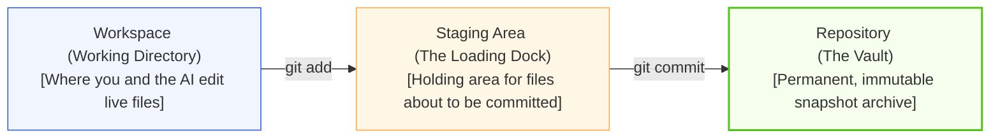
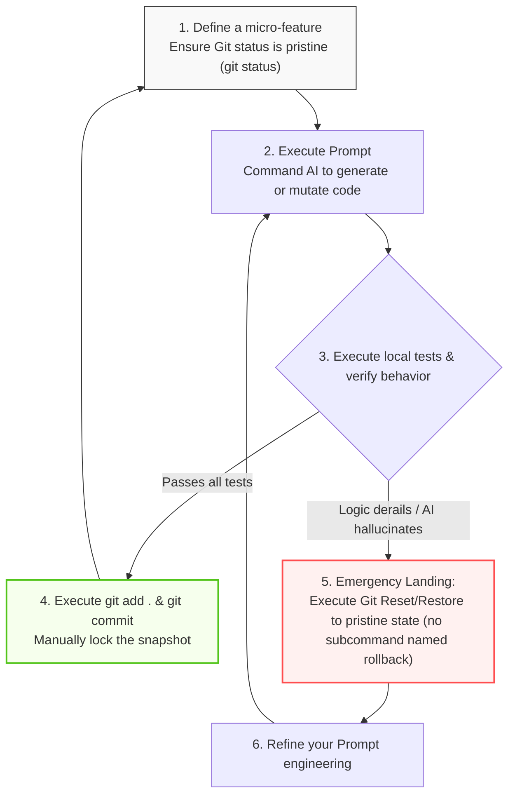

# Code Version Control

> "Anyone who has never made a mistake has never tried anything new." — Albert Einstein

The speed at which an AI writes code is breathtaking, but the speed at which it makes catastrophic mistakes, hallucinates logic, or completely crashes your system is equally fast. 

If every version of your code is not meticulously saved, you are flying blind. The moment an AI agent corrupts the core logic of your program, and you cannot remember exactly which files it touched or what the architecture looked like five minutes ago, you face a disaster. You might be forced to tear down the entire repository and start over from scratch.

The infrastructure that allows us to back up, record, and flawlessly restore every single version of our code is called a **Version Control System**. Among all available tools, **Git** is the absolute core, serving as the undisputed global standard in software engineering. Built on top of Git is **GitHub**, the world's largest cloud code hosting and collaboration platform.

This guide will walk you through mastering Git and GitHub from the ground up, constructing a bulletproof "cyber safety net" for you in the AI era.

## The Underlying Logic of Git

Before diving into terminal commands, you should mentally model Git as a "high-definition dashcam" permanently recording the history of your code world. Its primary job is to press the shutter button and save a perfectly safe, uncorrupted clone of your repository *before* you (or your AI) execute any major surgery on the architecture.

### Core Git Vocabulary

| Concept | The Engineering Reality (AI Perspective) |
| --- | --- |
| **Repository (Repo)** | Your project folder. Once Git is initialized here, every single keystroke is silently monitored and recorded. |
| **Commit** | Taking a permanent "snapshot" of the codebase. Once committed, the exact state of your code at that specific millisecond is locked in time forever. |
| **Branch** | An independent, parallel timeline branching off from the main code. You can spawn a new branch to let the AI experiment and hallucinate without ever polluting your pristine main architecture. |
| **Merge** | Fusing the modifications of a branch (like a flawless new feature written by an AI) back into the primary timeline (the Main branch). |
| **Clone** | Downloading a perfect, 1:1 replica of a cloud repository to your local machine. |
| **Push** | Safely syncing your local historical snapshots up to a cloud server (like GitHub) for permanent backup. |
| **Pull** | Downloading the latest architectural modifications from the cloud and merging them locally (crucial when collaborating across multiple laptops or team members). |
| **Reset / Revert / Restore** | The ultimate undo button in the AI era. No matter how violently an AI ravages your codebase, a reset/revert/restore instantly reverts the system to the last pristine snapshot. Git implements rollback via `reset`, `revert`, `restore`, etc. — there is no subcommand named `rollback`. |

:::tip The Distributed Design Philosophy
The core architecture of Git is strictly "distributed." Every developer's local laptop possesses the *complete* project history, allowing you to code and commit offline. GitHub, conversely, acts as the "Grand Central Station" located in the cloud, utilized purely for cross-device synchronization and global team collaboration.
:::

### The Three Major Work Areas of Git

Understanding Git's three physical work areas is the absolute key to mastering its command-line interface:



## GitHub Registration and Git Configuration

### Registering a GitHub Account

1. Navigate to the [GitHub Official Website](https://github.com) and click **Sign up**.
2. Enter your email address and set a highly secure password.
   - **Username Tip:** Choose a concise, professional alphanumeric username (e.g., `ruanqizhen`), because it will be permanently embedded in the URLs of all your software projects.
3. Complete the CAPTCHA, click **Create account**, and verify your email.
4. **Plan Selection:** Select the Free plan. It provides unlimited public and private repositories, which is entirely sufficient for 99% of engineering use cases.

:::tip Your Username is Your Digital Real Estate!
Your Username directly dictates the web URL of your personal developer homepage. If your username is `tom`, your generated portfolio link will be `tom.github.io`. The username you casually select today will become your permanent cyber "house number" in the engineering world.
:::

### Installing Git

- **Windows:** Navigate to the [Git Official Download Page](https://git-scm.com/download/win) and grab the installer. Keep all default checkboxes selected during installation, but ensure **"Git Bash"** (an incredibly powerful UNIX-style terminal) is checked.
- **macOS:** Open your Terminal and execute `xcode-select --install` to fetch Apple's developer tools, or utilize Homebrew by executing `brew install git`.
- **Linux (Ubuntu/Debian):** Execute `sudo apt update && sudo apt install git`.

Once installed, open your terminal (Windows users must open Git Bash) and execute the following command to verify the core binary:

```bash
git --version
# If the output reads something like "git version 2.x.x", your installation was flawless.
```

### Initial Identity Configuration

Every Git commit permanently stamps the author's identity onto the code. After installation, you must configure your global identity (ensure this matches your GitHub registration):

```bash
# 1. Bind your global author name
git config --global user.name "Your GitHub Username"

# 2. Bind your global author email
git config --global user.email "your-email@example.com"

# 3. Standardize the default initialization branch to 'main'
git config --global init.defaultBranch main

# 4. Verify your configuration payload
git config --list
```

### Configuring SSH Keys (Passwordless Operations)

Configuring an SSH key pair allows your local machine to securely push code to GitHub without demanding your password on every single transaction.

1. **Generate the Key Pair:** Execute this command in your terminal (press Enter repeatedly to accept the defaults):
```bash
ssh-keygen -t ed25519 -C "your-email@example.com"
```

2. **Extract the Public Key:** Execute this command and copy the entire output text:
```bash
cat ~/.ssh/id_ed25519.pub
# Copy the massive string starting with 'ssh-ed25519...'
```

3. **Bind to GitHub:** Log into GitHub → Click your Avatar (Top Right) → **Settings** → **SSH and GPG keys** → Click **New SSH key**. Paste your copied key into the `Key` block, name it (e.g., "Main Laptop"), and click **Add SSH key**.
4. **Test the Handshake:** Execute `ssh -T git@github.com`. If you receive a response stating `Hi username! You've successfully authenticated...`, your encrypted pipeline is officially open!

## High-Frequency Core Git Operations

### Initializing a Local Repository

Create a completely fresh directory for your project, then navigate into it via your terminal:

```bash
# Navigate into your project workspace
cd my-project

# Initialize the Git monitoring architecture
git init
# A hidden '.git' folder has now been generated. This is the brain of your dashcam.
```

### Recording Code Snapshots

When you (or an AI agent) modify architecture, you must manually lock those changes into a historical snapshot utilizing a three-step sequence:

```bash
# Step 1: Scan current state (Identify exactly which files the AI mutated)
git status

# Step 2: Push mutations to the Staging Area (The Loading Dock)
git add README.md  # Stage a specific file
git add .          # [Industry Standard] Instantly stage all mutated files in the workspace

# Step 3: Permanently lock the snapshot into the Repository
git commit -m "feat: Initialize core project architecture and inject README docs"
```

### Auditing AI Mutations

Because AI generates code at blinding speeds, you must aggressively audit the exact lines it mutated before executing a commit:

```bash
# View raw diffs between your live workspace and the last snapshot (Run this BEFORE git add)
git diff

# View diffs that are currently sitting in the Staging Area
git diff --staged

# View a clean, condensed history of all past snapshots
git log --oneline
```

## Micro-Iterations and Emergency Landings

Now that you possess the Git fundamentals, you must adhere to the **Golden Loop Rule** when pair-programming with AI (e.g., Cursor, ChatGPT). **Never allow an AI to generate hundreds of lines of logic without committing in between.**



### The Art of the Elegant Rollback

If an AI aggressively corrupts your architecture, execute one of these "Emergency Landing" commands immediately:

```bash
# Scenario 1: AI corrupted live files, but you HAVEN'T run 'git add'. Discard all tracked file mutations.
# Note: restore only affects tracked files. To delete new untracked files created by AI, use git clean -fd
# Full cleanup (preview first with git status and git clean -n): git restore . && git clean -fd
git restore . 
# (Legacy Git syntax: git checkout -- .)

# Scenario 2: You accidentally ran 'git add .', but want to yank files back out of the Staging Area.
git restore --staged .

# Scenario 3: AI executed multiple commits, destroying the system. You need to nuke recent history.
# [Soft Rollback]: Revert the commit history, but keep the mutated code in your workspace for manual review.
git reset --soft HEAD~1

# [Hard Rollback]: LETHAL FORCE! Obliterate all mutations and permanently revert the codebase to the last clean snapshot.
git reset --hard HEAD~1
```

## Live Combat Simulation

To solidify this knowledge, we will simulate a real-world scenario: building a "Cyber Wooden Fish" single-page application (HTML + Tailwind CSS) using the **Git Discipline + AI Execution** methodology.

### Phase 1: Workspace Initialization

1. Create a directory named `cyber-muyu` on your machine.
2. Open your terminal, navigate inside, and initialize the Git watcher:

```bash
cd cyber-muyu
git init
```

### Phase 2: Generate the MVP (Minimum Viable Product)

1. Open your LLM web interface (ChatGPT, Claude, DeepSeek) and issue this prompt:
   > "Build a minimalist electronic 'wooden fish' web app. Output a single, runnable HTML file. The background must be dark, with a circular wooden fish centered on screen. Every click must increment a 'Merit' counter by 1."
2. Create an `index.html` file in your `cyber-muyu` directory, paste the AI-generated code entirely, and save.
3. Double-click `index.html` to launch it in a browser. Verify the counter increments upon clicking.
4. The MVP is stable. Instantly lock the foundational snapshot:

```bash
git status
git add .
git commit -m "feat: Establish MVP interface and core click-counter logic"
```

### Phase 3: Branch Isolation for High-Risk Mutations

We want the AI to inject advanced CSS animations and floating text. Adhering to the golden rule of "Never pollute the Mainline," we instantly spawn an isolated, parallel branch:

```bash
git switch -c feature/add-effects
# You are now in a secure, alternate timeline. If the AI destroys the code here, your MVP remains perfectly safe on the 'main' branch.
```

1. Copy the current `index.html` code back to the AI and command:
   > "Upgrade this codebase. Utilize Tailwind CSS for styling. Inject a scaling transition animation when the fish is clicked. Spawn cyan 'Merit +1' text at the cursor coordinates that floats upward and fades out. Output the complete HTML."
2. Overwrite your local `index.html` with the new AI payload.
3. Refresh the browser and verify the visual effects.
4. Execute `git diff` to audit the exact CSS/JS modifications the AI injected.
5. The logic is flawless. Lock the snapshot on the feature branch:

```bash
git add .
git commit -m "feat: Inject scaling animations and coordinate-based floating text"
```

### Phase 4: Mainline Convergence

Because the feature branch was empirically verified, we can safely fuse it into the production mainline:

```bash
# 1. Retreat to the pristine main branch
git switch main

# 2. Fuse the experimental feature branch into the mainline
git merge feature/add-effects

# 3. Housekeeping: Obliterate the temporary feature branch
git branch -d feature/add-effects
```

Observe the power of this workflow: We did not use a complex IDE. We used raw web-based AI and minimalist Git commands, yet we managed the architectural evolution with surgical, professional-grade precision. If the AI had derailed at any point, a simple `git reset --hard HEAD` would have instantly saved the project.

## Graphical Interfaces (GUI)

If staring at a black UNIX terminal and memorizing string commands induces panic, do not worry. The Git ecosystem features an exceptionally powerful GUI shortcut: **GitHub Desktop**.

It abstracts complex cryptographic terminal commands into a sleek, visual dashboard. You can harness the exact same architectural discipline described above using just your mouse.

### Deployment and Authentication

Download the installer from the [GitHub Desktop Official Website](https://desktop.github.com). Launch the application and click **Sign in to GitHub.com**. It will trigger an OAuth flow in your browser. Once authorized, your local machine is cryptographically bound to your cloud account—completely bypassing the need for manual SSH key generation!

### CLI vs. GUI Mapping

In GitHub Desktop, abstract terminal commands are transformed into hyper-visual workflows:

- **`git status` (The Audit):** The left pane automatically lists all mutated files. Clicking a file instantly renders a pristine Diff view on the right, explicitly highlighting AI mutations in red (deletions) and green (additions).
- **`git add` (The Staging):** Every mutated file possesses a checkbox. Checking the box executes a `git add`; unchecking it rips the file out of the staging area.
- **`git commit` (The Snapshot):** A text box sits in the bottom left. Type your architectural intent (e.g., `feat: Implement OAuth2 login`), smash the blue **Commit to main** button, and the snapshot is locked.
- **`git push` (The Cloud Sync):** A massive **Push origin** button lives in the top navigation bar. Click it once, and your local snapshots are securely blasted to the cloud server.

:::tip The God's-Eye View
Even if you eventually migrate to advanced IDEs like Cursor or VS Code (which feature excellent built-in Git panels), maintaining a standalone installation of GitHub Desktop is an elite engineering decision. 
When an AI hallucinates a massive, multi-file refactor that throws your repository into absolute chaos, GitHub Desktop's panoramic, highly visual history tree provides a "God's-eye view" of your architecture, allowing you to orchestrate an emergency rollback with absolute clarity.
:::