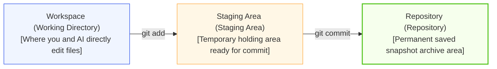
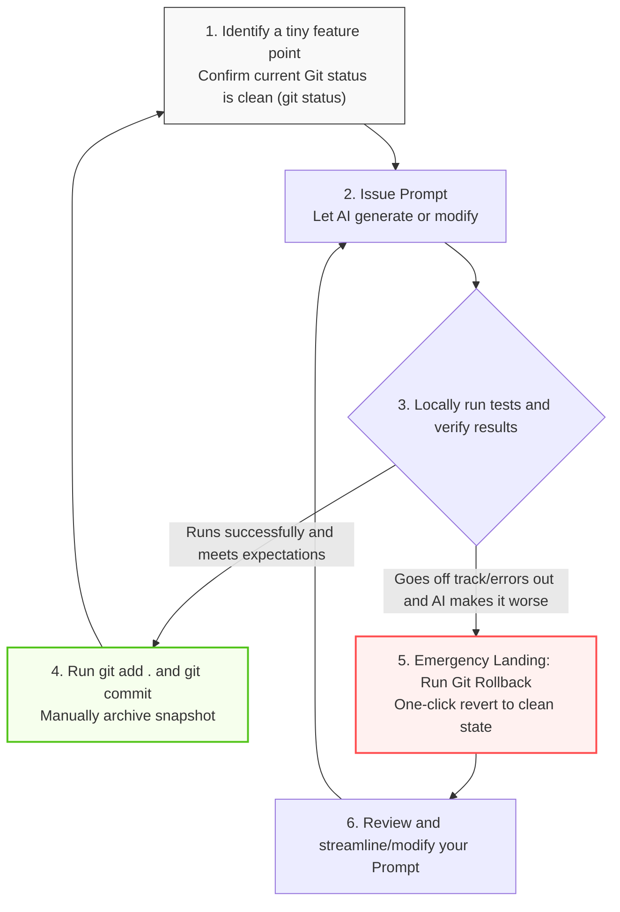

# Code Version Control

> "Anyone who has never made a mistake has never tried anything new." — Albert Einstein

The speed at which AI writes code is extremely fast, but the speed at which it makes mistakes, goes off track, or even "helps make things worse" and completely crashes the system is equally fast. If every version of the code is not saved, once the AI breaks the core logic of the program in a certain step, and we can't remember which files it changed or what it looked like before the changes, it would be a disaster—we might even need to tear down the entire program and start over.

The tools that help us back up, record, and restore every version of code are called version control tools. Among all similar tools, Git is the corest and most famous one in global software development today, and GitHub is the world's largest code hosting and collaboration platform built on Git.

This guide will start from scratch, comprehensively guide you to master Git and GitHub, and build a "super safety net" for you in the AI era.


## The Underlying Logic of Git

Before doing practical operations, you can imagine Git as a "high-definition dashcam" specialized in recording the code world. Its most important job is to press the shutter button and save a perfectly safe, intact copy before you (or the AI) perform major surgery on the code.

### Git's Core Vocabulary

| Concept | English Name | Common Explanation (AI Perspective) |
| --- | --- | --- |
| **仓库** | Repository / Repo | Your project folder. Once hosted by Git, its every move will be silently recorded. |
| **提交** | Commit | Taking a "snapshot" of the codebase. Once committed, the state at this time will be permanently locked. |
| **分支** | Branch | An independent development line branching off from the main line. You can create a new branch for the AI to scribble on without affecting the main line. |
| **合并** | Merge | Merging the modifications of a branch (like a new feature already written by AI) into the main line branch. |
| **克隆** | Clone | Completely copying a cloud remote repository to your local computer. |
| **推送** | Push | Safely syncing the historical snapshots on the local computer to the cloud server. |
| **拉取** | Pull | Downloading the latest modifications from the cloud and merging them locally (used when collaborating across multiple devices or teams). |
| **回退** | Reset / Rollback | The strongest regret medicine in the AI era. No matter how miserably the code is ravaged by the AI, it can be rolled back to the last perfect snapshot state in an instant. |

:::tip Distributed Design Philosophy
The core of Git is "distributed": every developer's local computer has the complete project history, allowing normal work even without a network. GitHub, on the other hand, is a "big housekeeper" located in the cloud, used for multi-terminal code synchronization and team collaboration.
:::

### The Three Major Work Areas of Git

Understanding the three work areas of Git is the key to mastering all Git commands:



## Registering for GitHub and Installing & Configuring Git

### Registering a GitHub Account

1. Visit the [GitHub official website (https://github.com)](https://github.com) and click Sign up in the top right corner.
2. Enter your email address and set a username and strong password.
   - Username suggestion: Use concise, professional English or Pinyin (e.g., `ruanqizhen`), because it will appear in the web links of all your projects.
3. Complete the human verification, click Create account, and go to your email to check the verification code to complete activation.
4. Plan selection: Select the Free plan directly; it already provides unlimited public and private repositories, which is completely sufficient.

:::tip Choosing a username is very important!
Your Username will directly determine the link prefix of your personal homepage on GitHub in the future. For example, if your username is `tom`, then your generated webpage link will start with `tom.github.io`. In other words, the username you casually set today will become your "house number" in the cyber world in the future.
:::

### Installing Git

- Windows: Go to the [Git official website download page](https://git-scm.com/download/win) to download the installation package. Keep the default checks all the way during installation, and be sure to check "Git Bash" (a very useful terminal tool).
- macOS: Open the terminal and enter `xcode-select --install` to install Apple developer tools, or use Homebrew to run `brew install git`.
- Linux (Ubuntu/Debian): Run `sudo apt update && sudo apt install git`.

After installation is complete, open the terminal (Windows users open Git Bash), and enter the following command to verify whether the installation was successful:

```bash
git --version
# If it correctly outputs something like "git version 2.x.x", it means the installation is successful!

```

### Initial Identity Configuration

Every Git commit records who modified the code, so after installation, you must configure your identity information (please keep it consistent with your GitHub registration information):

```bash
# 1. Set your name or nickname
git config --global user.name "Your GitHub Username"

# 2. Set your email
git config --global user.email "your-email@example.com"

# 3. Set the default branch name to main
git config --global init.defaultBranch main

# 4. Verify whether the configuration is successful
git config --list

```

### Configuring SSH Keys (Passwordless Push Recommended)

Configuring an SSH key allows you to push code to GitHub every time in the future without having to painstakingly re-enter your account and password.

1. Generate key pair: Run the following command in the terminal (just press Enter all the way):
```bash
ssh-keygen -t ed25519 -C "your-email@example.com"

```


2. Copy public key: Run the following command to view and copy all the output text:
```bash
cat ~/.ssh/id_ed25519.pub
# Copy this long string of characters starting with ssh-ed25519

```

3. Bind to GitHub: Log into GitHub → Click avatar in top right corner → Settings → SSH and GPG keys → Click New SSH key. Paste the content you just copied into the `Key` text box, give it a name (e.g., "My Laptop"), and click Add SSH key.
4. Test connection: Run `ssh -T git@github.com`. If you see `Hi username! You've successfully authenticated...`, it means the passwordless channel is completely opened!


## High-Frequency Basic Git Operations Locally

### Creating a Local Repository

Pick or create a folder randomly to be your project directory, and enter that directory in the terminal:

```bash
# Enter the project directory
cd my-project

# Initialize a Git repository
git init
# At this point, a hidden .git directory will be automatically generated under the folder; it is the "memory card" of the dashcam

```

### Recording Your Code

When we or the AI have modified the code, we need to solidify the code into a historical snapshot through the following three steps:

```bash
# Step 1: Check current status (see which files the AI touched)
git status

# Step 2: Submit modified files to the "Staging Area"
git add README.md  # Add a single file
git add .          # [Most commonly used] Stage all modifications of all files in the current directory at once

# Step 3: Officially commit to the repository and take a historical snapshot
git commit -m "feat: Initialize project, add README doc"

```

### Seeing Exactly What the AI Changed

The code generated by AI is sometimes extremely massive. Before committing, you must keep your eyes peeled to clearly see its changes:

```bash
# View the difference between the workspace and the last snapshot (see what the AI changed before running git add)
git diff

# View the differences that have been git added but not yet committed
git diff --staged

# View concise historical commit logs
git log --oneline

```


## Small Step Building and Emergency Landings

After mastering basic Git operations, when you pair program with AI (such as Cursor, ChatGPT), you should strictly adhere to the following "Golden Loop Rule." Absolutely never let the AI write hundreds of lines of code in one breath without making any Commits.



### How to Elegantly Undo and Rollback

Once the AI helps to make things worse, directly use the following commands for an "emergency landing":

```bash
# Scenario 1: AI just finished modifying, you haven't run git add, want to discard all modifications in workspace
git restore . 
# (Older versions of Git use: git checkout -- .)

# Scenario 2: You accidentally ran git add ., want to unstage files back to workspace
git restore --staged .

# Scenario 3: AI continuously modified several times, completely breaking the whole system, you want to undo recent Commits
# [Soft Rollback]: Undo the last commit, but keep workspace modifications, easy to re-review code
git reset --soft HEAD~1

# [Hard Rollback]: Extremely fierce! Directly discard all modifications after the last commit, forcibly returning to the last clean snapshot point
git reset --hard HEAD~1

```


## Practical Exercise

To let you fully master it, let's completely simulate a real scenario of collaboratively developing a "Cyber Wooden Fish" single-file webpage project (HTML + Tailwind CSS) using **Git standard + AI mindset**.

### Step 1: Create Folder and Initialize

1. Create a new folder named `cyber-muyu` on your computer (can operate via OS right-click "New Folder").
2. Open the terminal (Windows users use Git Bash), enter that folder, and initialize the Git repository:

```bash
cd cyber-muyu
git init
# At this point, a hidden .git directory will be automatically generated under the folder; it is the "memory card" of the dashcam
```


### Step 2: Send Command to AI, Generate Initial Version (MVP) Wooden Fish

1. Open your general AI web dialog box (like Meta AI, DeepSeek, ChatGPT, etc.) and send the following command:
   > "Help me make a minimalist electronic wooden fish webpage. Please directly generate a runnable single-file HTML. The interface background should be dark, with a circular wooden fish placed in the middle. Every time it is clicked, the accumulated merit count will increase by 1."
2. After the AI generates the code, create a new text file in your `cyber-muyu` folder, name it `index.html` (ensure the suffix is `.html` and not `.txt`), entirely copy and paste the AI-generated code into it, and then save.
3. Double-click `index.html` to play test it in the browser, confirming that the merit number indeed increases when clicked.
4. Confirm it runs well, and immediately archive your first safe foundation stone in the terminal:

```bash
# View the current status, you will see index.html is red (representing it's an untracked new file)
git status

# Prepare to commit: put all modifications under the current folder into the staging area
git add .

# Officially take a picture and archive
git commit -m "feat: Build base interface for cyber muyu and implement core tap counting feature"
```

### Step 3: Branch Out, Prepare to Add Cool Effects

We want the AI to continue upgrading this wooden fish, adding a scaling animation effect when tapped and floating "Merit +1" text. Following the golden rule of "do not pollute the main line," we immediately open up and switch to a temporary development branch:

```bash
git switch -c feature/add-effects
# Now, you have entered a safe "parallel universe" branch; no matter how you modify it next, it won't mess up the perfect MVP archive from just now
```

1. Open the webpage AI, copy all the code in your `index.html` to it, and send the command:
   > "Please help me upgrade based on this code. Use Tailwind CSS to beautify the interface, add a scaling transition animation when tapping the wooden fish; and every time it's tapped, randomly float out cyan glowing 'Merit +1' text near the mouse pointer, which drifts upwards and gradually fades out. Output the complete HTML code directly."
2. After the AI generates the new code, in your Notepad (or simple text editor), completely paste the new code over into `index.html` and save.
3. Refresh the browser to play test, confirming the special effects are very cool!
4. Run `git diff` to confirm all the points the AI changed:

```bash
git diff
```

5. Confirm everything behaves perfectly, and take a snapshot archive on the temporary feature branch:

```bash
git add .
git commit -m "feat: Add tap scaling transition animation and floating text effects"
```


### Step 4: Safely Merge into Mainstream and Call it a Day

Since the new feature tested perfectly, we can now safely merge it into the main line (`main` branch):

```bash
# 1. Switch back to the main branch
git switch main

# 2. Merge in the effect code written in the temporary branch
git merge feature/add-effects

# 3. Done! Now the main branch already has the coolest wooden fish. We can safely delete the local temporary branch:
git branch -d feature/add-effects
```

Behold! Even at this moment, we haven't used any advanced programming tools (like VS Code), just used web-based AI and simple file copy-pasting. Coupled with these few minimalist Git commands, we have already elegantly and professionally managed our software evolution. Even if the AI's code went wrong midway, we could always use `git reset --hard HEAD` to take the "regret medicine" with one click!


## Graphical Tools

If you feel dizzy seeing a full screen of a black terminal and typing strings of English commands (like `git add`, `git commit`), there is absolutely no need to panic. In the Git world, there is an extremely novice-friendly "shortcut"—GitHub Desktop.

It turns complex black-window commands into an intuitive graphical dashboard. You don't need to memorize any commands by rote; you can perfectly harness all the Git mental methods mentioned earlier just by clicking the mouse.

### Download and One-Click Login

Visit the [GitHub Desktop Official Website (https://desktop.github.com)](https://desktop.github.com) to download the installation package corresponding to your operating system. Launch the software after installation is complete, click Sign in to GitHub.com, and it will automatically pull up the browser to let you authorize the login. After successful login, your local computer is seamlessly bound to the cloud account, and even the complex SSH key configuration from earlier can be skipped entirely!

### Command Line vs Graphical

In the world of GitHub Desktop, originally boring commands become extremely vivid visual operations:

- `git status` (View Status): The "Changes" list on the left side of the software automatically lists modified files. Click any file, and the right side clearly marks which line of code you (or the AI) changed using red (deleted) and green (added).
- `git add` (Stage): Every modified file has a checkbox in front of it. Checking it is equivalent to running `git add`; unchecking it is equivalent to removing it from the staging area.
- `git commit` (Commit Snapshot): The bottom left corner of the interface comes with a typing box. Write your Commit message in `Summary` (e.g., `feat: Add login feature`), then click the blue "Commit to main" button below, and a historical snapshot is captured.
- `git push` (Push to Cloud): There is a big "Push origin" button right in the middle of the top navigation bar. Click it once, and the local snapshots will safely fly to the cloud.


:::tip
Even if we will use programming tools with built-in AI like VS Code in the future, and they themselves also have very beautiful graphical Git panels built-in, always keeping an official GitHub Desktop on the computer is still a smart decision.
When AI frantically pours out code, causing the project to fall completely into chaos, or you can't figure out the direction of the current code branch, open GitHub Desktop. Its ultra-clear panoramic visual history tree with a "God's-eye view" allows you to see what happened in the past at a glance, helping you easily make a one-click "emergency landing."
:::