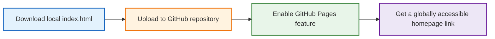
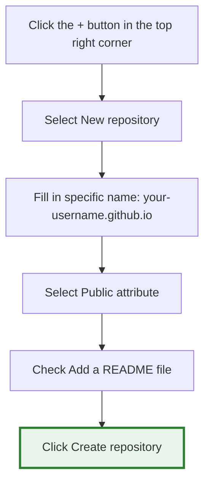

# Publishing and Sharing Your Webpage

> "Peaches and plums do not speak, but a path is formed beneath them." — "Records of the Grand Historian"

In the previous chapters, we have learned how to use AI to make various small tools and mini-games. But have you ever thought about having a fully exclusive corner of your own in the internet world?

This is the **Personal Homepage**.

In the era of social media, all of our homepages look exactly the same: identical templates, fixed formats, with your personality and content stuffed into the platform's uniform boxes. But a personal website is different. There, you decide what the page looks like, you decide what content to display, and how to introduce yourself to the world is entirely up to you.

In the past, the threshold for building a personal homepage was extremely high; it was originally something only professional frontend engineers could do. However, the emergence of AI has, for the first time, given ordinary people the ability to freely define their "internet digital castles."

Many AI tools will include a "Share" button after generating a webpage, allowing you to directly generate a link to send to friends. But there are several obvious problems with this:

1. It often requires visitors to also have an account on the corresponding AI platform;
2. It relies on the AI platform's own temporary runtime environment, making it not truly your website;
3. Many platforms do not save these results permanently; the link becomes invalid after a period of time.

If you want to own a personal homepage that exists long-term and is completely under your control, you need a more stable and official publishing method.

In this chapter, we will use the free static website service provided by the world's most famous code hosting platform—GitHub—called GitHub Pages. You don't need to rent a server, you don't need to buy a domain name, and you don't need to learn complex devops knowledge. Just click the mouse a few times, and in 5 minutes, you will have a personal homepage truly running on the internet.


## Step 1: Sketch Your Personal Homepage with Natural Language

Now, you only need to learn how to use natural language to describe the feeling you want to the AI. For example:

* *"I want a homepage as quiet as a deep forest at night."*
* *"I want the buttons to have a semi-transparent texture like glass."*
* *"I want a slight parallax effect when the page scrolls."*
* *"I want to make a cyberpunk terminal style homepage."*

The AI will translate these abstract aesthetics into actual running webpage code for us. Below is an extremely minimalist and elegant personal homepage prompt template that you can directly copy to the AI:

```text
# Role & Objective
You are a top-tier full-stack frontend engineer and UI/UX designer. Please help me write a single-file personal homepage/social navigation page (Link-in-bio page), named `index.html`. The page must be completely hand-written in native HTML/CSS/JavaScript, without relying on any third-party CSS/JS frameworks or external icon libraries. All icons must use inline SVG.

# Core Requirements
1. Visual Style & Aesthetics (Premium Aesthetics):
   - Adopt a refined style combining modern soft skeuomorphism and minimalism.
   - Use CSS variables (`:root` and `html.dark`) to define two sets of high-quality color systems (e.g., forest green / Morandi colors).
   - Use a soft gradient for the background, overlaid with an ultra-subtle Marble Texture filter dynamically and randomly generated using SVG `<feTurbulence>`, keeping opacity around 10%.
   - The main card container should use a frosted glass effect (`backdrop-filter: blur(10px)`), with different faint strokes and shadows in dark and light modes.

2. Micro-interactions & Animations:
   - Theme toggle button: Place a circular theme toggle button in the top right corner. When toggled, the icon (☀️/🌙) is accompanied by rotation, scaling, and fade animations, with a smooth transition of the page background and variables.
   - Navigation Cards:
     - The cards should be moderately wide (e.g., max 680px) and arranged vertically.
     - On Hover: The entire card shifts slightly upwards, the shadow deepens, and the border color transitions; a horizontal colorful gradient progress bar (`::before` scale animation) smoothly appears at the top of the card; an arrow icon slides in from the left on the right side; the SVG icon on the left produces a slight rotation or enlargement.

3. Engineering & Technical Details (Engineering Best Practices):
   - Prevent dark mode flickering: Immediately execute an IIFE script in the `<head>` to read the theme from `localStorage` and apply it instantly.
   - Responsive design: Perfectly adapt to mobile terminals (when max-width is below 600px, hide the right hover arrow, tweak paddings).
   - SEO friendly: Include complete Meta tags, a reasonable HTML5 semantic structure, and aria-labels for interactive elements.

# Page Content Structure
- Top: A line of exquisite and philosophical Slogan (e.g., "Flowers bloom and fall, clouds roll and unroll").
- Middle: A group of vertically arranged cards. Each card contains an SVG icon on the left, a title and description in the middle, and a hover arrow on the right.
- Bottom: A minimalist Footer divider and domain identifier.

Please output the complete, unomitted `index.html` code directly, ensuring CSS is written inside `<style>` and JS is written in the `<script>` at the bottom.

```

(When we need to convey more complex requirements to AI, we usually use Markdown format to organize and write text. For an introduction to this format, please refer to: [Appendix: Markdown Documentation](markdown))

Below is a prompt template for a multi-module personal homepage:

```text
# Role & Objective
You are a hall-of-fame full-stack frontend engineer and top UI/UX designer. Please help me write a single-file premium "Bento Grid" personal homepage and multi-dimensional portfolio page, named `index.html`.
The page must be completely hand-written in native HTML/CSS/JavaScript, rejecting any third-party frameworks or external icon libraries. All icons must strictly use high-definition inline SVGs.

# Layout & Architecture (Bento Golden Grid)
The core main body of the page is a responsive CSS Grid system with a maximum width of 1100px. Cards maintain a 20px gap. The cards are arranged in staggered dimensions (e.g., 2x2 large cards, 1x2 long cards, 1x1 square cards) to build a highly modern, tech-oriented asymmetrical visual aesthetic:
1. [Large Card: Personal Dashboard]: Occupies the core position in the top left corner. Contains an exquisite avatar frame, name, a minimalist dynamic typewriter effect Tagline, and an elegant local time real-time running component.
2. [Long Card: Featured Projects]: Extends horizontally. Used to showcase proud works, containing project cards, delicate grouping tags, a one-sentence striking description, and a "View Source" micro-motion button with flowing light effects.
3. [Square Card: Skill Matrix]: Aggregates personal tech stack or interest tags. Tags use a pill design with semi-transparent breathing gradient background colors, glowing slightly like neon lights when hovered over.
4. [Long Card: Inspiration/Essays]: Displays a philosophical motto or recent thoughts, with highly design-oriented typography.
5. [Square Card: Social Portals]: Aggregates multiple commonly used social platforms. Each platform is an independent minimalist micro-card embedded with an exquisite SVG icon.

# Design Philosophy & Aesthetics (Peak Visual Aesthetics)
1. Extreme Dark Flowing Light (Premium Dark Mode by Default):
   - Default to a profound tech dark style (Background color: an extremely faint gradient from Dark Night Obsidian `#0a0a0c` to Titanium Space Gray `#161619`).
   - The background is faintly scattered with flowing light halos (Mesh Gradient Blobs) drawn with CSS, carrying a faint frosted glass astigmatism effect, drifting and rotating extremely slowly in the background to give the page vitality.
2. Titanium Borders & Hover Light Effects (Glow & Border Effects):
   - Each bento box card background is a semi-transparent ultra-fine material (`background: rgba(255, 255, 255, 0.03)`), paired with a frosted glass filter (`backdrop-filter: blur(12px)`).
   - Cards have a `1px` faint semi-transparent titanium border (`rgba(255, 255, 255, 0.08)`).
3. Dual Color System Adaptation:
   - Must perfectly support Light Mode switching. In Light Mode, it transitions to pure and elegant Morandi white and light gray levels, borders become extremely pale elegant gray, and the whole presents a texture like premium paper.

# Interaction & Micro-animations (Soulful Micro-interactions)
1. Magnetic Hover: When the mouse pointer hovers over any bento box card, the entire card produces a smooth 3D perspective slight tilt (or slightly translates upwards by 6px), the shadow deepens, and the border opacity smoothly brightens.
2. Border Spotlight Effect: (Optional advanced effect) If possible, use JS to capture the mouse's coordinates within the card, making the card's border or background produce a faint following glow near the mouse.
3. One-Click Twist: The theme toggle button (sun/moon) in the top right corner, when clicked, is accompanied by an extremely silky rotating collapse animation. The color variable switching time for the entire page is controlled at 0.4s, with a perfect fade-in/fade-out transition.

# Technical Specifications & Code Quality
1. Zero First-Screen Flicker: Embed mask logic or an Immediately Invoked Function Expression (IIFE) at the top of the `<head>` to ensure that when the page is first loaded or refreshed, the theme (dark/light) instantly matches the user's system or `localStorage`. A momentary white screen or flicker is absolutely not allowed.
2. Extreme Responsiveness: On mobile devices (screen width less than 768px), the grid system perfectly and automatically degrades seamlessly into an elegant 1-column vertical arrangement. Card gaps are tweaked to 16px, and elements are scaled proportionally to ensure excellent mobile interaction.
3. Pure Code: Directly output a perfectly structured `index.html` without any deletions. Styles are entirely encapsulated within `<style>`, and micro-interactions and dynamic logic are entirely encapsulated within the `<script>` at the bottom. Please completely fill the text content in the page first using poetic, highly geek-romantic premium placeholders (e.g., Name: "Nameless Voyager", Motto: "Code writes the world, words record the soul", etc.).

```


## Step 2: Prepare and Download Your HTML File

Whether you are using ChatGPT Canvas, Claude Artifacts, Gemini, Meta AI, or other AI tools, as long as it has generated a webpage program based on the prompts above, you eventually need to turn this code into a real file on your computer.

Depending on the tool you use, the way you extract the code varies slightly:

* **If you are using Claude Artifacts or ChatGPT Canvas**: In the bottom right corner or top of the generated webpage preview interface, you will see an obvious "Download" icon (usually a small downward arrow or a code file icon). Click it, and the browser will automatically download the webpage to your computer.
* **If you are using a normal AI chat window**: In the top right corner of the code block output by the AI, click **Copy code**. Then create a new text file (TXT) on your computer desktop, paste the code into it, save and close.

After downloading or saving, find this file, right-click and select **Rename**, and completely change its name to: **`index.html`**

:::tip Why must it be called `index.html`?
In the internet world, `index.html` is the "home page" determined by the server by default. When someone visits a URL, the server will automatically prioritize looking for a file with this name and display it. Therefore, the entry file of the vast majority of static websites must be called `index.html`.
:::


## The Overall Process of Free Website Building

Once you have this local `index.html` personal homepage file, publishing it to the internet is actually far less complicated than you might imagine. The overall process is roughly just the following four steps:



Essentially, you are just uploading your homepage file to GitHub's cloud servers. And GitHub Pages will automatically turn it into a real website.


## Step 3: Create a Cloud "Repository" (Unlock Exclusive Top-Level Domain)

In GitHub, every project has an independent storage space called a Repository. We can think of it as a "cloud folder for putting homepage files."



The specific steps are as follows:

1. After logging into GitHub, click the **`+`** icon in the top right corner of the page and select **New repository**.
2. **Repository name**: **There is a very crucial "hidden easter egg" here!** Please be sure to enter precisely: `your-username.github.io` (For example, if your GitHub username is `tom`, then fill in `tom.github.io` here).
3. **Description**: You can write a brief introduction (optional), such as "My AI-customized personal homepage and social navigation."
4. **Public/Private**: **Must check Public**! For free accounts, GitHub will only allow us to turn on the GitHub Pages website publishing service if the repository is set to Public. If set to Private, others will not be able to access your webpage.
5. **Initialize this repository with**: Check **Add a README file**. This step is very important; it helps us automatically initialize the repository environment.
6. Scroll to the very bottom of the page and click the green **Create repository** button.

:::tip Why use this special repository name?
If you name the repository something ordinary in English (e.g., `my-homepage`), your final homepage URL will have a little tail, becoming `https://tom.github.io/my-homepage/`.
But if you precisely set the repository name to `your-username.github.io`, GitHub will recognize this as your **highest-level personal homepage**, and the final generated URL will be perfectly flawless: **`https://tom.github.io/`**. With no redundant paths at the end, you instantly get the professional, high-end feel of a major tech company's official website!
:::


## Step 4: Upload Your Personal Homepage File

Now that your cloud repository is built, we need to upload the prepared `index.html` file to it. You don't need to install any professional software at all; it can be completed directly in the browser:

1. On the homepage of the repository you just built, click the **Add file** button in the top right corner, and select **Upload files**.
2. **Drag and drop upload**: Directly drag the `index.html` file on your computer into the dashed box in the middle of the webpage.
3. Wait for the file upload progress bar to finish, and you will see `index.html` in the list.
4. **Commit changes**: Enter a sentence of description in the input box at the bottom of the page (e.g., `Deploy my personal homepage`).
5. Click the green **Commit changes** button to save the upload.

At this point, your repository should contain two files simultaneously: `README.md` and `index.html`.

:::tip 💡 Advanced Play: Want to put your real photo on your personal homepage?
When making a personal homepage, what people usually want to put up the most is their own avatar. If you directly use a local computer path (like `C:/Users/Desktop/avatar.jpg`), others absolutely won't be able to open it on the internet.
**The correct approach is to upload it together using a "relative path":**

1. Put your personal photo (renamed to simple English, like `avatar.jpg`) and `index.html` in the **same folder** on your computer.
2. When asking the AI to write the webpage code, add a requirement: "My avatar file name is `avatar.jpg`, please refer to it using a relative path directly in the code."
3. When uploading in this step, **drag and drop** `index.html` and `avatar.jpg` **simultaneously** into the GitHub repository. This way, your personal homepage can perfectly display your own photo!
:::


## Step 5: Enable GitHub Pages

This is the most crucial step; we will command GitHub to render the webpage files we just uploaded into a real website accessible globally.

1. In the row of function tabs at the top of the repository, click the ⚙️ **Settings** on the far right.
2. Scroll down the navigation bar on the left, find the 🌐 **Pages** option under the **Code and automation** section, and click to enter.
3. In the **Build and deployment** section, find the **Source** option, which should default to **Deploy from a branch**.
4. In the **Branch** dropdown menu below, **check if `main` is already selected by default** (some older accounts might be `master`) along with `/ (root)` next to it. Because we checked "Add a README file" when creating the repository in the previous steps, GitHub usually automatically configures this for you. If it still shows as `None`, please click manually to change it to **`main`**.
5. Click the **Save** button on the right.


## Step 6: Get Your Exclusive Website Link

After clicking save, GitHub will automatically start the build server for us in the background.

1. Wait patiently for 1 to 2 minutes.
2. Refresh the current Pages settings page, and you will see a highlighted notification bar with a green background appear at the top of the page:
> **Your site is live at `https://<your-username>.github.io/`**


3. **Click the link**: Click that URL, and a miracle happens! The highly designed personal homepage that you personally commanded the AI to write is perfectly running on the real internet!
4. **Share the joy**: Copy this clean, perfect top-level link and send it to friends or put it in your social software bio. Regardless of whether others are using a phone, tablet, or computer, they can instantly and smoothly visit your personal website.


## Continuous Evolution: How to Update Your Homepage in the Future?

When you want to continue iterating your homepage via AI (such as modifying the Slogan, adding new social links, or changing theme colors), the process is extremely simple:

| Action | Operation Steps |
| --- | --- |
| **1. Iterative Development** | Enter new requirements in the AI chat box (e.g., "Help me add a NetEase Cloud Music card"), and download the updated HTML code. |
| **2. Prepare Files** | Ensure the new file is still named `index.html` (if there are new images, ensure the file names are consistent too). |
| **3. Overwrite Upload** | Open the corresponding repository page on GitHub, click **Add file** -> **Upload files**, and drag the new file(s) in. |
| **4. Auto Deployment** | Click **Commit changes** to submit. GitHub will automatically republish in the background, and about 1 minute later, the original link will automatically update! |

The small games, tools, etc., that we made using AI in the previous chapters can also be downloaded using the same method, uploaded to GitHub one by one, and linked on your personal homepage. Your homepage will become the "central headquarters" for all your AI creations.


## Red Lines to Avoid for Zero-Foundation Players on GitHub

While enjoying the immense sense of accomplishment of publishing a website, please be sure to note the following common stumbling blocks:

* **Case Sensitivity**: The file name must be purely lowercase `index.html`, not `Index.html` or `INDEX.HTML`. Linux servers are extremely sensitive to case; one wrong letter will result in a 404 error (webpage not found).
* **Network Resource References**: If you ask AI to introduce external, non-custom resources into the webpage, ensure you use **absolute network links** (e.g., `https://picsum.photos/200`). If you want to use your own unique local images, be sure to refer to the "Advanced Play" in Step 4 to use relative paths and upload them together.
* **Access Delay**: Sometimes, due to international network fluctuations, it may take a few minutes for the website to display the latest content after clicking Commit. This is a normal network phenomenon; please wait patiently or try clearing your browser cache (shortcut Ctrl+F5 or Command+Shift+R) before trying again.


### The Author's Personal Homepage

For reference, my personal homepage was also generated using similar AI prompts, and was continuously fine-tuned and completed subsequently.

* **Homepage Preview**: [https://qizhen.xyz/](https://qizhen.xyz/)
* **Open Source Code**: [https://github.com/ruanqizhen/ruanqizhen](https://github.com/ruanqizhen/ruanqizhen)