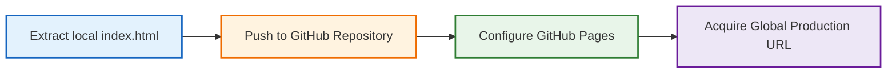

# Publishing and Sharing Your Webpage

> "If you build it, they will come." — *Field of Dreams*

In previous chapters, we learned how to wield AI to rapidly prototype small utilities and mini-games. But have you ever considered carving out a completely autonomous, exclusive corner of the internet that belongs entirely to you?

This is the power of the **Personal Homepage**.

In the era of algorithmic social media, our digital identities are homogenized. Every profile looks exactly the same: identical templates, rigid formatting, with your personality forcibly squeezed into the platform's uniform boxes. A personal website is fundamentally different. Here, *you* dictate the architecture, *you* control the aesthetic, and *you* decide exactly how to introduce yourself to the world.

Historically, the technical threshold for building and deploying a personal homepage was prohibitively high. It was a privilege reserved strictly for professional frontend engineers. Today, however, AI has democratized this capability, granting ordinary individuals the power to effortlessly architect their own "digital castles."

Many consumer-grade AI tools provide a convenient "Share" button after generating a webpage, allowing you to instantly text a link to your friends. However, this approach carries several fatal engineering flaws:

1. It often forces visitors to register an account on the AI platform just to view your page.
2. The page relies entirely on the AI platform's ephemeral, temporary runtime environment. It is not *truly* your website.
3. These platforms frequently purge their temporary cache. Within a few weeks, your link will permanently die.

If you want a professional, long-term personal homepage that remains entirely under your sovereign control, you need a stable, enterprise-grade deployment pipeline.

In this chapter, we will utilize **GitHub Pages**—a free, static hosting service provided by GitHub, the world's largest code hosting platform. You do not need to rent a Linux server, you do not need to purchase a domain name, and you absolutely do not need to learn complex DevOps pipelines. With just a few clicks, you will deploy a global, production-ready personal homepage in under 5 minutes.

## Step 1: Architecting Your Homepage via Natural Language

Your only task is to learn how to translate your abstract aesthetic desires into precise natural language for the AI. For example:

* *"I want a homepage as quiet as a deep forest at night."*
* *"I want the UI components to possess a semi-transparent, frosted glass texture."*
* *"I want subtle, parallax scrolling effects."*
* *"I want an aggressive, neon-lit cyberpunk terminal aesthetic."*

The AI will instantly compile these abstract aesthetics into executable HTML/CSS. Below is a highly optimized, minimalist Prompt Template that you can copy directly to generate a premium personal homepage:

```text
# Role & Objective
You are a world-class frontend engineer and UI/UX designer. Build a single-file personal homepage/Link-in-bio page named `index.html`. The page must be written entirely in native HTML/CSS/JavaScript. Do NOT use any third-party CSS/JS frameworks (like Tailwind or React) or external icon libraries. All icons must be highly optimized, inline SVGs.

# Core Requirements
1. Visual Style & Aesthetics (Premium Quality):
   - Adopt a refined aesthetic that merges modern soft skeuomorphism with extreme minimalism.
   - Utilize CSS variables (`:root` and `html.dark`) to define two premium color palettes (e.g., Forest Green / Morandi Neutrals).
   - Apply a soft gradient background, overlaid with an ultra-subtle, dynamically generated SVG `<feTurbulence>` marble texture (keep opacity around 10%).
   - The primary card container must feature a frosted glass effect (`backdrop-filter: blur(10px)`), with distinct drop-shadows and border strokes for both dark and light modes.

2. Micro-Interactions & Animations:
   - Theme Toggle: Place a circular theme toggle button (☀️/🌙) in the top right. Clicking it must trigger rotation, scaling, and fade animations, alongside a silky-smooth transition of the CSS background variables.
   - Navigation Cards:
     - Constrain cards to a maximum width of 680px, stacked vertically.
     - Hover State: The card smoothly translates upward, the drop-shadow deepens, and the border color shifts. A vibrant gradient progress bar (`::before` scale animation) smoothly renders at the top edge. A right-pointing arrow slides in from the right edge, while the left-aligned SVG icon slightly rotates or scales up.

3. Engineering Best Practices:
   - Zero Flicker Dark Mode: Inject an Immediately Invoked Function Expression (IIFE) inside the `<head>` to read the theme from `localStorage` and apply it instantly before the DOM renders, preventing the dreaded "white flash."
   - Extreme Responsiveness: The design must flawlessly adapt to mobile viewports (e.g., hiding hover arrows and adjusting padding when `max-width` < 600px).
   - SEO & Accessibility: Include comprehensive meta tags, strict HTML5 semantic structure, and `aria-labels` on all interactive nodes.

# Content Architecture
- Header: A profound, philosophical Tagline (e.g., "Code writes the world, words record the soul").
- Body: A vertical stack of interactive cards. Each card contains a left-aligned SVG icon, a central title/description, and a right-aligned hover arrow.
- Footer: A minimalist divider and a copyright/domain identifier.

Output the complete, raw `index.html` code. Embed all CSS within a `<style>` block in the head, and all JS within a `<script>` block at the bottom of the body. Do not truncate the code.
```

*(When conveying complex architectural requirements to AI, we heavily utilize Markdown formatting. For a deep dive into this format, refer to: [Appendix: Markdown Documentation](./markdown.md))*

If you desire a more complex, multi-module layout, use the following "Bento Grid" Prompt Template:

```text
# Role & Objective
You are a hall-of-fame full-stack engineer and elite UI/UX designer. Build a single-file, premium "Bento Grid" personal portfolio named `index.html`. 
Write it entirely in native HTML/CSS/JavaScript. Reject all third-party frameworks and external icon fonts. All icons must be high-definition inline SVGs.

# Layout & Architecture (The Bento Golden Grid)
The core container must be a responsive CSS Grid system (max-width: 1100px) with a 20px gap. Cards must be arranged in staggered, asymmetrical dimensions (e.g., 2x2 large cards, 1x2 horizontal cards, 1x1 square cards) to construct a highly modern, tech-forward aesthetic:
1. [Large Card: Dashboard]: Anchors the top left. Features an elegant avatar frame, your name, a dynamic typewriter-effect Tagline, and a live local-time clock component.
2. [Horizontal Card: Featured Projects]: Spans horizontally. Showcases elite projects, utilizing pill-shaped tags, striking descriptions, and a "View Source" button with a flowing-light micro-animation.
3. [Square Card: Skill Matrix]: Aggregates tech-stack tags. Tags must use a pill design with semi-transparent, breathing gradient backgrounds that glow slightly like neon when hovered.
4. [Horizontal Card: Philosophy]: Displays a philosophical motto with highly deliberate, editorial-style typography.
5. [Square Card: Social Portals]: A grid of independent, minimalist micro-cards, each embedding a pristine SVG logo of a social platform.

# Design Philosophy (Peak Visual Aesthetics)
1. Extreme Dark Flowing Light (Premium Dark Mode Default):
   - Default to a profound tech-dark aesthetic (Background: an ultra-subtle gradient from Obsidian `#0a0a0c` to Titanium `#161619`).
   - The background must feature CSS-drawn Mesh Gradient Blobs that drift and rotate extremely slowly, layered beneath a faint frosted-glass blur filter to inject organic vitality into the page.
2. Titanium Borders & Spotlights:
   - Bento card backgrounds must use a semi-transparent material (`rgba(255, 255, 255, 0.03)`) paired with a heavy frosted glass filter (`backdrop-filter: blur(12px)`).
   - Apply a crisp, 1px semi-transparent titanium border (`rgba(255, 255, 255, 0.08)`).
3. Dual Color System:
   - Must flawlessly support Light Mode. Upon toggling, transition to pure, elegant Morandi whites and grays. Borders should become ultra-faint, giving the page the physical texture of premium cardstock.

# Micro-Interactions (Soulful UX)
1. Magnetic Hover: Hovering any bento card triggers a smooth 3D perspective tilt (or a 6px upward translation), deepens the shadow, and smoothly brightens the border opacity.
2. Border Spotlight (Advanced): Use JS to track mouse coordinates within the card, rendering a faint, following glow on the border/background directly beneath the cursor.
3. Silky Toggle: The theme toggle button must execute an extremely silky rotating collapse animation. The global CSS variable transition duration must be locked at exactly 0.4s.

# Technical Specifications
1. Zero First-Screen Flicker: Inject an IIFE script at the absolute top of the `<head>` to instantly sync the theme with `localStorage` or `window.matchMedia`. White-screen flashes are strictly forbidden.
2. Extreme Responsiveness: On viewports < 768px, the grid must elegantly degrade into a seamless, 1-column vertical stack. Gaps shrink to 16px, and padding scales proportionally.
3. Pure Output: Output a structurally perfect `index.html`. Do not truncate. Pre-fill the content with poetic, geek-romantic placeholders (e.g., Name: "Nameless Voyager").
```

## Step 2: Extracting Your HTML File

Whether you are utilizing ChatGPT Canvas, Claude Artifacts, or Gemini, once the AI generates the webpage, you must extract that raw code into a physical file on your local machine.

* **Using Claude Artifacts or ChatGPT Canvas:** Look for a dedicated "Download" icon (usually a downward arrow or file icon) near the preview panel. Click it, and the browser will instantly save the HTML file to your drive.
* **Using a Standard Chat Interface:** Click the **Copy code** button in the top right corner of the AI's code block. Open a basic text editor (like Notepad or TextEdit), paste the code, and save the file to your Desktop.

Regardless of how you saved it, locate the file, right-click, select **Rename**, and change the filename to exactly: **`index.html`**

:::tip Why must it be named `index.html`?
In web server architecture, `index.html` is the globally recognized default entry point. When a user navigates to your base URL, the server automatically hunts for a file with this exact name to render first. If you name it anything else, the server will throw an error.
:::

## The Deployment Pipeline

Deploying your local `index.html` to the global internet is incredibly straightforward. The entire pipeline consists of four macro steps:



Essentially, you are pushing your raw code to GitHub's enterprise cloud servers, and GitHub Pages will autonomously compile and host it as a production website.

## Step 3: Architecting the Cloud Repository (Unlocking Your Top-Level Domain)

In GitHub, every discrete software project lives inside an isolated storage space called a **Repository** (Repo). 

```mermaid
flowchart TD
    A[Click the '+' icon top right] --> B[Select 'New repository']
    B --> C[Name it EXACTLY: your-username.github.io]
    C --> D[Set visibility to 'Public' (recommended) - Private also works for Pages since 2023, but site itself is always public]
    D --> E[Check 'Add a README file']
    E --> F[Click 'Create repository']
    
    style F fill:#e8f5e9,stroke:#2e7d32,stroke-width:3px
```

Execute the following sequence:

1. Log into GitHub. Click the **`+`** icon in the top right navigation bar and select **New repository**.
2. **Repository name:** **PAY CLOSE ATTENTION!** You must name this repository precisely: `your-username.github.io` (e.g., if your GitHub handle is `tom`, you must enter `tom.github.io`).
3. **Description:** Enter a brief descriptor (e.g., "My AI-architected personal portfolio").
4. **Public/Private:** For a personal homepage we recommend **Public** for simplicity. Note: as of 2023, GitHub Free accounts can enable Pages on both public *and* private repositories — the old restriction that "must be Public otherwise can't enable Pages" is outdated. In either case, the published site itself is always publicly accessible on the internet.
5. **Initialize:** Check the box that says **Add a README file**. This is critical for initializing the Git branch architecture on the server.
6. Scroll to the bottom and smash the green **Create repository** button.

:::tip The Naming Cheat Code
If you give this repository a generic name (e.g., `my-homepage`), GitHub will host it at a messy sub-path: `https://tom.github.io/my-homepage/`.
However, if you name the repository exactly `your-username.github.io`, GitHub's routing engine recognizes this as your **Apex Personal Domain**. Your final URL will be flawlessly clean: **`https://tom.github.io/`**. This instantly provides the premium, highly professional aesthetic of a dedicated tech portfolio!
:::

## Step 4: Pushing Your Payload

With the cloud repository initialized, we must push your local `index.html` file up to the server. You do not need to use the terminal for this; it can be executed entirely via the web UI:

1. On your new repository's main page, click the **Add file** dropdown near the top right, and select **Upload files**.
2. **Drag and Drop:** Drag your local `index.html` file directly into the massive dashed box in the center of the screen.
3. Wait for the upload progress bar to hit 100%. You will see `index.html` populate in the staging list.
4. **Commit changes:** In the commit box at the bottom, write a brief architectural log (e.g., `Initial deployment of personal homepage`).
5. Click the green **Commit changes** button to permanently lock the code into the repository.

Your repository should now contain exactly two files: `README.md` and `index.html`.

:::tip 💡 Advanced Engineering: Injecting Local Assets (Images/Avatars)
If you want to display your real photo on the homepage, you cannot simply reference your local hard drive (e.g., `C:/Desktop/avatar.jpg`). The internet cannot access your local file system. 
**You must upload the asset using a "Relative Path":**

1. Place your photo (renamed to a clean, lowercase name like `avatar.jpg`) inside the **exact same local folder** as your `index.html`.
2. When prompting the AI, explicitly state: *"My avatar filename is `avatar.jpg`. You must reference it in the `` tag using a strict relative path."*
3. During the GitHub upload step, **drag and drop both `index.html` and `avatar.jpg` simultaneously** into the repository. The server will host both, and the image link will resolve perfectly!
:::

## Step 5: Igniting GitHub Pages

This is the final configuration step. We are commanding GitHub's CI/CD pipeline to render your uploaded code into a live production website.

1. In your repository, click the ⚙️ **Settings** tab located on the far right of the top navigation bar.
2. In the left-hand sidebar, scroll down to the **Code and automation** section and click on 🌐 **Pages**.
3. Under the **Build and deployment** header, look at the **Source** dropdown. In the new UI (late 2023+), the default is **GitHub Actions**, which uses a workflow file (e.g., `pages.yml`) to build and deploy. For the simplest zero-config setup, switch Source to **Deploy from a branch** if it is not already selected.
   - **Option A — Deploy from a branch (beginner, recommended here):** Select Branch **`main`** (or `master` on older accounts) and folder `/ (root)`, then click **Save**. Because you checked "Add a README" during creation, GitHub usually pre-configures this. If the dropdown says `None`, manually select `main`.
   - **Option B — GitHub Actions (current default):** Keep Source as GitHub Actions and add a Pages workflow. GitHub will suggest a `Static HTML` workflow that uploads your `index.html` as an artifact and deploys it. This is more powerful but requires a workflow file.
4. Click the **Save** button (when using Deploy from a branch).

## Step 6: Acquiring the Production Link

After clicking save, GitHub silently spins up a build server in the background to compile and deploy your code.

1. Wait patiently for roughly 60 to 120 seconds.
2. Refresh the Pages settings tab. A highlighted green notification banner will appear at the top:
   > **Your site is live at `https://<your-username>.github.io/`**

3. **Execute the Link:** Click the URL. A miracle of modern infrastructure occurs: the highly stylized, AI-architected code from your local machine is now running flawlessly on the global internet!
4. **Distribution:** Copy this pristine, top-level URL and inject it into your social media bios or send it to colleagues. Because it is a responsive web app, it will render perfectly across mobile, tablet, and desktop viewports.

## The CI/CD Loop: Iterating Your Homepage

When you inevitably want to upgrade your homepage (e.g., tweaking the Tagline, injecting a new social module, or overhauling the color palette), the iterative deployment loop is incredibly streamlined:

| Phase | Execution Steps |
| --- | --- |
| **1. AI Iteration** | Feed your current HTML back into the AI. Issue new architectural commands (e.g., *"Inject a Spotify currently-playing card widget"*), and extract the updated code. |
| **2. Local Preparation** | Ensure the new file is strictly named `index.html`. Ensure any new image assets are gathered in the same folder. |
| **3. Push Payload** | Open your GitHub repository, click **Add file** -> **Upload files**, and drag the new payload into the staging area. |
| **4. Auto-Deploy** | Click **Commit changes**. GitHub's webhooks will instantly detect the mutation, automatically trigger a background rebuild, and your live URL will reflect the new architecture within 60 seconds! |

You can utilize this exact same pipeline to host the mini-games and utilities we built in previous chapters. Simply upload them to GitHub and link to them from your homepage, transforming your `index.html` into a centralized hub for all your AI engineering creations.

## Critical Red Lines for Zero-Foundation Developers

While deploying code is highly rewarding, you must remain vigilant against these common infrastructural landmines:

* **Strict Case Sensitivity:** Your primary file MUST be named exactly `index.html` (pure lowercase). Never use `Index.html` or `INDEX.HTML`. Linux web servers are violently case-sensitive; a single capitalized letter will instantly trigger a catastrophic 404 (Not Found) error.
* **Network Resource Links:** If you command the AI to utilize external assets (like placeholder images or web fonts), verify it utilizes **Absolute HTTPS URLs** (e.g., `https://picsum.photos/200`). If you are using your own proprietary assets, you must strictly adhere to the Relative Path workflow detailed in the Advanced Engineering tip above.
* **CDN Propagation Delay:** After you click "Commit changes," it may take several minutes for the global DNS and CDN nodes to flush their cache and serve your new code. This is standard network latency. Do not panic. Wait 3 minutes, then execute a Hard Refresh on your browser (Ctrl+F5 on Windows, Cmd+Shift+R on Mac) to bypass the local cache.

### The Author's Live Architecture

For reference, the author's personal portfolio was architected using this exact AI-driven methodology and iteratively refined over time:

* **Live Production URL:** [https://qizhen.xyz/](https://qizhen.xyz/)
* **Raw Repository Source Code:** [https://github.com/ruanqizhen/ruanqizhen](https://github.com/ruanqizhen/ruanqizhen) — Note: this is GitHub's special **Profile README** repository (a repo whose name equals your username, used to display a README on your profile page). It is a different concept from a Pages user site. For a clean user site URL like `https://<username>.github.io/`, you should still create a repository named exactly `<username>.github.io` as described in Step 3 above.